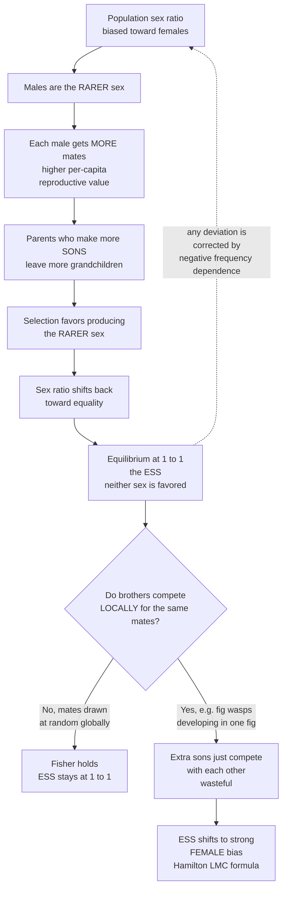

# ⚖️ Sex Ratios and the Fisher Principle

> [!abstract] TL;DR
> **Fisher's principle** explains why most sexually-reproducing species produce roughly **equal numbers of males and females** — not because a 1:1 split is "efficient for the species" (that group-selection reasoning is wrong), but because of a purely **game-theoretic**, individual-level argument: whichever sex is **rarer** enjoys higher **per-capita reproductive value** (each rare-sex individual gets more mates), so parents who overproduce the rarer sex leave more grandchildren. This **negative frequency-dependent selection** drives the population sex ratio to its **1:1 ESS**. When Fisher's assumptions break — notably under **local mate competition** (brothers competing for the same mates in structured, inbred groups like fig wasps) — the ESS shifts to a precisely predictable **female-biased** ratio. Historically this is a *founding* example of evolutionary game theory: Hamilton (1967) reasoned it out as an "unbeatable strategy" years before Maynard Smith formalized the ESS.

---

## Intuition

**Analogy:** Imagine a job market where employers can "produce" one of two kinds of worker, and every worker is guaranteed exactly one lifetime partner-match. If the town suddenly has three plumbers for every electrician, then **electricians are scarce** — each electrician is fought over and lands the best deal, while plumbers compete fiercely and settle for less. A parent choosing a trade for their child should obviously pick the **scarce** one, because scarcity means more matches. But as everyone rushes to make electricians, electricians stop being scarce — and the advantage evaporates exactly when the two trades are **equally common**. The market self-corrects to a 50:50 balance, and nobody planned it.

Sex is that market. "Male" and "female" are two trades; every offspring in the next generation has exactly one father *and* one mother, so the **total mating success of all males equals the total mating success of all females**. If males are rarer, each male fathers more offspring on average — so producing sons is the better bet, until sons stop being rare. The equilibrium sex ratio is not an accident and not a design "for the good of the species"; it is a **Nash-style balance point** where neither sex offers a reproductive premium. Fisher saw this in 1930, and it is one of the earliest genuinely game-theoretic arguments in all of biology — decades before the field had a name.

---

## How It Works

### Core Mechanics

The puzzle first. A single male can, in principle, fertilize many females, so a population that made **90% females** would produce *far more* total offspring per resource than a 1:1 population. If evolution optimized for group output, we would expect strongly female-biased ratios everywhere. We don't — most species sit near 1:1. Why? Because selection does **not** optimize group output; it optimizes the **number of grandchildren left by individual parents**, and that leads somewhere else entirely.

**Fisher's argument (individual-level, frequency-dependent):**

1. **Bookkeeping fact.** Every offspring two generations down has one mother and one father. So summed over the whole population, males and females contribute **equally** to the next generation's gene pool. If there are `M` males and `F` females, the *total* reproductive output flowing through males equals that flowing through females.
2. **Per-capita reproductive value.** Divide that equal total by the number of individuals of each sex. A male's expected share is proportional to `1/M`; a female's to `1/F`. So if males are **rarer** (`M < F`), each male has **higher** expected reproductive success than each female. Rarity buys mating opportunity.
3. **The parental decision.** A parent's fitness is measured in **grandchildren**. A parent who biases toward producing the rarer, higher-value sex therefore leaves more grandchildren than a parent who does not. Selection favors "make more of the rarer sex."
4. **Self-correction to equality.** As parents overproduce the rare sex, that sex becomes common, its per-capita value falls, and the advantage disappears. The only point at which producing either sex yields the **same** payoff — where no mutant sex-ratio strategy can do better — is where the sexes have **equal reproductive value**, i.e. a **1:1 ratio**. That is the **evolutionarily stable strategy** (see [[Evolutionarily_Stable_Strategies]]).

**Why this is a game.** No parent's best move is fixed; it depends on **what everyone else is doing** — on the whole population's sex ratio. This is a "**playing the field**" game (not a pairwise duel): the payoff to a strategy is set by the population's aggregate state, and the equilibrium is maintained by **negative frequency dependence** (the rarer sex is always favored). This is exactly the structure of a population game in [[Fitness_Payoffs_and_Population_Games]], and it is why Fisher's argument is retrospectively recognized as proto-EGT.

**The investment refinement.** Fisher actually framed the result in terms of **equal parental investment**, not equal numbers. If sons are twice as *costly* to raise as daughters, selection equalizes the total **resources** spent on each sex, so the *numerical* ratio becomes 2 daughters per son. Equal numbers is the special case where the two sexes cost the same.

### When the assumptions break: Local Mate Competition

Fisher assumes mates are drawn essentially **at random from the whole population** — a son competes against all other males everywhere. Relax that and the ESS moves. The most famous case is **Local Mate Competition (LMC)**, worked out by W. D. Hamilton in 1967 for structured, often inbred populations such as parasitoid and fig wasps developing inside a single fruit or host.

If a mother's **sons mate only with females in their own local patch** — frequently their own **sisters** — then producing many sons is self-defeating: her sons **compete with each other** for the same limited local mates, so extra sons cannibalize each other's success rather than adding new grandchildren. Meanwhile every daughter is guaranteed to be mated and disperses to found the next generation. The optimal strategy therefore tilts hard toward **daughters**. For `n` foundresses colonizing a patch, the ESS proportion of sons is the strikingly simple

> `s* = (n - 1) / (2n)`

For a **single** foundress (`n = 1`) the ESS is essentially "just enough sons to fertilize all the daughters" — extreme female bias. As `n` grows and the patch fills with unrelated competitors, local competition relaxes and `s*` climbs back toward **1/2**, recovering **Fisher's 1:1** in the limit. The degree of female bias thus *predicts the number of foundresses* — and this prediction has been confirmed with remarkable quantitative accuracy in fig wasps and mites, making sex-ratio theory one of EGT's cleanest empirical triumphs.

Related departures include **local resource competition / enhancement** (daughters or sons who stay home and compete for or contribute to family resources), the **Trivers-Willard** effect (mothers in good condition bias toward the sex whose reproductive payoff rises most with extra investment — often sons in polygynous mammals), and **sex allocation** in hermaphrodites and plants (how a simultaneous hermaphrodite splits reproductive budget between male and female function). All are precise, testable EGT predictions.

### Flow / Architecture



---

## Key Concepts

### Secondary (school) level

- **The one-line idea:** whichever sex is rarer is more valuable, because the rare sex has more mates to go around. So parents are pushed to make more of the rarer sex, which balances the numbers at roughly 50:50.
- **Why "for the good of the species" is wrong:** a population *could* make more babies overall by producing mostly females. Evolution doesn't do that, because it rewards individual parents for grandchildren, not the group for total output — and the grandchild-maximizing choice is the rare sex.
- **The exception you can picture:** in tiny fig wasps where brothers mate with their own sisters inside one fig, making lots of sons is pointless — the brothers just fight each other. So these species make **mostly daughters**.

### Undergraduate level

- **Reproductive value and the bookkeeping identity.** Each next-generation individual has one father and one mother, so total male and total female reproductive success are equal. Per-capita value of a son scales as `1/p` and a daughter as `1/(1 - p)`, where `p` is the population fraction male. A parent's fitness from strategy `s` (fraction of offspring that are sons) is proportional to `s/p + (1 - s)/(1 - p)`.
- **Negative frequency dependence.** The selection gradient on `s` is `1/p - 1/(1 - p)`: positive when `p < 1/2` (favor sons), negative when `p > 1/2` (favor daughters), zero at `p = 1/2`. The 1:1 ratio is stable precisely because deviations are self-correcting — the signature of an ESS maintained by frequency dependence.
- **Fisher's equal-investment version.** Selection equalizes total *investment* per sex, not numbers. If a son costs `c_m` and a daughter `c_f`, the ESS numerical ratio is `c_f : c_m`. Equal numbers is the equal-cost special case.
- **Hamilton's LMC result.** With `n` foundresses per patch and full local mating, the ESS proportion of sons is `s* = (n - 1)/(2n)`, ranging from strong female bias at `n = 1` up to Fisher's `1/2` as `n` grows.

### Graduate level

- **ESS derivation via mutant invasion.** Treat the sex ratio as a continuous strategy and compute the invasion fitness `w(s', s)` of a rare mutant `s'` in a resident-`s` population. Under Fisher's global-mating assumptions `w(s', s) = s'/s + (1 - s')/(1 - s)` (up to constants), whose gradient at `s' = s` vanishes only at `s = 1/2` — a convergence-stable, invadable-by-none point. Under LMC, `w` includes a **local-competition** term for sons sharing the patch, `w(s', s) = (1 - s') + [s'/(s' + (n-1)s)] \cdot [(1 - s') + (n-1)(1 - s)]`; setting the gradient at `s' = s` to zero yields exactly `s* = (n-1)/(2n)`.
- **Relatedness and inclusive fitness.** LMC bias is amplified by **kin structure**: competing sons and mated sisters are relatives, so a full treatment routes through **inclusive-fitness** accounting (relatedness weights on competitors), tightly coupling sex-ratio theory to kin selection. The haplodiploid genetics of wasps (relatedness asymmetries) further sharpen the predictions.
- **Historical primacy in EGT.** Hamilton's 1967 *Science* paper "Extraordinary Sex Ratios" framed the problem game-theoretically and coined the "**unbeatable strategy**" — operationally the ESS — six years before Maynard Smith and Price (1973). Sex-ratio theory is thus a *precursor and paradigm* of formal evolutionary game theory, demonstrating individual-level, frequency-dependent, equilibrium reasoning before the field existed. See [[Evolutionary_Game_Theory_Overview]].
- **Beyond Fisher and LMC.** The broader field of **sex allocation** encompasses local resource competition/enhancement, Trivers-Willard condition-dependent adjustment, cytoplasmic sex-ratio distorters and intragenomic conflict (mother-offspring and nuclear-cytoplasmic disagreement over the "optimal" ratio), environmental sex determination, and hermaphrodite allocation — collectively among the most quantitatively predictive areas of adaptationist biology.

---

## Python Demo

```python
# Fisher's principle as an evolutionary game, plus Hamilton's Local Mate Competition.
#
# Part A -- FISHER: parents carry a heritable "sex-ratio strategy" s = fraction of
#   SONS. The fitness of a strategy depends on the POPULATION sex ratio p, because
#   offspring of the RARER sex have higher reproductive value (more expected mates).
#   Running selection from several starting sex ratios converges to the 1:1 ESS
#   (p = 0.5) via NEGATIVE frequency-dependent selection.
#
# Part B -- LOCAL MATE COMPETITION: when brothers compete locally for mates (e.g.
#   fig wasps developing in one fig), extra sons are wasteful, so the ESS shifts to
#   FEMALE-biased ratios. The ESS proportion of sons follows Hamilton's (n-1)/(2n).

import numpy as np
import matplotlib.pyplot as plt

rng = np.random.default_rng(0)

# ----------------------------------------------------------------------
# Part A: Fisher -- replicator dynamics on a grid of sex-ratio strategies
# ----------------------------------------------------------------------
grid = np.linspace(0.0, 1.0, 201)          # candidate strategies: fraction of sons

def fisher_fitness(s, p):
    # Reproductive value of a son ~ 1/p, of a daughter ~ 1/(1-p).
    # A parent using strategy s leaves grandchildren via both sexes.
    p = np.clip(p, 1e-6, 1 - 1e-6)
    return s / p + (1.0 - s) / (1.0 - p)

def evolve_fisher(mean0, generations=120, spread=0.15):
    # Start with standing variation: a Gaussian bump of strategies centred on mean0.
    x = np.exp(-0.5 * ((grid - mean0) / spread) ** 2)
    x /= x.sum()                            # frequency distribution over strategies
    traj = []
    for _ in range(generations):
        p = float(x @ grid)                 # population fraction male = mean strategy
        traj.append(p)
        w = fisher_fitness(grid, p)         # fitness of each strategy at current p
        x = x * w
        x /= x.sum()                        # replicator (selection) update
    return np.array(traj)

starts = [0.10, 0.30, 0.70, 0.90]
fisher_traj = {p0: evolve_fisher(p0) for p0 in starts}

# ----------------------------------------------------------------------
# Part B: LMC -- ESS proportion of sons vs number of foundresses n
# ----------------------------------------------------------------------
def lmc_invasion_fitness(s_mut, s_res, n):
    # Mutant foundress plays s_mut among (n-1) residents playing s_res in one patch.
    # Daughters all disperse and mate; sons win a share of LOCAL matings only.
    daughters = 1.0 - s_mut
    total_males   = s_mut + (n - 1) * s_res
    total_females = (1.0 - s_mut) + (n - 1) * (1.0 - s_res)
    sons = 0.0 if total_males <= 0 else (s_mut / total_males) * total_females
    return daughters + sons

def lmc_ess(n, h=1e-4):
    # ESS = resident s where the invasion gradient d w / d s_mut vanishes at s_mut=s.
    cand = np.linspace(1e-3, 0.5, 4000)
    grad = np.array([(lmc_invasion_fitness(s + h, s, n)
                      - lmc_invasion_fitness(s - h, s, n)) / (2 * h) for s in cand])
    sign = np.sign(grad)
    cross = np.where(np.diff(sign) < 0)[0]          # + -> - crossing = fitness max
    if len(cross):
        return cand[cross[0]]
    return 0.0 if grad[-1] < 0 else 0.5             # boundary (n = 1 -> all daughters)

ns = np.arange(1, 13)
ess_numeric = np.array([lmc_ess(n) for n in ns])
ess_hamilton = (ns - 1) / (2 * ns)                  # Hamilton's analytic prediction

# ----------------------------------------------------------------------
# Visualization
# ----------------------------------------------------------------------
fig, ax = plt.subplots(1, 2, figsize=(13, 5))

for p0, tr in fisher_traj.items():
    ax[0].plot(tr, lw=2, label=f"start p0 = {p0:.2f}")
ax[0].axhline(0.5, color="k", ls="--", lw=1.2, label="Fisher ESS = 0.5")
ax[0].set_title("Fisher: sex ratio converges to 1:1\nvia negative frequency-dependent selection")
ax[0].set_xlabel("generation")
ax[0].set_ylabel("population fraction male  p")
ax[0].set_ylim(0, 1)
ax[0].legend(fontsize=8)

ax[1].plot(ns, ess_hamilton, "o-", color="crimson", lw=2,
           label="Hamilton  s* = (n-1)/(2n)")
ax[1].plot(ns, ess_numeric, "x", color="navy", ms=9, mew=2,
           label="numeric ESS (invasion)")
ax[1].axhline(0.5, color="gray", ls="--", lw=1, label="Fisher limit = 0.5")
ax[1].set_title("Local Mate Competition shifts the ESS\ntoward FEMALE-biased sex ratios")
ax[1].set_xlabel("number of foundresses per patch  n")
ax[1].set_ylabel("ESS proportion of sons  s*")
ax[1].set_ylim(0, 0.55)
ax[1].legend(fontsize=8)

plt.tight_layout()
plt.savefig("fisher_sex_ratio.png", dpi=120)
print("Fisher convergence (final p):",
      {p0: round(tr[-1], 4) for p0, tr in fisher_traj.items()})
print("LMC ESS proportion of sons  n=1..12:", np.round(ess_numeric, 3))
print("Hamilton prediction         n=1..12:", np.round(ess_hamilton, 3))
print("saved fisher_sex_ratio.png")
```

**What the output shows.** *Left panel:* no matter whether the population starts male-biased (`p0 = 0.9`) or female-biased (`p0 = 0.1`), the sex ratio marches to `p = 0.5` — the 1:1 ESS — because whichever sex is momentarily rarer is favored (negative frequency dependence). *Right panel:* under local mate competition the numerically-found ESS lands exactly on Hamilton's `s* = (n - 1)/(2n)`: a **single** foundress "should" make almost all daughters, and the bias relaxes toward Fisher's 1:1 as more unrelated foundresses (`n`) share the patch and global-style competition is restored.

---

## Real-World Applications

> **Example — Fig wasps and Hamilton's LMC prediction:** Pollinating fig wasps develop inside a single enclosed fig; brothers hatch and mate with their sisters *before* females fly out. With one foundress per fig, mothers produce extremely **female-biased** broods (often ~90% daughters, just enough sons to inseminate them) — matching `s* = (n-1)/(2n)` near `n = 1`. When several foundresses share a fig, observed sex ratios climb toward 1:1 exactly as the formula predicts. This quantitative match across species is one of the most celebrated confirmations of evolutionary game theory in the wild.

- **Parasitoid wasps in biological control.** *Nasonia* and other parasitoids adjust offspring sex ratio to the number of females ovipositing on a host patch — a textbook LMC system used both to test theory and to optimize mass-rearing of biocontrol agents.
- **Trivers-Willard in mammals.** Red deer, and other polygynous species, show mothers in good condition producing more **sons** (who benefit most from the extra investment through greater mating success), while poor-condition mothers skew toward daughters.
- **Human sex ratios and demography.** The slight male bias at birth in humans (~1.05 males per female) is consistent with Fisherian equal-investment once higher early male mortality is accounted for; deviations from the natural ratio (e.g. from sex-selective practices) are studied against this baseline.
- **Conservation and captive breeding.** Environmental sex determination in reptiles (temperature-dependent) means climate warming can skew sea-turtle and crocodilian sex ratios far from 1:1, a direct conservation threat; Fisherian and allocation theory frame the risk and the management targets.
- **Cytoplasmic sex-ratio distorters.** Maternally inherited bacteria such as *Wolbachia* manipulate host sex ratios (killing males, feminizing, inducing parthenogenesis) toward female bias, creating intragenomic conflict that Fisherian nuclear genes evolve to resist — a living demonstration of competing "players" inside one organism.

---

## Common Pitfalls

- **"A 1:1 ratio is efficient for the species."** This is the classic **group-selection** error. Fisher's whole point is that 1:1 is *not* what maximizes group output (a female-biased population would make more babies) — it is the individual-level equilibrium where no parent can do better. Any female-biased population is invadable by son-producers, so it cannot be evolutionarily stable under global mating. Contrast with genuine multilevel-selection reasoning, which requires far stronger structure to favor "restraint."
- **"Fisher predicts 1:1 always."** No — it predicts **equal investment**, and it assumes random/global mating. If sons and daughters cost different amounts, the numerical ratio departs from 1:1; and if mating is local, LMC pushes it strongly female-biased. Treating 1:1 as a universal law rather than a *baseline under specific assumptions* is a frequent mistake.
- **Confusing the sex ratio with individual "mixed strategies."** The 1:1 ESS can be reached either by every parent making 50% sons **or** by a stable *polymorphism* of son-makers and daughter-makers. The equilibrium is a property of the **population** sex ratio, not necessarily of each individual — a "playing the field" equilibrium, not a pairwise mixed strategy.
- **Forgetting reproductive value scales with rarity, not raw count.** The advantage comes from `1/p` versus `1/(1-p)` — *per-capita* value — not from the absolute number of the rare sex. Reasoning about totals instead of per-capita payoffs inverts the logic and reintroduces the group-selection fallacy.
- **Ignoring relatedness in LMC.** LMC bias is not just "sons compete"; it is amplified because competitors and mates are **kin**. A correct quantitative treatment needs inclusive-fitness / relatedness weighting (especially in haplodiploids), not a naive competition count.

---

## Related Concepts

- [[Fitness_Payoffs_and_Population_Games]] — the sex-ratio game is a **"playing the field"** population game: payoff (grandchildren) depends on the whole population's state, and the 1:1 ESS is maintained by negative frequency dependence.
- [[Evolutionarily_Stable_Strategies]] — the 1:1 ratio (and each LMC-shifted ratio) is an **ESS**: uninvadable by any mutant sex-ratio strategy. This note is the canonical biological ESS example.
- [[Evolutionary_Game_Theory_Overview]] — Fisher's 1930 argument and Hamilton's 1967 "unbeatable strategy" are historical **precursors** of formal EGT, predating Maynard Smith's ESS.
- [[Replicator_Dynamics]] — the selection dynamics that carry the population sex ratio to the 1:1 fixed point, as run in the Python demo.
- [[The_Hawk_Dove_Game]] — a sibling frequency-dependent equilibrium: both reach a stable interior mixture because rarity is rewarded.
- [[Natural_Selection_and_Adaptation]] — the biological substrate; sex ratio is a showcase of adaptationist, individual-level prediction.
- [[Asexual_and_Sexual_Reproduction]] — why two sexes exist at all, the precondition for a sex-ratio problem to arise.
- [[Meiosis_and_Genetic_Variation]] — chromosomal sex determination and segregation, the genetic machinery whose "fairness" Fisherian ratios presuppose.
- [[Population_Genetics]] — allele-frequency dynamics underpinning heritable sex-ratio strategies and their spread.
- [[Genomic_Imprinting_and_X_Inactivation]] — parent-of-origin and sex-chromosome conflicts connect to intragenomic disputes over sex allocation.
- [[Cooperation_and_Evolutionary_Game_Theory]] — the same frequency-dependent, invasion-based logic applied to the evolution of cooperation.

*Forthcoming EGT sibling notes will link here as the founding applied example: `Kin_Selection_and_Inclusive_Fitness` (the relatedness machinery behind LMC bias), `Group_and_Multilevel_Selection` (why the group-selection reading of sex ratios fails), `Host_Pathogen_and_Coevolution` (frequency dependence in antagonistic systems, and Wolbachia-style sex-ratio distorters), and `Foraging_and_the_Ideal_Free_Distribution` (another "playing the field" equilibrium where individuals equalize payoffs across options).*

---

## Review Questions

1. **(Secondary)** A population is currently 70% female. In plain language, why does natural selection favor parents who now produce more sons — and why does that pressure vanish once the ratio reaches 50:50? Why is "the species makes too many wasteful males" the wrong way to think about it?
2. **(Undergraduate)** Write the fitness of a parent using sex-ratio strategy `s` (fraction sons) when the population fraction male is `p`, and show that the selection gradient changes sign at `p = 1/2`. Then explain how Fisher's *equal-investment* version modifies the predicted **numerical** ratio when sons cost twice as much as daughters.
3. **(Graduate — scenario)** You sample two parasitoid wasp species: species A typically has **one** female ovipositing per host, species B usually has **five or more**. Using Hamilton's LMC result `s* = (n-1)/(2n)`, predict which species is more female-biased and by roughly how much, state the assumptions that must hold, and explain why relatedness among competing sons makes this an inclusive-fitness problem rather than a simple counting exercise.

---

## Sources

- Fisher, R. A. (1930). *The Genetical Theory of Natural Selection.* Oxford University Press. (Chapter on the evolution of the sex ratio.)
- Hamilton, W. D. (1967). "Extraordinary Sex Ratios." *Science* 156, 477–488. (Local mate competition; the "unbeatable strategy.")
- Charnov, E. L. (1982). *The Theory of Sex Allocation.* Princeton University Press.
- West, S. A. (2009). *Sex Allocation.* Princeton University Press.
- Herre, E. A. (1985). "Sex Ratio Adjustment in Fig Wasps." *Science* 228, 896–898.

---

#evolutionary-game-theory #sex-ratio #fisher-principle #frequency-dependent #local-mate-competition
