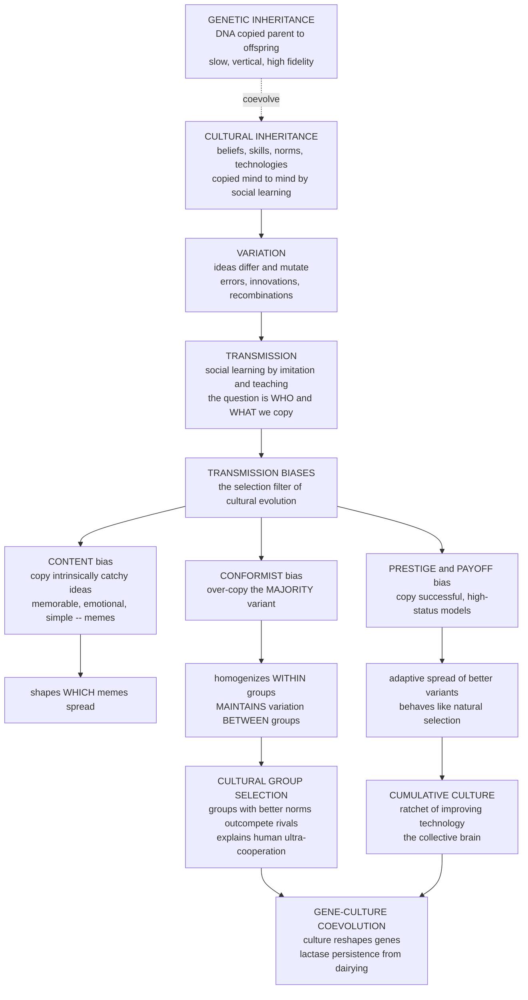

# 🧠 Cultural Evolution and Social Learning

> [!abstract] TL;DR
> **Genes are not the only things that evolve — ideas do too.** Culture (socially transmitted information: beliefs, skills, norms, technologies) is a **second inheritance system** riding on top of biology, and it undergoes genuinely **Darwinian evolution**: **variation** (ideas differ and mutate), **selection** (some spread more than others), and **transmission** (by imitation and teaching, not DNA). **Dual-inheritance theory** (Cavalli-Sforza & Feldman 1981; Boyd & Richerson 1985) makes this a rigorous, mathematical discipline: humans inherit information through **two channels — genes and culture — that coevolve**. What gets selected is governed by **transmission biases** — *whom* and *what* we copy. **Content biases** favour intrinsically catchy ideas (the seed of "memes"); **conformist bias** disproportionately copies the **majority** (homogenizing groups internally while **maintaining between-group differences**); and **prestige/payoff bias** copies the **successful** (spreading adaptive variants like natural selection). Social learning itself is an evolved strategy — but pure copying can be parasitic (**Rogers' paradox**: copiers free-ride on out-of-date information), so evolution favours a **smart mix** of learning when and whom it pays. The payoff is enormous: **conformist transmission maintains stable between-group cultural variation** that genes cannot, enabling **cultural group selection** — a leading explanation for human ultra-cooperation, large-scale institutions, and cumulative technology (the "collective brain"). And the street runs both ways: **gene-culture coevolution** — the textbook case being **lactase persistence** evolving in dairying populations — shows culture literally **reshaping the human genome**. Evolutionary game theory thus reaches beyond genes to explain cumulative technology, the spread of norms and misinformation, language change, and what makes humans uniquely cultural.

---

## Intuition

**Analogy:** A catchy tune gets stuck in your head, and you hum it on the bus; a stranger overhears it and hums it too. A useful cooking shortcut, a slang word, a religious ritual, a way to knap a stone tool — each spreads from mind to mind, **mutating a little with every copy**, competing with rival versions for the scarce resource of human attention and memory. You did not invent fire, the alphabet, or the number zero; you **inherited** them, not in your DNA but by **watching and being taught**. That second inheritance is culture, and it is doing something remarkable: **descent with modification**, the exact same engine that built the eye and the wing, now running on ideas instead of genes — and running **far faster**, because we deliberately copy the popular and the successful rather than waiting for the slow lottery of birth and death.

Two consequences follow immediately, and they structure everything below. First, because we can **choose** whom to imitate — the majority, the rich, the famous, the demonstrably competent — cultural "selection" is **biased and strategic** in ways genetic selection never is. Second, because a whole village can **converge on the same norms by conformist imitation and enforce them by punishment**, groups can stay **culturally different from their neighbours** in a way that genetically intermixing populations never could — and that stubborn between-group difference is precisely the raw material that lets **cooperative groups out-compete selfish ones**. Culture is not a footnote to human evolution. For our species, it *is* the main event.

---

## How It Works

### Core mechanics

**1. Culture is a Darwinian system.** Strip culture down to its logic and it satisfies the three ingredients of any evolutionary process. **Variation:** people hold different beliefs, techniques, and stories, and every act of transmission introduces error, embellishment, and innovation — the cultural analogue of mutation and recombination. **Selection:** some variants are copied more than others, so their frequency in the population rises while rivals fade. **Heredity:** the variants are **faithfully-enough transmitted** across "generations" of learners — but the generation is a **learning event**, not a birth, so cultural change can outrun genetic change by orders of magnitude. This is not a loose metaphor: the field borrows the **mathematics of population genetics** wholesale, tracking variant *frequencies* over time exactly as one tracks alleles, and the demo below is a Wright-Fisher-style model with the "mutation" and "selection" reinterpreted as social learning. It extends the same "descent with modification" logic that [[From_Classical_to_Evolutionary_Game_Theory]] applies to strategies, now to socially learned information.

**2. Dual inheritance — two channels, one animal.** Humans are the product of **two interacting inheritance systems**. Genes are transmitted vertically (parent to offspring), slowly, at high fidelity. Culture is transmitted **vertically, obliquely (from unrelated elders), and horizontally (peer to peer)**, fast, and often at lower fidelity but far higher volume. **Dual-inheritance theory** — developed by **Cavalli-Sforza & Feldman (1981)** and **Boyd & Richerson (1985)** — treats these two channels as **coupled dynamical systems** that shape each other. Crucially, culture is itself a **biological adaptation**: a species that can accumulate and copy know-how need not rediscover fire, edible plants, or tool-making from scratch each generation. Culture is *how humans adapt* — faster than natural selection could ever manage, and to environments (Arctic tundra, deep desert, high altitude) that no unaided genome could handle.

**3. Why imitate at all? — the evolution of social learning and Rogers' paradox.** Learning has two modes. **Individual (asocial) learning** — trial and error — produces up-to-date, accurate information but is **costly, slow, and dangerous** (which berry is poisonous?). **Social learning** — copying others — is **cheap and safe**: it exploits the effort someone else already spent. So natural selection should favour copying. But **Alan Rogers (1988)** proved a devastating catch: a population of pure imitators has **no higher mean fitness than a population of pure individual learners**. Why? Copiers are **information parasites** — they free-ride on the individual learners who track the changing environment, but when everyone copies, nobody is tracking, and the copied information goes **stale**. At equilibrium the copiers do no better than the loners they mimic. The resolution, and the reason human culture works, is **smart, conditional social learning**: strategies that copy **selectively** — *when* individual learning is expensive or unreliable, and *whom* it pays to imitate (the successful, the skilled, the many). The evolution of learning is thus itself an **evolutionary-game problem**: the best learning strategy depends on what everyone else is doing, exactly the frequency-dependence at the heart of EGT, and a natural companion to the imitation-and-learning models in [[Evolutionary_Economics_and_Bounded_Rationality]].

**4. Transmission biases — the "selection" of cultural evolution.** What decides which variant spreads is captured by **transmission biases**, sorted into two families. **Content (or direct) biases** act on the *idea itself*: some variants are intrinsically more memorable, emotionally arousing, easy to understand, or fear-triggering, so they spread regardless of who holds them — this is the kernel of truth in the "meme" concept (minimally counterintuitive religious concepts, gossip, moral outrage). **Context (or model) biases** act on *whom you copy*, and three matter most:
   - **Conformist bias:** copy the **majority**, and do so *disproportionately* — if 60% hold variant A, you adopt it with probability **greater than 60%**. Conformity **homogenizes a group internally** (diversity collapses toward the local majority) and, decisively, **maintains differences between groups** that start with different majorities.
   - **Prestige bias:** copy **high-status, admired, successful-*looking*** individuals — a heuristic for "this person must be doing something right," even when the copied trait is incidental to their success (why celebrities sell unrelated products).
   - **Payoff bias:** copy whatever **demonstrably works best** — the highest-return technique or technology. This is the most directly **adaptive** bias and behaves almost exactly like **natural selection**, driving better variants to fixation.

These biases are the **selective filter** of cultural evolution; the demo makes their qualitatively different fingerprints unmistakable.

**5. Memetics and its limits.** **Richard Dawkins (1976)** coined the **meme** — a unit of cultural transmission (a tune, catchphrase, idea, fashion) conceived as a **replicator** that spreads mind to mind and is, in a sense, "selfish," propagating because it is good at propagating (a chain letter, an earworm) rather than because it benefits its host. The image is vivid and useful, but strict memetics has real **limitations**: cultural transmission is usually **not high-fidelity copying** but **reconstructive** — learners rebuild an idea from fragments, cues, and their own inference (a story is retold, not photocopied), so a discrete gene-like "unit" is often fuzzy or nonexistent. Modern cultural evolution therefore mostly **drops the strict gene-analogy** in favour of **population-dynamic models** that track frequencies and biases without insisting on faithful replicators — while still treating information spread with the network and contagion tools of [[Network_Dynamics_and_Contagion]].

**6. Cultural group selection — the big payoff.** Here is the mechanism's crown jewel. **Genes flow between groups** whenever individuals migrate and interbreed, which quickly **erases genetic differences** — so classical between-group genetic selection is weak (see [[Group_and_Multilevel_Selection]]). But **culture behaves differently**: because **conformist transmission pulls immigrants toward the local majority** and **norm enforcement (punishment) penalizes deviants**, groups can **stay culturally distinct even with substantial migration**. Large, **stable between-group variation** is exactly what group selection needs to bite. So groups with more **cooperative norms, punishment institutions, and prosocial beliefs** out-produce, out-last, and are preferentially **copied by** rival groups — **cultural group selection**. This is a leading explanation for uniquely human **ultra-sociality**: cooperation among **thousands of unrelated strangers**, sustained by moralized norms, reputation, and institutions rather than kinship — connecting directly to [[Indirect_Reciprocity_and_Reputation]] and to the evolution of conventions and norms (planned sibling `The_Evolution_of_Conventions_and_Norms`).

**7. Gene-culture coevolution — culture reshaping biology.** The coupling is a **two-way street**: culture is not just shaped *by* genes, it **reshapes the genome**. The cleanest case is **lactase persistence**. Ancestrally, humans stopped producing lactase (the enzyme that digests milk sugar) after weaning. When some populations invented **dairying** ~7,000–10,000 years ago, they created a strong new selection pressure favouring the rare genetic variants that keep lactase switched on into adulthood — and those variants **swept to high frequency in exactly the dairying cultures** (Northern Europe, East African pastoralists) and remained rare elsewhere. **A cultural practice drove a genetic change.** Other cases: **cooking** softened food and is implicated in the reduction of human gut and jaw and the energetic budget for large brains; the **spread of agriculture** reshaped diet, disease, and metabolism (see [[Neolithic_Revolution_and_Agriculture]]); and the whole human capacity for **language, teaching, and high-fidelity imitation** likely evolved genetically *because* culture made those capacities pay — a coevolutionary spiral. Humans are, quite literally, the **product of gene-culture coevolution** — the theme of [[Evolutionary_Psychology_and_Cultural_Evolution]] and [[Biocultural_Anthropology]].

### Culture as a second inheritance system



---

## Key Concepts

### Secondary (intuitive)

- **A second kind of evolution.** Ideas, skills, and customs vary, compete, and get passed on by copying — so they **evolve**, just like living things, but through **imitation instead of birth**.
- **We copy the popular and the successful.** That is why cultural change is so fast and so strategic: you can *choose* the best model instead of waiting for the genetic lottery.
- **Conformity glues groups together.** When everyone copies the majority, a village converges on shared customs *and* stays different from the next village — differences genes could never keep.
- **Culture can change your genes.** Milk-drinking cultures evolved the genes to digest milk. The practice came first; the biology followed.

### Undergraduate (formal)

- **Cultural replicator dynamics.** Track variant frequencies `p_i`. A transmission rule maps current frequencies to next-generation frequencies; unbiased copying gives `p_i' = p_i` in expectation (**neutral, drift only**), payoff bias gives `p_i' ∝ p_i · π_i` (**a replicator equation** — see [[Replicator_Dynamics]]).
- **Conformist transmission.** With sampling and a conformity exponent, adoption probability is a **nonlinear, sigmoidal** function of frequency: variants above 50% are adopted *more* than their frequency, below 50% *less*. Result: an **unstable interior**, **stable fixation at 0 or 1**, and **rapid loss of within-group diversity**.
- **Rogers' paradox.** At the mixed equilibrium of individual vs social learners, `\bar{w}_{\text{social}} = \bar{w}_{\text{individual}}`: adding cheap imitators does **not** raise mean population fitness, because copiers dilute the environment-tracking done by individual learners.
- **Neutral cultural drift.** In a finite population, unbiased copying is mathematically **Wright-Fisher drift**: variant frequencies random-walk, heterozygosity decays at rate `1/N`, and one variant eventually fixes by chance — the cultural analogue of [[Finite_Populations_and_Stochastic_Dynamics]].
- **Between-group variance `F_ST`.** Cultural `F_ST` (fraction of total variation *between* groups) is empirically **much higher than genetic `F_ST`**, precisely because conformity and norms resist the homogenizing flow of migration — the quantitative signature that enables cultural group selection.

### Graduate (advanced)

- **The conformist transmission function.** For two variants with frequency `p`, Boyd & Richerson write the adoption probability as `p + D·p(1-p)(2p-1)` with `D > 0` (conformist) or `D < 0` (anti-conformist / novelty-seeking). The cubic has fixed points at `0, 1/2, 1`; `D > 0` makes `1/2` **unstable** and the endpoints **stable** — diversity is expelled. The demo uses the equivalent power-law form `w_i ∝ p_i^α`, `α > 1`.
- **Price-equation partition of cultural change.** The Price equation applies to *any* inheritance system; for culture it decomposes frequency change into **transmission bias** (the cultural analogue of selection) plus **innovation/error** (the analogue of mutation), and, across a metapopulation, into **within-** and **between-group** components — the formal machinery shared with [[Group_and_Multilevel_Selection]].
- **Guided variation vs biased transmission.** Boyd & Richerson distinguish **guided variation** (individuals learn something, then transmit their *modified* version — Lamarckian-flavoured directional change) from **biased transmission** (selective copying of unchanged variants). Real cumulative culture blends both; the balance sets how "directed" vs "selectionist" cultural change is.
- **Cumulative culture and the ratchet.** The **Tomasello ratchet** requires transmission fidelity high enough that improvements are *retained* faster than they are lost — hence the **collective-brain** result (Henrich, Muthukrishna): innovation rate scales with **population size and connectedness**, so demographic collapse can cause **cultural loss** (the Tasmanian toolkit simplification).
- **Cultural group selection and institutions.** Formal models (Boyd, Richerson, Henrich, Bowles & Gintis) show conformist transmission plus moralistic punishment can stabilize **arbitrary cooperative norms** at large scale, with **between-group competition** selecting among stable equilibria — a mechanism for the evolution of institutions studied in `Evolutionary_Dynamics_in_Markets_and_Institutions` and `Evolutionary_Political_Science_and_Conflict` (planned siblings).
- **Reconstructive vs replicative transmission.** Sperber's **attraction theory** argues transmission is lossy reconstruction pulled toward **cognitive attractors**, so population-level stability can arise from **shared psychology** rather than faithful copying — the principal theoretical rival/complement to selectionist "memetic" accounts.

---

## Python Demo

We simulate **cultural evolution under different transmission biases** in a finite population of `N` individuals, each holding one of `V` cultural variants (think competing technologies or behaviours). Each generation, everyone re-learns by **social learning**, and we vary only the **rule for whom/what to copy**. **Unbiased** copying (adopt a random individual's variant) reduces to **Wright-Fisher neutral drift** — frequencies random-walk with no direction, the cultural analogue of genetic drift. **Conformist** bias (`w_i ∝ p_i^α`, `α > 1`) **over-copies the majority**, collapsing within-group diversity and racing the current plurality to fixation. **Payoff/prestige** bias (`w_i ∝ p_i · π_i`) **copies the successful**, so the highest-payoff variant sweeps to fixation *adaptively* even when it starts rare — a replicator equation in disguise. A fourth panel shows the punchline for cooperation: **conformist transmission keeps two groups culturally different despite ongoing migration**, whereas unbiased copying lets migration homogenize them — the between-group variance that **cultural group selection** feeds on. `numpy` and `matplotlib` only.

```python
# Cultural evolution under three transmission biases + between-group variation.
# Punchline: SAME population, SAME variants -- only the COPYING RULE differs,
# yet the dynamics are qualitatively different: drift vs fixation vs adaptation.
import numpy as np
import matplotlib.pyplot as plt

# ---- Setup ----------------------------------------------------------------
N   = 500                                  # population size (finite -> drift visible)
V   = 4                                     # number of cultural variants
T   = 300                                   # learning generations
p0  = np.array([0.40, 0.30, 0.20, 0.10])    # initial variant frequencies
payoffs = np.array([1.0, 1.0, 1.0, 3.0])    # variant 3 is the "better technology"
ALPHA = 6.0                                 # conformity exponent (>1 = conformist)

def effective_variants(p):
    """Inverse Simpson index: the effective number of coexisting variants."""
    return 1.0 / np.sum(p**2)

def evolve(rule, seed):
    """One run of social learning for T generations. Returns freq trajectory."""
    r = np.random.default_rng(seed)
    p = p0.astype(float).copy()
    traj = [p.copy()]
    for _ in range(T):
        if   rule == "unbiased":   w = p                 # copy a random person
        elif rule == "conformist": w = p ** ALPHA        # over-copy the common
        elif rule == "payoff":     w = p * payoffs       # copy the successful
        w = w / w.sum()
        p = r.multinomial(N, w) / N                       # finite-pop resampling
        traj.append(p.copy())
    return np.array(traj)

traj_unb  = evolve("unbiased",   seed=7)
traj_conf = evolve("conformist", seed=7)
traj_pay  = evolve("payoff",     seed=7)

# ---- Between-group variation: does conformity resist migration? -----------
def two_groups(rule, m, T, N, seed):
    """Two groups, one binary trait. Migration mixes them each generation;
    then each group learns socially. Returns freq-of-A trajectory per group."""
    r  = np.random.default_rng(seed)
    pA = np.array([0.85, 0.15])              # group 0 mostly A, group 1 mostly B
    tr = [pA.copy()]
    for _ in range(T):
        mean = pA.mean()
        pm   = (1 - m) * pA + m * mean         # migration pulls toward the mean
        if rule == "conformist":               # conformity pulls back to own majority
            wA = pm**ALPHA / (pm**ALPHA + (1 - pm)**ALPHA)
        else:                                  # unbiased: no restoring force
            wA = pm
        pA = r.binomial(N, wA) / N
        tr.append(pA.copy())
    return np.array(tr)

T2, MIG = 200, 0.10
gr_conf = two_groups("conformist", MIG, T2, N, seed=3)
gr_unb  = two_groups("unbiased",   MIG, T2, N, seed=3)

# ---- Report ---------------------------------------------------------------
print(f"Effective number of variants after {T} generations "
      f"(start = {effective_variants(p0):.2f}):")
print(f"   unbiased  (drift)      : {effective_variants(traj_unb[-1]):.2f}  "
      f"-> slow, undirected loss of diversity")
print(f"   conformist (majority)  : {effective_variants(traj_conf[-1]):.2f}  "
      f"-> rapid fixation of the plurality")
print(f"   payoff (best variant)  : {effective_variants(traj_pay[-1]):.2f}  "
      f"-> the high-payoff variant sweeps")
print(f"\nAdaptive spread: variant 3 (payoff {payoffs[3]:.0f}) started at "
      f"{p0[3]:.2f}, ended at {traj_pay[-1,3]:.2f} under payoff bias.")
print(f"Between-group gap after {T2} gens with migration m={MIG}:")
print(f"   conformist : |pA_g0 - pA_g1| = {abs(gr_conf[-1,0]-gr_conf[-1,1]):.2f}  "
      f"(variation MAINTAINED -> cultural group selection possible)")
print(f"   unbiased   : |pA_g0 - pA_g1| = {abs(gr_unb[-1,0]-gr_unb[-1,1]):.2f}  "
      f"(groups HOMOGENIZED by migration)")

# ---- Visualize ------------------------------------------------------------
fig, ax = plt.subplots(2, 2, figsize=(14, 9))
colors = ["#1f77b4", "#ff7f0e", "#2ca02c", "#d62728"]
gens   = np.arange(T + 1)

def plot_variants(a, traj, title):
    for i in range(V):
        a.plot(gens, traj[:, i], color=colors[i], lw=2, label=f"variant {i}")
    a.set_title(title); a.set_xlabel("learning generation")
    a.set_ylabel("variant frequency"); a.set_ylim(-0.02, 1.02); a.grid(alpha=0.3)
    a.legend(fontsize=8, ncol=2, loc="upper right")

plot_variants(ax[0, 0], traj_unb,
              "UNBIASED copying -> neutral DRIFT\nundirected random walk, slow diversity loss")
plot_variants(ax[0, 1], traj_conf,
              "CONFORMIST bias -> rapid FIXATION\nthe majority variant is over-copied to 1")
plot_variants(ax[1, 0], traj_pay,
              "PAYOFF / PRESTIGE bias -> ADAPTIVE sweep\nbest variant (3) wins though it started rarest")

# Panel 4: conformity maintains between-group variation despite migration.
g = np.arange(T2 + 1)
ax[1, 1].plot(g, gr_conf[:, 0], color="#2ca02c", lw=2.2, label="conformist, group 0")
ax[1, 1].plot(g, gr_conf[:, 1], color="#2ca02c", lw=2.2, ls="--", label="conformist, group 1")
ax[1, 1].plot(g, gr_unb[:, 0],  color="#888888", lw=1.8, label="unbiased, group 0")
ax[1, 1].plot(g, gr_unb[:, 1],  color="#888888", lw=1.8, ls="--", label="unbiased, group 1")
ax[1, 1].set_title(f"CONFORMITY maintains between-group variation\n(migration m={MIG} each generation)")
ax[1, 1].set_xlabel("learning generation"); ax[1, 1].set_ylabel("frequency of variant A")
ax[1, 1].set_ylim(-0.02, 1.02); ax[1, 1].grid(alpha=0.3); ax[1, 1].legend(fontsize=8)

plt.tight_layout()
plt.savefig("cultural_evolution_transmission_biases.png", dpi=120)
print("\nSaved figure -> cultural_evolution_transmission_biases.png")
```

Expected output (values vary a little with the seed; qualitative story is robust):

```
Effective number of variants after 300 generations (start = 3.45):
   unbiased  (drift)      : 1.x   -> slow, undirected loss of diversity
   conformist (majority)  : 1.00  -> rapid fixation of the plurality
   payoff (best variant)  : 1.00  -> the high-payoff variant sweeps

Adaptive spread: variant 3 (payoff 3) started at 0.10, ended at 1.00 under payoff bias.
Between-group gap after 200 gens with migration m=0.1:
   conformist : |pA_g0 - pA_g1| = 0.7x  (variation MAINTAINED -> cultural group selection possible)
   unbiased   : |pA_g0 - pA_g1| = 0.0x  (groups HOMOGENIZED by migration)
```

Four fingerprints, one population. **Top-left (unbiased):** frequencies wander with no destination — pure **drift**; whichever variant happens to fix does so **by luck**, slowly, and the outcome is different every seed. **Top-right (conformist):** the initial plurality (variant 0) is copied *more* than its share, so it **snowballs to fixation fast** and diversity is crushed — the rule that homogenizes a group. **Bottom-left (payoff):** variant 3 starts **rarest** but is the **best**, and copying-the-successful behaves exactly like **selection**, sweeping it to fixation — adaptive optimization. **Bottom-right:** the cooperation punchline — with the *same* 10% migration each generation, **conformist** groups snap back to their own majorities and **stay culturally different** (the green solid and dashed lines hold apart), while **unbiased** groups are dragged together into one homogeneous blob (the grey lines merge). That persistent green gap is the **between-group variance** that makes **cultural group selection** — and human large-scale cooperation — possible.

---

## Real-World Applications

> **Example — the Tasmanian toolkit and the "collective brain."** When rising seas cut Tasmania off from mainland Australia ~10,000 years ago, its small, isolated population **progressively lost technologies** — bone tools, cold-weather clothing, fishing gear — that mainland groups kept. No one "forgot how" deliberately; with **too few skilled models to copy** and inevitable transmission errors, complex skills were **lost faster than they were reinvented**. This is cumulative culture running *in reverse*, and it demonstrates the field's sharpest quantitative prediction: a society's **technological sophistication scales with the size and connectedness of its population of learners** (Henrich's *collective brain*), not with individual intelligence. It is why innovation clusters in cities and networks — and why isolation causes cultural regression.

- **Public health and behaviour change.** Vaccination uptake, handwashing, contraception, and diet spread by **social learning**, and interventions work best when they exploit the right bias: recruit **prestigious local models** (prestige bias), broadcast that a behaviour is **already the norm** (conformist bias), or make the **payoff visible**. Getting the bias wrong — e.g. loudly announcing that "too many people don't vaccinate" — can **backfire** by signalling the *wrong* majority.
- **Misinformation and online fads.** Social media supercharges **content bias** (outrage, novelty, and fear are intrinsically copyable) and **prestige bias** (influencers), while algorithms amplify whatever is already popular — a machine for **conformist and content-biased transmission**. Modelling rumours, memes, and moral-outrage cascades uses the same frequency-and-network machinery as [[Network_Dynamics_and_Contagion]] and [[Social_Networks_and_Social_Ties]].
- **Language change.** Sound shifts, new words, and grammatical drift are cultural evolution in real time: variants spread by imitation with conformist and prestige biases, and neutral variants can fix by **drift** — the modelling backbone of [[Language_Change_and_Diffusion]] and [[Language_Evolution_and_Origins]].
- **The stability and diversity of norms and religions.** Why do moral and religious norms vary sharply *between* societies yet stay stable *within* them for centuries? Conformist transmission plus punishment maintains the between-group variation; cultural group selection among those stable variants helps explain the spread of **prosocial "big gods" and cooperative institutions** (see [[Culture_Norms_Values_and_Ideology]] and [[Language_and_Culture]]).
- **Innovation policy and organizations.** Firms and R&D ecosystems are collective brains: recombination of ideas, imitation of successful competitors (payoff/benchmarking), and the trade-off between **exploration** (individual learning) and **exploitation** (copying) — the applied edge studied in `Evolutionary_Dynamics_in_Markets_and_Institutions` (planned sibling).

---

## Common Pitfalls

- **Treating "meme" as a faithful gene-like replicator.** Most cultural transmission is **reconstructive**, not photocopied — learners rebuild ideas from cues and inference. Discrete, high-fidelity "units" are the *exception*, so strict memetics over-promises. Population-level stability often comes from **shared psychology (attractors)**, not copying fidelity.
- **Conflating the biases.** Conformist (copy the *majority*), prestige (copy the *high-status*), and payoff (copy the *best-performing*) are **distinct mechanisms with distinct dynamics** — the demo's panels diverge precisely because of this. Prestige and payoff can **come apart**: copying celebrities transmits traits *incidental* to their success.
- **Forgetting Rogers' paradox.** "Social learning is cheap, so evolution just favours copying" is wrong. Pure copying is **parasitic on individual learning** and yields **no net fitness gain**; what evolves is **conditional, selective** learning. Any model with only imitators and a changing environment is missing the point.
- **Assuming conformity is always adaptive.** Conformist bias is a **double-edged sword**: it stabilizes useful group norms *and* locks in **maladaptive** ones (harmful traditions, information cascades, bubbles). Anti-conformist / novelty-seeking biases exist for exactly this reason.
- **Ignoring demography.** Cumulative culture depends on **population size and connectedness**, not just cleverage or genius. Shrinking or fragmenting the population can cause **cultural loss** even with no change in individual ability (the Tasmania result).
- **Reifying "the culture" as a super-organism with goals.** Cultural evolution is **population dynamics of variants under biased transmission**, not a purposeful agent. "Culture wants X" is shorthand at best; the causal action is in individual learning decisions aggregated over a population.
- **Skipping the conditions for cultural group selection.** It requires **maintained between-group variance** (conformity + enforcement), **low enough migration relative to that restoring force**, and **real group-level payoffs**. Invoking it without checking these repeats the "good of the group" error flagged in [[Group_and_Multilevel_Selection]].

---

## Related Concepts

- [[Group_and_Multilevel_Selection]] — cultural evolution supplies the **between-group variance** that genes lack, making cultural group selection the most plausible route to human ultra-cooperation.
- [[Indirect_Reciprocity_and_Reputation]] — reputation and moralized norms are **culturally transmitted**; conformist enforcement is how they scale to strangers.
- [[Kin_Selection_and_Inclusive_Fitness]] — the *other* route to cooperation; culture lets humans cooperate far **beyond kin**, decoupling prosociality from relatedness.
- [[From_Classical_to_Evolutionary_Game_Theory]] — the "descent with modification" logic extended from strategies to **socially learned ideas**.
- [[Replicator_Dynamics]] — payoff-biased transmission **is** a replicator equation with fitness read as cultural payoff.
- [[Finite_Populations_and_Stochastic_Dynamics]] — unbiased copying is **cultural drift**: Wright-Fisher dynamics with variants in place of alleles.
- [[Fitness_Payoffs_and_Population_Games]] — the payoff-as-selection foundation that lets "successful variant" mean something precise.
- [[Evolutionary_Economics_and_Bounded_Rationality]] — imitation and social learning reframed as economic adaptation under bounded rationality; the sibling application on human learning dynamics.
- [[Evolutionary_Game_Theory_Overview]] — the vault entry point situating cultural evolution among EGT's applications.
- [[Evolutionary_Psychology_and_Cultural_Evolution]] — the anthropology companion on dual inheritance, social learning, and human uniqueness.
- [[Biocultural_Anthropology]] — the study of the gene-culture feedback loop in human biology.
- [[Neolithic_Revolution_and_Agriculture]] — a cultural revolution that drove genetic change (diet, disease, lactase persistence).
- [[Language_and_Culture]] — language as both a product of and a channel for cultural transmission.
- [[Culture_Norms_Values_and_Ideology]] — the sociology of the norms whose stability and between-group variation this note explains.
- [[Social_Networks_and_Social_Ties]] — the topology over which cultural variants actually diffuse.
- [[Language_Change_and_Diffusion]] — language change as cultural evolution with conformist, prestige, and drift dynamics.
- [[Language_Evolution_and_Origins]] — the coevolution of the biological capacity for language with culture itself.
- [[Observational_Learning]] — the psychology of imitation (Bandura) that is the micro-mechanism of cultural transmission.
- [[Social_Influence_and_Conformity]] — the experimental psychology (Asch) behind conformist transmission.
- [[Network_Dynamics_and_Contagion]] — the complexity-science view of how ideas, fads, and misinformation spread.
- [[Cooperation_and_Evolutionary_Game_Theory]] — the systems-thinking companion on evolved cooperation, to which cultural mechanisms add a human-specific layer.

**Planned siblings in this vault (referenced above, not yet written):** `The_Evolution_of_Conventions_and_Norms` (how shared conventions and norms crystallize), `Evolutionary_Political_Science_and_Conflict` (culture, norms, and inter-group conflict), and `Evolutionary_Dynamics_in_Markets_and_Institutions` (firms and institutions as evolving cultural systems).

---

## Review Questions

1. **(Conceptual)** Culture is described as a "second inheritance system." Identify the three Darwinian ingredients (variation, selection, transmission) in cultural evolution and, for each, name what plays the role that mutation, natural selection, and genetic heredity play in biological evolution. Why can cultural evolution be *faster* than genetic evolution?
2. **(Scenario)** A public-health team wants a new sanitation behaviour to spread through a set of villages. Contrast what **conformist**, **prestige**, and **payoff** transmission biases each predict about how to design the campaign — and explain one way a well-intentioned message could **backfire** by triggering the wrong bias. Then explain, using the between-group panel of the demo, why conformist transmission could make the behaviour **stick differently in different villages**.
3. **(Trade-off / synthesis)** State **Rogers' paradox** and explain why simply "adding cheap social learners" does not raise a population's mean fitness. Then argue how **conformist transmission** simultaneously (a) can trap a group in a *maladaptive* tradition and (b) enables **cultural group selection** to spread *adaptive cooperative norms* — and why the same mechanism produces both outcomes. Finally, use **lactase persistence** to explain what "gene-culture coevolution" adds beyond one-way genetic determinism.

---

## Sources

- Boyd, R. & Richerson, P. J. (1985). *Culture and the Evolutionary Process*. University of Chicago Press.
- Cavalli-Sforza, L. L. & Feldman, M. W. (1981). *Cultural Transmission and Evolution: A Quantitative Approach*. Princeton University Press.
- Richerson, P. J. & Boyd, R. (2005). *Not by Genes Alone: How Culture Transformed Human Evolution*. University of Chicago Press.
- Henrich, J. (2016). *The Secret of Our Success: How Culture Is Driving Human Evolution, Domesticating Our Species, and Making Us Smarter*. Princeton University Press.
- Rogers, A. R. (1988). "Does Biology Constrain Culture?" *American Anthropologist*, 90(4), 819–831.
- Mesoudi, A. (2011). *Cultural Evolution: How Darwinian Theory Can Explain Human Culture and Synthesize the Social Sciences*. University of Chicago Press.

---

#evolutionary-game-theory #cultural-evolution #social-learning #dual-inheritance #memetics
