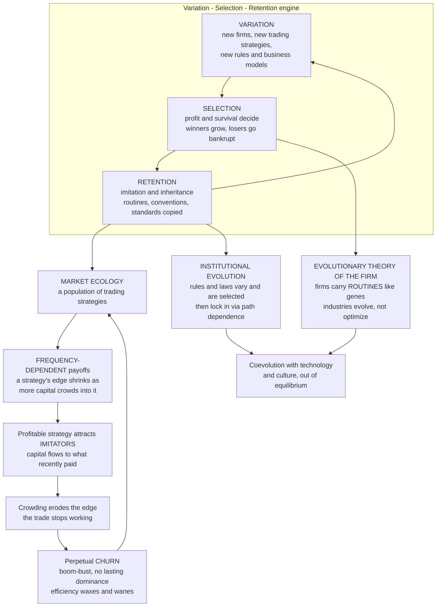

# 📈 Evolutionary Dynamics in Markets and Institutions

> [!abstract] TL;DR
> Markets, firms, and institutions are not static optima sitting at equilibrium — they are **evolving systems**. A financial market is an **ecology** of competing trading strategies whose success is **frequency-dependent**: a profitable strategy attracts **imitators** until crowding erodes its edge, so the market is a Darwinian struggle where no strategy dominates for long (Farmer's *market ecology*; Lo's **Adaptive Markets Hypothesis**, in which efficiency is an evolutionary outcome that waxes and wanes). Populations of adaptive strategies self-organize to fluctuate around the efficient level without ever settling (Arthur's **El Farol bar** and the **Minority Game**). Firms are carriers of **routines** (the economic analog of genes) that are **varied** by innovation, **selected** by profit and bankruptcy, and **retained** by imitation — the **evolutionary theory of the firm** (Nelson & Winter), which explains firm heterogeneity and industry life-cycles better than the fiction of the profit-maximizing firm. **Institutions** (rules, laws, market designs) likewise evolve and compete through variation, selection, and **path-dependent lock-in**, coevolving with technology and culture. EGT thus reframes economics as an **out-of-equilibrium adaptive process** — illuminating market instability, innovation, and institutional change — while cautioning that firms and strategies are not perfect replicators, so the biological analogy is a powerful **model-plus-metaphor**, not literal biology.

---

## Intuition

**Analogy:** A stock market looks nothing like the serene, silent equilibrium of a textbook diagram. Up close it is a **churning ecosystem** — a jungle of trading strategies competing, hunting, imitating, and driving one another extinct. When a strategy starts making money, rivals notice and **copy it**, piling into the same trade until the crowd is so large the edge evaporates and the strategy **self-destructs** — like a food source discovered by too many animals. Trend-followers and contrarians feed on each other the way predators and prey do: trend-followers thrive by riding the herd's momentum, then contrarians grow fat by fading the over-extended crowd, until quiet returns and patient fundamentalists collect — and then a new trend forms and the cycle restarts. Nothing rests. Markets, firms, and institutions **evolve**: successful firms and business models spread, failures go bankrupt, better rules out-compete worse ones. "Fitness" here is measured not in offspring but in **profit and survival**.

The formal move is to model an economy the way biology models an ecosystem. Strategy types are **species**, their capital shares are **population frequencies**, and their profits are **frequency-dependent payoffs** — high when a strategy is rare and novel, low once everyone crowds in. Feed those payoffs into `[[Replicator_Dynamics]]` (capital flows toward what recently paid), and the market becomes a living system that self-organizes toward efficiency but **never arrives** — perpetual evolutionary churn instead of a fixed point.

---

## How It Works

### The core reframing: markets and firms as populations under selection

Neoclassical finance says a market is (or rapidly becomes) an **efficient equilibrium** in which prices reflect all information and no strategy can beat the average. Evolutionary economics replaces that snapshot with a **process**. Three ingredients — the universal Darwinian algorithm — recur at every level:

1. **Variation** — new firms enter, entrepreneurs invent new products and routines, quants deploy new trading strategies, legislators draft new rules. This is the raw material, the "mutation."
2. **Selection** — the market decides. Profitable strategies attract capital; unprofitable ones lose it. Profitable firms grow; loss-making firms go bankrupt. Rules that deliver order and prosperity get copied by other jurisdictions; dysfunctional ones are abandoned. Fitness is **profit and survival**.
3. **Retention** — what works is **copied and inherited**. Trading strategies are imitated, firm routines are handed down and cloned by imitators, conventions and standards persist and propagate. This is the "heredity" that lets selection accumulate.

The crucial twist that makes this *evolutionary* rather than merely selectionist is **frequency dependence**. A trading strategy's payoff is not fixed — it depends on **how many others are already using it**. An arbitrage that is a gold mine when three funds run it becomes worthless when three hundred do, because their collective buying erases the mispricing they were exploiting. This is exactly the payoff structure of a `[[Fitness_Payoffs_and_Population_Games|population game]]`, and it is why markets behave like ecologies rather than converging to rest.

### Market ecology: strategies as species

**J. Doyne Farmer** made the ecology metaphor precise: think of a market as a set of **strategies (species)** whose returns depend on the **capital allocated to every other strategy** (the population state). Money flows toward strategies that have recently profited — a **replicator/imitation dynamic** on capital. Because a strategy's profitability falls as it becomes crowded, the system is driven by **negative frequency dependence** and **cyclic dominance**: value-investing pays until value bets get crowded and trends run them over; trend-following pays until the crowd over-extends and contrarians snap it back; contrarian fading pays until the market goes quiet and fundamentalists collect — a **rock-paper-scissors** among strategy types (`[[Cyclic_Dynamics_and_Rock_Paper_Scissors]]`). The market self-organizes toward efficiency (mispricings get competed away) but **never rests there**, because the very act of exploiting an inefficiency creates the next one.

### The Adaptive Markets Hypothesis

**Andrew Lo's Adaptive Markets Hypothesis (AMH)** uses evolution to reconcile the warring camps of the **Efficient Markets Hypothesis** and **behavioral finance** (`[[Foundations_of_Behavioral_Finance]]`). Markets are populated by **boundedly rational agents who adapt**. "Efficiency" is not a fixed property but an **evolutionary outcome** that **waxes and wanes** with the environment and the mix of participants: profit opportunities appear, get discovered, and are **competed away** as strategies adapt — then new opportunities open as conditions shift. Risk premia, arbitrage returns, and even the degree of rationality are **environment-dependent and time-varying**. Behavioral "biases" are not permanent irrationality but **heuristics** that were adaptive in some environment and misfire in others — the same evolutionary logic developed at the individual level in `[[Evolutionary_Economics_and_Bounded_Rationality]]`.

### El Farol and the Minority Game: self-organized near-efficiency

**W. Brian Arthur's El Farol Bar problem** distilled the idea to its core. A hundred people each want to go to a bar that is fun only if fewer than 60 attend; each uses private adaptive predictors of the crowd. There is no rational-expectations solution — if everyone predicts a light night, all go and it is packed. Yet in simulation, attendance **self-organizes to fluctuate around 60** without ever settling, as predictors that work get adopted and thereby stop working. The **Minority Game** (Challet & Zhang) is the formal cousin: agents repeatedly choose one of two sides and win by being in the **minority**. A population of adaptive strategies generates **emergent market-like volatility, herding, and near-efficiency** — the payoff-destroying feedback of "if a rule works, everyone copies it until it fails" made into a clean, endlessly-fluctuating model of a speculative market.

### The evolutionary theory of the firm

**Nelson & Winter (1982)** replaced the optimizing firm with an **evolving population of firms**. A firm is a bundle of **routines** — habitual ways of producing, pricing, hiring, and searching — that play the role of **genes**. Routines are **varied** (innovation, R&D, mutation of practice), **selected** (profitable routines let a firm grow and survive; bad ones lead to shrinkage and bankruptcy), and **retained** (successful routines are replicated internally and **imitated** by rivals). Industries therefore **evolve** rather than jump to a static optimum. This explains what equilibrium theory struggles with: **persistent firm heterogeneity** and productivity dispersion, **industry life-cycles** (a burst of entrants, a shake-out, consolidation), and **Schumpeterian creative destruction** as new routines displace incumbents.

### Institutional evolution

Institutions — property rights, contract law, corporate forms, market designs, regulations — are the **rules of the economic game**, and they too **evolve and compete**. They arise by variation (new statutes, charters, conventions), are selected (institutions that lower transaction costs and support exchange tend to spread; dysfunctional ones erode or get out-competed), and are retained through **path-dependent lock-in** — once an institutional complex is embedded, switching costs and complementarities make it self-reinforcing, so **institutions differ across societies and change only slowly** (**Douglass North**; **Geoffrey Hodgson**; **Samuel Bowles**). Institutions **coevolve** with technology and culture: new technologies demand new rules, and new rules enable new technologies, in a long feedback dance.

### Innovation as evolutionary search

Technological and economic innovation is itself **variation-selection-retention** over a design space. **Brian Arthur's** *combinatorial evolution* views new technologies as **recombinations of existing ones**, so the economy is continually exploring an **adjacent possible** — the set of designs one step away from what already exists. **Schumpeterian creative destruction** is the selection stage: novel combinations that pay off displace the old, and growth is the accumulated residue of this search (linking to `[[Technological_Progress]]` and `[[Endogenous_Growth_Theory]]`).



---

## Key Concepts

**Secondary (intuition level)**
- **A market is a jungle, not a still pond.** Trading strategies compete, get copied, and go extinct; nothing sits still.
- **Copying kills the edge.** When a way of making money spreads, so many people crowd in that it stops working — profitable strategies destroy themselves.
- **Predators and prey.** Trend-followers ride the herd, contrarians fade the over-extended herd, fundamentalists collect in the quiet — each thrives, then hands off to the next.
- **Firms are like organisms.** Good companies grow, bad ones go bankrupt; useful habits ("routines") get imitated across the industry.
- **Rules evolve too.** Laws, market designs, and institutions change slowly, compete, and often get stuck with whatever came first.

**Undergraduate (formal level)**
- **Frequency-dependent payoffs.** A strategy's return is a function of the whole population's strategy mix; crowding creates **negative frequency dependence**, the engine of churn.
- **Market ecology (Farmer).** Capital flows via imitation/replicator dynamics toward recently-profitable strategies; cyclic dominance among strategy types produces perpetual, non-equilibrium fluctuation.
- **Adaptive Markets Hypothesis (Lo).** Efficiency is an evolutionary, environment-dependent outcome; arbitrage opportunities appear and are competed away; behavioral biases are context-dependent heuristics.
- **El Farol / Minority Game.** Adaptive predictors self-organize attendance/positions to fluctuate around the efficient threshold, generating emergent volatility and herding without settling.
- **Evolutionary theory of the firm (Nelson-Winter).** Firms are populations of routines under variation (innovation), selection (profit/bankruptcy), retention (imitation); explains heterogeneity and industry life-cycles.
- **Institutional path dependence.** Increasing returns and complementarities lock in institutional arrangements, so institutions differ across societies and change slowly (`[[Complex_Adaptive_Systems]]`).

**Graduate (research level)**
- **Cyclic replicator dynamics.** With rock-paper-scissors payoffs among fundamentalist, momentum, and contrarian strategies the interior fixed point is a center or unstable focus, so trajectories are closed orbits or limit cycles — markets never rest at the efficient point (`[[Cyclic_Dynamics_and_Rock_Paper_Scissors]]`, `[[Evolutionary_Stability_and_Dynamic_Stability]]`).
- **Heterogeneous-agent asset pricing.** Brock-Hommes adaptive belief systems: fractions of forecasting rules updated by discrete-choice on realized profits, with intensity of choice beta; high beta yields a **rational route to randomness** — bifurcations, cycles, and chaotic price deviations from fundamentals.
- **Minority Game phase structure.** Control parameter alpha equals memory-states per agent; a phase transition separates a crowded, information-rich inefficient phase from a dilute efficient phase, with anomalous volatility near criticality (`[[Criticality_and_Phase_Transitions|criticality]]`).
- **Fitness landscapes of routines and technologies.** Innovation as search over rugged NK landscapes; combinatorial evolution and the adjacent possible; Schumpeterian growth as endogenous, out-of-equilibrium (`[[Evolutionary_Dynamics_and_Fitness_Landscapes]]`).
- **Caveats to the analogy.** Firms and strategies are **not perfect replicators**: transmission is Lamarckian (routines change intentionally), fitness is **endogenous and frequency-dependent**, design and foresight matter, and units of selection are ambiguous — so evolutionary economics is a rigorous **model-plus-metaphor**, not literal population genetics.

---

## Python Demo

We simulate a **market ecology** of three trading "species" — **fundamentalists**, **trend-followers**, and **contrarians** — whose profits are **frequency-dependent** in a cyclic, rock-paper-scissors pattern with a genuine economic rationale: **trends run over value bets** (trend beats fundamentalist), **over-extended crowds snap back** (contrarian beats trend), and **in a quiet market patient value pays while fading gets chopped up** (fundamentalist beats contrarian). Capital chases recent profit via `[[Replicator_Dynamics|replicator dynamics]]` (with a little experimentation), so **no strategy dominates for long** — the population **perpetually cycles**. A price process driven by the current strategy mix — trend-followers push price away from fundamental value, fundamentalists pull it back — produces **boom-bust** fluctuations locked to the ecological cycle, and a mispricing measure that oscillates forever: the market **self-organizes toward efficiency but never rests there**.

```python
# Market ecology of three trading strategies with FREQUENCY-DEPENDENT payoffs.
# Replicator/imitation dynamics on a rock-paper-scissors profit structure give a
# perpetual cycle (no strategy wins forever); a price process driven by the
# current strategy mix produces boom-bust that tracks the ecological cycle.
# numpy + matplotlib only.
import numpy as np
import matplotlib.pyplot as plt

# ---------------------------------------------------------------------------
# STRATEGY "SPECIES":  0 = Fundamentalist, 1 = Trend-follower, 2 = Contrarian
# Cyclic dominance (an ECOLOGICAL rock-paper-scissors):
#   Trend  BEATS  Fundamental   (trends run over value bets)
#   Contra BEATS  Trend         (over-extended crowds snap back)
#   Fund   BEATS  Contra        (in a quiet market value pays, fading gets chopped)
# a = loss magnitude, b = win magnitude.  a > b  ->  interior point UNSTABLE,
# so the population spirals into a persistent LIMIT CYCLE instead of resting.
a, b = 1.0, 0.5
A = np.array([[ 0.0, -a ,  b ],    # payoff to Fundamentalist vs [F, Trend, Contra]
              [ b ,  0.0, -a ],    # payoff to Trend-follower
              [-a ,  b ,  0.0]])   # payoff to Contrarian

mu  = 0.02      # imitation "noise" / experimentation (keeps all three alive)
dt  = 0.02
T   = 9000

x  = np.array([0.42, 0.34, 0.24])   # initial capital shares (off the center)
X  = np.empty((T, 3))

# price = log deviation from fundamental value (0 = fair); driven by the mix
p = np.zeros(T)
phi, kappa, sigma = 0.9, 0.3, 0.4   # momentum gain, mean-reversion gain, news
rng = np.random.default_rng(1)

for t in range(T):
    X[t] = x
    # FREQUENCY-DEPENDENT fitness: expected profit of each strategy vs the crowd
    fit = A @ x
    avg = x @ fit
    # replicator (imitate the successful) + rare experimentation, stay on simplex
    x = x + dt * (x * (fit - avg) + mu * (1.0/3.0 - x))
    x = np.clip(x, 1e-9, None)
    x = x / x.sum()

    # price impact: trend-followers push price away, fundamentalists pull it back
    if t >= 2:
        momentum  = phi * (X[t, 1] - X[t, 2]) * (p[t-1] - p[t-2])
        reversion = -kappa * X[t, 0] * p[t-1]
        p[t] = p[t-1] + momentum + reversion + sigma * rng.standard_normal()
        p[t] = np.clip(p[t], -80.0, 80.0)          # numerical safety rail
    elif t == 1:
        p[t] = sigma * rng.standard_normal()

inefficiency = np.abs(p)                            # distance of price from fair value
top = X.argmax(axis=1)                              # which species leads each step
names = ["Fundamentalist", "Trend-follower", "Contrarian"]

# ---------------------------------------------------------------------------
# VISUALIZE
fig = plt.figure(figsize=(13, 10))
cols = ["#2c7fb8", "#e6550d", "#31a354"]           # F, Trend, Contra
t_ax = np.arange(T) * dt

# (A) Strategy shares over time: perpetual cycles, no permanent dominance.
axA = fig.add_subplot(2, 2, 1)
for k in range(3):
    axA.plot(t_ax, X[:, k], color=cols[k], lw=1.4, label=names[k])
axA.set_title("Market ecology: capital shares cycle forever")
axA.set_xlabel("time"); axA.set_ylabel("share of capital")
axA.set_ylim(0, 1); axA.legend(loc="upper right", fontsize=8)

# (B) Simplex (ternary) phase portrait: the closed limit cycle.
axB = fig.add_subplot(2, 2, 2)
cx = X[:, 1] + 0.5 * X[:, 2]                        # ternary embedding
cy = (np.sqrt(3) / 2) * X[:, 2]
axB.plot(cx, cy, color="#555555", lw=0.7, alpha=0.9)
tri = np.array([[0, 0], [1, 0], [0.5, np.sqrt(3)/2], [0, 0]])
axB.plot(tri[:, 0], tri[:, 1], color="black", lw=1.0)
for (vx, vy), nm, c in zip(tri[:3], names, cols):
    axB.scatter([vx], [vy], color=c, s=60, zorder=3)
axB.annotate("Fundamentalist", (0, 0), fontsize=8, ha="left", va="top")
axB.annotate("Trend", (1, 0), fontsize=8, ha="right", va="top")
axB.annotate("Contrarian", (0.5, np.sqrt(3)/2), fontsize=8, ha="center", va="bottom")
axB.scatter([1/3 + 0.5/3], [(np.sqrt(3)/2)/3], marker="x", color="red",
            s=50, zorder=4, label="unstable center")
axB.set_title("Perpetual orbit around the (unstable) efficient mix")
axB.axis("equal"); axB.axis("off"); axB.legend(loc="lower center", fontsize=8)

# (C) Price: boom-bust locked to the ecological cycle.
axC = fig.add_subplot(2, 2, 3)
axC.plot(t_ax, p, color="#333333", lw=0.8)
axC.axhline(0, color="#2c7fb8", ls="--", lw=1.0, label="fundamental value")
axC.set_title("Price boom-bust driven by the strategy mix")
axC.set_xlabel("time"); axC.set_ylabel("price deviation from fair value")
axC.legend(loc="upper right", fontsize=8)

# (D) Mispricing never settles: efficiency waxes and wanes (AMH).
axD = fig.add_subplot(2, 2, 4)
win = 100
rolling = np.convolve(inefficiency, np.ones(win)/win, mode="valid")
axD.plot(t_ax[:rolling.size], rolling, color="#756bb1", lw=1.3)
axD.set_title("Inefficiency oscillates: markets self-organize but never rest")
axD.set_xlabel("time"); axD.set_ylabel("rolling |mispricing|")

fig.suptitle("Evolutionary market ecology: frequency-dependent strategies churn "
             "forever, producing boom-bust and time-varying efficiency", fontsize=12)
fig.tight_layout(rect=[0, 0, 1, 0.96])
plt.savefig("market_ecology.png", dpi=120)

# ---- numerical confirmation that no strategy permanently dominates ----
frac_leading = np.array([(top == k).mean() for k in range(3)])
print("Fraction of time each strategy LEADS the market:")
for k in range(3):
    print(f"  {names[k]:>15s}: {frac_leading[k]:.2f}")
print("Persistent volatility (std of price deviation):", round(p.std(), 2))
print("Mispricing never zero -> efficiency waxes and wanes, never final.")
plt.show()
```

**What the output shows.** Panel A: the three capital shares **rise and fall in an endless rotation** — fundamentalists give way to trend-followers, who are snapped back by contrarians, who cede to fundamentalists again — and the `argmax` printout confirms each strategy **leads roughly a third of the time**, none permanently. Panel B: on the strategy simplex the trajectory settles into a **closed limit cycle** orbiting the "efficient" balanced mix (marked, and **unstable**) — the market circles efficiency but never lands on it. Panel C: the price driven by that mix shows **boom-bust** — bubbles inflate while trend-followers dominate and burst when contrarians take over — with recurring excursions from fundamental value. Panel D: rolling mispricing **oscillates and never decays to zero**, the Adaptive-Markets picture that efficiency is a **time-varying evolutionary outcome**, not a permanent state. The whole system is powered by nothing but **frequency-dependent payoffs plus imitation**: profitable strategies attract crowds that erase their own edge.

---

## Real-World Applications

> **Example — the decay of a crowded quant strategy (the "quant quake" of August 2007):** many equity market-neutral funds independently discovered similar statistical-arbitrage and value/momentum signals. As capital piled into the same positions (`[[Statistical_Arbitrage]]`, `[[Momentum_Strategies]]`), the trade became **crowded** — exactly the negative frequency dependence of the demo. When a few funds deleveraged, the shared positions moved against everyone at once, triggering a self-reinforcing unwind and multi-sigma losses in strategies that had looked uncorrelated on paper. The edge had been **competed away by imitators**, and the crowding created a new instability: a textbook market-ecology boom-bust.

- **Market ecology and strategy crowding.** Farmer's framework explains why profitable signals **decay** as they are discovered and imitated, why strategy returns are frequency-dependent, and why funds must keep innovating just to stand still — a Red Queen race among strategies (`[[Mean_Reversion]]`, `[[Market_Microstructure]]`).
- **Algorithmic-trading ecology and flash crashes.** Modern markets are a fast-moving ecology of interacting algorithms — market-makers, arbitrageurs, momentum bots, execution algos (`[[High_Frequency_Trading]]`, `[[Reinforcement_Learning_Trading]]`, `[[ML_in_Trading]]`). Their coupled feedbacks can produce **flash crashes**: emergent, out-of-equilibrium instability no single agent intends, the ecology view's central warning.
- **Adaptive Markets Hypothesis in practice.** Lo's AMH reframes portfolio management as **adaptation**: risk premia and factor returns are time-varying because the population of strategies and the environment change; "anomalies" get arbitraged away and new ones open, so edge is perishable (`[[Foundations_of_Behavioral_Finance]]`).
- **Industry evolution and startup dynamics.** Nelson-Winter selection is visible in venture ecosystems and industry shake-outs: a burst of entrants trying variant business models, ruthless selection by the market, and imitation of winning routines — explaining industry life-cycles far better than a representative optimizing firm (`[[Oligopoly]]`, `[[Perfect_Competition]]`).
- **Institutional design and competition policy.** Treating institutions as evolving, path-dependent systems informs how regulators design market structures, standards, and antitrust remedies — recognizing lock-in, coevolution with technology, and the difficulty of moving a society from an inferior to a superior institutional equilibrium.
- **Agent-based macro and computational economics.** Central banks and researchers use agent-based models (`[[Agent_Based_Modeling]]`, `[[Economic_and_Social_Complexity]]`) of heterogeneous adaptive firms and households to study crises and policy in an out-of-equilibrium economy, complementing equilibrium DSGE models.

---

## Common Pitfalls

- **"Markets converge to a stable efficient equilibrium."** The market-ecology and AMH view is that efficiency is a **moving target** the system circles but never settles on — exploiting an inefficiency creates the next one. Treating the market as a fixed point discards the churn that is the whole phenomenon.
- **"A profitable strategy stays profitable."** Frequency dependence guarantees the opposite: **imitation crowds the trade and erases the edge**. Backtested edges decay in live trading precisely because success attracts capital.
- **"Evolutionary dynamics always settle down."** With cyclic (rock-paper-scissors) frequency dependence the dynamics have **no stable rest point** — closed orbits or limit cycles, not convergence. Assuming convergence smuggles equilibrium back in (`[[Cyclic_Dynamics_and_Rock_Paper_Scissors]]`).
- **"Firms and strategies are perfect replicators, so this is literal biology."** They are **not**. Transmission is Lamarckian (routines are changed on purpose), foresight and design matter, fitness is endogenous, and the unit of selection is fuzzy. Evolutionary economics is a rigorous **model-plus-metaphor**, and pushing the genetics analogy too far produces bad economics.
- **"The market selects the best firm/technology."** Path dependence and increasing returns can **lock in inferior** firms, standards, and institutions; selection is historical and contingent, not globally optimizing.
- **"El Farol / Minority Game are toy curiosities."** They are minimal models that generate **real market stylized facts** — herding, fat-tailed volatility, near-but-imperfect efficiency, phase transitions — from adaptive agents alone, and are load-bearing evidence for the ecology view.
- **"Institutions are chosen optimally by a social planner."** They **evolve** under variation, selection, and lock-in, coevolving with technology and culture; their cross-country persistence and slow change reflect path dependence, not global optimization.

---

## Related Concepts

- [[Evolutionary_Economics_and_Bounded_Rationality]] — the section-opener sibling; this note is its markets-firms-institutions companion, applying bounded-rationality dynamics to real economic systems.
- [[Replicator_Dynamics]] — the imitate-the-successful law that drives capital toward profitable strategies in the market-ecology demo.
- [[Cyclic_Dynamics_and_Rock_Paper_Scissors]] — the cyclic-dominance structure behind perpetual market churn and the non-resting strategy cycle.
- [[Fitness_Payoffs_and_Population_Games]] — the frequency-dependent payoff formalism that makes markets behave like ecologies.
- [[Evolutionary_Stability_and_Dynamic_Stability]] — why the "efficient" balanced strategy mix is an unstable rest point that the market orbits rather than settles on.
- [[Evolutionary_Game_Theory_Overview]] — the vault entry point whose machinery is applied here to economics.
- [[From_Classical_to_Evolutionary_Game_Theory]] — the shift from equilibrium-by-computation to equilibrium-by-selection that this note extends to markets.
- [[Evolutionary_Game_Theory_and_Machine_Learning]] — multi-agent reinforcement learning and the algorithmic-trading ecology that modern markets have become.
- [[Cultural_Evolution_and_Social_Learning]] — the imitation-and-transmission mechanism by which strategies and firm routines are copied.
- [[Foraging_and_the_Ideal_Free_Distribution]] — the biological analog: foragers crowd a patch until its payoff drops to the average, exactly as traders crowd a profitable strategy.
- [[Nash_Equilibrium]] — the static solution concept EGT reframes as a rest point markets circle but never reach.
- [[Foundations_of_Behavioral_Finance]] — the behavioral evidence the Adaptive Markets Hypothesis reconciles with efficiency via evolution.
- [[Statistical_Arbitrage]] — a canonical strategy whose edge decays as imitators crowd in (frequency dependence in action).
- [[Momentum_Strategies]] — the trend-follower species of the demo, thriving on herd momentum.
- [[Mean_Reversion]] — the contrarian species, profiting by fading over-extended crowds.
- [[High_Frequency_Trading]] — the fast algorithmic ecology whose coupled feedbacks can produce flash crashes.
- [[Reinforcement_Learning_Trading]] — adaptive agents learning within the market ecology, a modern face of the replicator dynamic.
- [[ML_in_Trading]] — how machine-learning strategies crowd, adapt, and compete away one another's edge.
- [[Market_Microstructure]] — the order-book level at which the strategy ecology actually plays out.
- [[Oligopoly]] — firm competition and selection, the industrial-organization face of the evolutionary theory of the firm.
- [[Perfect_Competition]] — the frictionless optimizing benchmark that evolving, satisficing firms depart from.
- [[Market_Equilibrium]] — the static supply-demand fixed point recast here as an emergent, out-of-equilibrium state.
- [[Technological_Progress]] — innovation as evolutionary search over a design space (combinatorial evolution).
- [[Endogenous_Growth_Theory]] — the Schumpeterian, innovation-driven growth that creative destruction generates.
- [[Complex_Adaptive_Systems]] — the framing of the economy as many adaptive agents producing emergent, non-equilibrium patterns.
- [[Agent_Based_Modeling]] — the computational method of choice for evolutionary and complexity economics.
- [[Emergence_and_Self_Organization]] — how near-efficiency and boom-bust emerge from local imitation without central design.
- [[Economic_and_Social_Complexity]] — the Santa Fe complexity-economics program this note anchors to.
- [[Evolutionary_Dynamics_and_Fitness_Landscapes]] — the fitness-landscape view of firm routines and technologies under selection.
- [[Cooperation_and_Evolutionary_Game_Theory]] — how the same selection dynamics can also build prosocial norms and institutions.

> Not-yet-written siblings referenced in prose only — `The_Evolution_of_Conventions_and_Norms` (stochastic stability and which conventions crystallize), `Fairness_Bargaining_and_the_Ultimatum_Game` (evolved fairness in exchange), and `Evolutionary_Political_Science_and_Conflict` (institutional and political dynamics) — will link back here once created.

---

## Review Questions

**Tier 1 — Conceptual**
1. Explain in plain language why a financial market behaves more like an **evolving ecosystem** than a static equilibrium. What role does **imitation** play, and why does copying a profitable strategy tend to **destroy** the profit?
2. What is the **Adaptive Markets Hypothesis**, and how does treating "efficiency" as an **evolutionary outcome** reconcile the Efficient Markets Hypothesis with behavioral finance?

**Tier 2 — Applied**
3. In the demo, the three strategies form a rock-paper-scissors: trend beats fundamental, contrarian beats trend, fundamental beats contrarian. Trace the resulting **cycle of dominance** and explain how it maps onto a real **boom-bust** episode in prices. Why does setting the loss magnitude larger than the win magnitude (a > b) make the market **cycle forever** instead of settling at the balanced mix?
4. Describe the **evolutionary theory of the firm** (Nelson-Winter) in terms of variation, selection, and retention of **routines**. What real phenomena — firm heterogeneity, industry life-cycles, productivity dispersion — does it explain that a profit-maximizing-firm model cannot?

**Tier 3 — Analytical / Open-ended**
5. The El Farol bar problem and the Minority Game have **no rational-expectations solution**, yet a population of adaptive agents self-organizes to fluctuate near the efficient level. Explain the feedback ("if a rule works, everyone copies it until it fails") and what it implies for whether real markets can ever be *perfectly* efficient.
6. Critically assess the biological analogy in evolutionary economics. In what specific ways are firms, trading strategies, and institutions **not** faithful replicators (Lamarckian transmission, endogenous fitness, design and intention), and how should those disanalogies change how much we trust conclusions drawn from replicator-dynamics models of markets and institutions?

---

## Sources

- Farmer, J. D. (2002). "Market Force, Ecology and Evolution." *Industrial and Corporate Change* 11(5), 895-953. — the market-ecology framework: strategies as species with frequency-dependent returns.
- Lo, A. W. (2004). "The Adaptive Markets Hypothesis: Market Efficiency from an Evolutionary Perspective." *Journal of Portfolio Management* 30(5), 15-29; expanded in Lo, A. W. (2017), *Adaptive Markets*, Princeton University Press.
- Nelson, R. R., & Winter, S. G. (1982). *An Evolutionary Theory of Economic Change*. Harvard University Press. — routines, selection, and the evolutionary theory of the firm.
- Arthur, W. B. (1994). "Inductive Reasoning and Bounded Rationality." *American Economic Review* 84(2), 406-411. — the El Farol bar problem.
- Challet, D., & Zhang, Y.-C. (1997). "Emergence of Cooperation and Organization in an Evolutionary Game." *Physica A* 246, 407-418. — the Minority Game.
- Brock, W. A., & Hommes, C. H. (1998). "Heterogeneous Beliefs and Routes to Chaos in a Simple Asset Pricing Model." *Journal of Economic Dynamics and Control* 22, 1235-1274. — adaptive belief systems and the rational route to randomness.
- North, D. C. (1990). *Institutions, Institutional Change and Economic Performance*. Cambridge University Press. — the evolution and path dependence of institutions.

---

#evolutionary-game-theory #market-ecology #institutional-evolution #minority-game #adaptive-markets
