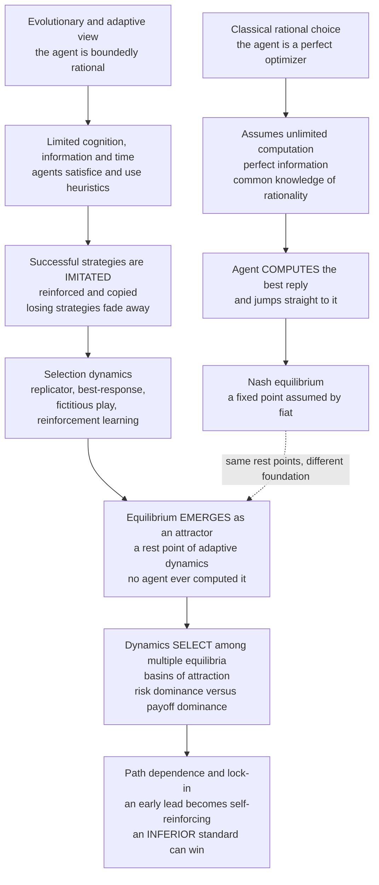

# 🏛️ Evolutionary Economics and Bounded Rationality

> [!abstract] TL;DR
> Classical economics and game theory assume **hyper-rational** agents — unlimited computation, perfect information, common knowledge of rationality — who **compute** the equilibrium and jump straight to it. Real humans have **bounded rationality** (Herbert Simon): limited cognition, information, and time. They **satisfice**, use heuristics, **imitate** what works, and learn by trial and error. Evolutionary game theory rebuilds the microfoundations: strategies that earn more get **copied and reinforced (selection)**, so the *population* converges to equilibrium through a **dynamic adaptive process** rather than by individual calculation — "as if" rationality **emerges from selection, not cognition**, and Nash equilibria are reinterpreted as **rest points / attractors of adaptive dynamics** (replicator, best-response, fictitious play, reinforcement learning). This buys three things classical theory cannot: it **justifies equilibrium with low rationality**, it **selects among multiple equilibria** (basins of attraction, stochastic stability, risk-dominance versus payoff-dominance — Kandori-Mailath-Rob, Young), and it explains **path dependence and lock-in** — where increasing returns turn an early lead self-reinforcing so an **inferior standard wins** (QWERTY, VHS). This is the engine of **complexity economics** (Santa Fe, Arthur, Beinhocker), the **evolutionary theory of the firm** (Nelson & Winter), and **agent-based modeling** — treating the economy as an **evolving ecosystem**, more like biology than physics. This note opens the vault's *Applications in Economics and Society* section.

---

## Intuition

**Analogy:** Picture a food court at lunch. Neoclassical theory imagines every diner as a lightning-fast optimizer who instantly surveys all thirty stalls, prices, wait times, and their own precise preferences, solves the constrained-maximization problem, and walks to the single best stall. That is **not** what people do. Most diners glance at which lines are long — *those stalls must be good* — copy a friend's recommendation, return to the place that satisfied them last week, or just pick something "good enough" and stop looking. No one computes the optimum. Yet over weeks the crowd still **flows toward the popular, well-reviewed stalls and away from the bad ones**, and the food court settles into a stable pattern. The *equilibrium got found* — not because any individual was a genius, but because **successful choices got imitated and spread while poor ones emptied out**.

That is exactly how evolutionary game theory models an economy: like biology models an ecosystem. Strategies that earn higher payoffs **"reproduce"** — they get copied, reinforced, adopted by more people — while losing strategies fade. The population finds equilibria through **selection and imitation**, not because anyone assumed or calculated them. And because the process is **historical**, *which* stall becomes the hit can depend on who happened to line up first: an early lead snowballs, and a merely-decent stall can beat a better one that never got a crowd.

---

## How It Works

### The critique: perfect rationality is a heroic assumption

Classical game theory and neoclassical economics rest on a demanding picture of the agent. To play a `[[Nash_Equilibrium]]` you must, in principle: know the full game and everyone's payoffs (**perfect information**), be able to solve for best replies without cost (**unlimited computation**), know that everyone else is equally rational and knows that you know, and so on (**common knowledge of rationality**), and then **instantaneously coordinate** on a fixed point. Even for chess this is impossible; for a market with millions of heterogeneous participants it is a fantasy. **Herbert Simon** attacked this directly in the 1950s: human rationality is **bounded** by finite cognition, incomplete information, and scarce time. Agents do not *maximize* — they **satisfice** (search until an option is "good enough" against an aspiration level), lean on **heuristics** (rules of thumb, imitation, defaults), and **adapt** as they go. The question EGT answers is: *if agents are this dumb, where do equilibria come from?*

### The evolutionary answer: equilibrium without a genius

EGT supplies a **low-rationality foundation** for equilibrium. No agent needs to *compute* the equilibrium. Instead:

1. A **population** of boundedly rational agents each plays some strategy.
2. Strategies that earn higher payoffs are **more likely to be copied, reinforced, or reproduced** — this is **selection**.
3. Strategy frequencies therefore **change over time** according to a dynamic law.
4. The process **converges to (or cycles around) a rest point** — and the interior rest points of many such dynamics are exactly the **Nash equilibria** of the game.

So the equilibrium concept survives, but its meaning shifts: a Nash equilibrium is reinterpreted as an **attractor / rest point of an adaptive process** rather than a state that rational agents deduce and select by fiat. "As-if optimization" — Friedman's old defense of rational-choice models — is given a genuine mechanism: **selection**, not clairvoyance, is what makes the aggregate *look* optimized. This is the core of `[[From_Classical_to_Evolutionary_Game_Theory]]`.

### The microfoundations: a family of learning dynamics

Several distinct adaptive processes all deliver this result, differing in *how much* the agent must know:

- **Replicator dynamics** — *imitate the successful*. The share of a strategy grows in proportion to how much its payoff beats the population average. Agents need only observe payoffs and copy; this is the workhorse and the mean-field limit of many imitation rules. See `[[Replicator_Dynamics]]`.
- **Best-response dynamics** — *myopically best-respond* to the current population mix. More cognitively demanding (you must compute a best reply), but still no foresight or common knowledge.
- **Fictitious play** — *best-respond to the empirical history* of opponents' past moves. Agents track frequencies and treat them as beliefs; it converges in many important game classes.
- **Reinforcement learning** — *raise the probability of rewarded actions* and lower that of punished ones (Erev-Roth, Q-learning). The least demanding of all: no model of the game, just experienced payoffs.

The deep unifying fact — the **"evolution equals learning" connection** — is that **many of these learning rules share the replicator equation as their mean-field limit** (Börgers-Sarin showed reinforcement learning → replicator; imitation and pairwise-comparison rules likewise). So a single differential equation captures both *biological* selection and *cognitive* learning, which is why EGT bridges cleanly into `[[Behavioral_Economics_Psychology]]`, `[[Judgment_and_Decision_Making]]`, and machine learning (the not-yet-written sibling `Evolutionary_Game_Theory_and_Machine_Learning`, on multi-agent RL and the replicator-mutator equation).



### Which equilibrium? Selection and refinement

A game like a **coordination game** or a **standards battle** has **multiple** strict Nash equilibria, and classical theory is famously **silent** on which one occurs — every equilibrium is "equally valid." This indeterminacy is a genuine embarrassment for prediction. Evolutionary dynamics **break the tie**: each equilibrium has a **basin of attraction**, and where the population starts (and how noise perturbs it) determines the outcome. Adding small persistent mutation/experimentation makes the selection sharper still — **Kandori-Mailath-Rob (1993)** and **Peyton Young (1993)** showed that as noise vanishes the system spends almost all its time at the **stochastically stable** equilibrium, which in 2×2 coordination games is the **risk-dominant** one (the "safe" strategy with the larger basin) — *even when it is not the payoff-dominant one*. EGT thereby becomes an **equilibrium-selection theory**: it predicts *which* convention, standard, or norm actually emerges (developed further in the planned siblings `The_Evolution_of_Conventions_and_Norms` and `Fairness_Bargaining_and_the_Ultimatum_Game`).

### Path dependence and lock-in

Because selection is a **historical** process, outcomes depend on **initial conditions and early events** — the hallmark of evolutionary economics. When there are **increasing returns to adoption** (network effects, learning-by-doing, complementary infrastructure), an early lead **self-reinforces**: more adopters make a standard more valuable, attracting still more adopters. The system can **lock in** to whichever standard pulled ahead first — and that need not be the best one. **W. Brian Arthur (1989)** and **Paul David (1985)** formalized this: **QWERTY** beat arguably-faster layouts, **VHS** beat Betamax, gasoline beat steam and electric cars — not necessarily because they were superior, but because contingent early advantages compounded. Markets **do not always find the optimum**; contingency matters. The Python demo below makes this concrete: an inferior-but-safe standard captures a *larger basin of attraction* and wins from most starting points, so the superior standard must secure a substantial early lead to survive.

### The Santa Fe / complexity-economics program

EGT is one pillar of a broader rethinking of economics as a **complex adaptive system** (`[[Complex_Adaptive_Systems]]`, `[[Economic_and_Social_Complexity]]`). In this view — associated with the **Santa Fe Institute**, **Brian Arthur**, and **Eric Beinhocker** — the economy is **many heterogeneous adaptive agents interacting out of equilibrium**, producing **emergent** aggregate patterns (`[[Emergence_and_Self_Organization]]`) and continual novelty. **Innovation is evolutionary search**: the **variation-selection-retention** of technologies, firms, products, and organizational routines. **Nelson & Winter's (1982)** *evolutionary theory of the firm* treats firms as bundles of **routines** (the economic analog of genes) that are selected by market competition and mutated by search — replacing the fiction of the profit-maximizing firm with a population of satisficing, adapting organizations. Economics starts to look **more like biology than physics** — an evolving ecology rather than a static optimization toward a unique equilibrium (`[[Evolutionary_Dynamics_and_Fitness_Landscapes]]`, `[[Cooperation_and_Evolutionary_Game_Theory]]`).

### The method: agent-based models

Methodologically, this paradigm favors **agent-based simulation** (`[[Agent_Based_Modeling]]`) over closed-form equilibrium analysis. You instantiate a **population of heterogeneous, adaptive agents**, give them simple behavioral rules (imitate, best-respond, reinforce), let them **interact on a network or market**, and *watch what emerges* — capturing bounded rationality, heterogeneity, interaction structure, and **out-of-equilibrium dynamics** that analytic models assume away. This is a central tool of computational social science, developed for markets and institutions in the planned sibling `Evolutionary_Dynamics_in_Markets_and_Institutions`.

---

## Key Concepts

**Secondary (intuition level)**
- **People imitate, they don't optimize.** We copy what seems to work, stick with habits, and pick "good enough" — nobody solves the whole problem in their head.
- **The crowd finds the answer.** Even if every individual is a bit clueless, popular good choices spread and bad ones empty out, so the group settles into a stable pattern.
- **History matters.** Whichever option gets an early crowd can snowball and win — sometimes a worse product beats a better one just because it got there first (QWERTY, VHS).
- **Bounded rationality.** Herbert Simon's idea: real minds have limited time, information, and brainpower, so they use shortcuts instead of perfect calculation.

**Undergraduate (formal level)**
- **Bounded rationality and satisficing.** Agents search until an option clears an aspiration level, rather than maximizing over the full choice set; they use heuristics and imitation.
- **Learning dynamics as microfoundations.** Replicator (imitate the successful), best-response (myopic optimization), fictitious play (best-respond to empirical history), reinforcement learning (reward-weighted action probabilities) — all adaptive, none requiring common knowledge.
- **Nash equilibrium as an attractor.** Interior rest points of the replicator equation coincide with Nash equilibria; strict Nash equilibria are asymptotically stable — see `[[Evolutionary_Stability_and_Dynamic_Stability]]`.
- **Equilibrium selection.** With multiple equilibria, **basins of attraction** determine which is reached; in 2×2 coordination games the **risk-dominant** equilibrium has the larger basin.
- **Path dependence and increasing returns.** Positive feedback (network effects, learning-by-doing) makes early leads self-reinforcing and can **lock in** a suboptimal standard.

**Graduate (research level)**
- **Evolution equals learning.** The replicator equation is the **mean-field limit** of many stochastic learning rules (Börgers-Sarin reinforcement learning; Schlag's imitate-the-better; pairwise-comparison/Fermi dynamics); the **replicator-mutator equation** adds experimentation/mutation and links to language and cultural evolution.
- **Stochastic stability.** In finite populations with vanishing mutation rate (Kandori-Mailath-Rob 1993; Foster-Young 1990; Young 1993), the long-run distribution concentrates on the **stochastically stable state**, selected by the **least-improbable escape** (radius-coradius / tree-surgery arguments) — generically the risk-dominant equilibrium.
- **Convergence is not guaranteed.** Best-response and replicator dynamics can **fail to converge** (Shapley cycles, `[[Cooperation_and_Evolutionary_Game_Theory]]` rock-paper-scissors limit cycles, chaotic learning); "no-regret" learning converges to the weaker **coarse correlated equilibrium**, not necessarily Nash.
- **Evolutionary theory of the firm.** Nelson & Winter model firms as populations of **routines** under selection (market) and variation (search/innovation); aggregate outcomes are **Schumpeterian** — creative destruction, out-of-equilibrium growth, not a Walrasian fixed point.
- **Complexity economics.** The economy as a non-equilibrium **complex adaptive system**: heterogeneous agents, endogenous novelty, fat-tailed fluctuations, and emergent macro patterns studied by agent-based computational economics (ACE) rather than representative-agent DSGE.

---

## Python Demo

We take a **technology-adoption / standards battle** as a symmetric 2×2 coordination game between a **superior standard A** (higher payoff when everyone coordinates on it) and an **inferior-but-safe standard B** (lower coordinated payoff, but no penalty for being early/incompatible). Crucially, **no agent optimizes or "jumps to Nash."** Instead a **population of boundedly rational imitators** follows **replicator dynamics** — the share of a standard grows when it out-earns the population average. We show (1) the population **converging to an equilibrium through selection alone**, (2) the **basins of attraction** of the two competing equilibria, and (3) **path dependence / lock-in**: the inferior standard is **risk-dominant**, owns the **larger basin**, and therefore wins from most starting points — the superior standard must grab a big **early lead** to survive. A stochastic finite-population version shows the same starting point producing **different outcomes** depending on early random breaks (the QWERTY/VHS contingency).

```python
# Technology-adoption coordination game solved NOT by rational optimization but by
# a population of boundedly rational IMITATORS (replicator dynamics + stochastic
# imitation). Demonstrates: convergence via selection, basins of attraction,
# path dependence, and lock-in of an INFERIOR standard (the QWERTY / VHS effect).
import numpy as np
import matplotlib.pyplot as plt

# ---------------------------------------------------------------------------
# THE GAME: two competing standards A (superior) and B (inferior but "safe").
# Payoff matrix, row = my choice, col = partner's choice:
#            partner A   partner B
#   me A  [    5   ,       0    ]   A pays 5 if everyone coordinates on A,
#   me B  [    3   ,       4    ]   but 0 if I adopt A while others use B.
# A is PAYOFF-DOMINANT (A,A=5 > B,B=4)  ->  A is the better standard.
# B is RISK-DOMINANT   (B is the safe choice: it never pays 0).
# Both (A,A) and (B,B) are strict Nash equilibria; classical theory cannot say
# which occurs. Evolutionary selection CAN.
M = np.array([[5.0, 0.0],
              [3.0, 4.0]])

def payoff_diff(x):
    # x = fraction of the population currently using standard A.
    # Mean-field payoff to an A-player and to a B-player against the population.
    pA = M[0, 0] * x + M[0, 1] * (1 - x)      # 5x + 0(1-x) = 5x
    pB = M[1, 0] * x + M[1, 1] * (1 - x)      # 3x + 4(1-x)
    return pA - pB                            # = 6x - 4  ->  zero at x* = 2/3

x_star = 2.0 / 3.0   # unstable interior equilibrium = the tipping point / separatrix
# For x > 2/3 the superior standard A wins; for x < 2/3 the inferior standard B
# wins. B's basin [0, 2/3) is TWICE the size of A's basin (2/3, 1]  ->  lock-in.

# ---------------------------------------------------------------------------
# (1) DETERMINISTIC REPLICATOR DYNAMICS from many initial conditions.
def replicator(x0, dt=0.01, steps=1500):
    x = float(x0)
    traj = np.empty(steps + 1)
    traj[0] = x
    for k in range(steps):
        x += dt * x * (1 - x) * payoff_diff(x)   # imitate-the-successful law
        x = min(max(x, 0.0), 1.0)
        traj[k + 1] = x
    return traj

inits = np.linspace(0.02, 0.98, 17)
trajs = [replicator(x0) for x0 in inits]
t = np.arange(trajs[0].size) * 0.01

# ---------------------------------------------------------------------------
# (2) STOCHASTIC IMITATION in a FINITE population (path dependence).
# N agents; each step a random focal agent compares payoff with a random model
# and copies the model's standard with a Fermi (logit) probability. Same start
# x0 = 0.60 (an early lead for A, but BELOW the 2/3 tipping point) run many times:
# most runs lock into the inferior B, a lucky few tip over into the superior A.
def stochastic_imitation(x0=0.60, N=200, steps=6000, beta=1.0, mut=0.001, rng=None):
    rng = rng or np.random.default_rng()
    agents = (rng.random(N) < x0).astype(int)      # 1 = uses A, 0 = uses B
    hist = np.empty(steps + 1)
    hist[0] = agents.mean()
    for k in range(steps):
        x = agents.mean()
        pA = M[0, 0] * x + M[0, 1] * (1 - x)
        pB = M[1, 0] * x + M[1, 1] * (1 - x)
        i, j = rng.integers(N), rng.integers(N)    # focal i, model j
        pay_i = pA if agents[i] else pB
        pay_j = pA if agents[j] else pB
        if rng.random() < 1.0 / (1.0 + np.exp(-beta * (pay_j - pay_i))):
            agents[i] = agents[j]                  # imitate the more successful
        if rng.random() < mut:                     # rare experimentation
            agents[rng.integers(N)] = rng.integers(2)
        hist[k + 1] = agents.mean()
    return hist

rng = np.random.default_rng(7)
runs = [stochastic_imitation(rng=np.random.default_rng(s)) for s in range(12)]
locked_A = sum(r[-1] > 0.5 for r in runs)

# ---------------------------------------------------------------------------
# VISUALIZE
fig = plt.figure(figsize=(13, 10))

# (A) Phase line: dx/dt vs x -> two stable attractors and one unstable tipping point.
axA = fig.add_subplot(2, 2, 1)
xg = np.linspace(0, 1, 400)
f = xg * (1 - xg) * payoff_diff(xg)
axA.plot(xg, f, color="#2c3e50", lw=2)
axA.axhline(0, color="gray", lw=0.8)
axA.plot([0, 1], [0, 0], "go", ms=9)                 # stable attractors
axA.plot([x_star], [0], "ro", ms=9)                  # unstable tipping point
axA.annotate("inferior B wins\n(stable)", xy=(0, 0), xytext=(0.05, -0.25))
axA.annotate("superior A wins\n(stable)", xy=(1, 0), xytext=(0.68, 0.22))
axA.annotate("tipping point x* = 2/3", xy=(x_star, 0), xytext=(0.30, 0.35),
             arrowprops=dict(arrowstyle="->"))
axA.set_title("Selection dynamics: attractors, not assumptions")
axA.set_xlabel("x = fraction adopting the superior standard A")
axA.set_ylabel("dx/dt  (change from imitation)")

# (B) Convergence of the population via imitation (no agent optimizing).
axB = fig.add_subplot(2, 2, 2)
for tr in trajs:
    color = "#27ae60" if tr[-1] > 0.5 else "#c0392b"
    axB.plot(t, tr, color=color, lw=1.3, alpha=0.8)
axB.axhline(x_star, color="black", ls=":", lw=1.2)
axB.text(t[-1] * 0.55, x_star + 0.02, "separatrix x* = 2/3", fontsize=8)
axB.set_title("Population CONVERGES through selection alone")
axB.set_xlabel("time")
axB.set_ylabel("fraction adopting standard A")
axB.set_ylim(-0.03, 1.03)

# (C) Basins of attraction: the INFERIOR standard owns the larger basin.
axC = fig.add_subplot(2, 2, 3)
axC.axvspan(0, x_star, color="#c0392b", alpha=0.30)
axC.axvspan(x_star, 1, color="#27ae60", alpha=0.30)
axC.axvline(x_star, color="black", lw=1.5)
axC.text(x_star / 2, 0.5, "BASIN of inferior B\n(size 2/3)\nlock-in",
         ha="center", va="center", fontsize=10)
axC.text((x_star + 1) / 2, 0.5, "basin of\nsuperior A\n(size 1/3)",
         ha="center", va="center", fontsize=10)
axC.set_title("Path dependence: inferior standard has the LARGER basin")
axC.set_xlabel("initial fraction using superior standard A")
axC.set_yticks([]); axC.set_xlim(0, 1)

# (D) Same start x0 = 0.60, different histories, different lock-in (QWERTY effect).
axD = fig.add_subplot(2, 2, 4)
th = np.arange(runs[0].size)
for r in runs:
    color = "#27ae60" if r[-1] > 0.5 else "#c0392b"
    axD.plot(th, r, color=color, lw=1.0, alpha=0.75)
axD.axhline(x_star, color="black", ls=":", lw=1.2)
axD.axhline(0.60, color="gray", ls="--", lw=1.0)
axD.text(th[-1] * 0.02, 0.62, "identical start x0 = 0.60", fontsize=8)
axD.set_title(f"Contingency: {locked_A}/12 runs lock into A, the rest into inferior B")
axD.set_xlabel("imitation step")
axD.set_ylabel("fraction adopting standard A")
axD.set_ylim(-0.03, 1.03)

fig.suptitle("Bounded-rational imitators reach economic equilibrium by SELECTION, "
             "with path dependence and lock-in", fontsize=13)
fig.tight_layout(rect=[0, 0, 1, 0.96])
plt.savefig("evolutionary_economics_lock_in.png", dpi=120)

# ---- numerical confirmation ----
print("Unstable tipping point x* =", round(x_star, 3),
      "-> B's basin [0, x*) is twice A's basin (x*, 1]")
print("Deterministic runs converging to superior A:",
      sum(tr[-1] > 0.5 for tr in trajs), "of", len(trajs),
      "(only those starting above 2/3)")
print("Stochastic runs from the SAME start x0=0.60 that locked into A:",
      locked_A, "of 12 -> same history-start, different outcomes (path dependence)")
plt.show()
```

**What the output shows.** Panel A is the **phase line**: the imitation law `dx/dt = x(1-x)(6x-4)` has **two stable attractors** — everyone-on-B (x=0) and everyone-on-A (x=1) — separated by an **unstable tipping point at x\* = 2/3**. Equilibria are **rest points of a dynamic**, not assumptions. Panel B shows a fan of populations **converging** to one standard or the other purely by imitation — no agent ever computed the equilibrium, yet the population finds it. Panel C displays the **basins of attraction**: because the inferior standard B is **risk-dominant**, its basin `[0, 2/3)` is **twice** the superior standard's basin `(2/3, 1]` — the better technology loses from most initial conditions, and needs a **large early lead** to win. Panel D is the **path-dependence** punchline: twelve stochastic runs launched from the **identical** early lead `x0 = 0.60` (below the tipping point) split — a lucky few ride early random adoption over the threshold and lock into the superior A, while most lock into the **inferior B**. Same starting history, different destinies — the QWERTY/VHS effect, reproduced from nothing but imitation and chance.

---

## Real-World Applications

> **Example — the QWERTY keyboard and VHS versus Betamax:** the canonical lock-in stories (Paul David; W. Brian Arthur). QWERTY was designed to *slow typists down* on 1870s mechanical typewriters, yet it beat later ergonomic layouts because typists, manufacturers, and typing schools each had an incentive to adopt whatever the *others* had already adopted — a coordination game with strong network effects. Once QWERTY secured an early lead, increasing returns (trained typists, installed machines) made switching collectively irrational even though a better layout existed. VHS beat the technically-comparable Betamax the same way: more titles → more players sold → more titles, a self-reinforcing spiral where an early edge, not superiority, decided the winner. Both are the inferior-standard-with-the-larger-basin from the demo.

- **Technology adoption and standards battles.** Operating systems, programming languages, social-network platforms, EV charging connectors, cryptocurrency protocols — all are coordination games with network effects where **equilibrium selection and lock-in**, not raw quality, often decide outcomes. Standards wars are won by seeding an early adopter base to cross the tipping point.
- **Industry dynamics and the evolutionary theory of the firm.** Nelson & Winter model firms as bundles of **routines** selected by the market and mutated by R&D; entry, growth, and bankruptcy are **selection** on a population of heterogeneous, satisficing firms. This explains persistent productivity dispersion, Schumpeterian creative destruction, and why industries evolve rather than sit at a static optimum (`[[Economic_and_Social_Complexity]]`).
- **Financial-market dynamics.** Traders **imitate** strategies that have recently paid off (momentum, herding), which can amplify into **bubbles and crashes** — an out-of-equilibrium, path-dependent dynamic that representative-rational-agent models miss. Agent-based "artificial stock markets" (Santa Fe) reproduce fat tails and volatility clustering from populations of adaptive, boundedly rational traders (`[[Foundations_of_Behavioral_Finance]]`).
- **Evolution of institutions, conventions, and norms.** Which side of the road we drive on, contract forms, property conventions, and social norms are **selected** among many possible equilibria by adaptive dynamics and stochastic stability (Young). EGT predicts *which* convention crystallizes and how norms can suddenly tip (developed in the planned sibling `The_Evolution_of_Conventions_and_Norms`).
- **Behavioral-economics evidence.** Humans demonstrably use **evolved heuristics** rather than optimization — anchoring, availability, imitation, default-following, loss aversion (`[[Cognitive_Biases]]`, `[[Problem_Solving_and_Decision_Making]]`, `[[Behavioral_Economics_Psychology]]`). EGT supplies the *dynamic* population-level counterpart to behavioral economics' individual-level findings, and connects to `[[Cooperation_and_Evolutionary_Game_Theory]]` for how prosocial norms spread.

---

## Common Pitfalls

- **"Bounded rationality means irrationality."** No — it means **procedurally** rational: agents use sensible, low-cost rules (imitate the successful, satisfice) that are well-adapted to a complex world. The claim is that the *aggregate* still self-organizes, not that individuals are foolish.
- **"Evolutionary dynamics always converge to Nash."** Only sometimes. Best-response and replicator dynamics can **cycle** (rock-paper-scissors, Shapley cycles) or behave chaotically; no-regret learning converges only to the weaker *coarse correlated equilibrium*. Assuming convergence is itself a rationality assumption smuggled back in.
- **"The market always selects the best option."** The whole point of **path dependence** is that it does **not**. Increasing returns can lock in an **inferior** standard (QWERTY). Efficiency is an outcome of history and initial conditions, not a guarantee.
- **"Payoff-dominance wins."** In coordination games the **risk-dominant** (safe) equilibrium usually has the larger basin and is stochastically stable, so it beats the payoff-dominant (better) one from most starting points. Do not assume the higher-payoff equilibrium is selected.
- **"Replicator dynamics literally requires biological reproduction."** It is a **mean-field limit of imitation and reinforcement learning** among *cultural* agents; "reproduction" here means a strategy being **copied**, not an agent having offspring. Confusing the metaphor with genetics leads to bad economics.
- **"Equilibrium is where the story ends."** In complexity economics the interesting action is **out of equilibrium** — innovation, novelty, and continual adaptation. Treating the economy as sitting at a fixed point discards exactly the dynamics EGT was built to study.
- **"Agent-based models are just unrigorous simulation."** Well-designed ABMs are controlled computational experiments with explicit micro-rules; they capture heterogeneity, networks, and non-equilibrium dynamics that closed-form models assume away. The rigor is in the **robustness analysis**, not in a closed-form solution.

---

## Related Concepts

- [[Evolutionary_Game_Theory_Overview]] — the vault's entry point; this note applies its machinery to economics and society.
- [[From_Classical_to_Evolutionary_Game_Theory]] — the foundational shift from rational-choice equilibrium to adaptive dynamics that this note builds on for economics.
- [[Replicator_Dynamics]] — the imitate-the-successful law used in the demo and the mean-field limit of many economic learning rules.
- [[Evolutionary_Stability_and_Dynamic_Stability]] — why strict Nash equilibria are asymptotically stable attractors, underpinning equilibrium selection here.
- [[Nash_Equilibrium]] — the classical fixed-point concept that EGT reinterprets as a rest point of adaptive dynamics.
- [[Correlated_Equilibrium]] — the broader solution concept that no-regret learning dynamics actually converge to.
- [[Repeated_Games_and_Folk_Theorems]] — repeated interaction and reputation are where imitation-driven cooperation norms take hold.
- [[Nash_Equilibrium_Applications]] — microeconomic applications of the equilibrium concept that EGT gives adaptive microfoundations for.
- [[Oligopoly]] — Cournot competition is a classic setting where best-response and imitation dynamics reach the equilibrium without hyper-rational firms.
- [[Consumer_Optimization]] — the perfect-optimizer benchmark that bounded rationality departs from.
- [[Market_Equilibrium]] — the static supply-demand fixed point that complexity economics recasts as an emergent, possibly out-of-equilibrium state.
- [[Behavioral_Economics_Psychology]] — the empirical case that humans use heuristics, not optimization; EGT is its population-dynamic counterpart.
- [[Cognitive_Biases]] — the evolved shortcuts that constitute bounded rationality at the individual level.
- [[Problem_Solving_and_Decision_Making]] — satisficing and heuristic search (Simon) as the psychology behind bounded rationality.
- [[Judgment_and_Decision_Making]] — the cognitive-science account of heuristics-and-biases that grounds low-rationality agents.
- [[Foundations_of_Behavioral_Finance]] — imitation, herding, and adaptive traders driving booms and crashes in markets.
- [[Complex_Adaptive_Systems]] — the framing of the economy as many adaptive agents producing emergent patterns.
- [[Emergence_and_Self_Organization]] — how aggregate equilibria emerge from local imitation without central design.
- [[Agent_Based_Modeling]] — the computational method of choice for evolutionary and complexity economics.
- [[Economic_and_Social_Complexity]] — the applied complexity-economics program (Santa Fe, Arthur, Beinhocker) this note anchors to.
- [[Evolutionary_Dynamics_and_Fitness_Landscapes]] — the fitness-landscape view of innovation as evolutionary search over technologies and routines.
- [[Cooperation_and_Evolutionary_Game_Theory]] — how prosocial norms and conventions spread through the same selection dynamics.

> Siblings planned for this *Applications in Economics and Society* section — `Evolutionary_Dynamics_in_Markets_and_Institutions` (agent-based markets, institutional evolution), `The_Evolution_of_Conventions_and_Norms` (stochastic stability, which conventions emerge), `Fairness_Bargaining_and_the_Ultimatum_Game` (why humans reject unfair splits), `Cultural_Evolution_and_Social_Learning` (imitation and cultural transmission), and `Evolutionary_Game_Theory_and_Machine_Learning` (multi-agent RL and the replicator-mutator equation) — will each link back to this section-opener.

---

## Review Questions

**Tier 1 — Conceptual**
1. Classical game theory says rational agents "compute the Nash equilibrium and play it." In plain words, what does evolutionary game theory replace this with, and why does it *not* require any agent to be smart? What is doing the work instead of individual calculation?
2. What did Herbert Simon mean by **bounded rationality** and **satisficing**, and how does an economy of satisficers still end up at an equilibrium?

**Tier 2 — Applied**
3. In the demo's coordination game the superior standard A pays 5 when everyone coordinates but 0 if you adopt it while others use B, whereas the inferior standard B pays 4 (coordinated) or 3 (mismatched). Compute the tipping point x\*, identify which standard is risk-dominant, and explain why the *inferior* standard wins from most initial conditions.
4. Give a real standards battle (keyboard layout, video format, OS, EV charger, or crypto protocol) and map it onto the model: what are the two equilibria, what creates the increasing returns, and what early event tipped the outcome? Was the winner the superior option?

**Tier 3 — Analytical / Open-ended**
5. Explain the "evolution equals learning" claim: in what sense do reinforcement learning, imitation, and biological selection share the replicator equation as a limit, and why does this let EGT unify behavioral economics with population dynamics? Where does the analogy break down?
6. Multiple-equilibrium coordination games are indeterminate under classical theory. Explain how **stochastic stability** (Kandori-Mailath-Rob, Young) selects a unique long-run equilibrium as mutation vanishes, why it favors risk-dominance over payoff-dominance, and what this implies for the design of policy interventions meant to move a society from an inferior to a superior convention.

---

## Sources

- Simon, H. A. (1955). "A Behavioral Model of Rational Choice." *Quarterly Journal of Economics* 69, 99-118. — the founding statement of bounded rationality and satisficing.
- Arthur, W. B. (1989). "Competing Technologies, Increasing Returns, and Lock-In by Historical Events." *Economic Journal* 99, 116-131. — increasing returns, path dependence, and technological lock-in.
- David, P. A. (1985). "Clio and the Economics of QWERTY." *American Economic Review* 75, 332-337. — the QWERTY case study of inferior-standard lock-in.
- Kandori, M., Mailath, G. J., & Rob, R. (1993). "Learning, Mutation, and Long Run Equilibria in Games." *Econometrica* 61, 29-56. — stochastic stability and risk-dominant equilibrium selection.
- Nelson, R. R., & Winter, S. G. (1982). *An Evolutionary Theory of Economic Change*. Harvard University Press. — routines, selection, and the evolutionary theory of the firm.
- Fudenberg, D., & Levine, D. K. (1998). *The Theory of Learning in Games*. MIT Press. — fictitious play, replicator, best-response, and reinforcement learning as microfoundations.
- Beinhocker, E. D. (2006). *The Origin of Wealth: Evolution, Complexity, and the Radical Remaking of Economics*. Harvard Business Review Press. — the complexity-economics synthesis.

---

#evolutionary-game-theory #evolutionary-economics #bounded-rationality #imitation-learning #path-dependence
