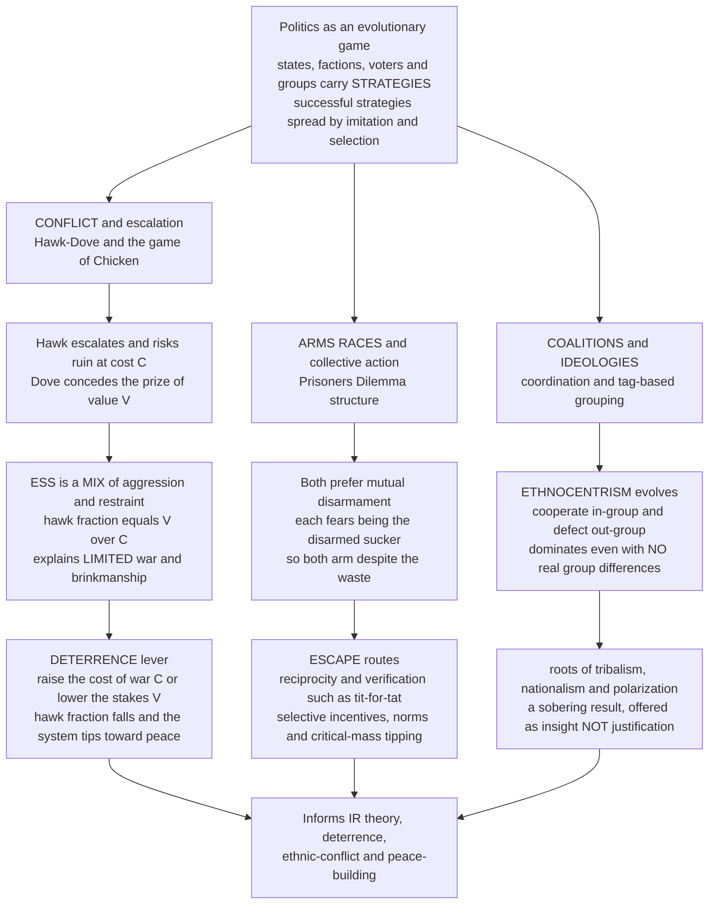

# 🕊️ Evolutionary Political Science and Conflict

> [!abstract] TL;DR
> Politics is an **evolutionary game** played for the highest stakes. Its actors — states, factions, voters, ethnic coalitions, interest groups — do not compute flawless equilibria; they run **strategies that spread by success and imitation**, so evolutionary game theory models political dynamics **without assuming hyper-rationality**, complementing classical rational-choice political science. Three engines recur. **Conflict is Hawk-Dove / Chicken**: escalating (Hawk) risks mutual ruin at cost `C`, conceding (Dove) cedes the prize `V`, and the ESS is a **stable mix of aggression and restraint** (hawk fraction `V/C`) — which is why real wars are usually *limited*, and why **raising the cost of war (deterrence) or lowering the stakes pushes the equilibrium toward peace**. **Arms races are Prisoner's Dilemmas**: both sides prefer mutual disarmament yet each fears being the disarmed sucker, so both arm despite the waste (the Cold War standoff) — escapable only by **reciprocity, verification, and norms** (tit-for-tat arms control) or by changing the payoffs. And **ethnocentrism evolves disturbingly easily**: Hammond & Axelrod showed that "cooperate in-group, defect out-group" can **dominate a population even with no real group differences**, via tag-based cooperation and spatial structure — an evolutionary root of tribalism, nationalism, and polarization. The framework illuminates the **security dilemma**, Schelling's deterrence, Olson's collective-action problem, coalition and alliance dynamics, and the diffusion of ideologies — offered as **insight, not determinism**, and explicitly guarded against naturalistic-fallacy justifications of conflict.

---

## Intuition

**Analogy:** Two nations eye the same disputed border, exactly like two animals contesting a patch of territory. Each faces the **Hawk-Dove dilemma**: escalate and risk a ruinous war that bleeds both sides (cost `C`), or back down and lose the prize, face, and resources (value `V`). If backing down were free, everyone would concede and there would be peace — but a state that *always* concedes gets exploited by every aggressor, so pure pacifism cannot survive; and a state that *always* escalates eventually smashes into another escalator and both are gutted, so pure aggression cannot survive either. The population of states settles at a **mixture of aggression and restraint** — which is precisely why history is full of *limited* wars, brinkmanship, and standoffs rather than perpetual peace or perpetual annihilation.

Now widen the lens. An **arms race** is a Prisoner's Dilemma: both superpowers would be better off disarmed, yet each fears being the one who disarmed while the other kept building, so both arm to the teeth and burn trillions on weapons neither wants to use. **Political ideologies, voting blocs, and ethnic coalitions** spread and compete like strategies in a population — the ones that win elections, attract members, or survive conflict get *imitated and grow*, whether or not anyone reasoned them out. Politics, at its core, is an **evolutionary game of coalitions, conflict, and cooperation** — the successful strategies reproduce, and the stakes are as high as they get.

---

## How It Works

### Political actors as strategy-carriers, not perfect optimizers

Classical political game theory (Schelling, Axelrod, Powell) models states and politicians as **rational actors** who compute best replies. That is powerful but demanding: it assumes leaders know the full game, everyone's payoffs, and everyone's rationality. The **evolutionary** reframing keeps the strategic logic but drops the clairvoyance. A political system is a **population** of actors — states, parties, factions, voters, militant groups — each carrying a **strategy** (a foreign-policy posture, an ideology, a mobilization tactic, a cooperative or defecting stance). Strategies that **succeed spread**: winning coalitions get copied, deterrent postures that avoid ruin get imitated, ideologies that mobilize voters diffuse across districts, tactics that win civil wars propagate to the next insurgency. Equilibria are **rest points of this adaptive process**, not states anyone deduced. This is why EGT *complements* rational-choice IR rather than replacing it — it explains how strategic patterns emerge and persist even when the actors are boundedly rational, imitative, and historically constrained (the low-rationality foundation developed in the sibling *[[Evolutionary_Economics_and_Bounded_Rationality]]*).

### Conflict as Hawk-Dove / Chicken: the ESS mix of war and restraint

The canonical model of international and factional conflict is **Hawk-Dove**, which political scientists know as the game of **Chicken**. Two actors contest a prize worth `V`. **Hawk** escalates and fights; **Dove** displays resolve but concedes if the other escalates. The payoffs:

- Hawk meets Dove: Hawk seizes `V`, Dove gets `0` — aggression pays against a pushover.
- Dove meets Dove: they split or negotiate, each gets `V/2` — peaceful bargaining.
- **Hawk meets Hawk**: mutual escalation, ruinous war, each nets `(V - C)/2` — **negative when `C > V`**.

When war is costly (`C > V`), *neither* pure posture is stable. An all-Dove world of appeasers is invaded by a single aggressor who wins everything; an all-Hawk world of escalators bleeds itself dry and is invaded by anyone who shows restraint. The **evolutionarily stable strategy is a mixture**: a fraction `p* = V/C` of the population plays Hawk, held in place by **negative frequency dependence** — aggression pays when rare and fails when common. This is the deep reason real conflict is usually **limited**: escalation and restraint *coexist* at equilibrium. The comparative statics are the policy payoff: **raising `C` (deterrence — making war more destructive or costly) lowers the hawk fraction `V/C`**, and **lowering `V` (reducing the stakes, splitting the prize, guaranteeing partial gains) lowers it too**. Both push the system toward peace. Deterrence works in this model not by making anyone nicer but by **bending the payoff arithmetic**.

### Arms races and collective action as Prisoner's Dilemmas

Where Hawk-Dove punishes mutual escalation catastrophically, the **Prisoner's Dilemma** punishes it merely badly — and that changes everything. In an **arms race**, each side's dominant move is to *arm* regardless of what the other does: if the rival disarms, arming lets you dominate; if the rival arms, you dare not be the disarmed sucker. So both arm, wasting enormous resources on a standoff **both would prefer to escape** — the Cold War nuclear buildup in one game. The same structure is Mancur **Olson's collective-action problem**: everyone benefits from a public good (a mobilized revolution, a lobbying win, clean government), but each individual is tempted to **free-ride** and let others pay the cost, so the good is under-provided. Escape routes are the same in both cases and are the heart of the cooperation literature: **direct reciprocity** (tit-for-tat arms control with **verification**, so today's defection is punished tomorrow — see *[[Direct_Reciprocity_and_Repeated_Games]]*), **selective incentives and norms** that reward contributors and shame defectors, and **critical-mass / tipping dynamics** where cooperation becomes self-sustaining once enough actors join (the model of bandwagons and revolutions).

### The security dilemma and deterrence

A cruel wrinkle specific to politics is the **security dilemma**: measures one state takes purely for *defense* — building missiles, forming alliances, fortifying borders — are **indistinguishable from offense** to its neighbors, who respond in kind, spiraling both into hostility neither wanted. This turns a would-be cooperative situation into an escalation trap. **Deterrence** stabilizes the Chicken game from the other direction: mutual assured destruction (**MAD**) makes `C` so astronomically large that the hawk fraction `V/C` collapses toward zero — nobody rationally escalates when escalation means annihilation. Thomas **Schelling's** nuclear strategy is the art of manipulating this game: **credible commitment**, the "threat that leaves something to chance," and deliberately *tying your own hands* to make a deterrent threat believable. The evolutionary reading adds that these postures also **spread by success** — deterrent doctrines that avoided ruin were imitated across the nuclear age.

### The evolution of ethnocentrism and in-group bias

The most sobering result is **Hammond & Axelrod's (2006)** model of **ethnocentrism**. Give agents an arbitrary, meaningless **tag** (think of it as an ethnic or group marker) and let them choose to cooperate or defect based only on whether a partner shares their tag. On a spatial lattice with reproduction-by-success, **ethnocentric agents — cooperate in-group, defect out-group — reliably evolve and come to dominate**, even though the tags carry *no real information* and there are *no genuine group differences*. In-group cooperation clusters spatially, out-competes both universal cooperators (who get exploited by strangers) and universal defectors (who miss the gains of local cooperation). This is a stark evolutionary account of the roots of **tribalism, nationalism, inter-group conflict, and polarization**: hostility toward out-groups can emerge from **tag-based cooperation and spatial structure alone**, without any of the "real" grievances we usually invoke to explain it. It is a warning, not a justification — see the pitfalls on the naturalistic fallacy.

### Coalitions, alliances, and the size principle

Political coalitions **form and dissolve through adaptive processes**. Among states, **balance-of-power** dynamics push alliances to form *against* whoever grows too strong — a self-correcting feedback that has recurred across centuries of great-power politics. Within legislatures and parties, William **Riker's size principle** predicts that actors build **minimal winning coalitions** — just large enough to win, no larger — so as not to dilute the spoils, and these coalitions reshuffle as payoffs shift. Coalition dynamics have a natural cooperative-game reading (**Shapley value**, the core) but an *evolutionary* one too: successful coalition strategies get imitated and stable configurations are those no small group can profitably upset.



---

## Key Concepts

### Secondary (intuitive)

- **Limited war, not endless war.** Because all-out aggression bankrupts everyone, states settle into a *mix* of tough and conciliatory postures — which is why most conflicts are bounded rather than total.
- **Make war more costly and you get less of it.** Deterrence works by raising the price of fighting; the model says a bigger cost of war shrinks the share of aggressors.
- **The arms-race trap.** Both sides would love to disarm, but neither dares go first, so both keep building weapons they never want to use.
- **Us-versus-them can grow from nothing.** Groups can evolve to help their own and shun outsiders even when the group labels mean nothing real — a warning about how easily tribalism takes hold.
- **Winning strategies spread.** Ideologies, tactics, and coalitions that succeed get copied and grow, whether or not anyone reasoned them out.

### Undergraduate (formal)

- **Hawk-Dove / Chicken payoffs.** With Hawk = 0, Dove = 1: `A = [[(V-C)/2, V], [0, V/2]]`. When `C > V` the mixed ESS plays Hawk with probability `p* = V/C`; the interior rest point is asymptotically stable under the replicator dynamics.
- **Conflict incidence.** The fraction of encounters that escalate to mutual (destructive) war is `p*^2 = (V/C)^2`, so deterrence lowers realized conflict **quadratically** in the hawk fraction — a stronger effect than on `p*` itself.
- **Prisoner's Dilemma of arming.** `T > R > P > S`: mutual disarmament `R` beats mutual arming `P`, but *arm* strictly dominates *disarm*, so the one-shot equilibrium is mutual arming despite `R > P`. Repetition and reciprocity restore cooperation (Folk Theorem).
- **Security dilemma.** Defensive capability raises the perceived offensive threat to others, shifting their payoffs toward Hawk and triggering an escalation spiral even absent aggressive intent.
- **Riker's size principle.** Rational coalition-builders form **minimal winning coalitions**; in evolutionary terms these are the configurations stable against invasion by a cheaper winning re-alignment.

### Graduate (advanced)

- **Tag-based cooperation (Hammond-Axelrod).** On a lattice with four strategies — ethnocentric, universal cooperator, universal defector, egoist (cooperate out-group only) — reproduction proportional to payoff plus local dispersal yields **ethnocentric dominance**; the effect requires *viscosity* (spatial structure) and *observable tags* and collapses under well-mixed interaction. Connects directly to *[[Spatial_and_Network_Games]]*.
- **Stochastic stability of conflict conventions.** In finite populations with rare experimentation (Kandori-Mailath-Rob, Young), which convention — deference to the incumbent power, "bourgeois" respect for possession, a norm of restraint — becomes the long-run outcome is set by **least-improbable escape**, giving an equilibrium-selection theory of political norms.
- **Bargaining and the commitment problem.** Fearon's rationalist explanations for war locate conflict in **private information plus incentives to misrepresent**, **commitment problems** under shifting power, and **issue indivisibility** — the frictions that stop actors from reaching the peaceful `V/2` split that Hawk-Dove says both would prefer.
- **Replicator-mutator diffusion of ideologies.** Ideology spread across districts or states maps onto the **replicator-mutator equation** (selection by electoral/mobilization success plus mutation by innovation and misperception), giving polarization and bandwagons a formal dynamical model.
- **Balance-of-power as negative feedback.** Alliance formation against the strongest actor is a stabilizing feedback loop; whether it produces stable multipolarity or recurrent hegemonic war depends on offense-defense balance and the shape of `C(V)`.

---

## Python Demo

We model **conflict escalation among a population of states (or factions)** as a Hawk-Dove / Chicken game and drive it with **replicator dynamics** — no state optimizes; aggressive and conciliatory postures simply spread in proportion to success. The demo (1) confirms the population **converges to the mixed ESS hawk fraction `V/C`** from any starting mix, so aggression and restraint coexist at a *limited-conflict* equilibrium; (2) runs the **deterrence comparative static** — raising the cost of war `C` monotonically lowers the equilibrium hawk fraction and, even more sharply, the realized **war incidence `p*^2`**; and (3) shows the mirror lever — raising the **stakes `V`** pushes the system toward more conflict, so *lowering* the stakes promotes peace. Requires only `numpy` and `matplotlib`.

```python
# Political conflict as an evolutionary Hawk-Dove / Chicken game among "states".
#   1. replicator dynamics converge to the mixed ESS hawk fraction p* = V/C
#      (a STABLE coexistence of aggression and restraint => LIMITED war)
#   2. DETERRENCE: raising the cost of war C lowers p* and lowers realized
#      war incidence p*^2 even faster (a quadratic peace dividend)
#   3. STAKES: raising the prize value V raises conflict; lowering V => peace
import numpy as np
import matplotlib.pyplot as plt

def hawk_dove_matrix(V, C):
    # rows/cols: 0 = Hawk (escalate), 1 = Dove (concede).
    # A[i, j] = payoff to an i-state meeting a j-state.
    return np.array([[(V - C) / 2.0, V      ],
                     [0.0,           V / 2.0]])

def replicator(A, x0, steps=4000, dt=0.01):
    # x = fraction of states playing Hawk; return the trajectory.
    xs = np.empty(steps + 1)
    x = float(x0)
    for t in range(steps + 1):
        xs[t] = x
        pop = np.array([x, 1.0 - x])          # current posture mix
        fit = A @ pop                          # frequency-dependent payoffs
        phi = pop @ fit                        # population-average payoff
        x = np.clip(x + x * (fit[0] - phi) * dt, 0.0, 1.0)
    return xs

def ess_hawk_fraction(V, C):
    # mixed ESS exists only when war is costly (C > V); else pure Hawk.
    return V / C if C > V else 1.0

# ---- (1) Convergence to the mixed ESS from many starting mixes ----------
V, C = 3.0, 6.0                                # costly war: C > V
A = hawk_dove_matrix(V, C)
p_star = ess_hawk_fraction(V, C)               # = 0.5
starts = [0.02, 0.20, 0.40, 0.60, 0.80, 0.98]
trajs = {s: replicator(A, s) for s in starts}

# ---- (2) DETERRENCE comparative static: vary cost of war C --------------
C_grid = np.linspace(V + 0.01, 6 * V, 300)     # only C > V is meaningful
p_of_C = np.array([ess_hawk_fraction(V, c) for c in C_grid])
war_incidence_C = p_of_C ** 2                  # fraction of mutual-Hawk (war) encounters

# ---- (3) STAKES comparative static: vary the prize value V --------------
C_fixed = 6.0
V_grid = np.linspace(0.01, C_fixed - 0.01, 300)  # keep C > V so peace is possible
p_of_V = np.array([ess_hawk_fraction(v, C_fixed) for v in V_grid])

# ---- console summary ----------------------------------------------------
print(f"Costly-war regime  V={V}, C={C}  ->  mixed ESS hawk fraction p* = V/C = {p_star:.3f}")
for s in starts:
    print(f"   start {s:.2f}  ->  replicator settles at {trajs[s][-1]:.3f}")
print(f"\nDeterrence (raise C):")
for c in [3.5, 6.0, 12.0, 18.0]:
    p = ess_hawk_fraction(V, c)
    print(f"   C={c:5.1f}  ->  hawk fraction {p:.3f},  war incidence p^2 = {p**2:.3f}")
print(f"\nStakes (raise V, C fixed at {C_fixed}):")
for v in [1.0, 3.0, 5.0]:
    p = ess_hawk_fraction(v, C_fixed)
    print(f"   V={v:4.1f}  ->  hawk fraction {p:.3f},  war incidence p^2 = {p**2:.3f}")

# ---- visualize ----------------------------------------------------------
fig, ax = plt.subplots(1, 3, figsize=(16, 4.6))

# Panel 1: replicator convergence to the mixed ESS (limited conflict).
for s in starts:
    ax[0].plot(trajs[s], lw=1.6, label=f"start {s:.2f}")
ax[0].axhline(p_star, color="k", ls="--", lw=1.3, label=f"ESS = V/C = {p_star:.2f}")
ax[0].set_title("Conflict settles at a MIX of aggression and restraint")
ax[0].set_xlabel("selection steps")
ax[0].set_ylabel("fraction of states playing Hawk")
ax[0].set_ylim(0, 1)
ax[0].legend(fontsize=7, loc="center right")

# Panel 2: deterrence -- raising the cost of war lowers conflict.
ax[1].plot(C_grid / V, p_of_C, lw=2.2, color="tab:blue", label="hawk fraction  p* = V/C")
ax[1].plot(C_grid / V, war_incidence_C, lw=2.2, color="tab:red",
           label="war incidence  p*^2")
ax[1].set_title("DETERRENCE: costlier war means less conflict")
ax[1].set_xlabel("cost-to-stakes ratio  C / V")
ax[1].set_ylabel("equilibrium conflict level")
ax[1].set_ylim(0, 1)
ax[1].legend(fontsize=8)

# Panel 3: stakes -- lowering the prize value promotes peace.
ax[2].plot(V_grid / C_fixed, p_of_V, lw=2.2, color="tab:green",
           label="hawk fraction  p* = V/C")
ax[2].plot(V_grid / C_fixed, p_of_V ** 2, lw=2.2, color="tab:purple",
           label="war incidence  p*^2")
ax[2].set_title("STAKES: higher prize means more conflict")
ax[2].set_xlabel("stakes-to-cost ratio  V / C")
ax[2].set_ylabel("equilibrium conflict level")
ax[2].set_ylim(0, 1)
ax[2].legend(fontsize=8, loc="upper left")

plt.tight_layout()
plt.savefig("evolutionary_political_conflict.png", dpi=120)
print("\nsaved figure -> evolutionary_political_conflict.png")
```

Expected output — every starting mix relaxes to the ESS, and both policy levers bend the equilibrium toward peace:

```
Costly-war regime  V=3.0, C=6.0  ->  mixed ESS hawk fraction p* = V/C = 0.500
   start 0.02  ->  replicator settles at 0.500
   start 0.20  ->  replicator settles at 0.500
   start 0.40  ->  replicator settles at 0.500
   start 0.60  ->  replicator settles at 0.500
   start 0.80  ->  replicator settles at 0.500
   start 0.98  ->  replicator settles at 0.500

Deterrence (raise C):
   C=  3.5  ->  hawk fraction 0.857,  war incidence p^2 = 0.735
   C=  6.0  ->  hawk fraction 0.500,  war incidence p^2 = 0.250
   C= 12.0  ->  hawk fraction 0.250,  war incidence p^2 = 0.062
   C= 18.0  ->  hawk fraction 0.167,  war incidence p^2 = 0.028
```

The left panel shows six trajectories fanning from different starting mixes and all bending to the dashed `V/C` line: aggression and restraint **coexist** at a stable, limited-conflict equilibrium — no state chose it, selection found it. The middle panel is the **deterrence result**: as the cost of war `C` rises relative to the stakes, the hawk fraction falls like `V/C` and the *realized* war incidence falls like `(V/C)^2` — a quadratic peace dividend that is the model's case for making war more costly. The right panel is the mirror image: raising the **stakes** `V` (a bigger, indivisible prize) drives the system toward more conflict, which is why *reducing* what is at stake — splitting the prize, guaranteeing partial gains, making disputes divisible — is itself a peace strategy.

---

## Real-World Applications

> **Example — Cold War nuclear deterrence and arms control:** the US-Soviet standoff was simultaneously a Prisoner's Dilemma (both would gain from disarming, yet each armed for fear of the disarmed-sucker outcome, producing tens of thousands of warheads neither wished to use) and a Chicken game stabilized by **MAD** — a cost of war `C` so catastrophic that the equilibrium hawk fraction `V/C` collapsed and neither superpower dared escalate to direct war. Escape from the arms-race dilemma came exactly as the theory prescribes: **reciprocity with verification** — SALT, START, and the ABM Treaty were tit-for-tat bargains made credible by inspection regimes, converting a defect-defect trap into sustained mutual restraint (see *[[Nuclear_Strategy_and_Arms_Control]]*).

- **International relations and the security dilemma.** Alliance formation, deterrence postures, and hostility spirals (pre-1914 Europe, US-China military competition) are modeled as populations of Hawk-Dove and security-dilemma interactions where defensive moves read as offensive threats (*[[International_Relations_Theories]]*, *[[Geopolitics_and_Power_Politics]]*, *[[War_Conflict_and_Security]]*).
- **Civil war and ethnic conflict.** Hammond-Axelrod ethnocentrism and tag-based cooperation help explain how ethnic mobilization, in-group favoritism, and inter-group violence can ignite even where objective group differences are minor — informing models of insurgency, ethnic outbidding, and the difficulty of post-conflict reconciliation (*[[Nationalism_Ethnicity_and_Collective_Identity]]*, *[[Race_Ethnicity_and_Racism]]*, *[[Global_Security_and_Terrorism]]*).
- **Collective action, revolutions, and mobilization.** Voting, protest, revolution, and public-goods provision are Olsonian social dilemmas; **critical-mass / tipping models** (Granovetter, Kuran's preference-falsification) explain why revolutions look impossible until, once a threshold of participants is crossed, they become unstoppable bandwagons (*[[Social_Movements_and_Revolution]]*, *[[Collective_Behavior_and_Crowds]]*).
- **Polarization and partisan dynamics.** Ideologies and party positions spread by electoral success and imitation; ethnocentric in-group/out-group logic scaled to partisanship offers an evolutionary lens on affective polarization and democratic backsliding (*[[Democratic_Backsliding_and_Polarization]]*, *[[Political_Parties_and_Party_Systems]]*).
- **Coalition and alliance formation.** Balance-of-power alignment among states and minimal-winning legislative coalitions (Riker's size principle) are adaptive processes with a cooperative-game backbone (*[[Coalitional_Games_and_Shapley_Value]]*).

---

## Common Pitfalls

- **The naturalistic fallacy — "evolved therefore justified."** That ethnocentrism, aggression, or war can *evolve* explains nothing about whether they are *good* or *inevitable*. The Hammond-Axelrod result is a warning about a trap to escape, not a license for tribalism. Treating "it's in our nature" as moral cover is the single most dangerous misuse of this literature.
- **Mistaking the ESS for an optimum.** The mixed hawk-dove equilibrium has *lower* collective welfare than universal restraint would — but universal restraint is invadable, so selection cannot reach it. "Stable" is not "desirable"; the whole point of deterrence and institutions is to *change the game* so a better equilibrium becomes reachable.
- **Assuming actors are pure automata.** States and politicians are *partly* rational and strategic; leaders, institutions, ideas, and contingency matter enormously. EGT is a complement to rational-choice and institutional analysis, not a replacement — use it for the population-level patterns it explains, not as a deterministic theory of any single decision.
- **Reading `V/C` off a poorly specified game.** The `V/C` result requires `C > V` and symmetric, well-defined stakes. Real conflicts have private information, commitment problems, and indivisible issues (Fearon) that the bare Hawk-Dove matrix omits — quoting a hawk fraction without checking the game's assumptions is meaningless.
- **Confusing the Prisoner's Dilemma with Chicken.** Arms races (defect strictly dominates) and escalation standoffs (mutual escalation is *catastrophic*, so no dominant move) have different structures and different escapes — reciprocity for the former, credible deterrence and stake-reduction for the latter. Applying the wrong model prescribes the wrong policy.
- **Ignoring interaction structure.** Ethnocentrism's evolution *depends on* spatial viscosity and observable tags; in a well-mixed population the result weakens or vanishes. Population structure (who interacts with whom) is not a detail — it is often the decisive variable (*[[Spatial_and_Network_Games]]*).

---

## Related Concepts

- [[Evolutionary_Game_Theory_Overview]] — the parent note; this applies its machinery to war, deterrence, and political coalitions.
- [[The_Hawk_Dove_Game]] — the founding model of limited conflict; here it becomes the game of Chicken between states and factions.
- [[The_Prisoners_Dilemma_and_Cooperation]] — the structure of arms races and collective-action problems, and how cooperation can nonetheless evolve.
- [[Direct_Reciprocity_and_Repeated_Games]] — tit-for-tat and verification as the escape route from arms-race dilemmas.
- [[Spatial_and_Network_Games]] — the population structure that makes ethnocentrism and tag-based cooperation evolve.
- [[Cultural_Evolution_and_Social_Learning]] — the imitation mechanism by which ideologies, tactics, and postures spread through political populations.
- [[Evolutionary_Economics_and_Bounded_Rationality]] — the low-rationality foundation letting political equilibria emerge without hyper-rational actors.
- [[Evolutionarily_Stable_Strategies]] — the uninvadability criterion behind the stable mix of aggression and restraint.
- [[Replicator_Dynamics]] — the selection law used in the demo to drive the state population to the ESS.
- [[Group_and_Multilevel_Selection]] — the debate over whether in-group cooperation and ethnocentrism reflect group-level selection.
- [[Nash_Equilibrium]] — the classical solution concept that EGT reinterprets as an attractor of adaptive political dynamics.
- [[Mixed_Strategies]] — the mixed hawk-dove ESS reread as a stable population ratio of aggressors to conciliators.
- [[Repeated_Games_and_Folk_Theorems]] — why repetition and reputation sustain cooperation in arms control and alliances.
- [[Coalitional_Games_and_Shapley_Value]] — the cooperative-game backbone of alliance and party-coalition dynamics.
- [[War_Conflict_and_Security]] — the political-science treatment of escalation, limited war, and deterrence.
- [[Nuclear_Strategy_and_Arms_Control]] — MAD, credible commitment, and Schelling's deterrence as a high-stakes Chicken game.
- [[International_Relations_Theories]] — realism, the security dilemma, and balance of power that these games formalize.
- [[Geopolitics_and_Power_Politics]] — great-power competition and alliance formation as adaptive strategic dynamics.
- [[Global_Security_and_Terrorism]] — insurgency and asymmetric conflict as evolutionary strategic contests.
- [[Democratic_Backsliding_and_Polarization]] — partisan in-group/out-group dynamics through the ethnocentrism lens.
- [[Political_Parties_and_Party_Systems]] — ideology diffusion and coalition formation among competing party strategies.
- [[Social_Movements_and_Revolution]] — critical-mass and tipping models of mobilization and revolutionary bandwagons.
- [[Collective_Behavior_and_Crowds]] — free-riding, thresholds, and cascades in collective political action.
- [[Nationalism_Ethnicity_and_Collective_Identity]] — the sociology of in-group identity that ethnocentrism models formalize.
- [[Race_Ethnicity_and_Racism]] — inter-group bias and its self-reinforcing dynamics.
- [[Social_Capital_and_Trust]] — the cooperative norms whose erosion or growth shapes collective-action outcomes.
- [[Political_Sociology_and_Social_Power]] — coalitions, power, and mobilization as population-level social processes.

> Referenced in prose but not yet written in this vault: `The_Evolution_of_Conventions_and_Norms` (stochastic stability of political norms) and `Evolutionary_Dynamics_in_Markets_and_Institutions` (institutional evolution) — both will link back here when added.

---

## Review Questions

**Tier 1 — Conceptual**
1. Politics is full of *limited* wars, brinkmanship, and standoffs rather than perpetual peace or perpetual annihilation. Using the Hawk-Dove / Chicken model, explain why *neither* pure appeasement nor pure aggression is evolutionarily stable, and what the resulting equilibrium looks like.
2. What is the difference between an **arms race** (Prisoner's Dilemma) and an **escalation standoff** (Chicken), and why does each demand a *different* escape route — reciprocity-with-verification for one, credible deterrence and stake-reduction for the other?

**Tier 2 — Applied**
3. In the demo's conflict game the prize is worth `V = 3` and war costs `C = 6`. Compute the ESS hawk fraction and the realized war incidence `p*^2`. Now a deterrent doctrine triples the cost of war to `C = 18`. Recompute both, and explain in one sentence why the drop in *realized* conflict is larger than the drop in the hawk fraction.
4. Take a real case — the Cold War nuclear standoff, the pre-1914 European alliance system, or an ethnic civil war — and map it onto one of the three engines (Hawk-Dove, Prisoner's Dilemma, or ethnocentrism). Identify the payoffs, the equilibrium, and the lever that could shift it toward peace.

**Tier 3 — Analytical / Open-ended**
5. Hammond & Axelrod found that ethnocentrism — cooperate in-group, defect out-group — evolves and dominates *even with no real group differences*, provided there is spatial structure and observable tags. Explain the mechanism, why well-mixed populations weaken the result, and precisely why concluding "tribalism is therefore natural and justified" commits the **naturalistic fallacy**.
6. Rational-choice IR (Fearon) locates war in private information, commitment problems, and issue indivisibility — frictions that stop actors from reaching the peaceful split both prefer. Evolutionary game theory locates conflict in selection among boundedly rational strategy-carriers. Are these views rivals or complements? Argue your position, and say what each explains that the other misses.

---

## Sources

- Maynard Smith, J. (1982). *Evolution and the Theory of Games*. Cambridge University Press. — Hawk-Dove, the War of Attrition, and the ESS framework underlying conflict models.
- Schelling, T. C. (1960/1980). *The Strategy of Conflict*. Harvard University Press. — deterrence, credible commitment, the threat that leaves something to chance, and the game of Chicken.
- Axelrod, R. (1984). *The Evolution of Cooperation*. Basic Books. — tit-for-tat, reciprocity, and the escape from Prisoner's-Dilemma arms-race dynamics.
- Hammond, R. A., & Axelrod, R. (2006). "The Evolution of Ethnocentrism." *Journal of Conflict Resolution* 50(6), 926-936. — tag-based cooperation and the emergence of in-group bias without real group differences.
- Olson, M. (1965). *The Logic of Collective Action*. Harvard University Press. — free-riding, selective incentives, and the collective-action problem.
- Jervis, R. (1978). "Cooperation Under the Security Dilemma." *World Politics* 30(2), 167-214. — the security dilemma and offense-defense balance.
- Fearon, J. D. (1995). "Rationalist Explanations for War." *International Organization* 49(3), 379-414. — private information, commitment problems, and issue indivisibility as the true frictions behind war.

---

#evolutionary-game-theory #political-science #conflict #arms-races #coalitions
