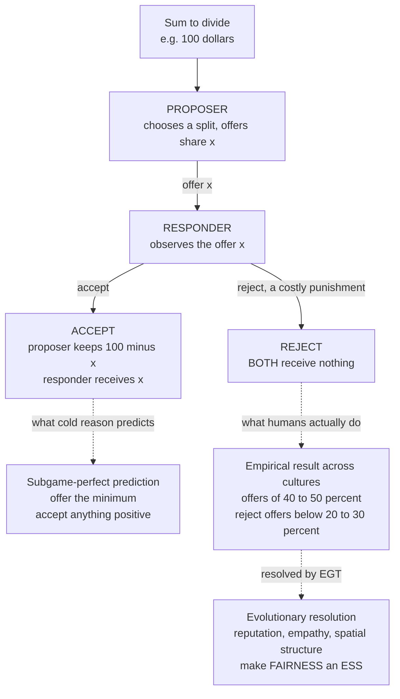

# 🤝 Fairness, Bargaining, and the Ultimatum Game

> [!abstract] TL;DR
> The **Ultimatum Game** (Güth 1982) is the sharpest evidence that humans are **not** cold payoff-maximizers. A **proposer** offers a split of a sum; a **responder** accepts (both get the split) or rejects (both get **nothing**). Cold logic — [backward induction](## "solve the last move first: a rational responder accepts any positive amount, so a rational proposer offers the minimum") — predicts the proposer offers the **minimum** and the responder accepts **anything positive**. Real people worldwide instead offer **40 to 50 percent** and **reject** offers below **20 to 30 percent**, angrily choosing zero over being cheated — a **costly punishment** of unfairness. EGT resolves the paradox: in a **repeated, reputation-laden** social world, a credible willingness to reject exploitation — enforced by **moral anger** as a commitment device — **deters** lowballing and secures better future offers. Nowak, Page & Sigmund (2000) proved that adding **reputation or empathy** turns **fairness into an ESS**; **spatial structure** and noise do the same. This evolved **strong reciprocity** (Gintis, Bowles, Fehr) — conditional cooperation plus altruistic punishment — underpins human cooperation, fair bargaining conventions, and the moral economy beneath markets and institutions.

---

## Intuition

**Analogy:** I offer to split **100 dollars** with you — but *I* decide the split, and you can only **accept** or **reject**. If you reject, we **both** walk away with nothing. A coldly rational you should accept even **1 dollar**, since 1 dollar beats 0. Yet across the world, real people **reject** offers below roughly **30 dollars**, angrily choosing nothing over the feeling of being cheated. Why would evolution build in such "spiteful" fairness?

Because in real life you almost never play **once** and **anonymously**. You play the same partners, and word gets around. A **reputation** for refusing to be exploited pays off when you interact many times: people who know you will not swallow a raw deal make you **better offers** in the first place. The lab's one-shot game strips away that future — but your evolved emotions do not know that. The flash of anger at a 10-dollar offer, the impulse to reject "on principle," is not a **failure of reason**; it is a **strategy** that was profitable across a lifetime of repeated, observed encounters, misfiring in an artificial one-shot setting. Fairness, in this view, is a **piece of evolved software** for bargaining in a social world — and the Ultimatum Game is the experiment that catches it in the act.

---

## How It Works

### The game and the "rational" prediction

The Ultimatum Game has two roles and one round:

1. A sum `S` (say 100 dollars) is on the table. The **proposer** offers the responder a share `x`, keeping `S - x`.
2. The **responder** observes `x` and chooses **accept** or **reject**.
3. **Accept:** proposer keeps `S - x`, responder gets `x`. **Reject:** *both get zero*.

Solve it by [subgame-perfect](## "subgame-perfect equilibrium: every player is optimal at every decision node, found by backward induction") reasoning. Look at the **responder's** move last: for any `x > 0`, accepting (`x`) beats rejecting (`0`), so a selfish responder accepts **anything positive**. Anticipating this, a selfish proposer offers the **smallest positive amount** — 1 cent — and keeps almost everything. That is the unique subgame-perfect equilibrium for *Homo economicus*.

### The anomaly

Humans do the opposite. Across hundreds of studies (typically Western university samples first):

- **Proposers** offer a **mean near 40 to 50 percent**; the 50-50 split is the single most common offer.
- **Responders reject** low offers — those below about **20 to 30 percent** are rejected roughly half the time. Rejection is **costly punishment**: the responder *pays* (gives up real money) to deny the unfair proposer their share.

Two control games pin down what is happening. In the **Dictator Game** the responder cannot reject — proposers still give something, but *less*, showing part of the offer is genuine generosity and part is **strategic fear of rejection**. Rejections themselves reveal a genuine **preference against being treated unfairly**, formalized as **inequity aversion** (Fehr & Schmidt 1999): people dislike unequal outcomes, especially those that disadvantage them, enough to burn money to avoid them.

### Cross-cultural evidence: nature and culture

Henrich and colleagues ran the Ultimatum Game in **15 small-scale societies** (foragers, horticulturalists, pastoralists). Behavior varied **enormously** and predictably:

- The **Machiguenga** of Peru, with little cooperation beyond the family, made **low offers** near 25 percent and rarely rejected — closest to the selfish prediction.
- Societies with strong **gift-giving / cooperative** institutions (e.g. the **Lamalera** whale hunters, the **Au and Gnau** of Papua New Guinea) made **hyper-fair** offers **above 50 percent** — and sometimes *rejected* overly generous offers, because a large gift imposes an obligation to reciprocate.

Fairness norms tracked two societal variables: **market integration** (exposure to anonymous trade) and the **payoffs to cooperation** in daily life. The lesson is **nature and culture**: humans everywhere have fairness machinery, but its calibration is a **learned, culturally evolved** norm (see [[Cultural_Evolution_and_Social_Learning]]) — not a fixed constant. This is also a caution about the **WEIRD** bias of drawing universal claims from Western student subjects.

### Why reject? The evolutionary puzzle

Rejecting a positive offer looks like pure **spite** — you hurt yourself to hurt another. In a **one-shot, anonymous** game it *is* payoff-irrational. But evolution did not shape us for one-shot anonymity; it shaped us for **repeated life among people who remember and gossip**. There, a **credible** willingness to reject low offers is a **deterrent**: partners who know you will reject exploitation offer you more up front. The threat only works if it is **credible**, and the cheapest way to make a threat credible is to actually *feel* the anger that makes you carry it out even against your immediate interest — negative emotion as a **commitment device** (Frank's "passions within reason"). Our fairness sense is thus a **strategy tuned for the repeated game** that misfires — reveals itself — in the artificial one-shot lab.

### Evolutionary models: making fairness an ESS

Can fairness be **evolutionarily stable**, or does selection always erode it toward the selfish prediction? Model each agent by two heritable traits: an **offer** `p` (what it proposes) and a **minimum acceptable threshold** `q` (the least it will accept).

- **Anonymous, well-mixed population:** as responder, any `q > 0` only causes you to reject money you could have kept, so selection drives `q → 0`; once everyone accepts anything, proposers freely lower `p → 0`. Evolution reproduces the **selfish** subgame-perfect prediction.
- **With reputation or empathy (Nowak, Page & Sigmund 2000):** let proposers sometimes *know* the responder's threshold `q` — or couple the two roles so agents "offer what they would accept" (**empathy**). Now a **high threshold pays**: proposers who know you demand fairness must offer you more. Offers and thresholds **co-evolve upward**, and **fairness becomes an ESS**. **Spatial structure** ([[Spatial_and_Network_Games]]) and **noise** promote fairness by the same logic — clustering lets fair types interact preferentially.

### Flow / Architecture



---

## Key Concepts

**Secondary (core idea):**
- **Ultimatum Game:** proposer offers a split, responder accepts (both get it) or rejects (both get zero).
- **The anomaly:** people offer near half and **reject stingy offers**, choosing zero over unfairness.
- **Fairness is real:** we care about *how* the pie is split, not only about our own slice.

**Undergraduate (mechanism):**
- **Subgame-perfect prediction** via [[Backward_Induction]]: offer the minimum, accept anything positive — and why humans violate it.
- **Costly punishment / altruistic punishment:** paying a personal cost to penalize unfair behavior with no direct return (Fehr & Gächter 2002).
- **Inequity aversion** (Fehr–Schmidt): utility falls with unequal outcomes, so rejecting a lowball can be *rational* given fairness preferences.
- **Dictator vs Ultimatum:** the difference isolates strategic fear of rejection from pure generosity.
- **Cross-cultural variation** (Henrich et al.): offers scale with market integration and cooperative payoffs.

**Graduate (theory):**
- **Fairness as an ESS:** Nowak–Page–Sigmund (2000) show reputation or empathy shifts the evolutionary attractor from selfish to fair; connects to [[Evolutionarily_Stable_Strategies]].
- **Strong reciprocity** (Gintis, Bowles, Fehr): conditional cooperation + altruistic punishment, possibly stabilized by **gene-culture coevolution** and **cultural group selection** ([[Group_and_Multilevel_Selection]]).
- **Emotion as commitment device:** moral anger makes an otherwise non-credible rejection threat credible.
- **Evolutionary bargaining:** the Nash Demand / "divide-the-dollar" game has evolutionary treatments (Young 1993; Skyrms 1996) in which adaptive dynamics select the **fair 50-50 split** as **stochastically stable** — the evolution of the social contract.

---

## Python Demo

```python
# Evolving fairness in the Ultimatum Game.
# Each agent carries two heritable traits:
#   p = offer it makes as PROPOSER
#   q = minimum share it will accept as RESPONDER
# Fitness = average payoff from playing both roles against random opponents.
# Reproduction is proportional to fitness, with small Gaussian mutation.
#
# w = probability the proposer KNOWS the responder's threshold (reputation/empathy).
#   Scenario A: w = 0.0  -> anonymous, well-mixed  -> evolves SELFISH (p,q -> 0)
#   Scenario B: w = 0.5  -> reputation coupling     -> evolves FAIR (p,q rise together)

import numpy as np
import matplotlib.pyplot as plt


def evolve(w, N=1200, generations=400, K=80, mut=0.03, seed=1):
    r = np.random.default_rng(seed)
    p = r.random(N)   # offers as proposer, in [0,1]
    q = r.random(N)   # acceptance thresholds as responder, in [0,1]
    mean_p, mean_q = [], []

    for _ in range(generations):
        opp = r.integers(0, N, size=(N, K))   # K random opponents per agent
        pj, qj = p[opp], q[opp]               # opponents' traits  (N,K)
        pi, qi = p[:, None], q[:, None]       # focal agent traits (N,1)

        # --- focal agent as PROPOSER against opponent (responder) ---
        # with prob w: knows opponent's threshold qj -> offers qj -> keeps 1-qj
        # with prob 1-w: offers own pi -> keeps 1-pi if accepted (pi>=qj) else 0
        prop = w * (1.0 - qj) + (1 - w) * np.where(pi >= qj, 1.0 - pi, 0.0)

        # --- focal agent as RESPONDER against opponent (proposer) ---
        # with prob w: proposer knows my qi -> offers qi -> I get qi
        # with prob 1-w: proposer offers pj -> I get pj if pj>=qi else 0
        resp = w * qi + (1 - w) * np.where(pj >= qi, pj, 0.0)

        fitness = (prop + resp).mean(axis=1)          # (N,)

        # selection: reproduce proportional to fitness
        weights = np.maximum(fitness, 1e-9)
        parents = r.choice(N, size=N, p=weights / weights.sum())
        p, q = p[parents].copy(), q[parents].copy()

        # mutation (heritable variation), clipped to a valid share
        p = np.clip(p + r.normal(0, mut, N), 0, 1)
        q = np.clip(q + r.normal(0, mut, N), 0, 1)

        mean_p.append(p.mean())
        mean_q.append(q.mean())

    return np.array(mean_p), np.array(mean_q), p, q


pA, qA, pfA, qfA = evolve(w=0.0)   # anonymous / selfish regime
pB, qB, pfB, qfB = evolve(w=0.5)   # reputation / fair regime

print(f"Anonymous  (w=0.0): mean offer p = {pfA.mean():.2f}, mean threshold q = {qfA.mean():.2f}")
print(f"Reputation (w=0.5): mean offer p = {pfB.mean():.2f}, mean threshold q = {qfB.mean():.2f}")
# Typical result:
#   Anonymous  -> p ~ 0.05-0.15, q ~ 0.03-0.10   (selfish subgame-perfect corner)
#   Reputation -> p ~ 0.30-0.45, q ~ 0.30-0.45   (fair offers AND willingness to reject)

# ---------- visualization ----------
fig, ax = plt.subplots(1, 2, figsize=(12, 4.5))

ax[0].plot(pA, "r--", label="offer p  (anonymous)")
ax[0].plot(qA, "r:",  label="threshold q  (anonymous)")
ax[0].plot(pB, "b-",  label="offer p  (reputation)")
ax[0].plot(qB, "b-.", label="threshold q  (reputation)")
ax[0].axhline(0.5, color="gray", lw=0.8, ls="--")
ax[0].set_xlabel("generation"); ax[0].set_ylabel("population mean")
ax[0].set_ylim(0, 1); ax[0].set_title("Evolution of offers and thresholds")
ax[0].legend(fontsize=8)

bins = np.linspace(0, 1, 26)
ax[1].hist(pfA, bins=bins, alpha=0.5, color="red",  label="offers p (anonymous)")
ax[1].hist(pfB, bins=bins, alpha=0.5, color="blue", label="offers p (reputation)")
ax[1].axvline(0.5, color="gray", lw=0.8, ls="--")
ax[1].set_xlabel("evolved offer share p"); ax[1].set_ylabel("count of agents")
ax[1].set_title("Final offer distribution: selfish vs fair")
ax[1].legend(fontsize=8)

plt.tight_layout()
plt.savefig("ultimatum_fairness.png", dpi=120)
print("saved ultimatum_fairness.png")
```

The anonymous population collapses toward the selfish corner (tiny offers, accept-anything thresholds); adding reputation/empathy coupling makes **high thresholds pay**, dragging offers and thresholds up together until **fair splits with a real willingness to reject** dominate — Nowak–Page–Sigmund's result in miniature.

---

## Real-World Applications

- **Labor and wage negotiations:** unions reject "insulting" offers even when a strike is individually costly — a real-world responder rejection that protects future bargaining position.
- **Fair-price resistance in markets:** consumers boycott firms that price-gouge during shortages; ride-share **surge pricing** and sudden hikes trigger backlash disproportionate to the dollar cost — fairness norms constrain "what the market will bear."
- **Hold-up problem and contracts:** anticipating that partners will reject exploitative renegotiation, firms write contracts and build relational reputations rather than squeeze every last dollar.
- **Institution and safety-net design:** perceived fairness of taxation, redistribution, and public-goods provision governs compliance and legitimacy — fairness preferences are a design constraint, not noise ([[Behavioral_Economics_Psychology]]).
- **Neuroeconomics of fairness:** unfair offers activate the **anterior insula** (disgust/anger); disrupting the **right DLPFC** (rTMS) makes people *accept* more unfair offers — evidence that rejection is an emotionally driven, regulatable process.

---

## Common Pitfalls

- **Calling rejection "irrational."** It is payoff-suboptimal *only* in a true one-shot anonymous game. Given fairness preferences, or in the repeated/observed world our emotions evolved for, rejecting is a coherent, often profitable strategy.
- **Assuming fairness is a universal constant.** Henrich et al. show offers range from ~25 percent to over 50 percent across societies. Fairness is **calibrated by culture and market exposure**, not a fixed number — beware WEIRD generalization.
- **Confusing altruism with strategy.** High Ultimatum offers mix genuine generosity with **strategic fear of rejection**. The Dictator Game control is needed to separate them; skipping it overstates pure altruism.
- **Reading the Dictator Game as the same phenomenon.** Removing the rejection option changes incentives entirely; do not treat Dictator giving as a measure of Ultimatum fairness.
- **Forgetting that spite/rejection needs a support mechanism.** In a well-mixed anonymous model, punishment is a **second-order public good** and erodes; it becomes stable only with reputation, spatial structure, or group selection. Presenting fairness as "obviously" an ESS skips the hard part.
- **Ignoring proposer heterogeneity.** Many proposers offer half not from fairness but from an accurate model of *responder* thresholds — offers reflect **beliefs about rejection**, not just preferences.

---

## Related Concepts

- [[The_Prisoners_Dilemma_and_Cooperation]] — the base problem of cooperation; the Ultimatum Game adds *fairness/punishment* as a distinct enforcement channel.
- [[Indirect_Reciprocity_and_Reputation]] — the reputation mechanism that, applied to bargaining, converts selfish offers into fair ones (the Nowak–Page–Sigmund lever).
- [[Direct_Reciprocity_and_Repeated_Games]] — why a credible willingness to reject pays off once the game is repeated rather than one-shot.
- [[Spatial_and_Network_Games]] — spatial structure and clustering as an alternative route to making fairness evolutionarily stable.
- [[Group_and_Multilevel_Selection]] — the level at which cultural group selection is argued to have favored strong reciprocity.
- [[Evolutionarily_Stable_Strategies]] — the stability concept used to prove fairness can resist invasion by selfish mutants.
- [[Cultural_Evolution_and_Social_Learning]] — how fairness *norms* are transmitted and why they vary across societies.
- [[Evolutionary_Economics_and_Bounded_Rationality]] — the broader program of rebuilding economics on adaptive, non-hyper-rational agents.
- [[Bargaining_Theory]] — the classical Nash bargaining solution that evolutionary dynamics can select as stochastically stable.
- [[Subgame_Perfect_Equilibrium]] and [[Backward_Induction]] — the machinery behind the "offer the minimum" prediction the data refute.
- [[Nash_Equilibrium]] — the equilibrium reinterpreted here as an attractor of adaptive fairness dynamics.
- [[Prosocial_Behavior]] and [[Moral_Development]] — the psychology of fairness, punishment, and how fairness sensitivity develops.
- [[The_WEIRD_Problem]] — why lab fairness results from Western students may not generalize.
- [[Economic_Anthropology_and_Exchange]] — gift economies and reciprocity that explain hyper-fair and above-half offers.

Not yet in the vault (referenced in prose): *The Evolution of Conventions and Norms*, *Evolutionary Dynamics in Markets and Institutions*, and *Evolutionary Political Science and Conflict* extend this material to bargaining conventions, market fairness, and coercive conflict.

---

## Review Questions

**Secondary:**
1. In the Ultimatum Game, why does a responder who rejects a 10-dollar offer out of 100 end up with *less* money than if they had accepted — and why do many people do it anyway?

**Undergraduate:**
2. Use backward induction to derive the subgame-perfect prediction for two purely selfish players. Then explain two distinct real reasons the prediction fails: one about the **responder's** preferences and one about the **proposer's** beliefs.
3. Henrich et al. found some societies make offers **above 50 percent** and even reject *generous* offers. What features of those societies produce this, and what does it show about whether fairness is innate or learned?

**Graduate:**
4. In a well-mixed anonymous population of `(p, q)` agents, show intuitively why selection drives `q → 0` and hence `p → 0`. Then explain precisely what Nowak, Page & Sigmund's addition of **reputation** changes so that high thresholds become profitable and fairness becomes an ESS.
5. "Strong reciprocity is altruistic punishment that pays no direct return, so it cannot evolve by individual selection." State the strongest version of this objection, then give the **cultural group selection / gene-culture coevolution** response — and identify what empirical evidence would distinguish the two accounts.

---

## Sources

- Güth, W., Schmittberger, R., & Schwarze, B. (1982). ["An experimental analysis of ultimatum bargaining."](https://doi.org/10.1016/0167-2681(82)90011-7) *Journal of Economic Behavior & Organization* 3(4): 367-388.
- Nowak, M. A., Page, K. M., & Sigmund, K. (2000). ["Fairness versus reason in the ultimatum game."](https://doi.org/10.1126/science.289.5485.1773) *Science* 289: 1773-1775.
- Henrich, J., Boyd, R., Bowles, S., Camerer, C., Fehr, E., Gintis, H., & McElreath, R. (2001). ["In search of Homo economicus: Behavioral experiments in 15 small-scale societies."](https://doi.org/10.1257/aer.91.2.73) *American Economic Review* 91(2): 73-78.
- Fehr, E., & Gächter, S. (2002). ["Altruistic punishment in humans."](https://doi.org/10.1038/415137a) *Nature* 415: 137-140.
- Gintis, H., Bowles, S., Boyd, R., & Fehr, E. (2003). ["Explaining altruistic behavior in humans."](https://doi.org/10.1016/S1090-5138(02)00157-5) *Evolution and Human Behavior* 24: 153-172.
- Skyrms, B. (1996). *Evolution of the Social Contract.* Cambridge University Press.

---

#evolutionary-game-theory #ultimatum-game #fairness #bargaining #strong-reciprocity
