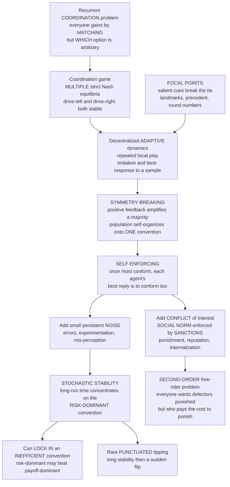

# 🚦 The Evolution of Conventions and Norms

> [!abstract] TL;DR
> **Why do we all drive on the same side of the road, use the same money, and speak the same language — even though nobody sat down and designed any of it?** Because these are **conventions**: self-enforcing solutions to recurrent **coordination problems** where everyone gains by doing the *same* thing but it does not matter *which* thing. A coordination game has **many equilibria** (drive-left and drive-right are both stable); a convention is a **shared expectation** that selects one of them, and once most people follow it, it is in *each* individual's interest to conform, so it locks in without any central authority. Evolutionary game theory explains both **how** one convention gets picked out of many by **decentralized adaptive dynamics** — repeated play, imitation, best-response, and **focal points** (Lewis, Schelling, Sugden) — and, rigorously, **which** one wins in the long run. **Stochastic stability** theory (Foster & Young 1990; Kandori-Mailath-Rob 1993; Young 1993) proves that when adaptive play is perturbed by **small persistent random errors**, the population spends **almost all** its time at the **risk-dominant** convention — the robust, larger-basin one — which can **differ from the payoff-dominant (efficient) one**, so a society can get stuck in an **inefficient** convention. Outcomes are **path-dependent** (the initial majority usually wins) and change is **punctuated** — long stability broken by rare, sudden **tipping**. **Social norms** extend conventions to settings with genuine **conflict of interest** (cooperation, fairness, property), converting Prisoner's-Dilemma temptations into coordination via **sanctions and punishment** — which works but raises the **second-order free-rider problem** (who pays to punish?). From money and language to property rights, etiquette, and morality, conventions and norms are the **invisible institutional fabric** of society, and this framework is where law, economics, sociology, and political science meet.

---

## Intuition

**Analogy:** Ask *why do we drive on the right* (or the left) and there is no cosmic answer — physics is indifferent, and roughly a third of the world does the opposite. The rule exists for one reason only: **once most people pick a side, everyone else must match or crash.** Nobody legislated it into existence at the dawn of driving; it **emerged** from countless local encounters and then **locked in** so hard that changing it now would take an act of parliament and a day of chaos (Sweden's 1967 switch, "Dagen H", required exactly that). That is a **convention**: an arbitrary-in-origin, self-enforcing regularity that solves a problem *everyone* faces of needing to **coordinate** on the *same* choice. The moment you notice it, you see conventions everywhere — which side of the sidewalk you pass on, that a round green paper rectangle is "money," that a nod means yes, that a queue is served front-to-back, that this particular sequence of sounds means "water." None was designed; each is binding precisely because **everyone expects everyone else to follow it.**

The technical translation is exact. A situation where all parties want to make the *same* choice but are indifferent *which* is a **coordination game**, and such games have **multiple equilibria** — many self-consistent conventions, each perfectly stable once established. The hard question is not "is a convention stable" (they all are) but **"how does a population *select* one of the many, without a designer — and can we predict *which*?"** Evolutionary game theory answers both: conventions **crystallize** out of decentralized imitation and best-response (symmetry breaking), and small, ever-present **noise** determines which convention the society settles into over the very long run. When the arbitrary coordination problem also carries a **conflict of interest** — everyone prefers the *cooperative* outcome collectively but is individually tempted to defect — a bare convention is not enough, and we get a **social norm**: a convention with teeth, enforced by disapproval, punishment, and internalized guilt.

---

## How It Works

### Core mechanics

**1. A convention is a coordination equilibrium.** David **Lewis (1969)** gave the classic analysis: a convention is a **regularity in behaviour** that (i) everyone conforms to, (ii) everyone expects everyone else to conform to, and (iii) everyone prefers to conform *given* that expectation — because it solves a recurrent **coordination problem**. The defining feature of a coordination game is **multiple strict [[Nash_Equilibrium|Nash equilibria]]**: in the driving game, "both drive left" and "both drive right" are *both* equilibria (no one gains by unilaterally deviating), and they may be equally good. Game theory alone therefore **cannot** tell you which convention a society will use — the equilibrium-selection problem is *underdetermined* by rationality. A convention is precisely the extra ingredient — a **shared expectation** — that picks one equilibrium and makes it common knowledge. This is why conventions feel simultaneously **arbitrary** (it could have been the other one) and **binding** (given that it's this one, you must comply).

**2. The emergence problem — selection without a designer.** If rationality does not pick the equilibrium, what does? The evolutionary answer is **decentralized adaptive dynamics**. Agents do not compute a grand equilibrium; they **repeatedly play**, **observe** what others recently did, and **adjust** — by **imitation** (copy what seems to work) or **myopic best-response** (do what is optimal against the recent behaviour you have sampled). Run this on a population that starts **mixed**, and something striking happens: tiny local majorities get **amplified**, because best-responding to "slightly more people drive left" means "drive left," which makes the majority larger, which pulls in more conformers — a **positive-feedback / symmetry-breaking** cascade. The population **self-organizes onto ONE shared convention** with no coordinator. And the endpoint is **self-enforcing**: once most have adopted it, each individual's *own* interest is to conform, so no external enforcement is needed to hold it in place. This is Hume's, Hayek's, Schelling's, and Sugden's **spontaneous order** — institutions that are "the result of human action but not of human design."

**3. Focal points break ties.** How does the very first tilt happen when the options are perfectly symmetric? Thomas **Schelling (1960)** showed that people coordinate remarkably well *without communicating* by converging on the **focal point** (or "Schelling point") — the equilibrium that is **salient** for reasons *outside* the payoff matrix: a landmark meeting spot ("under the clock at Grand Central"), a **round number**, a **precedent**, a shared cultural or linguistic cue, the **prominent** option. Salience is an **equilibrium-selection device**: it lets a population jump onto one convention because everyone expects everyone to expect *that* one. Focal points explain why conventions are not random — they latch onto whatever is **psychologically or culturally prominent** (why "12:00 noon" and not "11:53").

**4. Stochastic stability — which convention wins in the long run.** Here is the deep result. Add to adaptive play a **small persistent probability of error** — agents occasionally "mutate," experiment, or mis-perceive. Now every configuration is reachable, so the process is an **ergodic Markov chain** with a unique long-run (stationary) distribution. **Foster & Young (1990)**, **Kandori, Mailath & Rob (1993)**, and **Peyton Young (1993)** proved that as the noise shrinks, this distribution **concentrates on a specific equilibrium — the stochastically stable one** — and for 2x2 coordination games that equilibrium is the **risk-dominant** convention (Harsanyi-Selten): the one with the **larger basin of attraction**, the "safer" choice that best-responds against the widest range of beliefs. The mechanism is elegant: to *escape* a convention, enough agents must simultaneously err to push the population across the basin boundary; the risk-dominant convention has the **wider moat**, so escaping *it* needs **more** simultaneous errors (an exponentially rarer event) than escaping its rival. Over cosmic time the society therefore sits at the risk-dominant convention almost always.

**5. Risk-dominant can beat payoff-dominant — inefficient lock-in.** The convention selected by stochastic stability is **not necessarily the best one**. In a Stag-Hunt-style coordination game, one convention (say A) may be **payoff-dominant** — everyone is better off if all coordinate on it — while another (B) is **risk-dominant** — safer if you are unsure what others will do. Stochastic stability picks **B**. So a population's blind adaptive dynamics can **lock into an inefficient, even harmful, convention** (QWERTY keyboards, imperial units, insecure legacy standards) purely because it was the *safer* thing to converge on, not the *better* one. This is the game-theoretic core of **path dependence** and **standards lock-in**.

**6. Path dependence and punctuated tipping.** Because the dynamics have **multiple stable rest points**, **history matters**: the convention a population ends up at usually reflects **which one had the early majority** (or which was focal), not which is efficient. And because escaping a convention requires a rare confluence of errors or a shock large enough to cross the basin boundary, real conventions show **punctuated equilibrium** — **long stretches of stability** interrupted by **sudden, rare tipping** to a new convention (fashion cascades, revolutions in etiquette, the collapse of a currency, a language shift). Small changes usually die out; occasionally one crosses the threshold and the whole population **flips fast**.

**7. From conventions to norms — adding conflict of interest.** Pure coordination has **no conflict**: everyone is happy once *some* convention is fixed. **Social norms** extend the analysis to situations with **genuine conflict of interest** — cooperation, fairness, honesty, property — where the collectively-best outcome is individually **temptation-ridden** (a [[The_Prisoners_Dilemma_and_Cooperation|Prisoner's Dilemma]], not a coordination game). A **norm** turns such a game *into* a coordination problem by attaching **sanctions**: disapproval, reputational damage, exclusion, or outright **punishment** for violators, plus **internalized** guilt and shame. Once "cooperate, and punish defectors" is the expected behaviour, defecting becomes costly, so conforming is a best response — the norm is self-enforcing exactly like a convention. But enforcement is itself **costly**, which raises the **second-order free-rider problem**: everyone wants defectors punished but would rather someone *else* bear the cost of punishing. Explaining who pays is the central puzzle of norm enforcement, addressed by **reputation** (punishers gain standing — see [[Indirect_Reciprocity_and_Reputation]]), **strong reciprocity** (an evolved *taste* for punishing cheaters even at a cost, sustained in public-goods experiments by Fehr & Gächter 2002), and **meta-norms** (a norm to punish non-punishers, Axelrod 1986).

**8. Property as an evolved convention — the Bourgeois strategy.** Robert **Sugden (1986)** and Maynard Smith's **[[The_Hawk_Dove_Game|Hawk-Dove]]** analysis show that **property rights** themselves are conventions. Add an asymmetry — "who was here first?" — to a contest over a resource, and a new strategy becomes available: **Bourgeois** = *play Hawk if you are the current owner, Dove if you are the intruder* (respect prior possession). Bourgeois is an **[[Evolutionarily_Stable_Strategies|ESS]]**: it settles disputes **cheaply** by using an arbitrary but commonly-recognized cue (possession) to decide who yields, avoiding costly fights. Ownership is thus not a metaphysical fact but a **self-enforcing coordination convention** — which is why "possession is nine-tenths of the law," why squatters' rights exist, and why the *paradoxical* anti-Bourgeois convention ("intruder takes all") is *also* an ESS in principle, underscoring that property conventions are conventions, not natural law.

### From coordination problem to self-enforcing convention and norm



---

## Key Concepts

### Secondary (intuitive)

- **A convention is a "which side of the road" problem.** Everyone benefits from doing the *same* thing; it does not matter *which*; and once most people pick one, you had better match. No one designs it — it **emerges and sticks**.
- **Self-enforcing means no police needed.** You drive on the correct side not because of the law but because crashing is worse. The rule holds itself up.
- **Focal points break ties.** Meeting a stranger in a city with no plan, people head for the obvious landmark. Salience — not payoff — picks the meeting spot.
- **Some conventions are bad and stuck anyway.** QWERTY, imperial units, and the "fax machine because everyone else has one" all show a society can lock onto an **inferior** convention just because it got there first.
- **Norms are conventions with teeth.** When people are tempted to cheat (not just mis-coordinate), the convention needs **punishment and disapproval** to hold — that is a **social norm**.

### Undergraduate (formal)

- **Coordination game.** A symmetric 2x2 game with payoffs `a` (both A), `b` (both B), and low off-diagonal payoffs `c, d` for mis-matching. Both `(A,A)` and `(B,B)` are strict **Nash equilibria**; the mixed equilibrium is unstable. Contrast with the [[The_Prisoners_Dilemma_and_Cooperation|Prisoner's Dilemma]], which has a *unique* (bad) equilibrium.
- **Basin of attraction and the best-response threshold.** Under best-response dynamics, play A iff the fraction of others playing A exceeds `x* = (b - c) / ((a - c) + (b - d))`. Convention A's basin is `x > x*`; B's is `x < x*`. Symmetry breaking = the population being pushed to one side of `x*` and rolling to the corner.
- **Risk dominance.** A **risk-dominates** B iff `(a - d) > (b - c)` — equivalently `x* < 1/2`, i.e. A has the **larger basin**. This is the "safer" convention: the best response under maximal uncertainty about others.
- **Payoff dominance.** A is payoff-dominant iff `a > b`. **Payoff and risk dominance can point to different conventions** — the source of inefficient lock-in.
- **Adaptive play (Young).** Agents best-respond to a **random sample** of recent plays drawn from a finite memory; with sample size and memory bounded, the process is a Markov chain over recent-history states — a tractable, boundedly-rational model of convention formation (see [[Evolutionary_Economics_and_Bounded_Rationality]]).
- **Stochastically stable state.** As mutation rate `ε → 0`, the stationary distribution puts probability `→ 1` on one absorbing convention: the **risk-dominant** one in 2x2 coordination games.

### Graduate (advanced)

- **Perturbed Markov chains and resistance trees (Freidlin-Wentzell / Young).** Model the process as an **ergodic Markov chain** perturbed by mutations of order `ε`. The **stochastic potential** of each recurrent class is the minimum total **resistance** (number of mutations) of a spanning tree rooted at it; the **stochastically stable** states minimize stochastic potential. For 2x2 coordination this yields the risk-dominant equilibrium; the escape rate from a convention scales as `ε^k` where `k` is the number of simultaneous errors needed to cross `x*`.
- **KMR vs Young.** **Kandori-Mailath-Rob (1993)** use uniform mutation in a well-mixed population; **Young (1993)** uses adaptive play with sampling from bounded memory. Both select risk dominance in 2x2, but the models differ in *speed* and in richer games can diverge.
- **Waiting times and the "long run" caveat.** The expected time to reach the stochastically stable state (and to tip between conventions) is roughly `ε^{-k}`, which **explodes as `ε → 0`** and grows with population size. Ellison (1993, 2000) shows **local interaction** (lattices, small samples, "radius-coradius") **dramatically shortens** these waiting times — stochastic stability bites *fast* when interaction is local, *never* when it is global and `N` is huge. This is the crucial realism check on the theory.
- **Interaction structure matters.** On a network / lattice, conventions spread by **contagion** and the risk-dominant convention invades via clustered "seeds" (Morris 2000, *contagion threshold*); see [[Spatial_and_Network_Games]] and [[Network_Dynamics_and_Contagion]]. Structure can *overturn* the well-mixed prediction and enable coexistence of local conventions.
- **Correlated conventions and signals.** A shared external signal can implement a **[[Correlated_Equilibrium|correlated equilibrium]]** — the formalization of a focal point / traffic-light convention where a public device tells each player which action to take.
- **Norm enforcement and the second-order problem.** Formal treatments (Axelrod 1986 meta-norms; Fehr & Gächter 2002 altruistic punishment; Boyd, Gintis, Bowles & Richerson 2003) show costly punishment can stabilize *arbitrary* cooperative norms, but the *stability of punishing itself* requires reputation, conformist transmission (see [[Cultural_Evolution_and_Social_Learning]]), or group selection — otherwise second-order free-riders undermine it.

---

## Python Demo

We simulate the **emergence of a convention** in the spirit of **Young's adaptive play / KMR stochastic stability**. A well-mixed population of `N` agents repeatedly plays a **2x2 coordination game** with two conventions, **A** and **B** — *both* are strict Nash equilibria. Each micro-step, a random agent **best-responds** to the fraction of others currently playing A, but with small probability `ε` it **mutates** (plays a random action: error / experimentation). The game is rigged to make the two notions of "good" **disagree**: **A is payoff-dominant** (coordinating on A pays more) while **B is risk-dominant** (B has the larger basin, threshold `x* = 0.6`). We show four things: (1) **symmetry breaking** — from a mixed 50/50 start the population self-organizes onto *one* convention; (2) **path dependence** — the initial share decides the winner, but the bar is set by the **risk-dominance threshold 0.6**, not 50%; (3) **punctuated tipping** — a long, small-`N`, noisy run sits at the payoff-dominant convention A, then *rarely and suddenly* tips down to B and stays there; (4) **long-run stochastic selection** — over a long run the population spends **almost all its time at the risk-dominant convention B**, even though A is more efficient. `numpy` and `matplotlib` only.

```python
# The evolution of a CONVENTION: adaptive play + rare mutations (KMR / Young).
# A 2x2 coordination game with TWO conventions (A, B), both Nash equilibria.
# Rigged so PAYOFF-dominant (A) != RISK-dominant (B): stochastic stability picks B.
import numpy as np
import matplotlib.pyplot as plt

# ---- The coordination game -------------------------------------------------
# payoff[i, j] = payoff to an agent PLAYING i against an opponent PLAYING j.
# 0 = convention A, 1 = convention B.
#   A vs A = 5 (A,A)      A vs B = 1
#   B vs A = 3            B vs B = 4 (B,B)
payoff = np.array([[5.0, 1.0],
                   [3.0, 4.0]])
A_AA, A_AB = payoff[0, 0], payoff[0, 1]
B_BA, B_BB = payoff[1, 0], payoff[1, 1]

# Best-response threshold x*: play A iff fraction-of-others-playing-A > x*.
# E[A|x] = A_AA*x + A_AB*(1-x);  E[B|x] = B_BA*x + B_BB*(1-x)
xstar = (B_BB - A_AB) / ((A_AA - A_AB) + (B_BB - B_BA))   # = 0.60
payoff_dominant = "A" if A_AA > B_BB else "B"             # 5 > 4  -> A
risk_dominant   = "A" if xstar < 0.5 else "B"             # x*=0.6 -> B (bigger basin)
print(f"best-response threshold x* = {xstar:.2f}  "
      f"(play A iff >{xstar:.0%} of others play A)")
print(f"PAYOFF-dominant convention = {payoff_dominant}   "
      f"RISK-dominant convention = {risk_dominant}\n")

def simulate(N, x0, eps, steps, rng, record_every=1):
    """Asynchronous best-response dynamics with mutation rate eps.
    Returns the trajectory of the fraction of the population playing A."""
    nA = int(round(x0 * N))
    state = np.concatenate([np.zeros(nA, int), np.ones(N - nA, int)])  # 0=A, 1=B
    rng.shuffle(state)
    countA = int((state == 0).sum())
    traj = np.empty(steps // record_every)
    k = 0
    for t in range(steps):
        i = rng.integers(N)
        self_is_A = (state[i] == 0)
        xA = (countA - (1 if self_is_A else 0)) / (N - 1)   # fraction of OTHERS on A
        EA = A_AA * xA + A_AB * (1 - xA)
        EB = B_BA * xA + B_BB * (1 - xA)
        br = 0 if EA >= EB else 1
        action = int(rng.integers(2)) if rng.random() < eps else br  # mutate or best-respond
        if action != state[i]:                              # update running count of A
            countA += 1 if action == 0 else -1
            state[i] = action
        if t % record_every == 0:
            traj[k] = countA / N; k += 1
    return traj

# ---- (1) Symmetry breaking: mixed 50/50 start -> ONE convention ------------
N1, EPS1 = 100, 0.02
sweeps = 80
steps1 = sweeps * N1
t_axis1 = np.arange(steps1) / N1                      # time in "revisions per capita"
runs_sb = [simulate(N1, 0.50, EPS1, steps1, np.random.default_rng(s)) for s in range(6)]

# ---- (2) Path dependence: winner set by the 0.60 threshold, not 0.50 ------
starts = [0.50, 0.55, 0.65, 0.80]
runs_pd = {x0: simulate(N1, x0, EPS1, steps1, np.random.default_rng(100 + i))
           for i, x0 in enumerate(starts)}

# ---- (3) Punctuated tipping: small N, long noisy run, start at A ----------
N3, EPS3 = 14, 0.14
steps3 = 400_000
rec3 = 100
tip = simulate(N3, 1.00, EPS3, steps3, np.random.default_rng(7), record_every=rec3)
t_axis3 = np.arange(len(tip)) * rec3 / N3

# ---- (4) Long-run occupancy: fraction of time at each convention ----------
burn = len(tip) // 5
at_B = np.mean(tip[burn:] < 0.5)      # B-convention = minority of pop on A
at_A = np.mean(tip[burn:] > 0.5)
print(f"Long-run occupancy (small N={N3}, eps={EPS3}, after burn-in):")
print(f"   time at RISK-dominant B  : {at_B:6.1%}   <- stochastically stable")
print(f"   time at PAYOFF-dominant A : {at_A:6.1%}   <- efficient but NOT selected")

# ---- Visualize -------------------------------------------------------------
fig, ax = plt.subplots(2, 2, figsize=(14, 9))

# Panel 1: symmetry breaking
for tr in runs_sb:
    ax[0, 0].plot(t_axis1, tr, lw=1.4, alpha=0.85)
ax[0, 0].axhline(xstar, color="k", ls=":", lw=1.5, label=f"risk-dom. threshold x*={xstar:.2f}")
ax[0, 0].set_title("1) SYMMETRY BREAKING from a mixed 50/50 start\n"
                   "each run self-organizes onto ONE convention (here B: bigger basin)")
ax[0, 0].set_xlabel("revisions per capita"); ax[0, 0].set_ylabel("fraction playing A")
ax[0, 0].set_ylim(-0.02, 1.02); ax[0, 0].grid(alpha=0.3); ax[0, 0].legend(fontsize=8)

# Panel 2: path dependence
for x0, tr in runs_pd.items():
    ax[0, 1].plot(t_axis1, tr, lw=1.8, label=f"start {x0:.0%} A "
                  + ("-> A" if x0 > xstar else "-> B"))
ax[0, 1].axhline(xstar, color="k", ls=":", lw=1.5)
ax[0, 1].set_title("2) PATH DEPENDENCE: initial majority usually wins\n"
                   "but the bar is the RISK-dominance threshold 0.60, not 0.50")
ax[0, 1].set_xlabel("revisions per capita"); ax[0, 1].set_ylabel("fraction playing A")
ax[0, 1].set_ylim(-0.02, 1.02); ax[0, 1].grid(alpha=0.3); ax[0, 1].legend(fontsize=8)

# Panel 3: punctuated tipping
ax[1, 0].plot(t_axis3, tip, lw=0.8, color="#8e44ad")
ax[1, 0].axhline(xstar, color="k", ls=":", lw=1.2)
ax[1, 0].set_title("3) PUNCTUATED TIPPING (small N, persistent noise)\n"
                   "long plateau at payoff-dominant A, then a RARE sudden flip to B")
ax[1, 0].set_xlabel("revisions per capita"); ax[1, 0].set_ylabel("fraction playing A")
ax[1, 0].set_ylim(-0.02, 1.02); ax[1, 0].grid(alpha=0.3)

# Panel 4: long-run stochastic selection
bars = ax[1, 1].bar(["A\n(payoff-dominant)", "B\n(risk-dominant)"],
                    [at_A, at_B], color=["#2980b9", "#c0392b"])
ax[1, 1].set_title("4) LONG-RUN STOCHASTIC SELECTION\n"
                   "population spends almost all time at the RISK-dominant convention")
ax[1, 1].set_ylabel("fraction of long-run time"); ax[1, 1].set_ylim(0, 1)
for b, v in zip(bars, [at_A, at_B]):
    ax[1, 1].text(b.get_x() + b.get_width() / 2, v + 0.02, f"{v:.0%}",
                  ha="center", fontsize=11, fontweight="bold")
ax[1, 1].grid(alpha=0.3, axis="y")

plt.tight_layout()
plt.savefig("evolution_of_conventions.png", dpi=120)
print("\nSaved figure -> evolution_of_conventions.png")
```

Expected output (values vary a little with the seed; the qualitative story is robust):

```
best-response threshold x* = 0.60  (play A iff >60% of others play A)
PAYOFF-dominant convention = A   RISK-dominant convention = B

Long-run occupancy (small N=14, eps=0.14, after burn-in):
   time at RISK-dominant B  :  9x.x%   <- stochastically stable
   time at PAYOFF-dominant A :  x.x%   <- efficient but NOT selected

Saved figure -> evolution_of_conventions.png
```

Four windows onto the same mechanism. **Panel 1 (symmetry breaking):** from a perfectly mixed 50/50 start, each run does *not* stay mixed — the tiny random imbalance is amplified by best-response feedback and the population **collapses onto one convention**. Because 50% sits *below* the risk-dominance threshold 0.60, they collapse onto **B** — the bigger-basin convention. **Panel 2 (path dependence):** the *initial share* decides the winner, but the crucial teaching point is that the threshold is **0.60, not 0.50** — a convention needs to start with a *large enough* majority (above the risk-dominance bar) to survive; the payoff-dominant A wins *only* from an 80% start, and loses even from a 55% head start. **Panel 3 (punctuated tipping):** in a small, noisy population the payoff-dominant convention A is *locally* stable and holds for a long plateau — until, by a rare confluence of mutations, the population crosses the basin boundary and **tips suddenly to B**, then stays there (the reverse jump, needing far more simultaneous errors, essentially never happens). This is **punctuated equilibrium**: long calm, sudden change. **Panel 4 (stochastic selection):** tallied over the whole run, the society spends **almost all its time at the risk-dominant convention B** — even though **A is the efficient, payoff-dominant choice**. Blind adaptive dynamics select for **safety, not welfare** — the game-theoretic signature of **inefficient lock-in**.

---

## Real-World Applications

> **Example — driving sides, keyboards, and currency as pure conventions.** *Which* side of the road a country drives on is a textbook self-enforcing coordination convention: arbitrary in origin (Napoleonic and colonial history seeded most of it), self-enforcing once fixed (deviate and you crash), and enormously **costly to change** — Sweden's 1967 left-to-right switch needed a coordinated, government-imposed "tipping" of the whole population on a single morning, precisely because no *decentralized* process would move everyone at once. The **QWERTY** keyboard and **imperial units** are the standard illustrations of the darker corollary — a society can lock onto a **risk-dominant / first-mover** convention that is *not* the efficient one and stay there for a century.

- **Money and language.** Both are paradigm **spontaneous conventions** (Menger on money; Hume and Lewis on both). A currency has value only because everyone expects everyone to accept it; a word means what it does only because a community coordinates on it. Neither was designed; both are self-enforcing coordination equilibria — and both can **tip** (hyperinflation collapses the money convention overnight; slang and sound-changes spread as convention shifts, see [[Cultural_Evolution_and_Social_Learning]]).
- **Technology standards and network effects.** Driving side, measurement systems, file formats, communication protocols, and platform standards are coordination games with **strong network externalities**, prone to **lock-in** on the risk-dominant / installed-base option rather than the technically best one. Understanding stochastic stability and tipping is central to **standards wars** and platform strategy (see [[Network_Dynamics_and_Contagion]] and the planned sibling `Evolutionary_Dynamics_in_Markets_and_Institutions`).
- **Property rights and law.** The **Bourgeois "respect prior possession"** convention (Sugden) underlies real institutions — adverse possession, first-in-time water and mineral rights, homesteading — and shows why property is an **evolved coordination convention** rather than natural law. Its formal home is [[Property_Law]] and [[Law_and_Economics]], and its externality-bargaining cousin is the [[Coase_Theorem]].
- **Fairness, cooperation, and punishment.** Norms of **fairness** (50/50 splits as focal points), **reciprocity**, and **honesty** are enforced by disapproval and costly punishment; public-goods experiments (Fehr & Gächter) show cooperation collapses without punishment and is sustained with it — the empirical face of the second-order free-rider problem, tied to [[Indirect_Reciprocity_and_Reputation]] and the planned sibling `Fairness_Bargaining_and_the_Ultimatum_Game`.
- **Etiquette, manners, and morality.** Greetings, queuing, table manners, dress codes, and much of everyday morality are **conventions and norms** — arbitrary in content, binding in force, enforced by shame and social sanction, and studied as social control in [[Law_Deviance_and_Social_Control]] and [[Culture_Norms_Values_and_Ideology]].
- **Persistence and sudden change of harmful norms.** Foot-binding, duelling, and (in reverse) rapid shifts in norms around smoking or seatbelts illustrate **punctuated tipping**: a self-enforcing bad norm persists for generations, then flips fast once expectations cross a threshold — the logic behind "**norm cascades**" and coordinated abandonment campaigns (Bicchieri; Sunstein).

---

## Common Pitfalls

- **Confusing "which convention is stable" with "which gets selected."** *All* the conventions of a coordination game are stable equilibria — that is the whole point. The interesting, hard, and predictable question is **equilibrium selection**: which one a population lands on and stays at. Answering "it's an equilibrium" explains nothing about *which*.
- **Assuming the selected convention is efficient.** Stochastic stability picks the **risk-dominant**, *not* the **payoff-dominant**, convention. Do not assume markets or evolution deliver the best standard — they can **lock in an inferior one** and make it very hard to escape.
- **Mistaking "path dependence" for "majority rules at 50%."** The initial-majority *does* usually win, but the decisive threshold is the **risk-dominance basin boundary** (0.60 in the demo), not one-half. A payoff-dominant convention can lose even with a comfortable early lead.
- **Treating the "long run" as literal near-term time.** In large, well-mixed populations the expected waiting time to reach the stochastically stable state (or to tip) grows like `ε^{-k}` and with `N` — **astronomically long**. Stochastic stability is a statement about idealized limits; **local interaction** (Ellison) is what makes it bite in realistic time. Quoting the theory without the waiting-time caveat is a classic error.
- **Ignoring interaction structure.** The clean "risk dominance wins" result is a **well-mixed** claim. On networks and lattices, clustering, contagion thresholds, and locality can **slow, accelerate, or overturn** it and permit **coexisting local conventions** (see [[Spatial_and_Network_Games]]).
- **Collapsing conventions and norms.** A pure **convention** (no conflict of interest) is self-enforcing *without* punishment — you conform because it is in your own interest. A **norm** covers conflict of interest and needs **sanctions**; forgetting this makes the second-order free-rider problem invisible and over-predicts cooperation.
- **Forgetting who pays to punish.** "Norms solve the Prisoner's Dilemma via punishment" is only half an argument: **punishment is costly**, so you must also explain why anyone punishes — via reputation, strong reciprocity, meta-norms, or cultural group selection — or the norm unravels from the second order.
- **Reifying convention as design.** Conventions are the "result of human action but not of human design." Treating them as if some authority *chose* them (rather than them **emerging** from decentralized dynamics and focal points) misdiagnoses both how they arise and how they change.

---

## Related Concepts

- [[Nash_Equilibrium]] — coordination games have **multiple** strict Nash equilibria; a convention is the shared expectation that *selects* one of them.
- [[Correlated_Equilibrium]] — the formalization of a focal point or "traffic-light" convention: a shared public signal that coordinates players onto an equilibrium.
- [[The_Hawk_Dove_Game]] — adding an "owner vs intruder" asymmetry yields the **Bourgeois** convention, showing property rights as an evolved, self-enforcing coordination equilibrium.
- [[Evolutionarily_Stable_Strategies]] — each convention is an ESS of the coordination game; the Bourgeois strategy is the ESS that resolves contests cheaply via a conventional cue.
- [[The_Prisoners_Dilemma_and_Cooperation]] — the game with *conflict of interest* that a **norm** (convention plus punishment) turns into a coordination problem to sustain cooperation.
- [[Indirect_Reciprocity_and_Reputation]] — reputation is a leading answer to the **second-order free-rider problem**: punishing violators pays because it builds standing.
- [[Direct_Reciprocity_and_Repeated_Games]] — repeated interaction is the engine of adaptive play and the substrate on which conventions and norms crystallize.
- [[Cultural_Evolution_and_Social_Learning]] — imitation, conformist transmission, and prestige bias are the concrete micro-dynamics that select and stabilize conventions, and maintain them between groups.
- [[Evolutionary_Economics_and_Bounded_Rationality]] — Young's adaptive play is a boundedly-rational learning model; conventions are its long-run attractors.
- [[Replicator_Dynamics]] — the deterministic (noise-free) skeleton whose basins of attraction the stochastic theory perturbs and selects among.
- [[Finite_Populations_and_Stochastic_Dynamics]] — the finite-population, mutation-driven Markov-chain machinery that makes stochastic stability and rare tipping precise.
- [[Spatial_and_Network_Games]] — interaction structure can accelerate, slow, or overturn which convention wins, and permits coexisting local conventions.
- [[Fitness_Payoffs_and_Population_Games]] — the payoff-as-selection foundation on which "risk-dominant" and "payoff-dominant" are defined.
- [[Emergence_and_Self_Organization]] — conventions are a paradigm case of order arising from decentralized local interaction without a designer.
- [[Bifurcations_and_Tipping_Points]] — punctuated convention change is a tipping-point / basin-crossing phenomenon in a multistable system.
- [[Network_Dynamics_and_Contagion]] — conventions and norm cascades spread by contagion; contagion thresholds govern whether a new convention invades.
- [[Cooperation_and_Evolutionary_Game_Theory]] — the systems-thinking companion on evolved cooperation, of which norm enforcement is a key mechanism.
- [[Culture_Norms_Values_and_Ideology]] — the sociology of the norms whose emergence, stability, and between-group variation this note explains game-theoretically.
- [[Social_Capital_and_Trust]] — trust and cooperative norms as the informal institutions that self-enforcing conventions underpin.
- [[Law_Deviance_and_Social_Control]] — sanctions, disapproval, and social control as the enforcement side of norms.
- [[Property_Law]] — property rights as an institutionalized coordination convention (the legal descendant of the Bourgeois strategy).
- [[Law_and_Economics]] — the economic analysis of legal rules as equilibrium-selection and coordination devices.
- [[Coase_Theorem]] — bargaining over externalities given well-defined property conventions; the flip side of "property as convention."
- [[Public_Goods]] — the collective-action setting where norms and punishment must sustain cooperation against free-riding.

**Planned siblings in this vault (referenced above, not yet written):** `Fairness_Bargaining_and_the_Ultimatum_Game` (fairness norms and focal splits), `Evolutionary_Dynamics_in_Markets_and_Institutions` (standards, lock-in, and institutions as evolving conventions), and `Evolutionary_Political_Science_and_Conflict` (norms, conventions, and inter-group conflict).

---

## Review Questions

1. **(Conceptual)** Explain why a coordination game's having **multiple strict Nash equilibria** means that rationality alone *cannot* predict which convention a society adopts — and precisely what a **convention** (in Lewis's sense) adds to break the indeterminacy. Then describe the **decentralized adaptive dynamics** by which one convention gets *selected* from many without any designer, and why the endpoint is **self-enforcing**.
2. **(Scenario)** A country wants to move its entire population from an entrenched-but-inefficient technology standard (convention B) to a better one (convention A). Using the demo's concepts — **risk dominance, basins of attraction, the best-response threshold, and punctuated tipping** — explain why a purely decentralized, gradual switch tends to **fail**, what determines whether a coordinated "flip everyone at once" (like Sweden's Dagen H) can succeed, and how a **focal point** or public signal could help. Why is the risk-dominance threshold, not a 50% majority, the number that matters?
3. **(Trade-off / synthesis)** State the **stochastic-stability** result (adaptive play plus small persistent noise selects the **risk-dominant** equilibrium) and explain why it can leave a society stuck in the **payoff-inefficient** convention. Then give the two most important **caveats** — the exploding **waiting time** as noise vanishes / population grows, and the role of **local interaction** — and explain how they qualify any real-world claim that "evolution selects the risk-dominant convention." Finally, contrast a pure **convention** with a **social norm**: what does adding a **conflict of interest** change, why is **punishment** then required, and what is the **second-order free-rider problem** it creates?

---

## Sources

- Lewis, D. (1969). *Convention: A Philosophical Study*. Harvard University Press.
- Schelling, T. C. (1960). *The Strategy of Conflict*. Harvard University Press.
- Young, H. P. (1993). "The Evolution of Conventions." *Econometrica*, 61(1), 57–84.
- Kandori, M., Mailath, G. J. & Rob, R. (1993). "Learning, Mutation, and Long Run Equilibria in Games." *Econometrica*, 61(1), 29–56.
- Sugden, R. (1986). *The Economics of Rights, Co-operation and Welfare*. Blackwell.
- Young, H. P. (1998). *Individual Strategy and Social Structure: An Evolutionary Theory of Institutions*. Princeton University Press.
- Fehr, E. & Gächter, S. (2002). "Altruistic Punishment in Humans." *Nature*, 415, 137–140.
- Bicchieri, C. (2006). *The Grammar of Society: The Nature and Dynamics of Social Norms*. Cambridge University Press.

---

#evolutionary-game-theory #conventions #social-norms #coordination-games #stochastic-stability
