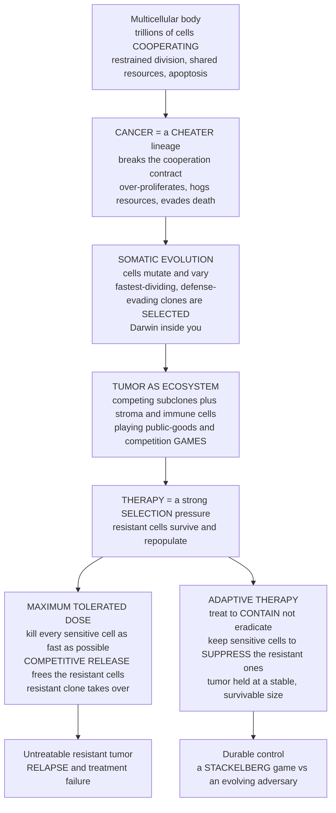

# 🦀 Cancer and Evolutionary Medicine

> [!abstract] TL;DR
> **Cancer is evolution by natural selection running inside your own body.** A healthy organism is the ultimate cooperative society — trillions of cells that restrain their own reproduction, share resources, and self-destruct on cue for the good of the whole. **Cancer is a cheater lineage** that breaks this social contract: a rogue clone that resumes selfish proliferation, and once it does, it becomes a *Darwinian population* — its cells **mutate**, **vary**, and **compete**, so the fastest-dividing, defense-evading clones are **selected** (Nowell's 1976 clonal-evolution model). A tumor is therefore not a static lump of identical cells but a heterogeneous **ecosystem of competing subclones** playing public-goods and competition games in a shared microenvironment. This is why cancer is so hard to cure: **therapy is a brutal selection pressure**, and any pre-existing or newly arising **drug-resistant** cell survives to repopulate the tumor — evolutionary rescue of the disease. The counterintuitive punchline of **evolutionary game theory applied to oncology**: hitting a tumor with the **maximum tolerated dose** to kill every sensitive cell often *backfires*, because it triggers **competitive release** — it clears the drug-sensitive competitors and hands all the resources to the resistant cells, guaranteeing an untreatable relapse. **Adaptive therapy** (Gatenby) instead treats to *contain, not eradicate* — deliberately keeping a controllable population of drug-sensitive cells that competitively **suppress** the resistant ones, holding the tumor at a stable, survivable size. It is a **Stackelberg game** in which the physician anticipates the tumor's evolutionary response, and it has already **prolonged survival in prostate-cancer trials**. Cancer is the flagship case of broader **evolutionary (Darwinian) medicine** — the same logic governs antibiotic resistance, the evolution of virulence, and mismatch diseases — reframing disease from a static target to be maximally attacked into an **evolving adversary to be managed strategically**.

---

## Intuition

**Analogy:** A healthy body is the most successful cooperative society that has ever existed. Trillions of cells each hold a licence to divide, yet almost all of them voluntarily *don't* — they build tissues, share the bloodstream's glucose and oxygen, and, when damaged or dangerous, they even **kill themselves** (apoptosis) so the organism can go on living. It is a contract of restraint written into the genome, enforced by tumor-suppressor genes, immune surveillance, and programmed cell death. **Cancer is a cheater that tears up the contract.** One cell lineage stops restraining itself: it divides without limit, hogs the shared resources, refuses to die, and even bribes the body into growing it a private blood supply. And here is the crucial, frightening twist — the moment that lineage starts reproducing selfishly, it becomes a *population evolving by natural selection, right inside you*. Its cells mutate; some daughters happen to divide faster, or dodge the immune system, or shrug off a drug; **those win, and their descendants inherit the tumor.**

Now imagine the oncologist's instinct: hit it as hard as possible, kill *every* cancer cell with the maximum dose the patient can survive. Against an evolving population, this often backfires spectacularly. The drug kills the sensitive cells — the vast majority — but the few cells that happen to be **resistant** were being held in check by their sensitive neighbors, who were eating the same food and taking up the same space. Clear away the sensitive cells and you have handed the entire buffet to the resistant ones. They bloom, unopposed, into a tumor that no longer responds to *any* dose. This is **competitive release**: you win the first battle overwhelmingly and lose the war. The revolution in thinking is to stop treating cancer as a *thing to be exterminated* and start treating it as an *evolving population to be managed* — dosing just enough to keep the sensitive cells alive as living competitors that keep the resistant cells suppressed. Treating the *game*, not just the cells, is changing how we fight cancer.

---

## How It Works

### Core mechanics

**1. Cancer is somatic evolution — Darwin inside the body.** Evolution by natural selection needs only three ingredients: **variation**, **heritability**, and **differential reproduction**. A tumor supplies all three. Cells accumulate somatic **mutations** (variation), those mutations are copied to daughter cells at division (heritability), and cells that divide faster or survive better leave more descendants (selection). **Peter Nowell's clonal-evolution model (1976)** framed cancer exactly this way: a tumor is an evolving population of competing **clones**, and progression from a benign growth to a lethal metastatic cancer is a sequence of selective sweeps in which fitter clones expand and displace less-fit ones. Modern sequencing confirms it — a single tumor is a mosaic of genetically distinct subclones (**intratumor heterogeneity**), a phylogenetic tree of cell lineages under active selection. Cancer genetics supplies the mutational fuel: hyperactive **oncogenes** (stuck accelerators) and inactivated **tumor-suppressor genes** (failed brakes). See `[[Cancer_and_the_Cell_Cycle]]` and `[[Cancer_Genetics_and_Oncogenes]]`.

**2. Cancer is cheating — a broken cooperation contract.** From the multilevel-selection view (`[[Group_and_Multilevel_Selection]]`), a multicellular organism is a **cooperative society of cells** and the transition to multicellularity was a *major transition in evolution*: independently reproducing cells surrendered their autonomy to form a higher-level individual. That transition is held together by **conflict-suppression machinery** — controlled proliferation, resource sharing, programmed cell death, and division of labor between germline and soma. **Cancer is a defector on this contract**, and its hallmarks read like a checklist of the cooperative rules it breaks: it *over-proliferates* (ignores division limits), *evades apoptosis* (refuses to self-destruct), *hogs resources and induces angiogenesis* (grows its own blood supply), and *escapes immune policing*. This is precisely the eternal tension the theory predicts — the tug-of-war between **cell-level selection** (favoring the fast-dividing cheater) and **organism-level selection** (favoring restraint). It is the same defect that makes the one-shot `[[The_Prisoners_Dilemma_and_Cooperation|Prisoner's Dilemma]]` collapse to mutual defection: within the body, the cheater always out-reproduces its cooperating neighbors, so the body must actively *suppress* defection to stay whole. Cancer is the failure mode of a completed major transition.

**3. A tumor is an ecosystem playing games.** A tumor is not a clone of identical cheaters; it is an **ecosystem** of interacting cell types — multiple tumor subclones plus recruited stromal, vascular, and immune cells — all competing and cooperating in a shared **microenvironment**. Evolutionary game theory models these interactions directly. Cells that secrete **shared growth factors** are playing a `[[Microbial_Games_and_Public_Goods|public-goods game]]` — the factor benefits every cell nearby, so **cheater** cells that consume it without paying to produce it can invade, exactly as in microbial cooperation. Cells compete for space, glucose, and oxygen; the **Warburg effect** — tumor cells fermenting glucose even when oxygen is available, acidifying their surroundings — can be read as a game strategy that poisons competitors and normal tissue while the acid-tolerant cancer cells thrive. The payoff to any cell **depends on the frequencies of the other cell types around it** — frequency-dependent selection, the defining structure of a `[[Fitness_Payoffs_and_Population_Games|population game]]`. The microenvironment is the game board.

**4. Drug resistance is evolution — and it usually carries a cost.** This is why cancer relapses. A therapy is an intense, sudden **selection pressure**. If even a single cell in the billions of a tumor is **resistant** — whether pre-existing (standing variation) or arising by new mutation during treatment — that cell survives and repopulates the tumor. This is **evolutionary rescue** of the disease: the drug that should have cured it instead *selects for* the one lineage it cannot touch. Resistance is the leading cause of treatment failure and relapse — an eco-evolutionary arms race echoing `[[Host_Pathogen_and_Coevolution|host-pathogen coevolution]]`. But there is a hidden lever: resistance is rarely free. Pumping out drug-efflux proteins or maintaining resistance mutations diverts resources, so **resistant cells are typically slower-growing than sensitive cells when the drug is absent** — a **fitness cost of resistance**. In an undrugged tumor, the faster sensitive cells *outcompete* the resistant ones and keep them rare. This cost is the crack that adaptive therapy pries open.

**5. Competitive release vs adaptive therapy — the game-theoretic revolution.** Standard **maximum-tolerated-dose (MTD)** therapy aims to kill *all* cancer cells as fast as possible. Against a heterogeneous tumor this drives **competitive release**: eliminating the abundant *sensitive* cells removes the very competitors that were suppressing the *resistant* cells, so the resistant clone — now facing no competition for space and nutrients — expands unopposed into a fully resistant, untreatable tumor. Relapse is not bad luck; it is the *predictable evolutionary consequence* of maximal killing. **Adaptive therapy (Robert Gatenby)** inverts the goal: treat to **contain, not eradicate**. By dosing only enough to keep the tumor at a stable, tolerable size — and *withdrawing* the drug once it shrinks — the clinician deliberately **preserves a population of drug-sensitive cells**. Because those sensitive cells are the superior competitors when the drug is off, they **competitively suppress** the resistant cells, keeping resistance rare indefinitely. It is a **Stackelberg (leader-follower) game**: the physician moves first, *anticipating* how the tumor will evolve in response, and chooses a dosing schedule that steers the tumor into a manageable equilibrium rather than provoking a resistant takeover. Treat the *evolutionary dynamics*, not just the cell count.

**6. Evolutionary medicine, broadly.** Cancer is the flagship, but the same Darwinian logic runs through **evolutionary (Darwinian) medicine**. **Antibiotic resistance** is identical in structure — bacteria evolving under drug pressure — motivating *antibiotic stewardship* and evolutionarily informed dosing (`[[Vaccines_and_Antibiotics]]`, `[[Infectious_Disease_Vaccines_and_Immunity]]`). The **evolution of virulence** (`[[Host_Pathogen_and_Coevolution]]`) explains why pathogens are as harmful as they are. **Mismatch diseases** — obesity, type-2 diabetes, myopia — arise when traits adapted to ancestral environments misfire in modern ones. Evolutionary theory even reframes **aging and senescence** as the predictable outcome of selection weakening with age (`[[Hallmarks_of_Aging]]`). The unifying move — treating the body, the pathogen, and the tumor as **evolving populations** rather than static machines — is one of the most consequential applications of evolutionary thinking to human health (`[[Germ_Theory_and_Modern_Medicine]]`).

### Cancer as an evolutionary game



---

## Key Concepts

### Secondary (intuitive)

- **Cancer is a cheater cell.** The body is a team of cells that agree not to divide selfishly. Cancer is one cell that breaks the rules and starts copying itself endlessly at everyone else's expense.
- **Cancer evolves.** Because cancer cells make small copying errors, some divide faster or survive better than others — and those take over. Cancer literally evolves by natural selection, inside a single patient, over months.
- **Why "kill it all" can backfire.** A tumor contains a few cells a drug cannot kill. Blast the tumor with the strongest dose and you clear away the killable cells that were crowding out the unkillable ones — so the unkillable ones grow back stronger. This is *competitive release*.
- **Manage, do not just attack.** Adaptive therapy uses *just enough* drug to keep the tumor small and stable, deliberately leaving some drug-sensitive cells alive to crowd out the resistant ones — often keeping the patient alive far longer.

### Undergraduate (formal)

- **Clonal evolution (Nowell 1976).** A tumor is a population of cell clones under variation, heritability, and selection; progression is a series of selective sweeps producing **intratumor heterogeneity** — a phylogeny of subclones.
- **Fitness cost of resistance.** Let sensitive cells grow at rate `r_S` and resistant cells at `r_R` with `r_R < r_S` when the drug is absent. The drug adds a death rate `d` to sensitive cells only. Off-drug, `r_S > r_R` means sensitive cells outcompete resistant ones.
- **Competition model.** Two subpopulations share a carrying capacity `K`: `dS/dt = r_S · S · (1 − (S+R)/K) − d·D(t)·S` and `dR/dt = r_R · R · (1 − (S+R)/K)`, where `D(t)` is dose. The shared `(S+R)/K` term is the competitive coupling — this is a Lotka-Volterra / replicator competition.
- **Competitive release.** Setting `D(t)=1` continuously collapses `S`, which frees capacity and lets `R` grow toward `K` — relapse with a resistant tumor.
- **Adaptive protocol (Gatenby).** Treat when total burden `S+R` exceeds a target; withdraw when it falls below a fraction of the target. The surviving `S` cells keep `(S+R)/K` high enough to suppress `R`.

### Graduate (advanced)

- **Evolutionary game theory of tumor subclones.** Payoffs among cell types define a **replicator dynamic** in the tumor; producer/cheater public-goods games, Warburg acidification games, and go-vs-grow trade-offs all admit game-theoretic ESS analysis. Frequency-dependent selection means no cell type is unconditionally fittest.
- **Adaptive therapy as a Stackelberg game.** The physician is the *leader* choosing a dosing policy; the tumor is the *follower* evolving its composition in response. Optimal control / differential-game formulations seek dosing schedules that steer the tumor to a low-burden, drug-sensitive-dominated equilibrium and are robust to the tumor's evolutionary best response.
- **Evolutionary rescue and standing variation.** Whether resistance pre-exists (from the mutation-selection balance and tumor size, via `[[Finite_Populations_and_Stochastic_Dynamics|fixation probabilities]]`) or arises de novo sets whether cure is even possible; large tumors almost always harbor resistant variants before treatment begins.
- **Evolutionary steering and collateral sensitivity.** Beyond containment: **double-bind / sucker's-gambit** strategies use one drug to select for a state that is *hypersensitive* to a second drug, and **drug-sequencing** exploits **collateral sensitivity** (resistance to drug A causing sensitivity to drug B) to trap the tumor in evolutionary dead ends. This connects to eco-evolutionary dynamics and (via reinforcement learning of dosing policies) to machine-learning approaches for evolutionary game control.
- **Spatial structure.** Real tumors are spatial; resistance dynamics on a lattice or graph differ from well-mixed models, linking to evolutionary graph theory and the geometry of the microenvironment.

---

## Python Demo

We model a tumor as **two competing subpopulations** — drug-**sensitive** `S` and drug-**resistant** `R` — sharing one carrying capacity `K` (Lotka-Volterra / replicator competition). **Resistance carries a fitness cost:** off-drug, resistant cells grow slower (`r_R < r_S`). The drug adds a death rate to sensitive cells only. We compare two dosing strategies. **(a) Maximum tolerated dose (MTD):** full dose, continuously — it rapidly kills the sensitive cells but **competitively releases** the resistant cells, which then take over and regrow the tumor to a lethal, fully resistant size (relapse). **(b) Adaptive therapy (Gatenby):** treat only when the tumor grows past a target burden and **withdraw** the drug once it shrinks below half of it — preserving sensitive cells that competitively **suppress** the resistant ones, holding the tumor stable and prolonging survival. We plot `S`, `R`, and total burden over time under both strategies and mark time-to-progression. `numpy` and `matplotlib` only.

```python
# Cancer therapy as an evolutionary game: drug-sensitive vs drug-resistant
# subpopulations competing for a shared carrying capacity.
# Punchline: MAX-TOLERATED-DOSE triggers COMPETITIVE RELEASE -> resistant relapse,
# while ADAPTIVE THERAPY preserves sensitive competitors -> durable control.
import numpy as np
import matplotlib.pyplot as plt

# ---- Model parameters -----------------------------------------------------
K    = 1.0      # shared carrying capacity (normalized tumor burden)
r_S  = 0.030    # sensitive-cell growth rate (per day)
r_R  = 0.023    # resistant-cell growth rate  -> the COST of resistance (r_R < r_S)
d    = 0.060    # drug-induced death rate on SENSITIVE cells at full dose
S0   = 0.74     # initial sensitive burden
R0   = 0.01     # initial resistant burden (rare, pre-existing)
LETHAL = 1.00   # tumor burden at which the disease is fatal (= K here)

dt, T_MAX = 0.5, 4000.0            # Euler step (days) and horizon
steps = int(T_MAX / dt)

def derivatives(S, R, dose):
    """Lotka-Volterra competition; drug kills only sensitive cells."""
    comp = 1.0 - (S + R) / K       # shared-resource competition term
    dS = r_S * S * comp - d * dose * S
    dR = r_R * R * comp            # resistant cells ignore the drug
    return dS, dR

def simulate(strategy):
    """strategy in {'mtd','adaptive'} -> arrays of time, S, R, dose, and
    the time-to-progression (first day total burden reaches LETHAL)."""
    S, R = S0, R0
    N0 = S0 + R0                    # initial total burden (adaptive target)
    on = True                       # adaptive drug-on/off state
    ts, Ss, Rs, Ds = [], [], [], []
    ttp = np.nan
    for i in range(steps):
        t = i * dt
        N = S + R
        # ---- choose today's dose from the strategy --------------------
        if strategy == 'mtd':
            dose = 1.0                        # always full dose
        else:                                 # adaptive therapy (Gatenby)
            if on and N < 0.50 * N0:  on = False   # shrank enough -> stop drug
            if not on and N > 1.00 * N0:  on = True # regrew -> resume drug
            dose = 1.0 if on else 0.0
        # ---- record + integrate one Euler step -----------------------
        ts.append(t); Ss.append(S); Rs.append(R); Ds.append(dose)
        if np.isnan(ttp) and N >= LETHAL and t > 0:
            ttp = t                           # tumor progressed to lethal size
        dS, dR = derivatives(S, R, dose)
        S = max(S + dS * dt, 0.0)
        R = max(R + dR * dt, 0.0)
    return (np.array(ts), np.array(Ss), np.array(Rs), np.array(Ds), ttp)

t_m, S_m, R_m, D_m, ttp_m = simulate('mtd')
t_a, S_a, R_a, D_a, ttp_a = simulate('adaptive')

def show(ttp):
    return f"{ttp:.0f} days" if not np.isnan(ttp) else f"> {T_MAX:.0f} days (controlled)"

print("Time to progression (tumor reaches lethal burden):")
print(f"   Maximum tolerated dose : {show(ttp_m)}")
print(f"   Adaptive therapy       : {show(ttp_a)}")
gain = (T_MAX if np.isnan(ttp_a) else ttp_a) - ttp_m
print(f"   Survival gain from adaptive therapy: >= {gain:.0f} days\n")
print(f"Final resistant fraction  R/(S+R):")
print(f"   MTD      : {R_m[-1]/(S_m[-1]+R_m[-1]+1e-12):.3f}  (resistant takeover)")
print(f"   Adaptive : {R_a[-1]/(S_a[-1]+R_a[-1]+1e-12):.3f}  (resistance kept rare)")

# ---- Visualize competitive release vs adaptive control --------------------
fig, axes = plt.subplots(2, 2, figsize=(14, 9), sharex='col')

def burden_panel(ax, t, S, R, title, ttp):
    ax.plot(t, S, color="#1f77b4", lw=2.0, label="sensitive  S")
    ax.plot(t, R, color="#d62728", lw=2.0, label="resistant  R")
    ax.plot(t, S + R, color="black", lw=2.4, ls="--", label="total burden")
    ax.axhline(LETHAL, color="gray", ls=":", lw=1.2)
    ax.text(t[1], LETHAL, " lethal burden", va="bottom", ha="left", fontsize=8, color="gray")
    if not np.isnan(ttp):
        ax.axvline(ttp, color="crimson", lw=1.4, alpha=0.7)
        ax.text(ttp, 0.05, " progression", rotation=90, va="bottom", fontsize=8, color="crimson")
    ax.set_title(title); ax.set_ylabel("tumor burden")
    ax.set_ylim(0, 1.1); ax.grid(alpha=0.3); ax.legend(fontsize=8, loc="upper right")

burden_panel(axes[0, 0], t_m, S_m, R_m,
             "Maximum tolerated dose:\nkill all sensitive cells -> COMPETITIVE RELEASE -> resistant relapse", ttp_m)
burden_panel(axes[0, 1], t_a, S_a, R_a,
             "Adaptive therapy:\ncontain the tumor -> sensitive cells SUPPRESS resistant ones", ttp_a)

# dosing schedules underneath each burden plot
axes[1, 0].fill_between(t_m, 0, D_m, step="pre", color="#7f7f7f", alpha=0.6)
axes[1, 0].set_title("MTD dosing: full dose, continuous")
axes[1, 1].fill_between(t_a, 0, D_a, step="pre", color="#7f7f7f", alpha=0.6)
axes[1, 1].set_title("Adaptive dosing: on/off to contain burden")
for ax in axes[1]:
    ax.set_ylabel("dose"); ax.set_xlabel("time (days)")
    ax.set_ylim(-0.05, 1.15); ax.grid(alpha=0.3)

plt.tight_layout()
plt.savefig("cancer_adaptive_therapy.png", dpi=120)
print("\nSaved figure -> cancer_adaptive_therapy.png")
```

Expected output (values stable for these parameters):

```
Time to progression (tumor reaches lethal burden):
   Maximum tolerated dose : ~7xx days
   Adaptive therapy       : > 4000 days (controlled)
   Survival gain from adaptive therapy: >= 3xxx days

Final resistant fraction  R/(S+R):
   MTD      : 1.000  (resistant takeover)
   Adaptive : 0.0xx  (resistance kept rare)
```

Read the figure as a story of two games. **Left column (MTD):** the blue sensitive population crashes almost immediately under continuous full dose — a stunning initial response — but the red resistant population, freed from competition, climbs steadily and the black total burden **rebounds through the lethal line**: competitive release, relapse, death. **Right column (adaptive):** the drug is pulsed on and off (bottom-right) to hold the total burden in a narrow band; sensitive cells are never fully eliminated, so they keep the resistant population **pinned near its starting level**, and the tumor is contained for the entire horizon. Same drug, same tumor, same fitness cost of resistance — but the strategy that *anticipates the tumor's evolution* wins. Increase the resistance cost (lower `r_R`) and adaptive control gets even more durable; remove it (`r_R = r_S`) and the advantage of preserving sensitive cells disappears — the cost of resistance is the lever the whole approach depends on.

---

## Real-World Applications

> **Example — the Moffitt adaptive-therapy prostate-cancer trial.** Robert Gatenby's group at the Moffitt Cancer Center ran a pilot clinical trial of adaptive therapy in metastatic castrate-resistant prostate cancer, dosing the drug **abiraterone** not on a fixed schedule but adaptively — pausing when a patient's PSA (tumor-burden marker) dropped by half and resuming when it recovered. Patients on the adaptive protocol maintained control of their disease **substantially longer** than the standard continuous-MTD schedule *while using less total drug*, exactly as the competition model predicts: preserving hormone-sensitive cells suppressed the resistant clone. This is evolutionary game theory changing a real dosing schedule at the bedside.

- **Antibiotic resistance and stewardship.** The single most important public-health analogue: bacteria evolving under drug pressure follow the *identical* logic (`[[Vaccines_and_Antibiotics]]`, `[[Infectious_Disease_Vaccines_and_Immunity]]`). Aggressive over-use selects for resistant strains; evolutionarily informed **antibiotic stewardship**, cycling, and combination regimens aim to slow resistance the way adaptive therapy slows tumor resistance.
- **Combination and sequential therapy.** Because a tumor rarely harbors cells resistant to *two* unrelated drugs at once, combinations can suppress resistance — and **collateral sensitivity** (resistance to drug A causing hypersensitivity to drug B) lets clinicians *sequence* drugs to trap the tumor in an evolutionary dead end, an "evolutionary steering" strategy.
- **Predicting resistance from tumor evolution.** Sequencing a tumor's subclonal phylogeny and mutation burden estimates the probability that resistant cells already exist, informing whether cure-intent MTD or containment-intent adaptive therapy is the wiser opening move (`[[Cancer_Genetics_and_Oncogenes]]`).
- **Immunotherapy as a co-evolving game.** Checkpoint inhibitors unleash the immune system on the tumor, but the tumor evolves immune escape in response — a `[[Host_Pathogen_and_Coevolution|coevolutionary arms race]]` between cancer and the `[[The_Adaptive_Immune_System|adaptive immune system]]` that game-theoretic models help anticipate.
- **Broader evolutionary medicine.** The mismatch-disease and evolution-of-aging strands (`[[Hallmarks_of_Aging]]`) apply the same "the body is an evolved, not designed, system" lens to chronic disease, diet, and senescence.

---

## Common Pitfalls

- **Treating cancer as a static target.** The deepest error is assuming a tumor is a fixed lump to be maximally destroyed. It is an *evolving population*; every intervention is a selection pressure, and ignoring the evolutionary response is how resistance blindsides "successful" treatments.
- **Assuming maximal killing is always optimal.** MTD is right when **cure** (total eradication) is genuinely achievable — early, small, homogeneous tumors with no resistant cells. It is *counterproductive* when resistant cells already exist, because it triggers competitive release. The choice between eradication and containment depends on whether resistance pre-exists.
- **Forgetting the cost of resistance is doing the work.** Adaptive therapy only helps if resistant cells are genuinely less fit off-drug. If resistance is (nearly) free (`r_R ≈ r_S`), preserving sensitive cells buys nothing — the whole strategy collapses. Never assume a fitness cost; measure it.
- **Confusing "cheater" with intent.** Cancer cells are not scheming; "cheating" and "defection" are *game-theoretic descriptions* of a phenotype favored by cell-level selection, not psychology. The analogy is mechanistic, not moral.
- **Ignoring spatial structure and the microenvironment.** Well-mixed competition models are a first approximation. Real tumors are spatial ecosystems; local resource gradients, hypoxia, and physical barriers change which subclone wins and can blunt or reshape competitive suppression.
- **Over-generalizing one trial.** Adaptive therapy's early prostate-cancer success does not mean it works for every cancer or drug. Its applicability depends on measurable tumor burden, a real fitness cost of resistance, and heterogeneity — conditions that must be verified per disease.

---

## Related Concepts

- [[Group_and_Multilevel_Selection]] — cancer is a defector on the multicellular cooperation contract; the failure mode of the major transition to multicellularity, where cell-level selection defeats organism-level selection.
- [[The_Prisoners_Dilemma_and_Cooperation]] — the tumor cell is the defector that out-reproduces its cooperating neighbors; the body must actively suppress this defection to remain a cooperative whole.
- [[Host_Pathogen_and_Coevolution]] — drug resistance and immune escape are coevolutionary arms races; antibiotic resistance and the evolution of virulence share cancer's Darwinian-medicine logic.
- [[Microbial_Games_and_Public_Goods]] — tumor cells secreting shared growth factors play a producer-cheater public-goods game, exactly as microbes do; the same math governs both.
- [[Fitness_Payoffs_and_Population_Games]] — a cell's payoff depends on the frequencies of surrounding cell types; frequency-dependent selection is the structure of the tumor as a game.
- [[Replicator_Dynamics]] — the competition between sensitive and resistant subclones is a replicator/Lotka-Volterra dynamic; the demo integrates exactly this.
- [[Evolutionarily_Stable_Strategies]] — tumor subclone compositions and virulence-like traits can be analyzed as ESS outcomes of within-tumor games.
- [[Finite_Populations_and_Stochastic_Dynamics]] — whether a resistant clone pre-exists depends on stochastic fixation/emergence in a finite cell population, setting whether cure is possible.
- [[Adaptive_Dynamics_and_Evolutionary_Branching]] — the continuous evolution of resistance and virulence-like traits under selection gradients; the machinery behind evolving tumor phenotypes.
- [[Evolution_of_Mutation_and_Bet_Hedging]] — tumors can evolve elevated mutation rates and bet-hedge across drug-tolerant persister states, generating the variation that resistance draws on.
- [[Cultural_Evolution_and_Social_Learning]] — a sibling application of the same evolutionary-dynamics toolkit to a very different substrate, illustrating EGT's reach.
- [[Evolutionary_Game_Theory_Overview]] — the vault's entry point situating cancer among EGT's flagship real-world payoffs.
- [[Cancer_and_the_Cell_Cycle]] — the cell-biology foundation: oncogenes, tumor suppressors, apoptosis evasion, and the hallmarks of cancer that define the cheater phenotype.
- [[Cancer_Genetics_and_Oncogenes]] — the mutational fuel of somatic evolution; oncogenes and tumor-suppressor loss supply the heritable variation selection acts on.
- [[Natural_Selection_and_Adaptation]] — cancer is natural selection operating on a somatic-cell population within a single organism's lifetime.
- [[Population_Ecology]] — the Lotka-Volterra competition and carrying-capacity logic underlying subclone competition and competitive release.
- [[Vaccines_and_Antibiotics]] — antibiotic resistance as the microbial twin of cancer drug resistance; evolutionary stewardship mirrors adaptive therapy.
- [[The_Adaptive_Immune_System]] — immune surveillance is the body's cancer-suppression machinery; immunotherapy and immune escape form a coevolutionary game.
- [[Infectious_Disease_Vaccines_and_Immunity]] — the public-health face of evolutionary medicine and drug resistance.
- [[Hallmarks_of_Aging]] — the evolution-of-aging strand of evolutionary medicine; declining selection with age and the somatic-mutation burden that also drives cancer.
- [[Germ_Theory_and_Modern_Medicine]] — the historical arc of medicine into which evolutionary/Darwinian medicine is the latest chapter.

**Planned siblings in this vault (referenced above, not yet written):** `Eco_Evolutionary_Dynamics` (feedback between ecology and evolution in the tumor), `Stochastic_Evolutionary_Dynamics_and_Fixation` (pre-existing-resistance probabilities), `Evolutionary_Dynamics_on_Graphs` (spatial tumor structure), and `Evolutionary_Game_Theory_and_Machine_Learning` (learned dosing policies / evolutionary steering).

---

## Review Questions

1. **(Conceptual)** Explain, using the three ingredients of natural selection, why a tumor is best understood as an *evolving population* rather than a static disease. Then describe how this reframing dissolves the paradox that a therapy which kills 99.9% of cancer cells can still lead to a fatal relapse.
2. **(Scenario)** A patient's tumor is known to already contain a small population of drug-resistant cells that grow ~25% slower than sensitive cells when the drug is absent. An oncologist is deciding between continuous maximum-tolerated dosing and adaptive therapy. Which would you expect to prolong survival, and *why* — walk through the competitive-release vs competitive-suppression mechanism. What single measurable property of the resistant cells would most change your recommendation, and in which direction?
3. **(Trade-off / synthesis)** Adaptive therapy is often described as a *Stackelberg game against an evolving adversary*, and cancer as a *broken major transition to multicellularity*. Tie these two framings together: explain what the "cooperation contract" of multicellularity is, why cancer is its defection, and how adaptive therapy exploits the *within-tumor* competition between subclones — the same competition that individual-level selection creates — to manage the disease. Then argue how the identical logic transfers to antibiotic resistance, and what that says about the promise and limits of evolutionary medicine.

---

## Sources

- Nowell, P. C. (1976). "The clonal evolution of tumor cell populations." *Science*, 194(4260), 23–28.
- Gatenby, R. A., Silva, A. S., Gillies, R. J. & Frieden, B. R. (2009). "Adaptive therapy." *Cancer Research*, 69(11), 4894–4903.
- Zhang, J., Cunningham, J. J., Brown, J. S. & Gatenby, R. A. (2017). "Integrating evolutionary dynamics into treatment of metastatic castrate-resistant prostate cancer." *Nature Communications*, 8, 1816.
- Aktipis, C. A., Boddy, A. M., Jansen, G., Hibner, U., Hochberg, M. E., Maley, C. C. & Wilkinson, G. S. (2015). "Cancer across the tree of life: cooperation and cheating in multicellularity." *Philosophical Transactions of the Royal Society B*, 370(1673), 20140219.
- Nesse, R. M. & Williams, G. C. (1994). *Why We Get Sick: The New Science of Darwinian Medicine*. Times Books.
- Merlo, L. M. F., Pepper, J. W., Reid, B. J. & Maley, C. C. (2006). "Cancer as an evolutionary and ecological process." *Nature Reviews Cancer*, 6(12), 924–935.

---

#evolutionary-game-theory #cancer #somatic-evolution #adaptive-therapy #evolutionary-medicine
