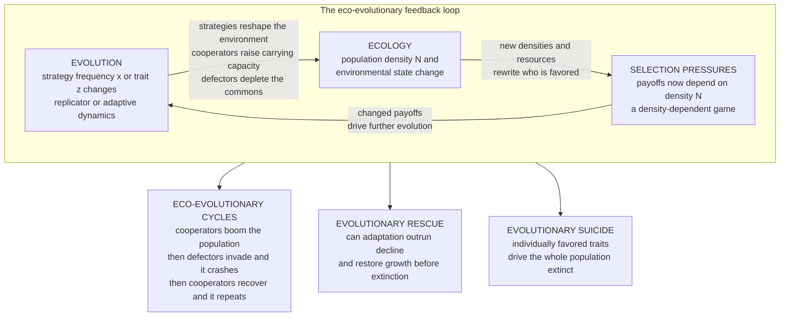

# 🔄 Eco-Evolutionary Dynamics

> [!abstract] TL;DR
> Classical evolutionary game theory holds **population size fixed** and tracks only how strategy *frequencies* change — the replicator equation lives on a simplex of proportions. But in nature, winning changes **how many** of you there are, and *how many* changes the environment everyone competes in. **Eco-evolutionary dynamics** couples the two: an **ecological** equation for population density `N` (logistic / Lotka-Volterra) is joined to an **evolutionary** equation for strategy frequency `x` or trait `z` (replicator / adaptive dynamics), closing a **feedback loop** — evolution changes strategies, strategies change densities and resources, densities change selection pressures, and selection changes evolution again. Historically ecology was assumed *fast* and evolution *slow*, so they were studied separately; but when evolution is **rapid** (guppies, sticklebacks, microbes evolve on ecological timescales) the loop must be modeled **jointly**. Coupling produces phenomena invisible to fixed-size models: **eco-evolutionary cycles** — the *oscillating tragedy of the commons* where cooperators boom the population, defectors then invade and crash it, and cooperators recover (Weitz et al. 2016); **evolutionary rescue** — a declining population saved from extinction if adaptation is fast enough to restore positive growth first (central to conservation, antibiotic resistance, and cancer therapy); and **evolutionary suicide** — adaptation that maximizes individual fitness driving the whole population extinct. This turns EGT into a tool for the urgent problems of a changing planet.

---

## Intuition

**Analogy:** Imagine a crowded dance floor. Classical evolutionary game theory watches only the *style* of dancing — what fraction are doing the waltz versus the tango — and assumes the floor holds a fixed number of people all night. Eco-evolutionary dynamics notices something the old picture ignored: when one style catches on, the whole crowd swells or thins, and *that* changes the floor itself — how much room there is, how loud it gets, which style now pays. **The dancers and the dance floor are reshaping each other in real time.** Getting better at your strategy is not a move in a fixed room; it is a move that renovates the room mid-dance, and the renovated room changes which move wins next.

The classic biological version: predators that get **better at hunting** crash their prey population — and then, with nothing left to eat, **starve**. Their evolutionary "success" rewrote the ecology, and the rewritten ecology turned success into catastrophe. Ecology (how many there are) and evolution (what they do) are not a slow process riding on top of a fast one; they **feed back on each other at the same tempo**, and the joint dynamics can boom, crash, oscillate, rescue, or self-destruct in ways neither half predicts alone.

---

## How It Works

### From fixed size to coupled dynamics

Standard replicator dynamics (see [[Replicator_Dynamics]]) tracks a strategy frequency `x` on a fixed-size population:

$$\dot{x} = x\,(1-x)\,\big(\pi_C(x) - \pi_D(x)\big),$$

where payoffs `π` depend only on *frequencies*. Population size `N` never appears — it is assumed constant, or infinite. That is a modeling *choice*, not a fact of biology. Real populations **grow and shrink**, and their density `N` is itself a state variable with its own dynamics — logistic growth, Lotka-Volterra competition, predator-prey coupling (all covered in [[Population_Ecology]]). Eco-evolutionary dynamics simply **stops holding `N` fixed** and lets it evolve *alongside* `x`:

$$\dot{N} = N\,g(x, N), \qquad \dot{x} = x\,(1-x)\,\big(\pi_C(x, N) - \pi_D(x, N)\big).$$

The two equations are **coupled through two channels**:

1. **Strategies affect density.** The per-capita growth rate `g(x, N)` depends on `x` — cooperators who maintain a shared resource raise the effective carrying capacity; defectors who exploit it lower it. What the population *does* sets how many it can *sustain*.
2. **Density affects selection.** The payoffs `π(x, N)` depend on `N` — this is a **density-dependent game**. A strategy that is favored when the population is sparse can be disfavored when it is crowded, because the value of exploiting, sharing, competing, or dispersing changes with density.

This is **"replicator dynamics with a dynamic population size"** (Cressman; Hofbauer & Sigmund). The old simplex of frequencies becomes a **richer dynamical system** on the `(x, N)` plane, with its own fixed points, limit cycles, and bifurcations.

### The eco-evolutionary feedback loop

The core idea is a **closed loop**. Evolution changes traits and strategies → traits change ecological variables (density, resource levels, the physical environment) → those changed variables change selection pressures → selection drives further evolution → and around again. Because the loop closes, ecology and evolution are **not separable**; you cannot compute the "ecological equilibrium" and then evolve on top of it if the evolving trait keeps moving the equilibrium.

Historically the loop was cut by a **timescale separation**: ecology fast, evolution slow. Under that assumption the ecology reaches equilibrium *before* the trait moves a hair, which is exactly what [[Adaptive_Dynamics_and_Evolutionary_Branching|adaptive dynamics]] exploits. But field studies of **rapid evolution** — Trinidadian guppies re-shaping their life history in a handful of generations, sticklebacks, *Daphnia*, and microbial chemostats — show evolution keeping pace with ecology. When the two tempos **overlap**, the loop is live and must be integrated **jointly**, not in sequence. This is a canonical [[Feedback_Loops_and_Causality|feedback]] system in the [[Nonlinearity_and_Feedback|systems-thinking]] sense.

### What the coupling produces

Three signature phenomena, all absent from fixed-size EGT:

- **Eco-evolutionary cycles.** The feedback can be *rotational*: cooperators raise carrying capacity, the population booms; a dense, resource-rich population rewards defectors, who invade; defection depletes the commons, the population crashes; a sparse population has little to exploit, so cooperators recover — and the wheel turns. This is the **oscillating tragedy of the commons** (Weitz et al. 2016), a predator-prey-like cycle in *strategy-and-density* space.
- **Evolutionary rescue.** A population declining in a deteriorated environment can be **saved from extinction** if adaptive evolution restores positive growth *before* `N` hits zero — a **race** between ecological decline and evolutionary adaptation (Gomulkiewicz & Holt 1995).
- **Evolutionary suicide.** Adaptation that maximizes each individual's fitness can drive `N` to **zero** — selection favoring traits that are individually advantageous but collectively lethal. Evolution optimizes fitness, *not* population persistence.



---

## Key Concepts

### Secondary (intuition level)

- **Winning changes the crowd.** In the old picture, only the *style* of playing changes and the number of players stays fixed. Really, a winning style makes the population grow or shrink, and that changes the game.
- **The dance floor pushes back.** More players means a more crowded floor, which changes which style now pays — so the environment you built starts steering your evolution.
- **Boom, then bust.** Cooperators can make the population boom; a booming, rich population is a feast for cheaters, who then invade and crash it; a crashed population is poor pickings, so cooperators come back. Round and round.
- **A race against extinction.** When the environment turns bad, a species is in a race: can it evolve fast enough to survive before it dies out? That race is *evolutionary rescue* — and it decides whether species survive climate change and whether germs survive our drugs.

### Undergraduate (formal level)

- **Coupled state variables.** The system state is the pair `(x, N)`: strategy frequency *and* population density, each with its own differential equation, coupled both ways.
- **Density-dependent payoffs.** `π(x, N)` depends on `N`, so the **game itself changes as the population grows or shrinks**. A strategy that is an [[Evolutionarily_Stable_Strategies|ESS]] at low density may not be an ESS at high density — the equilibrium concept must be evaluated at the *realized* density.
- **r-selection vs K-selection meets game theory.** At low density (sparse, growing) selection favors fast reproduction; at high density (crowded, near carrying capacity) it favors efficient competition. Embedding a game in population dynamics couples these classic ecological regimes to strategy choice.
- **Eco-evolutionary cycles.** In the `(x, N)` plane the coupled flow can circulate around an interior fixed point — a **center** (neutral closed orbits) or a **limit cycle** (attracting oscillation) born at a Hopf [[Bifurcations_and_Tipping_Points|bifurcation]].
- **Evolutionary rescue as a race.** Mean per-capita growth `m(x)` starts negative in a spoiled environment; selection raises the beneficial strategy's frequency, pushing `m` back above zero. Survival depends on whether `m` crosses zero **before** `N` reaches the extinction floor — a competition of *rates*.
- **Niche construction.** Organisms modify their own environment (beavers build dams, plants alter soil chemistry, humans reshape everything), so the "environment" in the feedback loop is **partly built by the evolving population** itself — extending the loop to ecosystem engineering.

### Graduate (research level)

- **Replicator-density systems and their invariants.** Coupling a replicator equation to a density equation can yield a system with a **conserved quantity** (a Hamiltonian), making the interior fixed point a *nonlinear center* with a continuum of closed orbits — the Lotka-Volterra structure transplanted into strategy-density space (see the demo). Adding dissipation (costs, self-limitation) converts the center into a stable spiral (damped cycles) or, with the right destabilizing term, an attracting **limit cycle** via a **Hopf bifurcation**.
- **Game-environment feedback (Weitz et al. 2016).** Let an environmental state `n` interpolate between two payoff matrices; cooperators enhance `n`, defectors degrade it. The replicator-environment system exhibits **persistent oscillations** and, on the boundary, a **heteroclinic cycle** — the *oscillating tragedy of the commons*. Non-equilibrium behavior is the generic outcome, not the exception.
- **Adaptive dynamics with demography.** The canonical equation of [[Adaptive_Dynamics_and_Evolutionary_Branching|adaptive dynamics]] already carries the equilibrium population size `N(x)` in its speed term; **evolutionary suicide** occurs when the selection gradient drives the trait to a point where `N(x^*) = 0` — a *convergence-stable* trait value that is demographically lethal (Ferrière; Gyllenberg & Parvinen). The tragedy of the commons is its game-theoretic face.
- **Evolutionary rescue theory.** Gomulkiewicz & Holt (1995) frame rescue as a **U-shaped** demographic trajectory: population declines, adaptive genetic change accumulates, growth recovers. Rescue probability rises with **standing genetic variation**, **population size** (mutational supply and demographic buffer), **migration** (gene flow of pre-adapted variants), and the **speed and severity** of environmental change relative to the maximal rate of adaptation.
- **Evolutionary epidemiology.** Pathogen virulence coevolves with the SIR epidemic state; the susceptible density `S` is a dynamic environment that changes the selection on transmission and virulence — the eco-evolutionary reading of [[Host_Pathogen_and_Coevolution|host-pathogen coevolution]]. Superinfection couples within-host competition to between-host epidemic dynamics.
- **Fisheries-induced evolution.** Size-selective harvesting is an eco-evolutionary problem: fishing pressure (an ecological mortality) selects for **smaller, earlier-maturing fish**, whose altered life history feeds back on stock dynamics and yield — a managed, and often mismanaged, feedback loop.

---

## Python Demo

Two coupled simulations, both integrating an **ecological** density equation together with an **evolutionary** replicator/selection equation using a hand-written RK4 integrator. **Model 1** is the *oscillating tragedy of the commons*: cooperator fraction `x` and population density `N` are coupled so that cooperators are favored only when the commons is uncrowded (payoff advantage `β(N_c − N)`) while density grows only when cooperators are common (`α(x − x_c)`). The interior fixed point `(x_c, N_c)` is a **nonlinear center** — there is a conserved quantity, exactly as in Lotka-Volterra — so the system produces **persistent eco-evolutionary cycles**: `N` booms when cooperators lead, defectors then invade, `N` crashes, and cooperators recover. **Model 2** is **evolutionary rescue**: after the environment deteriorates the wild type has negative growth, an adapted type has positive growth, and the adapted fraction `y` rises by selection; a **fast**-evolving population rebounds in a U-shape while a **slow**-evolving one crosses the extinction floor and is lost. `numpy` and `matplotlib` only.

```python
# Eco-evolutionary dynamics: couple a POPULATION-DENSITY equation with a
# STRATEGY-FREQUENCY (replicator) equation. Two flagship phenomena:
#   MODEL 1 -- "oscillating tragedy of the commons" -> PERSISTENT eco-evo CYCLES
#   MODEL 2 -- EVOLUTIONARY RESCUE -> a race between decline and adaptation
import numpy as np
import matplotlib.pyplot as plt

def rk4(rhs, s0, dt, steps):
    """Generic 4th-order Runge-Kutta integrator for s' = rhs(s)."""
    S = np.empty((steps + 1, len(s0)))
    S[0] = np.array(s0, float)
    s = np.array(s0, float)
    for k in range(steps):
        k1 = rhs(s)
        k2 = rhs(s + 0.5 * dt * k1)
        k3 = rhs(s + 0.5 * dt * k2)
        k4 = rhs(s + dt * k3)
        s = s + (dt / 6.0) * (k1 + 2 * k2 + 2 * k3 + k4)
        S[k + 1] = s
    return S

# ===========================================================================
# MODEL 1 -- ECO-EVOLUTIONARY CYCLES (oscillating tragedy of the commons)
# ---------------------------------------------------------------------------
# x = fraction of COOPERATORS (1-x = defectors);  N = population DENSITY.
#   Replicator:  dx/dt = x*(1-x) * (payoff_C - payoff_D),
#                payoff_C - payoff_D = beta*(Nc - N)
#       -> cooperators WIN when the commons is uncrowded (N < Nc); as the
#          population gets dense a defector who skips the upkeep gains more,
#          so defection pays => a DENSITY-DEPENDENT game.
#   Density:     dN/dt = N * alpha*(x - xc)
#       -> per-capita growth is positive only when cooperators are common
#          enough (x > xc) to sustain the shared carrying capacity.
# The interior fixed point (xc, Nc) is a NONLINEAR CENTER: a conserved
# quantity exists (as in Lotka-Volterra) so the orbits never settle.
alpha, beta = 1.0, 1.0
xc, Nc = 0.5, 1.0

def eco_evo_rhs(state):
    x, N = state
    dx = x * (1.0 - x) * beta * (Nc - N)     # replicator, density-dependent payoff
    dN = N * alpha * (x - xc)                 # density grows if cooperators common
    return np.array([dx, dN])

dt1, steps1 = 0.004, 12000
traj = rk4(eco_evo_rhs, [0.70, 1.0], dt1, steps1)     # start cooperator-rich
t1 = np.arange(steps1 + 1) * dt1
x_t, N_t = traj[:, 0], traj[:, 1]

def H(x, N):                                           # conserved quantity
    return alpha * (-xc * np.log(x) - (1 - xc) * np.log(1 - x)) \
         - beta * (Nc * np.log(N) - N)
H_drift = abs(H(x_t[-1], N_t[-1]) - H(x_t[0], N_t[0]))

# ===========================================================================
# MODEL 2 -- EVOLUTIONARY RESCUE (race between decline and adaptation)
# ---------------------------------------------------------------------------
# The environment has just deteriorated. The WILD type now has NEGATIVE growth
# (rW < 0); a rare ADAPTED type has positive growth (rA > 0). Fraction adapted
# y rises by directional selection at rate sigma; mean per-capita growth is
#   m(y) = y*rA + (1-y)*rW.
#   dy/dt = sigma * y*(1-y)          (replicator / directional selection)
#   dN/dt = N * m(y) * (1 - N/K)     (density: falls while m<0, recovers m>0)
# If y crosses break-even (m=0) fast enough, N rebounds BEFORE hitting the
# extinction floor -> RESCUE. Too slow -> extinction.
rA, rW, K, N_ext = 0.6, -0.4, 1.0, 0.05
y_breakeven = -rW / (rA - rW)                          # m(y)=0  ->  y = 0.4

def rescue_rhs(sigma):
    def rhs(state):
        y, N = state
        m = y * rA + (1.0 - y) * rW
        dy = sigma * y * (1.0 - y)
        dN = N * m * (1.0 - N / K)
        return np.array([dy, dN])
    return rhs

dt2, steps2 = 0.02, 2000
t2 = np.arange(steps2 + 1) * dt2
fast = rk4(rescue_rhs(2.00), [0.02, 0.9], dt2, steps2)  # rapid evolution
slow = rk4(rescue_rhs(0.05), [0.02, 0.9], dt2, steps2)  # sluggish evolution
y_fast, N_fast = fast[:, 0], fast[:, 1]
y_slow, N_slow = slow[:, 0], slow[:, 1]
survived_fast = N_fast.min() > N_ext
survived_slow = N_slow.min() > N_ext

# ===========================================================================
# VISUALIZE
# ===========================================================================
fig = plt.figure(figsize=(13, 10))

# (A) cycles: density N and cooperator fraction x oscillate, out of phase
axA = fig.add_subplot(2, 2, 1)
axA.plot(t1, N_t, color="#c0392b", lw=1.6, label="population density N")
axA.plot(t1, x_t, color="#2980b9", lw=1.6, label="cooperator fraction x")
axA.axhline(Nc, color="#c0392b", ls=":", lw=0.8)
axA.axhline(xc, color="#2980b9", ls=":", lw=0.8)
axA.set_title("(A) Oscillating tragedy of the commons\n"
              "N booms when cooperators lead, defectors invade, N crashes")
axA.set_xlabel("time"); axA.set_ylabel("value")
axA.legend(fontsize=8, loc="upper right")

# (B) phase plane (x, N): a closed eco-evolutionary orbit
axB = fig.add_subplot(2, 2, 2)
axB.plot(x_t, N_t, color="#16a085", lw=0.9)
axB.plot(x_t[0], N_t[0], "ko", ms=6, label="start")
axB.plot(xc, Nc, "r*", ms=15, label="center (xc, Nc)")
axB.set_title("(B) Phase plane (x, N): a closed orbit\n"
              "ecology and evolution chase each other forever")
axB.set_xlabel("cooperator fraction x"); axB.set_ylabel("population density N")
axB.legend(fontsize=8, loc="upper right")

# (C) evolutionary rescue: fast evolution rebounds, slow one goes extinct
axC = fig.add_subplot(2, 2, 3)
axC.plot(t2, N_fast, color="#27ae60", lw=1.9, label="fast evolution -> RESCUE")
axC.plot(t2, N_slow, color="#8e44ad", lw=1.9, label="slow evolution -> extinction")
axC.axhline(N_ext, color="k", ls="--", lw=1.0, label="extinction threshold")
axC.set_title("(C) Evolutionary rescue: a U-shaped escape from extinction")
axC.set_xlabel("time"); axC.set_ylabel("population density N")
axC.legend(fontsize=8, loc="center right")

# (D) the adapting fraction drives the rescue once it passes break-even
axD = fig.add_subplot(2, 2, 4)
axD.plot(t2, y_fast, color="#27ae60", lw=1.9, label="fast: adapted fraction y")
axD.plot(t2, y_slow, color="#8e44ad", lw=1.9, label="slow: adapted fraction y")
axD.axhline(y_breakeven, color="k", ls=":", lw=1.0,
            label="break-even y (mean growth = 0)")
axD.set_title("(D) Adaptation drives the rescue\n"
              "growth turns positive once y passes break-even")
axD.set_xlabel("time"); axD.set_ylabel("adapted fraction y")
axD.legend(fontsize=8, loc="lower right")

fig.suptitle("Eco-evolutionary dynamics: coupled population density N and strategy x",
             fontsize=14)
fig.tight_layout(rect=[0, 0, 1, 0.96])
plt.savefig("eco_evolutionary_dynamics.png", dpi=120)

# ---- numerical confirmation ----
print("MODEL 1 (cycles): conserved-quantity drift H =", round(H_drift, 4),
      "-> ~0  => closed orbit, PERSISTENT oscillations")
print("  N range:", round(N_t.min(), 3), "to", round(N_t.max(), 3),
      "| x range:", round(x_t.min(), 3), "to", round(x_t.max(), 3))
print("MODEL 2 (rescue): fast-evolution survived?", survived_fast,
      "| slow-evolution survived?", survived_slow,
      "| break-even y =", round(y_breakeven, 2))
plt.show()
```

**What the output shows.** Panel **(A)**: the density `N` and the cooperator fraction `x` oscillate **indefinitely and out of phase** — `N` booms while cooperators dominate, then `x` collapses as defectors invade the crowded commons, then `N` crashes, then `x` recovers in the depleted world. Panel **(B)**: in the `(x, N)` plane the trajectory is a **closed loop** encircling the center `(x_c, N_c)` — ecology and evolution chase each other around a fixed point they never reach, and the printed conserved-quantity drift is `≈ 0`, confirming a genuine closed orbit rather than a numerical spiral. Panel **(C)**: the *evolutionary rescue* race — the **fast**-evolving population dips and rebounds in the classic **U-shape**, while the **slow**-evolving population slides straight through the extinction threshold and is lost. Panel **(D)** shows why: rescue happens exactly when the adapted fraction `y` climbs past the **break-even** point where mean growth turns positive — the fast line clears it early, the slow line never does. Same ecology, same starting density; **the only difference is the speed of evolution**, and it is the difference between survival and extinction.

---

## Real-World Applications

> **Example — Trinidadian guppies (the field lab of eco-evolutionary dynamics):** David Reznick, Joseph Travis, and colleagues moved guppies from high-predation streams (where cichlids eat adults) to predator-free headwaters. Within a **handful of generations** the guppies evolved slower maturation, larger offspring, and altered life history — and those evolved traits **fed back on population density, resource use, and even nutrient cycling** in the stream. Ecology and evolution moved on the *same* clock; you cannot predict the population trajectory without the evolution, or the evolution without the population. This is the textbook demonstration that the two are one coupled system.

- **Conservation under climate change.** Whether a species survives a warming, drying, or fragmenting world is an **evolutionary rescue** question: can adaptation restore positive growth before the population crashes? Rescue probability scales with standing genetic variation, population size, and gene flow — so conservation genetics (maintaining variation, enabling assisted migration) is directly an eco-evolutionary intervention. See [[Biodiversity_and_Conservation]].
- **Antibiotic and pesticide resistance.** A bacterial or pest population crashing under a drug is a population racing to be **rescued by a resistance mutation** before it is wiped out. High doses that leave survivors, or spatial refuges, tune the rescue probability. *Adaptive therapy* deliberately withholds maximal killing to keep drug-sensitive competitors alive and suppress resistant lineages — managing the feedback rather than trying to "win" it. Connects to [[Host_Pathogen_and_Coevolution]].
- **Cancer as tumor ecology.** A tumor is an evolving population in an ecological setting (nutrients, immune predation, spatial structure); therapy imposes strong selection, and resistant clones are *rescued* from the drug bottleneck. Evolutionary/adaptive oncology treats the tumor as an eco-evolutionary system — the domain of [[Cancer_and_Evolutionary_Medicine]]; the cell-cycle substrate is in [[Cancer_and_the_Cell_Cycle]].
- **Fisheries-induced evolution.** Size-selective harvesting selects for **smaller, earlier-maturing fish**; the evolved life history then feeds back on stock productivity and yield — an eco-evolutionary management problem where ignoring evolution mis-forecasts the fishery, as with Atlantic cod.
- **Evolutionary epidemiology.** Pathogen virulence and transmissibility evolve *while* the epidemic reshapes the susceptible population — the density of susceptibles is a dynamic environment steering selection, coupling within-host and between-host scales.
- **Microbial public goods.** In microbial communities, secreted "public goods" (siderophores, invertase, extracellular enzymes) raise the common carrying capacity while cheaters exploit them — a live **oscillating tragedy of the commons** studied in the chemostat, the empirical anchor for the demo's Model 1. See [[Microbial_Games_and_Public_Goods]].

---

## Common Pitfalls

- **"Population size is a harmless simplification."** Fixing `N` is exactly what hides eco-evolutionary cycles, rescue, and suicide. If strategies plausibly change **how many** individuals there are, holding `N` constant can flip qualitative predictions — a strategy that "wins" the frequency game may crash the population that plays it.
- **"Ecology is fast, evolution is slow, so decouple them."** True *only* when the timescales separate. For rapidly evolving systems (microbes, pests, pathogens, guppies) the loop is live and must be integrated **jointly**; computing an ecological equilibrium and evolving on top of it gives the wrong answer when the trait keeps moving that equilibrium.
- **"An ESS at one density is an ESS at all densities."** In a **density-dependent game** the payoff matrix itself depends on `N`. Evaluate stability at the *realized* density; a strategy uninvadable when sparse can be invadable when crowded, and vice versa.
- **"Adaptation always helps the population."** No — **evolutionary suicide** is real. Selection maximizes *individual* relative fitness, not population persistence; runaway competition or overexploitation can be individually favored yet drive `N` to zero. The tragedy of the commons is an eco-evolutionary outcome, not a metaphor.
- **"Persistent oscillation means the model is buggy."** Sustained eco-evolutionary cycles are the **correct** behavior of a conservative (center) or limit-cycle system, not a numerical artifact. A version that damps to a point has usually acquired a dissipative term (a cost, self-limitation) — a *different* model, not a corrected one.
- **"Evolutionary rescue is guaranteed given enough variation."** It is a **race of rates**. If environmental deterioration outpaces the maximal rate of adaptation, or the population crosses the extinction floor before the beneficial type takes over, the species is lost despite having the "right" mutation available. Speed and demographic buffer, not mere existence of variation, decide it.
- **"The environment is a fixed backdrop."** Under **niche construction** the organisms *build* their own selective environment (dams, soil chemistry, atmospheric oxygen). Treating the environment as exogenous misses a whole arm of the feedback loop.

---

## Related Concepts

- [[Fitness_Payoffs_and_Population_Games]] — the frequency-dependent payoffs of EGT; eco-evolutionary dynamics makes those payoffs **density-dependent** too, so the game changes as the population grows.
- [[Replicator_Dynamics]] — the fixed-size engine this note generalizes; coupling it to a density equation gives "replicator dynamics with a dynamic population size."
- [[Replicator_Dynamics_and_Fixed_Points]] — the fixed points and stability analysis that, once density is added, become the centers, spirals, and limit cycles of the `(x, N)` plane.
- [[Cyclic_Dynamics_and_Rock_Paper_Scissors]] — the archetype of perpetual non-equilibrium cycling; the oscillating tragedy of the commons is its eco-evolutionary cousin in strategy-density space.
- [[Adaptive_Dynamics_and_Evolutionary_Branching]] — the continuous-trait framework whose canonical equation already carries the equilibrium density; **evolutionary suicide** appears when the gradient drives the trait to zero population size.
- [[Evolutionarily_Stable_Strategies]] — the ESS concept, here evaluated at the *realized* density; a strategy's stability can flip as `N` changes.
- [[Host_Pathogen_and_Coevolution]] — evolutionary epidemiology couples virulence evolution to the SIR epidemic state, an eco-evolutionary loop with the susceptible density as the environment.
- [[The_Prisoners_Dilemma_and_Cooperation]] — the cooperation-defection tension whose density-coupled version produces the boom-bust commons cycle.
- [[Microbial_Games_and_Public_Goods]] — secreted public goods raise carrying capacity while cheaters exploit them: the laboratory realization of the demo's Model 1.
- [[Cancer_and_Evolutionary_Medicine]] — tumors as eco-evolutionary systems; drug-resistant clones are "rescued" from therapy, and adaptive therapy manages the feedback instead of maximizing kill.
- [[Cultural_Evolution_and_Social_Learning]] — human niche construction (agriculture, cities, technology) is eco-evolutionary feedback where the environment is culturally built.
- [[Evolutionary_Game_Theory_Overview]] — the vault entry point; eco-evolutionary dynamics is the "beyond fixed population size" frontier of the EGT map.
- [[From_Classical_to_Evolutionary_Game_Theory]] — situates the further move from fixed-size frequency dynamics to jointly coupled ecology and evolution.
- [[Population_Ecology]] — the logistic, Lotka-Volterra, and predator-prey machinery supplying the ecological half of the coupling.
- [[Community_Ecology]] — coexistence, competition, and diversity are reshaped when the interacting species also evolve on the ecological timescale.
- [[Biodiversity_and_Conservation]] — evolutionary rescue under climate change is applied eco-evolutionary dynamics for managing threatened populations.
- [[Natural_Selection_and_Adaptation]] — the Darwinian substrate; here selection and demography are solved as one coupled system rather than in sequence.
- [[Population_Genetics]] — the allele-frequency view of the evolving half, and the standing-variation reservoir that determines rescue probability.
- [[Cancer_and_the_Cell_Cycle]] — the cell-cycle and mutation substrate on which somatic tumor evolution and therapy-driven rescue play out.
- [[Feedback_Loops_and_Causality]] — the closed loop between ecology and evolution is a canonical reinforcing-and-balancing feedback structure.
- [[Nonlinearity_and_Feedback]] — the nonlinear coupling is what generates cycles, tipping, and rescue absent from linear or decoupled models.
- [[Dynamical_Systems_and_Attractors]] — fixed points, centers, and limit cycles of the `(x, N)` flow are the attractors classifying eco-evolutionary outcomes.
- [[Bifurcations_and_Tipping_Points]] — a Hopf bifurcation turns a stable equilibrium into a limit cycle; evolutionary suicide is a demographic tipping point driven by selection.
- [[Ecological_Resilience_and_Ecosystems]] — whether an ecosystem absorbs or amplifies a perturbation depends on the eco-evolutionary feedback, not ecology alone.

> Sibling EGT note referenced in prose and to be wired once written: *Evolutionary Political Science and Conflict* (the tragedy of the commons as an eco-evolutionary depletion of shared resources).

---

## Review Questions

**Tier 1 — Conceptual**
1. Using the dancers-and-dance-floor analogy, explain why classical evolutionary game theory (which holds population size fixed) can miss important behavior. Give one concrete example where a strategy that "wins" the frequency game harms the population that plays it.
2. Describe, in plain words, one full turn of the *oscillating tragedy of the commons*: start from a population dominated by cooperators and trace how it booms, is invaded, crashes, and recovers.

**Tier 2 — Applied**
3. In the demo's Model 2, mean per-capita growth is `m(y) = y·rA + (1−y)·rW` with `rW < 0 < rA`. Derive the break-even adapted fraction where `m = 0`, and explain why *evolutionary rescue* is a race of **rates** rather than a question of whether the beneficial variant merely exists. Name two factors that raise the probability of rescue and say why.
4. A pathogen population is crashing under a new antibiotic. Frame its possible survival as evolutionary rescue, and explain why an *adaptive-therapy* strategy that deliberately does **not** maximally kill the pathogen can reduce the chance that a resistant lineage rescues the population.

**Tier 3 — Analytical / Open-ended**
5. In Model 1 the interior fixed point `(x_c, N_c)` is a *nonlinear center* with a conserved quantity, giving persistent closed orbits. What single ingredient would you add to convert those neutral cycles into (a) damped oscillations settling to a point, and (b) a stable limit cycle born at a Hopf bifurcation? Justify each in terms of the sign of the divergence of the flow at the fixed point.
6. Explain how *evolutionary suicide* can arise even though every individual is maximizing its own fitness. Connect it to the tragedy of the commons and to the fact that convergence-stable trait values in adaptive dynamics carry the equilibrium population size `N(x)` — what does it mean for `N(x^*)` to reach zero, and why does natural selection not prevent it?

---

## Sources

- Weitz, J. S., Eksin, C., Paarporn, K., Brown, S. P., & Ratcliff, W. C. (2016). "An oscillating tragedy of the commons in replicator dynamics with game-environment feedback." *PNAS* 113(47), E7518-E7525. — the oscillating tragedy of the commons and game-environment feedback.
- Pelletier, F., Garant, D., & Hendry, A. P. (2009). "Eco-evolutionary dynamics." *Philosophical Transactions of the Royal Society B* 364(1523), 1483-1489. — the framing of ecology and evolution on comparable timescales.
- Gomulkiewicz, R., & Holt, R. D. (1995). "When does evolution by natural selection prevent extinction?" *Evolution* 49(1), 201-207. — foundational model of evolutionary rescue.
- Ferrière, R., & Legendre, S. (2013). "Eco-evolutionary feedbacks, adaptive dynamics and evolutionary rescue theory." *Philosophical Transactions of the Royal Society B* 368(1610), 20120081. — links adaptive dynamics, evolutionary suicide, and rescue.
- Post, D. M., & Palkovacs, E. P. (2009). "Eco-evolutionary feedbacks in community and ecosystem ecology: interactions between the ecological theatre and the evolutionary play." *Philosophical Transactions of the Royal Society B* 364(1523), 1629-1640. — feedback in community and ecosystem contexts, including niche construction.
- Hendry, A. P. (2017). *Eco-evolutionary Dynamics.* Princeton University Press. — comprehensive synthesis of the field.

---

#evolutionary-game-theory #eco-evolutionary-dynamics #feedback #evolutionary-rescue #density-dependence
