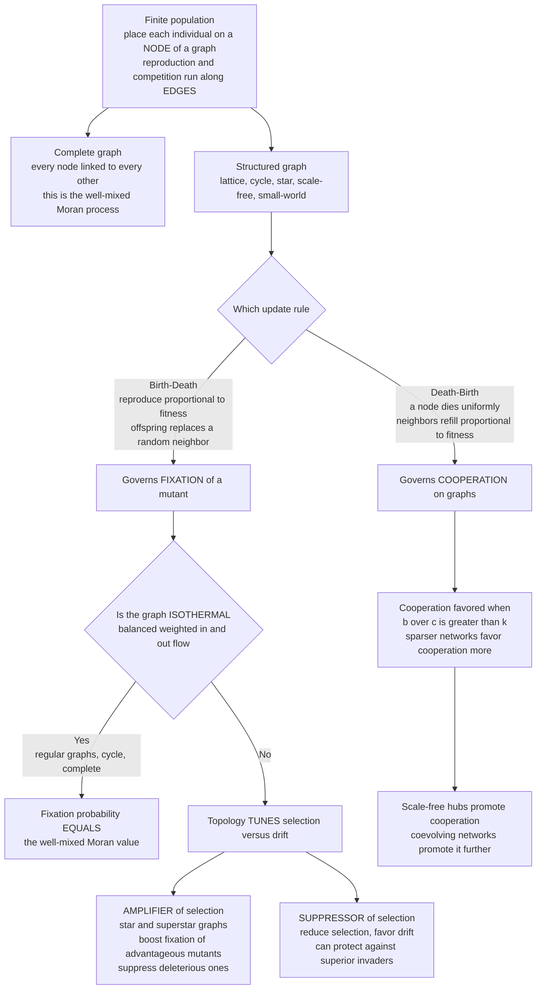

# 🕸️ Evolutionary Dynamics on Graphs

> [!abstract] TL;DR
> Classical evolution assumes a **well-mixed** population — every individual equally likely to interact with, replace, or be replaced by any other. **Evolutionary graph theory** (Lieberman, Hauert & Nowak, 2005) drops that fiction: put individuals on the **nodes** of a graph and let reproduction and competition run only along **edges**. The well-mixed Moran process is now just the special case of the **complete graph**. On other topologies the outcome changes dramatically. Some graphs are **amplifiers of selection** — the **star** boosts the fixation probability of an advantageous mutant *above* the well-mixed value (and suppresses deleterious ones), sharpening selection over drift. Others are **suppressors**, favoring drift. The elegant **isothermal theorem** says a graph gives *exactly* the Moran fixation probability if and only if it is isothermal (balanced weighted in/out flow) — which all **regular** graphs are. The **update rule** matters critically: **birth-death** governs fixation, while **death-birth** on a regular graph of degree `k` yields the celebrated cooperation condition `b/c > k` (Ohtsuki et al., 2006) — so **sparser networks favor cooperation more**. On real **scale-free** networks, cooperative hubs strongly promote cooperation. The lesson: *who-connects-to-whom is as important as the payoffs themselves.*

---

## Intuition

**Analogy:** Imagine a rumor spreading through a social world. In a tight-knit **village** where everyone talks to everyone, a new idea either dies within a day or sweeps through instantly — there is nowhere to hide and no time to prove itself. Now route those same people through a **sparse chain of acquaintances**, where each person only whispers to a couple of neighbors. The very same rumor now *creeps* — it moves slowly, gaining or losing credibility at each hop, and that slow passage gives a genuinely good idea time to demonstrate its worth before being judged.

The **structure of who-connects-to-whom dramatically changes evolution's outcome**. Some networks act like a megaphone: they **amplify** the advantage of a superior mutant, so even a slightly better variant reliably takes over. Other networks act like a wet blanket: they **suppress** selection, so chance (drift) dominates and the better variant is no more likely to win than a coin flip. And a few peculiar structures can even do the seemingly impossible — turn a *disadvantage* into a takeover, or protect a population against a superior invader. Change nothing about the payoffs; change only the **wiring** — and you change who wins.

---

## How It Works

### Populations on graphs

Take the finite-population machinery of the [[Finite_Populations_and_Stochastic_Dynamics|Moran process]] and generalize it: instead of an unstructured pool of `N` individuals, place one individual on each **node** of a graph `G`. **Edges** define who can reproduce into whom — reproduction and competition happen only between neighbors. Each node carries a type (say a *mutant* of relative fitness `r`, or a *resident* of fitness `1`), and the state of the whole system is *which* nodes are mutants.

- The **complete graph** `K_N` (every node linked to every other) recovers the classic **well-mixed Moran process** exactly — its fixation probability is the familiar `ρ = (1 − 1/r) / (1 − 1/r^N)`.
- **Arbitrary networks** — cycles, lattices, stars, scale-free, small-world — give **richer dynamics**. The *same* mutant with the *same* fitness `r` can have a wildly different fixation probability depending only on the topology.

This is the framework of **Lieberman, Hauert & Nowak (2005)**: evolution as a stochastic process on a weighted, possibly directed graph, with the complete graph as the well-mixed baseline that a century of theory quietly assumed.

### Update rules — a subtle, decisive modeling choice

On a graph, *how* individuals reproduce and die is no longer a harmless detail; it determines the answer. The main rules:

1. **Birth-Death (BD):** pick a node to reproduce **proportional to fitness** (selection acts here), then its offspring replaces a **random neighbor**. This rule governs **fixation** and amplifier/suppressor behavior.
2. **Death-Birth (DB):** pick a node to **die uniformly at random**, then its neighbors compete to fill the empty site **proportional to their fitness**. This rule is what yields the `b/c > k` cooperation condition.
3. **Imitation / pairwise comparison:** a node adopts a neighbor's strategy with probability increasing in the neighbor's payoff advantage — natural for cultural/behavioral spread.

In a well-mixed population these rules coincide. **On a graph they give genuinely different outcomes.** BD and DB can even disagree on whether cooperation is favored at all — the choice of update rule is one of the most important and most frequently under-reported decisions in structured-population models (see [[Spatial_and_Network_Games]]).

### Amplifiers vs suppressors of selection

The landmark result: **topology tunes the balance between selection and drift**, measured by how a graph shifts the **fixation probability** of an advantageous mutant relative to the well-mixed Moran value.

- **Isothermal graphs** (complete graph, cycle, any regular graph) give **exactly** the Moran fixation probability — structure is invisible to selection.
- **Amplifiers of selection** *raise* the fixation probability of beneficial mutants and *lower* it for deleterious ones. The canonical example is the **star**: a central hub connected to many leaves. Under birth-death updating the star behaves as if the selection strength were **squared** (roughly replacing `r` by `r²`), so it makes good mutants fix more reliably and bad mutants vanish more surely — it **sharpens selection**. Nowak's **superstar / metafunnel** graphs push amplification arbitrarily far, driving the fixation probability of *any* advantageous mutant toward `1`.
- **Suppressors of selection** *reduce* selection's effect, pushing fixation toward the neutral `1/N` and thus **favoring drift**. Certain directed or rooted structures (e.g., a directed line where influence flows one way) suppress selection — a superior mutant is no more likely to fix than a neutral one, and structure can even protect a population from advantageous invaders.

### The isothermal theorem

The clean structural criterion. Define each node's **temperature** as the total weight of edges flowing *into* it — how often it gets replaced. A graph is **isothermal** when all nodes have equal temperature (balanced weighted in/out flow). The **isothermal theorem** states:

> A graph has the *same* fixation probability as the well-mixed Moran process **if and only if** it is isothermal.

Every **regular** graph (all nodes the same degree, symmetric weights) is isothermal — hence complete graphs, cycles, and lattices all reproduce the Moran result. **Deviations from isothermality are exactly what create amplifiers and suppressors.** A structural, verifiable criterion replaces case-by-case simulation.

### Cooperation on graphs — the `b/c > k` rule

Move from a single mutant's fixation to the **evolution of cooperation**. In an additive **donation game**, a cooperator pays cost `c` to give each neighbor benefit `b`; a defector pays and gives nothing. Under **death-birth** updating on a **regular graph of degree `k`**, weak selection favors cooperation precisely when

$$\frac{b}{c} > k$$

the **benefit-to-cost ratio exceeds the average degree** (Ohtsuki, Hauert, Lieberman & Nowak, 2006). The intuition: a cooperator's benefit is diluted among its `k` neighbors, so **fewer neighbors** concentrate the mutual benefit inside a cooperator cluster, making cooperation easier to sustain. **Sparser networks favor cooperation; dense ones (`k → N`) approach the well-mixed limit where cooperation dies.** This single inequality distills network reciprocity into one line, and it is the graph-theoretic backbone of [[The_Prisoners_Dilemma_and_Cooperation|cooperation theory]].

### Complex networks, dynamic networks, and frontiers

Real contact networks are not regular. **Scale-free** networks (a few high-degree **hubs**, many low-degree nodes; see [[Small_World_and_Scale_Free_Networks]]) can strongly **promote cooperation** — cooperative hubs seed and stabilize cooperation and their many neighbors imitate them (Santos & Pacheco, 2005). Degree **heterogeneity**, clustering, and community structure all reshape outcomes, so the plain `b/c > k` value must be corrected on heterogeneous graphs. At the frontier, the network **coevolves** with strategy: individuals **rewire away from defectors** ("active linking" / partner choice), which strongly promotes cooperation; **temporal** and **multilayer** networks make the graph itself part of the evolutionary game — a very active research area.



---

## Key Concepts

### Secondary (school) level

- **Wiring changes the winner.** The same idea, gene, or behavior can win or lose depending only on *who is connected to whom*. Change the network, not the payoffs, and you change the outcome.
- **Megaphone vs wet blanket.** Some networks (a **star**, with a hub in the middle) act like a megaphone that makes a better variant reliably take over. Others act like a wet blanket, so pure luck decides instead.
- **Fewer neighbors help sharing.** If you help everyone you are connected to, having **fewer** connections concentrates the payback among your own kind — which is why sparser networks make cooperation easier.

### Undergraduate level

- **Graph generalization of the Moran process.** Individuals sit on nodes; reproduction/competition run along edges. The **complete graph** is the well-mixed Moran process; other graphs change the dynamics. State = the set of mutant nodes; absorbing states are all-mutant (**fixation**) or all-resident (**extinction**).
- **Update rules matter.** **Birth-Death** (reproduce ∝ fitness, replace a random neighbor) governs fixation. **Death-Birth** (die uniformly, neighbors refill ∝ fitness) governs cooperation. On a graph these give *different* answers — unlike the well-mixed case.
- **Amplifiers vs suppressors (Lieberman-Hauert-Nowak 2005).** Relative to the Moran fixation probability, some graphs **amplify** selection (the **star**: advantageous mutants fix more, deleterious ones less), others **suppress** it (favoring drift). Regular graphs (complete, cycle, lattice) match Moran exactly.
- **The `b/c > k` rule (Ohtsuki et al. 2006).** Under death-birth updating on a regular graph of degree `k`, cooperation in the additive donation game is favored under weak selection iff the benefit-to-cost ratio exceeds the average degree. **Sparser = more cooperative.**

### Graduate level

- **The isothermal theorem.** With a weighted, possibly directed graph and weights `w_ij`, define node temperature `T_j = Σ_i w_ij`. A graph yields the Moran fixation probability iff it is **isothermal** (`T_j` equal for all `j`), equivalently iff the weight matrix is **doubly stochastic** after normalization. Isothermality ⇔ vanishing structural bias; regular undirected graphs satisfy it automatically. Deviations parametrize amplification/suppression.
- **Star amplification.** For the star under BD updating, the fixation probability of a mutant with fitness `r` is approximately `(1 − 1/r²) / (1 − 1/r^{2N})` — selection is effectively *squared*. **Superstars, funnels, and metafunnels** (Lieberman et al.) are constructions whose amplification parameter `K` makes advantageous-mutant fixation `→ 1` as `K → ∞`. Rigorous classifications (Galanis et al.; Allen et al.) later characterized which graphs amplify, and that arbitrary directed graphs can suppress selection down to the neutral `1/N`.
- **Structure coefficient and `b/c` conditions.** The general weak-selection condition for cooperation is `(σ·a + b) > (c + σ·d)` for a 2×2 game with the graph's **structure coefficient** `σ`; for large regular graphs under death-birth this collapses to the additive-game rule `b/c > k`. Derivations use **pair approximation** (tracking neighbor-neighbor correlations) or **coalescent / identity-by-descent** methods that compute expected assortment. The condition is `b/c > k` for DB but is *not* satisfied by BD (which typically recovers the well-mixed, no-cooperation prediction).
- **Heterogeneous, dynamic, and multilayer networks.** On scale-free graphs the effective condition depends on the full **degree distribution** and degree correlations; cooperative hubs act as amplifiers of cooperation (Santos-Pacheco). **Active linking** and partner-choice models let the topology coevolve with strategies, generally boosting cooperation; **temporal** and **multilayer** networks are current frontiers where the graph is itself a strategic object.

---

## Python Demo

This simulation runs the **Moran process on a graph** under **birth-death** updating and shows that **topology changes the fixation probability of an advantageous mutant**. A single mutant of relative fitness `r > 1` is dropped onto a random node; each step a node reproduces proportional to fitness and its offspring replaces a random **neighbor**, until the mutant either fixes or dies. We estimate the fixation probability by Monte Carlo on four structures — a **complete graph** (well-mixed Moran baseline), a **cycle** (a regular, *isothermal* graph that should match the baseline), a **star** (a known **amplifier** that lifts fixation *above* the baseline), and a **random graph**. Panel 1 shows the empirical fixation probabilities against the exact Moran value, confirming the amplifiers-vs-suppressors result (Lieberman-Hauert-Nowak). Panel 2 plots the analytic fixation-vs-`r` curves for the isothermal baseline and the star amplifier, showing the star boosts advantageous mutants *and* suppresses deleterious ones. Panel 3 visualizes the `b/c > k` cooperation rule, shading where cooperation is favored under death-birth updating and highlighting that **sparser networks (small `k`) favor cooperation more**. Pure `numpy` + `matplotlib`.

```python
# EVOLUTIONARY DYNAMICS ON GRAPHS -- Moran process (birth-death) on 4 topologies.
# A single mutant (relative fitness r) is placed on a random node; each step one
# node reproduces PROPORTIONAL TO FITNESS and its offspring replaces a random
# NEIGHBOR (along an edge). We estimate the fixation probability per structure and
# show it DIFFERS by topology: the STAR AMPLIFIES selection (fixation above the
# well-mixed Moran value), while the CYCLE (regular/isothermal) MATCHES it.
import numpy as np
import matplotlib.pyplot as plt

rng = np.random.default_rng(11)

N       = 40      # number of nodes / population size
R       = 1.10    # relative fitness of the advantageous mutant (10% edge)
TRIALS  = 2500    # Monte Carlo runs per structure

# ---- graph builders : adjacency as a list of neighbor arrays --------------
def g_complete(n):
    return [np.array([j for j in range(n) if j != i]) for i in range(n)]

def g_cycle(n):
    return [np.array([(i - 1) % n, (i + 1) % n]) for i in range(n)]

def g_star(n):                      # node 0 = hub, nodes 1..n-1 = leaves
    adj = [np.arange(1, n)]                       # hub connects to all leaves
    adj += [np.array([0]) for _ in range(n - 1)]  # each leaf connects to hub
    return adj

def g_random(n, p=0.12):            # ring (guarantees connected) + extra edges
    nbr = [set([(i - 1) % n, (i + 1) % n]) for i in range(n)]
    for i in range(n):
        for j in range(i + 1, n):
            if rng.random() < p:
                nbr[i].add(j); nbr[j].add(i)
    return [np.array(sorted(s)) for s in nbr]

# ---- one birth-death Moran run on a graph; returns True if mutant fixes ----
def moran_graph_run(adj, n, r):
    state = np.zeros(n, dtype=np.int8)
    state[rng.integers(n)] = 1                    # one mutant on a random node
    count = 1
    while 0 < count < n:
        total = count * r + (n - count)           # total fitness in population
        # pick the reproducing node PROPORTIONAL TO FITNESS (two fitness classes)
        if rng.random() * total < count * r:      # reproducer is a mutant
            pool = np.flatnonzero(state == 1)
        else:                                     # reproducer is a resident
            pool = np.flatnonzero(state == 0)
        src = pool[rng.integers(pool.size)]
        nb  = adj[src]
        tgt = nb[rng.integers(nb.size)]           # offspring replaces a NEIGHBOR
        if state[tgt] != state[src]:              # a state actually changed
            count += 1 if state[src] == 1 else -1
            state[tgt] = state[src]
    return count == n

def fixation_prob(adj, n, r, trials):
    return sum(moran_graph_run(adj, n, r) for _ in range(trials)) / trials

# ---- exact well-mixed Moran fixation probability (the baseline) -----------
def moran_rho(r, n):
    if abs(r - 1.0) < 1e-12:
        return 1.0 / n
    return (1 - 1 / r) / (1 - r ** (-n))

# ---- run the four structures ---------------------------------------------
graphs = {
    "complete\n(well-mixed)": g_complete(N),
    "cycle\n(regular/isothermal)": g_cycle(N),
    "star\n(AMPLIFIER)": g_star(N),
    "random\n(near-regular)": g_random(N),
}
baseline = moran_rho(R, N)
results = {name: fixation_prob(adj, N, R, TRIALS) for name, adj in graphs.items()}

for name, rho in results.items():
    tag = name.replace("\n", " ")
    print(f"{tag:32s} fixation prob = {rho:.3f}  (Moran baseline {baseline:.3f})")

# =========================================================================
fig, ax = plt.subplots(1, 3, figsize=(16, 5))

# ---- Panel 1: empirical fixation probability by structure ----------------
names = list(results.keys())
vals  = [results[k] for k in names]
colors = ["#7f8c8d", "#2980b9", "#e74c3c", "#27ae60"]
ax[0].bar(range(len(names)), vals, color=colors, edgecolor="black")
ax[0].axhline(baseline, color="black", ls="--", lw=1.8,
              label=f"well-mixed Moran = {baseline:.3f}")
ax[0].axhline(1 / N, color="gray", ls=":", lw=1.5, label=f"neutral 1/N = {1/N:.3f}")
ax[0].set_xticks(range(len(names)))
ax[0].set_xticklabels(names, fontsize=9)
ax[0].set_ylabel("fixation probability of the mutant")
ax[0].set_title(f"Topology tunes fixation  (r={R}, N={N})\n"
                "STAR amplifies above the well-mixed value")
ax[0].legend(fontsize=9)

# ---- Panel 2: analytic fixation vs r -- isothermal vs star amplifier ------
rs = np.linspace(0.80, 1.30, 200)
iso  = np.array([moran_rho(r, N) for r in rs])              # regular/isothermal
star = np.array([moran_rho(r * r, N) for r in rs])          # star ~ r -> r^2
ax[1].plot(rs, iso,  color="#2980b9", lw=2.5,
           label="isothermal (complete, cycle) = Moran")
ax[1].plot(rs, star, color="#e74c3c", lw=2.5, label="star AMPLIFIER (r -> r^2)")
ax[1].axhline(1 / N, color="gray", ls=":", lw=1.5, label="neutral 1/N")
ax[1].axvline(1.0, color="black", lw=0.7)
ax[1].fill_between(rs, iso, star, where=(rs > 1), color="#e74c3c", alpha=0.12)
ax[1].annotate("advantageous mutants\nfix MORE often",
               xy=(1.18, moran_rho(1.18**2, N)), xytext=(1.02, 0.55),
               fontsize=9, arrowprops=dict(arrowstyle="->"))
ax[1].annotate("deleterious mutants\nfix LESS often",
               xy=(0.88, moran_rho(0.88**2, N)), xytext=(0.81, 0.20),
               fontsize=9, arrowprops=dict(arrowstyle="->"))
ax[1].set_xlabel("relative fitness r of the mutant")
ax[1].set_ylabel("fixation probability")
ax[1].set_title("Amplifier SHARPENS selection\n(boosts good, suppresses bad)")
ax[1].legend(fontsize=9, loc="upper left")

# ---- Panel 3: the b/c > k cooperation rule (death-birth updating) ---------
ks = np.arange(2, 13)
bc = np.linspace(1, 14, 300)
K, BC = np.meshgrid(ks, bc)
favored = (BC > K).astype(float)          # cooperation favored where b/c > k
ax[2].contourf(ks, bc, favored, levels=[-0.5, 0.5, 1.5],
               colors=["#f7f7f7", "#a9dfbf"])
ax[2].plot(ks, ks, color="#196f3d", lw=2.5, label="threshold  b/c = k")
ax[2].text(8.5, 12.3, "COOPERATION\nFAVORED\n(b/c > k)", color="#196f3d",
           fontsize=11, ha="center", weight="bold")
ax[2].text(9.5, 3.0, "defection wins\n(b/c < k)", color="#7b241c",
           fontsize=10, ha="center")
ax[2].annotate("sparser networks (small k)\nfavor cooperation more",
               xy=(2, 3.0), xytext=(3.4, 6.5), fontsize=9,
               arrowprops=dict(arrowstyle="->", color="#196f3d"))
ax[2].set_xlabel("average degree k (neighbors)")
ax[2].set_ylabel("benefit-to-cost ratio b/c")
ax[2].set_title("Cooperation on graphs (death-birth)\nOhtsuki et al.: b/c > k")
ax[2].legend(fontsize=9, loc="lower right")

plt.tight_layout()
plt.savefig("evolutionary_dynamics_on_graphs.png", dpi=120, bbox_inches="tight")
print("\nStar fixation exceeds the well-mixed Moran value -> AMPLIFIER of selection.")
print("Cycle/complete match the Moran baseline -> ISOTHERMAL (regular) graphs.")
print("saved evolutionary_dynamics_on_graphs.png")
plt.show()
```

**What the output shows.** Panel 1: the empirical fixation probability of the `r = 1.10` mutant sits right on the **well-mixed Moran baseline** for the **complete graph** and the **cycle** (the cycle is regular and therefore *isothermal*), but is visibly **higher for the star** — the star **amplifies** selection exactly as Lieberman-Hauert-Nowak predict, while the random graph lands near the baseline. Panel 2 makes the amplification mechanism explicit: the star's fixation curve (effectively `r → r²`) sits **above** the isothermal Moran curve for advantageous mutants (`r > 1`) *and* **below** it for deleterious ones (`r < 1`) — it sharpens selection in both directions, pulling every outcome further from the neutral `1/N`. Panel 3 draws the `b/c > k` cooperation rule: cooperation under death-birth updating is favored only in the shaded region **above the diagonal**, so **sparser networks (small `k`) need a much smaller benefit-to-cost ratio** to sustain cooperation — the graph-theoretic essence of network reciprocity.

---

## Real-World Applications

> **Example — tissue architecture as a cancer suppressor:** A tumor begins when a single somatic cell acquires an advantageous (faster-dividing) mutation and its lineage **fixes** in a tissue compartment. Because cells reproduce only into neighboring positions, a tissue is an **evolutionary graph**, and its architecture sets the mutant's fixation probability. Hierarchically organized tissues (the linear stem-cell → transit → differentiated flow of the intestinal crypt) resemble **suppressor** topologies: they *reduce* the fixation probability of advantageous somatic mutants, slowing the accumulation of oncogenic clones. Evolutionary graph theory thus offers a design rationale for *why* tissue structure looks the way it does — architecture that suppresses selection is architecture that suppresses cancer. This is developed further in the sibling note *Cancer_and_Evolutionary_Medicine*.

- **Spread of innovations and behaviors on social networks.** Whether a new technology, norm, or cost-bearing behavior introduced by a single person takes over depends on the **contact network** — its degree distribution, hubs, and clustering. Amplifier-like structures (well-connected hubs) make good ideas go viral; suppressor-like structures entrench the status quo. This is the network reading of adoption dynamics, linking to [[Network_Dynamics_and_Contagion]] and *Cultural_Evolution_and_Social_Learning*.
- **Microbial communities on surfaces.** Bacteria growing on agar or in a biofilm reproduce into neighboring sites, so producer/cheater dynamics of costly public goods play out on a spatial graph; the `b/c > k` logic and spatial reciprocity explain why cooperation is stable on surfaces but collapses in a shaken flask. See [[Microbial_Games_and_Public_Goods]].
- **Epidemic and information spreading.** The same node-and-edge substrate underlies contagion: which network amplifies a pathogen or a rumor, and which suppresses it, is the epidemiological mirror of amplifiers and suppressors of selection ([[Network_Science_Fundamentals]]).
- **Networked multi-agent systems (CS).** Distributed multi-agent reinforcement learning, peer-to-peer resource sharing, and cooperation among networked autonomous agents are engineered evolutionary graphs; the design intuition — sparser interaction graphs and the right update rule sustain cooperation — carries directly over, connecting to *Evolutionary_Game_Theory_and_Machine_Learning*.

---

## Common Pitfalls

- **"Structure does not change fixation for regular graphs."** Correct only for *isothermal* graphs — but note the flip side: people wrongly assume *all* structure amplifies. Regular graphs (cycle, lattice, complete) give **exactly** the Moran result; the interesting effects require breaking isothermality (the star, superstars, directed graphs).
- **"The star always amplifies, under any rule."** Amplification is a property of **birth-death** updating with fitness on birth. Change the update rule (death-birth, or fitness on death) and the same star can behave differently — even as a suppressor. Always state the update rule *and* whether selection acts on birth or death.
- **"`b/c > k` is a universal cooperation law."** It is exact for **regular** graphs under **death-birth** updating and **weak selection**. On heterogeneous (scale-free) networks the condition is corrected by the degree distribution; under **birth-death** updating it typically fails entirely (no cooperation benefit). Plugging a mean degree into `b/c > k` on a real social graph is wrong.
- **"Amplifiers are always good."** An amplifier sharpens selection in *both* directions — it also makes *deleterious* mutants that do arise fix *less* often, but it removes the drift-driven escape that sometimes rescues diversity. Whether amplification helps depends on what you want fixed.
- **"Denser networks help cooperation."** Backwards. Large `k` dilutes the concentrated mutual benefit inside a cooperator cluster and pushes toward the well-mixed limit where cooperation dies. **Sparser** interaction favors cooperation.
- **"Fixation is quick, so simulations are cheap."** On isothermal graphs neutral-ish fixation takes on the order of `N²` steps, and suppressor topologies can be far slower. Under-running Monte Carlo trials (too few, or capped too early) systematically biases estimated fixation probabilities toward extinction.

---

## Related Concepts

- [[Finite_Populations_and_Stochastic_Dynamics]] — the well-mixed Moran process and fixation probability that this note generalizes; the complete graph *is* that model, and amplifiers/suppressors are graph deviations from its `ρ`.
- [[Spatial_and_Network_Games]] — the sibling anchor on population structure; lattices and the Nowak-May spatial Prisoner's Dilemma are the geometric special case, and the `b/c > k` rule is shared between the two notes.
- [[The_Prisoners_Dilemma_and_Cooperation]] — the base dilemma whose graph-structured version obeys `b/c > k`; network reciprocity is Nowak's fifth rule for cooperation.
- [[Kin_Selection_and_Inclusive_Fitness]] — assortment via relatedness is the kin counterpart of the assortment that graph structure creates geometrically; both make cooperators meet cooperators.
- [[Cyclic_Dynamics_and_Rock_Paper_Scissors]] — structure also rescues cyclic games into spiral waves; a companion demonstration that topology reshapes evolutionary outcomes.
- [[Microbial_Games_and_Public_Goods]] — bacteria on surfaces are living evolutionary graphs; producer/cheater fixation is exactly a graph-Moran process.
- [[Replicator_Dynamics]] — the deterministic, infinite, well-mixed limit that all graph structure departs from.
- [[Evolutionarily_Stable_Strategies]] — the well-mixed uninvadability concept refined by structure: a strategy stable in a crowd may be invadable on a graph.
- [[Fitness_Payoffs_and_Population_Games]] — the payoff-matrix and donation-game foundation whose `b`, `c` enter the `b/c > k` condition.
- [[Network_Science_Fundamentals]] — degree, temperature, isothermality, and adjacency are the graph properties that control amplification and cooperation.
- [[Small_World_and_Scale_Free_Networks]] — heterogeneous, hub-dominated networks strongly promote cooperation (Santos-Pacheco) and depart most from a regular lattice.
- [[Network_Dynamics_and_Contagion]] — spreading of strategies on a graph is the same substrate as epidemic/information contagion; amplifiers/suppressors mirror super-spreaders.
- [[Cooperation_and_Evolutionary_Game_Theory]] — the Systems-Thinking overview of cooperation mechanisms; evolutionary graph theory supplies its network-reciprocity leg.
- [[Cellular_Automata]] — lattice evolutionary games are game-theoretic cellular automata; the local-update-to-global-pattern logic is shared.
- [[Agent_Based_Modeling]] — the computational method used to simulate these graph dynamics when no closed form exists.
- [[Cancer_and_the_Cell_Cycle]] — somatic mutant fixation in structured tissue is a graph-Moran process; tissue architecture as a selection suppressor is the biological payoff.
- [[Graph_Theory]] — the mathematics of degree, adjacency, regularity, and directedness underpinning the isothermal theorem.
- [[Graph_Representation]] — the DSA-vault treatment of adjacency lists/matrices used to encode these interaction graphs in code.
- [[Markov_Chains]] — the Moran-on-a-graph process is an absorbing Markov chain; fixation probability is an absorption probability.
- [[Emergence_and_Self_Organization]] — cooperative clusters and hub-seeded cooperation are self-organized global patterns absent from the well-mixed case.

> Companion Evolutionary Game Theory notes still to be written link here as the network anchor: *Stochastic_Evolutionary_Dynamics_and_Fixation* (the exact fixation formula and Kimura diffusion this note builds on), *Cancer_and_Evolutionary_Medicine* (tissue architecture as a suppressor), *Cultural_Evolution_and_Social_Learning* (imitation as the graph update rule), and *Evolutionary_Game_Theory_and_Machine_Learning* (evolutionary graphs in networked multi-agent learning).

---

## Review Questions

**Tier 1 — Conceptual**
1. In plain words, why does placing individuals on the nodes of a **star** graph make an advantageous mutant more likely to take over than in a well-mixed population? Use the idea that the network can act like a "megaphone" for selection.
2. State the **isothermal theorem** informally and explain why a **cycle** and a **complete graph** both give exactly the well-mixed Moran fixation probability, while a star does not.

**Tier 2 — Applied**
3. The cooperation condition on a regular graph under death-birth updating is `b/c > k`. Explain why this means **sparser** networks favor cooperation more, and predict what happens to the condition as `k → N` (every node connected to every other).
4. You and a colleague both simulate "the same" evolutionary graph and report opposite conclusions about whether cooperation evolves. Name two modeling choices that could explain the disagreement, and say precisely why each one changes the outcome.

**Tier 3 — Analytical / Open-ended**
5. Amplifiers of selection *sharpen* selection (good mutants fix more, bad ones less), while suppressors push everything toward the neutral `1/N`. Argue both sides of whether a **suppressor** topology is desirable for a tissue trying to avoid cancer, and connect your answer to the fixation probability of an advantageous somatic mutant.
6. The star amplifies fixation but the `b/c > k` cooperation rule is derived for *regular* graphs under *death-birth* updating — a different rule and a non-regular graph. Explain why "which graph structure is best" has **no single answer** independent of the update rule and the evolutionary question being asked (mutant fixation vs cooperation), and give one concrete case where changing only the update rule flips the conclusion.

---

## Sources

- Lieberman, E., Hauert, C., & Nowak, M. A. (2005). "Evolutionary dynamics on graphs." *Nature* 433, 312-316. — founds evolutionary graph theory; the isothermal theorem, amplifiers, suppressors, superstars.
- Ohtsuki, H., Hauert, C., Lieberman, E., & Nowak, M. A. (2006). "A simple rule for the evolution of cooperation on graphs and social networks." *Nature* 441, 502-505. — derivation of the `b/c > k` rule under death-birth updating.
- Santos, F. C., & Pacheco, J. M. (2005). "Scale-free networks provide a unifying framework for the emergence of cooperation." *Physical Review Letters* 95, 098104. — heterogeneous networks and cooperative hubs.
- Allen, B., Lippner, G., Chen, Y.-T., Fotouhi, B., Momeni, N., Yau, S.-T., & Nowak, M. A. (2017). "Evolutionary dynamics on any population structure." *Nature* 544, 227-230. — general `b/c` conditions on arbitrary weighted graphs.
- Nowak, M. A. (2006). *Evolutionary Dynamics: Exploring the Equations of Life.* Harvard University Press. (Ch. 8: evolutionary graph theory.)
- Hindersin, L., & Traulsen, A. (2015). "Most undirected random graphs are amplifiers of selection for birth-death dynamics, but suppressors for death-birth dynamics." *PLOS Computational Biology* 11(11), e1004437. — update-rule dependence of amplification.

---

#evolutionary-game-theory #evolutionary-graph-theory #amplifiers-suppressors #network-reciprocity #fixation-on-graphs
