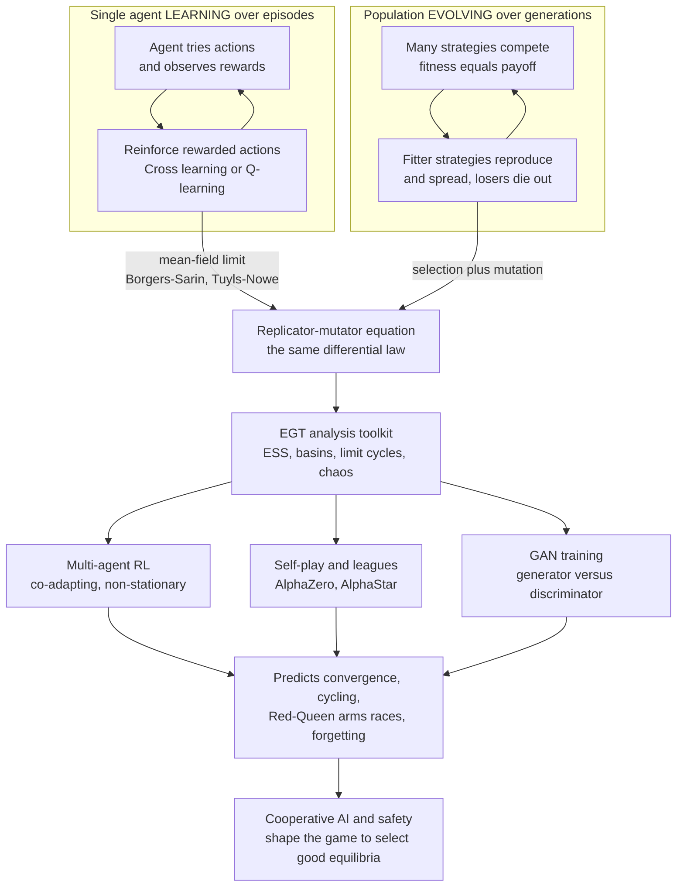

# 🤖 Evolutionary Game Theory and Machine Learning

> [!abstract] TL;DR
> Learning and evolution turn out to be **two faces of the same dynamics**. When **AlphaGo** learned to play by competing against copies of itself, it was doing evolution: strategies that won got reinforced, losers were discarded, and a lineage of agents climbed a fitness landscape toward mastery. This is not a loose metaphor — it is a **formal correspondence**. A single agent's **reinforcement learning** (Cross learning, stateless Q-learning) has the **replicator equation** as its **mean-field / continuous-time limit** (Börgers & Sarin 1997; Tuyls & Nowé) — *what an agent learns over time, a population evolves over generations*. That makes EGT the natural theory for analyzing modern AI: **multi-agent RL** is a non-stationary, co-adaptive process exactly like coevolution; **self-play** (AlphaZero, TD-Gammon, OpenAI Five, AlphaStar's league) is a population climbing a strategy landscape prone to **cycling and forgetting**; **GANs** are a two-player zero-sum arms race between a forger and a detector that suffers the same non-convergent, matching-pennies-like instabilities EGT studies; and **evolutionary computation** (genetic algorithms, evolution strategies, neuroevolution, quality-diversity search) runs evolution *as* a learning algorithm. EGT thus supplies both the **theory** to understand AI's learning dynamics and instabilities and a **toolkit** for building and aligning cooperative multi-agent systems. This note opens the vault's *Advanced Topics and Frontiers* section.

---

## Intuition

**Analogy:** Picture how AlphaGo actually got good. It did not memorize a book of moves. It played **millions of games against copies of itself**. After each game the moves that led to wins were made slightly more likely, the moves that led to losses slightly less likely. Repeat that a few million times and something remarkable happens: the agent's "population" of favored moves drifts steadily toward mastery — not because anyone taught it the right answer, but because **winning strategies got reinforced and losing strategies died out**. Squint, and that is exactly Darwin's algorithm: variation, selection, retention. The Go program was *evolving* a strategy, one self-play game at a time.

Now notice the same shape everywhere in modern AI. A **GAN** trains a forger (the generator) against a detector (the discriminator) locked in an arms race — each improvement by one is a new selection pressure on the other, precisely the **Red-Queen coevolution** biologists see between hosts and parasites. A crowd of **multi-agent RL** bots learning to drive, bid, or negotiate is a little ecosystem where every agent is a moving target for every other, co-adapting like species. And the deepest surprise: write down the equation for how a simple **reinforcement learner** updates its action probabilities, take the smooth limit, and you get the **replicator equation** — the *same* differential equation population biologists use to model evolving gene frequencies. Learning and evolution are not analogies for each other. Under the hood, they are **the same dynamics** wearing different clothes.

---

## How It Works

### The core equivalence: learning is evolution in miniature

Consider the simplest reinforcement learner, **Cross learning**. An agent holds a probability `p_a` for each action `a`. It plays an action, receives a reward `r` scaled to `[0, 1]`, and nudges its policy: the chosen action's probability rises toward 1 in proportion to the reward, and the others shrink to compensate. Nothing about biology appears anywhere in this rule.

**Börgers & Sarin (1997)** proved a startling fact: as the learning step `alpha` shrinks and time is rescaled, the *expected* trajectory of Cross learning converges to the **replicator dynamics**

`dx_i/dt = x_i * [ (A y)_i - x . A y ]`

— the exact equation from `[[Replicator_Dynamics]]` that governs how strategy frequencies change under natural selection. The learner's action probabilities `x_i` play the role of a **population's strategy frequencies**; the reward plays the role of **fitness**; reinforcing a rewarded action is the learning analog of a **fitter strategy reproducing**. What an individual agent *learns* over many episodes, a population *evolves* over many generations. **Tuyls & Nowé** extended this to stateless Q-learning with softmax action selection, whose continuous limit is the **replicator-mutator dynamics** — the replicator equation plus an exploration term that behaves exactly like biological **mutation**. The exploration rate *is* the mutation rate.

This is enormously useful in *both directions*: it gives learning a rich theory (import all of EGT — ESS, basins of attraction, limit cycles, chaos — to predict what a learner will do) and gives evolution a mechanism (selection is just distributed trial-and-error learning at the population scale).

### Multi-agent reinforcement learning as coevolution

The correspondence gets sharp — and troublesome — with **multiple** simultaneous learners. In single-agent RL the environment is fixed, so there is a stationary optimum to converge to. In **multi-agent RL (MARL)**, every agent's policy is part of *every other agent's environment*. As agent 1 learns, the world that agent 2 is optimizing against **shifts underfoot**. This **non-stationarity** is the defining difficulty of MARL, and it is precisely **coevolution**: species adapting to a fitness landscape that other species are simultaneously deforming.

EGT is the natural analysis tool. The **evolutionary dynamics of multi-agent learning** research program (Tuyls, 'tHoen, Bloembergen, Panait, Verbeeck) maps MARL algorithms onto their replicator-dynamics mean fields and then reads off the behavior from the phase portrait: does it converge to a **Nash equilibrium**, orbit a **center** forever, spiral into a **limit cycle**, or wander **chaotically**? Convergence is *not* guaranteed — in zero-sum games like matching pennies the dynamics are a center and learning **cycles endlessly** (see `[[Cyclic_Dynamics_and_Rock_Paper_Scissors]]`), and in richer games learning can be genuinely chaotic. This is why MARL is hard: you are not descending toward a fixed point, you are riding a coupled dynamical system that may never settle.

### Self-play: a lineage climbing a strategy landscape

**Self-play** — training by playing against copies of yourself — is the engine behind **TD-Gammon** (backgammon), **AlphaGo / AlphaZero** (Go, chess, shogi), and **OpenAI Five** (Dota 2). It is *explicitly* evolutionary: a lineage of agents improves by competing against its own recent variants, generating an **autocurriculum** of ever-harder opponents. Each generation faces a slightly stronger version of itself, so the difficulty ratchets up automatically without any human designing a curriculum.

But self-play inherits evolution's pathologies. Against a *single* frozen copy of itself, an agent can **overfit to one opponent** and then **catastrophically forget** how to beat older strategies — and in cyclic games (rock-paper-scissors structure) it can **chase its own tail forever**, rediscovering strategies it already knew. The fix is straight out of population biology: keep a **population**, not a single champion. **AlphaStar** (StarCraft II) trained an explicit **league** of diverse agents — main agents, exploiters, and past versions — so that no single strategy could be cheaply countered, exactly like maintaining genetic diversity to avoid a monoculture that one pathogen can wipe out. Self-play is population-based evolutionary search over the space of strategies.

### GANs: a two-player arms race

A **Generative Adversarial Network** (`[[GAN]]`) is, by construction, a **two-player zero-sum game**. The **generator** (forger) tries to produce fakes that fool the **discriminator** (detector); the discriminator tries to tell real from fake. Each is a selection pressure on the other: a better detector forces a better forger, which forces a better detector — a textbook **Red-Queen arms race**, structurally identical to the host-pathogen coevolution in `[[Host_Pathogen_and_Coevolution]]`.

And GANs suffer exactly the instabilities EGT predicts for such games. **Mode collapse** (the generator producing one type of output over and over) and **oscillation / non-convergence** during training are the machine-learning face of the **cycling** that replicator dynamics show in matching-pennies-like games — the equilibrium is a saddle or center, not an attractor, so gradient play orbits it rather than reaching it. Game-theoretic and evolutionary analyses of GAN training (and remedies like maintaining a *population* of generators/discriminators, or unrolled/optimistic updates) are a direct application of the same non-convergent-dynamics theory.

### Evolutionary computation: evolution as the algorithm

The bridge runs the other way too: use **evolution itself as a learning/optimization algorithm**. **Genetic algorithms** and **genetic programming** evolve solutions by variation-selection-retention. **Evolution strategies (ES)** — Salimans et al. (2017) showed a simple ES is a **competitive, massively parallelizable alternative to backprop-based RL**, estimating a gradient from a population of perturbed policies. **Neuroevolution** (NEAT) evolves both the weights *and* the topology of neural networks. And **quality-diversity / open-ended** methods — novelty search, MAP-Elites, POET — mimic natural evolution's *creativity*, seeking not one optimum but a *diverse archive* of stepping-stones, and **coevolutionary algorithms** (competitive and cooperative) use EGT ideas directly to manage the arms races and collusions such populations produce.

### Scaling and alignment: designing the games AIs play

Two frontiers close the loop. **Mean-field games** and **mean-field MARL** study the *limit* of very many interacting learners — where replicator/evolutionary dynamics become the tractable description of a whole population of agents, increasingly relevant to swarms of RL agents and **populations of LLM-based agents**. And **AI safety**: populations of adaptive AI agents can drift into emergent **cooperation** *or* into **collusion, arms races, and harmful equilibria**. The **Cooperative AI** agenda uses EGT and mechanism design (`[[VCG_Mechanism]]`, `[[Auction_Theory]]`) to *shape the games AIs play* so that beneficial equilibria are the ones selected — because if learning is evolution, then aligning multi-agent AI means engineering the selection pressures.



---

## Key Concepts

**Secondary (intuition level)**
- **Learning is just fast evolution.** Trying things, keeping what works, and dropping what does not is Darwin's algorithm running inside one agent's head.
- **AlphaGo evolved.** Playing millions of games against itself and reinforcing the winning moves is variation-selection-retention — a lineage climbing toward mastery.
- **GANs are an arms race.** A fake-maker and a fake-detector push each other to improve, exactly like predators and prey (or hackers and antivirus) escalating forever.
- **Sometimes learning never settles.** In rock-paper-scissors-like games the learners chase each other in circles instead of converging — that is a real, expected outcome, not a bug.

**Undergraduate (formal level)**
- **Cross learning and the replicator equation.** The simplest RL rule updates chosen-action probability by `alpha * r * (1 - p_a)`; its continuous-time expected motion is the replicator dynamics with reward as fitness (Börgers & Sarin 1997).
- **Q-learning and the replicator-mutator dynamics.** Stateless Q-learning with softmax (Boltzmann) selection has the replicator-*mutator* equation as its mean field; the exploration temperature acts as a mutation rate (Tuyls & Nowé).
- **MARL non-stationarity as coevolution.** With several learners the environment each optimizes against is itself changing — a moving fitness landscape — which is why single-agent convergence guarantees fail.
- **Self-play as population-based search.** Training against copies of oneself generates an autocurriculum; leagues/populations prevent overfitting to one opponent and cyclic forgetting.
- **GAN as a two-player zero-sum game.** The minimax objective makes generator vs discriminator adversarial; equilibria can be saddles, so gradient dynamics cycle (mode collapse, oscillation).

**Graduate (research level)**
- **Which mean field for which learner.** Cross learning → replicator; Q-learning-softmax → replicator-mutator; regret-matching / no-regret learning → convergence to the *coarse correlated equilibrium* (the set-valued, weaker attractor), not necessarily Nash.
- **Multi-population (asymmetric) replicator dynamics.** For an n-player MARL system each agent is a separate replicator population coupled through joint payoffs; fixed points are Nash equilibria, and stability is read from the Jacobian (sink, source, center, saddle).
- **Non-convergence is generic.** Zero-sum games give volume-preserving flows (Poincaré recurrence, centers); many games exhibit limit cycles or chaotic learning (Sato-Crutchfield). Optimistic / extra-gradient and other modifications recover last-iterate convergence.
- **Evolution strategies as competitive RL.** ES estimates `∇ E[f] ≈ (1/σ) E[f(θ+σε) ε]` from a population of perturbations — derivative-free, embarrassingly parallel, robust to sparse/delayed reward (Salimans et al. 2017); neuroevolution (NEAT) and quality-diversity (MAP-Elites, POET) target open-endedness.
- **Mean-field games and alignment.** In the many-agent limit, mean-field MARL and evolutionary dynamics describe populations of learners (including LLM agents); the Cooperative AI program uses this plus mechanism design to engineer selection so that safe, cooperative equilibria are the attractors.

---

## Python Demo

We make the **learning = evolution** correspondence visible. We implement **Cross learning** — a bona fide stateless *reinforcement-learning* rule (no model of the game, just experienced rewards) — for **two agents** repeatedly playing a 2x2 game. Then we **overlay the RL trajectory in strategy space on the replicator-dynamics vector field of the same game**. Börgers & Sarin's theorem predicts the RL path should *follow the replicator flow*. We run two games to show both faces of that flow: **Matching Pennies** (zero-sum), where the replicator equilibrium is a **center** and learning **cycles without converging**, and the **Prisoner's Dilemma**, where the flow points to the mutual-defection corner and learning **converges** there.

```python
# Demonstrate the LEARNING = EVOLUTION correspondence (Borgers-Sarin 1997):
# a two-agent REINFORCEMENT-LEARNING rule (Cross learning) traces out the
# REPLICATOR-DYNAMICS flow field of the same game. Matching Pennies -> a center,
# so learning CYCLES (need not converge); Prisoner's Dilemma -> learning CONVERGES
# to mutual defection. numpy + matplotlib.
import numpy as np
import matplotlib.pyplot as plt

# --- Two games. A = row-player (agent 1) payoff, B = column-player (agent 2)
#     payoff, both indexed [action of agent 1, action of agent 2]. -------------
# Matching Pennies (zero-sum): agent 1 wants to MATCH, agent 2 wants to MISMATCH.
A_mp = np.array([[ 1.0, -1.0],
                 [-1.0,  1.0]])
B_mp = np.array([[-1.0,  1.0],
                 [ 1.0, -1.0]])
# Prisoner's Dilemma (symmetric): action 0 = Cooperate, action 1 = Defect.
A_pd = np.array([[3.0, 0.0],
                 [5.0, 1.0]])
B_pd = A_pd.T                       # symmetric game: agent 2 uses the transpose

def replicator_field(A, B, X, Y):
    """Multi-population replicator flow. X = P(agent1 plays action 0),
       Y = P(agent2 plays action 0). Returns dX/dt, dY/dt on the grid."""
    ay0 = A[0, 0] * Y + A[0, 1] * (1 - Y)      # agent1 payoff for action 0
    ay1 = A[1, 0] * Y + A[1, 1] * (1 - Y)      # agent1 payoff for action 1
    dX = X * (1 - X) * (ay0 - ay1)
    xb0 = X * B[0, 0] + (1 - X) * B[1, 0]      # agent2 payoff for action 0
    xb1 = X * B[0, 1] + (1 - X) * B[1, 1]      # agent2 payoff for action 1
    dY = Y * (1 - Y) * (xb0 - xb1)
    return dX, dY

def cross_learning(A, B, x0, y0, alpha=0.01, steps=60000, seed=0):
    """Cross learning: after playing action a and receiving reward r in [0,1],
       raise P(a) by alpha*r*(1-P(a)) and shrink the rest. Its mean field is the
       replicator dynamics (Borgers & Sarin 1997)."""
    rng = np.random.default_rng(seed)
    p = np.array([x0, 1 - x0])                 # agent 1 policy over actions [0,1]
    q = np.array([y0, 1 - y0])                 # agent 2 policy
    lo = min(A.min(), B.min()); hi = max(A.max(), B.max())
    An, Bn = (A - lo) / (hi - lo), (B - lo) / (hi - lo)   # rescale rewards to [0,1]
    xs, ys = np.empty(steps + 1), np.empty(steps + 1)
    xs[0], ys[0] = p[0], q[0]
    for t in range(steps):
        a = rng.choice(2, p=p)                 # agents sample actions from policies
        b = rng.choice(2, p=q)
        rA, rB = An[a, b], Bn[a, b]            # each agent's realized reward
        p += alpha * rA * ((np.arange(2) == a) - p)   # Cross update, agent 1
        q += alpha * rB * ((np.arange(2) == b) - q)   # Cross update, agent 2
        p = np.clip(p, 1e-9, 1); p /= p.sum()
        q = np.clip(q, 1e-9, 1); q /= q.sum()
        xs[t + 1], ys[t + 1] = p[0], q[0]
    return xs, ys

# --- Run the learners --------------------------------------------------------
mp_x, mp_y = cross_learning(A_mp, B_mp, x0=0.65, y0=0.35, alpha=0.02, seed=1)
pd_x, pd_y = cross_learning(A_pd, B_pd, x0=0.80, y0=0.80, alpha=0.02, seed=2)

# --- Plot: RL trajectory OVER the replicator vector field --------------------
gx, gy = np.meshgrid(np.linspace(0.02, 0.98, 22), np.linspace(0.02, 0.98, 22))
fig, axes = plt.subplots(1, 2, figsize=(14, 6.4))

def panel(ax, A, B, xs, ys, title, eq, eqlabel):
    dX, dY = replicator_field(A, B, gx, gy)
    ax.streamplot(gx, gy, dX, dY, density=1.1, color="#9bb7d4", linewidth=0.8,
                  arrowsize=0.9)
    step = max(1, xs.size // 4000)             # subsample the RL path for clarity
    ax.plot(xs[::step], ys[::step], color="#c0392b", lw=0.9, alpha=0.85,
            label="Cross-learning RL trajectory")
    ax.plot(xs[0], ys[0], "ko", ms=7, label="start")
    ax.plot(*eq, "g*", ms=18, label=eqlabel)
    ax.set_xlim(0, 1); ax.set_ylim(0, 1)
    ax.set_xlabel("P(agent 1 plays action 0)")
    ax.set_ylabel("P(agent 2 plays action 0)")
    ax.set_title(title); ax.legend(loc="upper right", fontsize=8)

panel(axes[0], A_mp, B_mp, mp_x, mp_y,
      "Matching Pennies: replicator CENTER -> learning CYCLES",
      (0.5, 0.5), "mixed Nash (0.5, 0.5)")
panel(axes[1], A_pd, B_pd, pd_x, pd_y,
      "Prisoner's Dilemma: flow to corner -> learning CONVERGES",
      (0.0, 0.0), "Nash: mutual defection")

fig.suptitle("Reinforcement learning FOLLOWS the replicator dynamics "
             "(Borgers-Sarin correspondence)", fontsize=13)
fig.tight_layout(rect=[0, 0, 1, 0.95])
plt.savefig("rl_follows_replicator.png", dpi=120)

# --- Numerical confirmation ---------------------------------------------------
print("Matching Pennies  | RL endpoint (x,y) = (%.2f, %.2f); it ORBITS the "
      "(0.5,0.5) center and never settles." % (mp_x[-1], mp_y[-1]))
print("Prisoner's Dilemma | RL endpoint (x,y) = (%.3f, %.3f) -> both agents "
      "learn to DEFECT (converges to the corner), P(cooperate) -> 0."
      % (pd_x[-1], pd_y[-1]))
plt.show()
```

**What the output shows.** In the **left panel** the light streamlines are the replicator vector field of Matching Pennies: closed loops around a **center** at the mixed Nash `(0.5, 0.5)`. The red Cross-learning path — a pure reinforcement learner that never computes an equilibrium — **spirals around that center, orbiting rather than converging**, exactly the non-convergent behavior EGT predicts for zero-sum games (the same structure as `[[Cyclic_Dynamics_and_Rock_Paper_Scissors]]`, and the reason GAN training oscillates). In the **right panel** the replicator flow of the Prisoner's Dilemma points inexorably to the **mutual-defection corner** `(0, 0)`; the learner **follows the flow and converges** there, both agents teaching themselves to defect. Same RL rule, opposite fates — dictated entirely by the geometry of the underlying replicator dynamics. That is the Börgers-Sarin correspondence made visible: **the RL trajectory is a sample path of the replicator flow.**

---

## Real-World Applications

> **Example — AlphaZero and AlphaStar as evolutionary self-play:** DeepMind's AlphaZero reached superhuman Go, chess, and shogi with *zero* human game data, purely by **self-play** — a lineage of a single network repeatedly playing itself and reinforcing winning moves, i.e. selection over a population of strategies. AlphaStar (StarCraft II) went further and made the evolution *explicit*: it trained a **league** of diverse agents (main agents, league exploiters, main exploiters, and frozen past versions) so no strategy could be cheaply countered and the system could not cycle or forget — a direct application of maintaining population diversity to avoid a fragile monoculture.

- **Generative adversarial networks.** GAN training is a two-player zero-sum game whose notorious instabilities (mode collapse, oscillation, non-convergence) are the ML face of replicator cycling; game-theoretic and population-based analyses guide fixes like optimistic/unrolled updates and generator-discriminator populations (`[[GAN]]`).
- **Multi-agent RL for autonomy, markets, and games.** Self-driving fleets, automated bidding in ad auctions and power markets, and cooperative-competitive game AIs (OpenAI Five in Dota 2) are all co-adaptive MARL systems where EGT phase-portrait analysis predicts convergence, cycling, or collusion (`[[Multi_Agent_and_Inverse_RL]]`, `[[Multi_Agent_Systems]]`).
- **Evolution strategies and neuroevolution.** OpenAI's ES (Salimans et al. 2017) rivals policy-gradient RL on locomotion and Atari while scaling to thousands of parallel workers; NEAT and quality-diversity methods (MAP-Elites, POET) evolve controllers, network topologies, and open-ended curricula where gradient methods stall.
- **RLHF and preference learning.** Reinforcement learning from human feedback fine-tunes LLMs by treating human preference as a reward signal — a reinforcement dynamic whose stability and reward-hacking failure modes are naturally studied with learning-dynamics (EGT) tools.
- **Cooperative AI and mechanism design for agents.** As populations of LLM-based and RL agents transact, the Cooperative AI agenda uses EGT plus auction/mechanism design (`[[VCG_Mechanism]]`, `[[Auction_Theory]]`) to engineer the games so that cooperation, not collusion or arms races, is the selected equilibrium (`[[Algorithmic_Game_Theory]]`).

---

## Common Pitfalls

- **"The learning = replicator link is just a metaphor."** It is a *theorem*. Cross learning's mean field is the replicator equation and Q-learning-softmax's is the replicator-mutator equation. The correspondence is exact in the small-step, mean-field limit — treat it as a formal tool, not a poetic analogy.
- **"More training always converges to Nash."** Not in games. In zero-sum settings the replicator flow is a *center*, so learning **cycles forever**; in others it can be chaotic. Assuming your MARL run "just needs more steps" ignores that the underlying dynamics may have no attracting fixed point.
- **"Self-play against a single copy is enough."** A lone frozen opponent invites overfitting and **catastrophic forgetting**, and in cyclic games the agent chases its own tail. Robust self-play needs a **population / league** — the biological lesson that monocultures are fragile.
- **"GAN instability is a bug to be patched away."** Mode collapse and oscillation are the *expected* dynamics of a two-player zero-sum game with a non-attracting equilibrium. They are managed (optimistic updates, populations, regularization), not eliminated by tuning alone.
- **"Regret-minimizing / no-regret learning converges to Nash."** It converges to the weaker **coarse correlated equilibrium** set, which can be far from any Nash equilibrium. Conflating the two overstates what modern learning dynamics guarantee.
- **"Evolution strategies are just slow genetic algorithms."** ES is a scalable, derivative-free gradient *estimator* competitive with policy-gradient RL, prized for parallelism and robustness to sparse reward — a different beast from naive GAs, and sometimes the better tool.
- **"Reward is fitness, full stop."** The mapping holds under the mean-field assumptions (small steps, many samples, specific selection/exploration schemes). Function approximation, replay, and off-policy corrections in deep RL break the clean correspondence, so use it as *analysis intuition*, not a literal guarantee about a specific deep network.

---

## Related Concepts

- [[Replicator_Dynamics]] — the differential equation that is the mean-field limit of reinforcement learning; the mathematical heart of the learning-equals-evolution correspondence.
- [[Replicator_Dynamics_and_Fixed_Points]] — classifies the sinks, sources, centers, and saddles that determine whether a multi-agent learner converges, cycles, or diverges.
- [[Cyclic_Dynamics_and_Rock_Paper_Scissors]] — the canonical non-convergent flow; the same cycling that makes GAN training and matching-pennies self-play orbit instead of settle.
- [[Evolutionary_Economics_and_Bounded_Rationality]] — the sibling that develops the same "evolution equals learning" claim for boundedly rational economic agents and imitation dynamics.
- [[Host_Pathogen_and_Coevolution]] — the biological Red-Queen arms race that GANs and adversarial training reproduce exactly.
- [[Evolutionary_Game_Theory_Overview]] — the vault entry point whose machinery (ESS, dynamics, selection) this note imports to analyze AI.
- [[Evolutionarily_Stable_Strategies]] — the uninvadability concept used to reason about which learned strategies are robust to deviating agents.
- [[Finite_Populations_and_Stochastic_Dynamics]] — finite-population stochastic effects that mirror the noise and drift in population-based self-play leagues.
- [[Spatial_and_Network_Games]] — structured-population dynamics paralleling networked and mean-field multi-agent learning.
- [[Reinforcement_Learning]] — the ML foundation (agents, rewards, policies) whose simplest rules map onto the replicator equation.
- [[Q_Learning_and_SARSA]] — stateless Q-learning with softmax selection has the replicator-mutator dynamics as its mean field (Tuyls & Nowé).
- [[Policy_Gradient_Methods]] — gradient-based policy optimization, the RL family self-play scales up and that evolution strategies compete against.
- [[Multi_Agent_and_Inverse_RL]] — the MARL setting whose non-stationarity is precisely the coevolution EGT is built to analyze.
- [[Multi_Agent_Systems]] — populations of interacting agents (including LLM agents) where equilibrium selection and cooperation matter.
- [[GAN]] — the marquee ML-as-two-player-zero-sum-game example, analyzed through evolutionary cycling.
- [[Adversarial_Robustness]] — adversarial attack-and-defend as a Red-Queen coevolutionary arms race in ML security.
- [[Nash_Equilibrium]] — the fixed points that interior rest points of the learning dynamics coincide with.
- [[Minimax_Theorem]] — the zero-sum solution concept underlying both matching pennies and the GAN objective.
- [[Mixed_Strategies]] — randomized play, the mixed Nash the matching-pennies learner orbits.
- [[Repeated_Games_and_Folk_Theorems]] — repeated interaction where learned cooperation and reciprocity can emerge among adaptive agents.
- [[Algorithmic_Game_Theory]] — the computational-game-theory backdrop for learning dynamics, price of anarchy, and mechanism design for agents.
- [[VCG_Mechanism]] — incentive-compatible mechanism design used by Cooperative AI to shape the games agents play.
- [[Auction_Theory]] — the market mechanisms multi-agent RL systems bid in and that alignment work engineers.
- [[Complex_Adaptive_Systems]] — the systems-thinking framing of many co-adapting learners producing emergent aggregate behavior.
- [[Emergence_and_Self_Organization]] — how coordinated or pathological collective behavior emerges from local learning without central design.

> Siblings for this *Advanced Topics and Frontiers* section not yet written — `Evolutionary_Political_Science_and_Conflict` (arms races and conflict dynamics), `Evolutionary_Dynamics_on_Graphs` (network-structured evolution beyond `[[Spatial_and_Network_Games]]`), and `Evolutionary_Dynamics_in_Markets_and_Institutions` (agent-based markets) — are referenced here in prose and will link back when created.

---

## Review Questions

**Tier 1 — Conceptual**
1. In plain words, in what sense is a single agent's reinforcement learning "the same thing" as a population's evolution? Name the equation they share and say what plays the role of *fitness* and of *reproduction* in the learning picture.
2. Why is self-play (as in AlphaGo) an *evolutionary* process, and why did AlphaStar need a whole *league* of agents rather than just one champion playing itself?

**Tier 2 — Applied**
3. In the demo, the *same* Cross-learning rule cycles forever in Matching Pennies but converges in the Prisoner's Dilemma. Explain why, in terms of the geometry of the replicator vector field (center vs flow-to-corner), and connect this to why GAN training is prone to oscillation.
4. A team's multi-agent RL system "won't converge no matter how long we train." Using the learning-dynamics view, give two distinct reasons this can happen and what you would check (or change) in each case.

**Tier 3 — Analytical / Open-ended**
5. State the Börgers-Sarin correspondence precisely: what limit turns Cross learning into the replicator dynamics, and what does the Tuyls-Nowé extension add for Q-learning with softmax? Where does the clean correspondence break down for *deep* RL, and why does that matter for using EGT as an analysis tool?
6. You are designing a marketplace of autonomous LLM/RL agents and want to avoid harmful collusion or arms-race equilibria. Explain how the "learning is evolution" view reframes this as *engineering selection pressures*, and sketch how mechanism design (e.g. VCG-style incentives) plus population/league methods could steer the system toward a cooperative equilibrium.

---

## Sources

- Börgers, T., & Sarin, R. (1997). "Learning Through Reinforcement and Replicator Dynamics." *Journal of Economic Theory* 77(1), 1-14. — proves Cross learning's mean field is the replicator equation.
- Tuyls, K., & Nowé, A. (2005). "Evolutionary Game Theory and Multi-Agent Reinforcement Learning." *The Knowledge Engineering Review* 20(1), 63-90. — Q-learning-softmax to replicator-mutator dynamics; the EGT-of-MARL program.
- Bloembergen, D., Tuyls, K., Hennes, D., & Kaisers, M. (2015). "Evolutionary Dynamics of Multi-Agent Learning: A Survey." *Journal of Artificial Intelligence Research* 53, 659-697. — the definitive survey linking learning algorithms to their evolutionary mean fields.
- Salimans, T., Ho, J., Chen, X., Sidor, S., & Sutskever, I. (2017). "Evolution Strategies as a Scalable Alternative to Reinforcement Learning." *arXiv:1703.03864*. — ES as a competitive, parallel alternative to RL.
- Vinyals, O., et al. (2019). "Grandmaster level in StarCraft II using multi-agent reinforcement learning." *Nature* 575, 350-354. — AlphaStar's population-based league as explicit evolutionary self-play.
- Goodfellow, I., et al. (2014). "Generative Adversarial Networks." *NeurIPS*. — GANs framed as a two-player minimax game.
- Dafoe, A., et al. (2020). "Open Problems in Cooperative AI." *arXiv:2012.08630*. — the Cooperative AI agenda for aligning multi-agent systems.

---

#evolutionary-game-theory #multi-agent-learning #reinforcement-learning #self-play #GANs
