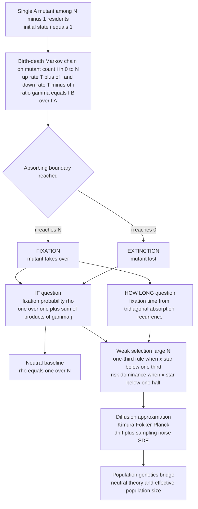

# 🎲 Stochastic Evolutionary Dynamics and Fixation

> [!abstract] TL;DR
> In an **infinite** population a strategy's fate is **deterministic**: the [[Replicator_Dynamics_and_Fixed_Points|replicator equation]] says exactly which trajectory unfolds and which state is stable. Real populations are **finite**, so evolution is **stochastic** — random drift can lose a superior mutant and occasionally carry an inferior one to victory. The question flips from *"which strategy is stable?"* to two **quantitative** ones: *"what is the **probability** that a single mutant takes over?"* (**fixation probability** `ρ`) and *"how **long** does that take?"* (**fixation time**). The canonical model is the **Moran process** — a birth-death **Markov chain** on the mutant count with absorbing states `0` and `N` — whose fixation probability has an **exact product formula**, equals the neutral baseline `1/N` under drift alone, and under **weak selection** obeys the elegant **one-third rule** and selects the **risk-dominant** convention. The **diffusion approximation** connects all of this to Kimura's population genetics. This is the rigorous mathematics beneath the foundational note [[Finite_Populations_and_Stochastic_Dynamics]].

---

## Intuition

**Analogy:** Imagine a gambler at a casino with a genuinely **favorable** bet — a positive expected edge on every spin. Over an infinite bankroll the law of large numbers guarantees a profit: that is the deterministic replicator world, where a fitter strategy *must* win. But the gambler has a **finite** bankroll, and a run of bad luck can bankrupt him *before* his edge ever pays off. Symmetrically, a friend playing an *unfavorable* game can hit a lucky streak and walk away rich. Finite populations are exactly this casino: a beneficial mutant can vanish by chance, and a harmful one can occasionally sweep the whole population.

So the meaningful outputs are no longer trajectories but **probabilities** and **timescales**: *what fraction of the time does the favorable bet actually pay off* (the **fixation probability**), and *how many spins until the bankroll hits either zero or the house limit* (the **fixation time**). This note develops the machinery that computes both, exactly and asymptotically — going deeper than [[Finite_Populations_and_Stochastic_Dynamics]], which introduces the model.

---

## How It Works

### Beyond the deterministic limit

The replicator equation `ẋ = x(1 - x)[π_A(x) - π_B(x)]` is a **deterministic ODE**: it is the `N → ∞` limit in which the fraction `x` of strategy A flows smoothly along a fixed trajectory, and stability is an attractor question. Finite `N` reintroduces **sampling noise**. Who reproduces is a random draw biased by fitness; the population fraction jitters, and that jitter — **genetic drift** — can overwhelm a small deterministic drift. The right mathematical objects become **first-passage quantities** of a Markov chain: absorption probabilities (fixation) and absorption times (fixation time).

### The Moran process as a birth-death chain

Fix `N` individuals, each of type **A** (mutant) or **B** (resident); the entire state is the count `i` of A-players on the ladder `{0, 1, …, N}`. Payoffs come from a game, so fitness is **frequency-dependent**: with `i` copies of A the mean payoffs are `π_A(i) = [a(i-1) + b(N-i)]/(N-1)` and `π_B(i) = [c·i + d(N-i-1)]/(N-1)` for payoff matrix rows `[a, b]` and `[c, d]`, and fitness is `f = 1 - w + w·π` with **selection strength** `w`. One Moran step picks a reproducer proportional to fitness and a random individual to die, keeping `N` constant. The count moves by `±1` or holds, with

- up-probability `T⁺(i) = [f_A·i / (f_A·i + f_B·(N-i))]·(N-i)/N`,
- down-probability `T⁻(i) = [f_B·(N-i) / (f_A·i + f_B·(N-i))]·i/N`.

States `0` (extinction) and `N` (fixation) are **absorbing**: every run ends in one of them.

### Fixation probability: the exact first-passage formula

Let `ρ_i` be the probability of reaching `N` starting from `i`. First-passage analysis of any birth-death chain gives the recurrence `ρ_i = T⁻(i)ρ_{i-1} + T⁺(i)ρ_{i+1} + (1 - T⁺ - T⁻)ρ_i` with `ρ_0 = 0`, `ρ_N = 1`. Solving it yields the celebrated **product formula**, which depends only on the ratios `γ_j = T⁻(j)/T⁺(j) = f_B(j)/f_A(j)`:

- **Fixation probability of a single mutant:** `ρ_A = ρ_1 = 1 / (1 + Σ_{k=1}^{N-1} Π_{j=1}^{k} γ_j)`.
- **Neutral baseline:** with `w = 0` all `γ_j = 1`, so `ρ_A = 1/N` — every individual is equally likely to be the common ancestor.
- **Constant relative fitness `r = f_A/f_B`:** the frequency-independent case collapses to the Kimura / gambler's-ruin result `ρ_A = (1 - 1/r)/(1 - 1/r^N)`. A `1%` edge (`r = 1.01`) gives `ρ_A ≈ 2%`, not certainty.
- **Frequency-dependent (game) case:** the same formula with game-derived `γ_j` — the probability that an innovation, cooperator, or mutant clone actually spreads.

The single number `1/N` is the **yardstick**: selection *favors* A precisely when `ρ_A > 1/N`, and *suppresses* it when `ρ_A < 1/N`.

### The one-third rule and risk dominance

Two different comparisons answer two different questions, and both have clean **weak-selection, large-`N`** limits for a 2×2 game:

1. **Is a single A mutant favored to invade B?** (`ρ_A > 1/N`) ⟺ `a + 2b > c + 2d` ⟺ the interior **unstable** equilibrium `x* = (d-b)/[(a-c)+(d-b)]` satisfies **`x* < 1/3`**. This is the **one-third rule** (Nowak, Sasaki, Taylor & Fudenberg 2004): A is favored if it is advantageous while rarer than `1/3` — a threshold strictly different from the deterministic basin boundary at `1/2`.
2. **Is A stochastically selected over B?** (`ρ_A > ρ_B`) ⟺ `a + b > c + d` ⟺ **`x* < 1/2`** ⟺ A is **risk-dominant** (larger basin of attraction). In the low-mutation limit the population spends almost all its time at the fixation state of the strategy with the larger `ρ`, so **finite-population dynamics select the risk-dominant convention** — the mathematics behind equilibrium selection and the evolution of norms (see the forthcoming sibling `The_Evolution_of_Conventions_and_Norms`).

The gap between the `1/3` invasion threshold and the `1/2` risk-dominance threshold is a genuine, testable signature of stochastic evolution that the replicator picture cannot see.

### Fixation time: not just IF but HOW LONG

Absorption *probability* is only half the story; the **absorption time** sets the tempo. Let `t_i` be the expected number of Moran steps to absorption (fixation or extinction) from state `i`. It solves the tridiagonal system

`(T⁺(i) + T⁻(i))·t_i = 1 + T⁺(i)·t_{i+1} + T⁻(i)·t_{i-1}`, with `t_0 = t_N = 0`.

- **Unconditional** time counts every run; **conditional** fixation time counts only runs that reach `N`.
- For a **bistable** game, `t_i` peaks near the unstable equilibrium `x*` — the population "dithers" there before committing.
- Neutral scaling: the conditional fixation time of a lone neutral mutant is of **order `N` generations** (one generation `= N` steps); absorption of the *unconditional* process is dominated by fast early extinction. Strongly beneficial mutants fix in `∼ ln N / s` generations. Timescale, not just outcome, decides whether an innovation spreads before conditions change.

### Weak selection and the diffusion approximation

Two analytical engines make finite-population EGT tractable:

- **Weak selection** (`w ≪ 1`): fitness differences are `O(1/N)`, linearizing every condition. This regime yields the one-third rule and, more generally, **Tarnita's structure coefficient** `σ` — across a huge class of models "A is favored over B" reduces to the single linear inequality `σ·a + b > c + σ·d`, with `σ` encoding population structure. The well-mixed one-third and risk-dominance criteria are special cases.
- **Diffusion approximation** (large `N`): the discrete chain converges to a **Fokker-Planck / stochastic differential equation** with a **drift** term (selection) plus a `√(x(1-x)/N)` **noise** term (sampling), closely related to [[Brownian_Motion|Brownian motion]] and [[Stochastic_Calculus|Itô calculus]]. This is exactly Kimura's population-genetics machinery — the bridge that lets EGT borrow decades of results on genetic drift and neutral theory.

### Flow / Architecture



---

## Key Concepts

### Secondary (school) level

- **Two questions, not one.** In a small group, when *one* person starts a new habit, ask (1) *what is the chance the whole group ends up doing it?* and (2) *how long until it either dies out or everyone adopts it?* Those are the **fixation probability** and the **fixation time**.
- **The `1/N` fair share.** If the new habit is no better and no worse, its chance of taking over is just `1/N` — one in `N`, the same as any random person's. Every claim that a strategy is "better" means its chance beats `1/N`.
- **Luck can beat merit in small groups.** A better habit can still fizzle out, and a worse one can still spread, because with few people chance dominates.

### Undergraduate level

- **Birth-death first passage.** The Moran count `i` is a birth-death [[Markov_Chains|Markov chain]] with absorbing ends. Solving the absorption recurrence gives the **product formula** `ρ_A = 1/(1 + Σ_{k=1}^{N-1} Π_{j=1}^{k} γ_j)`, `γ_j = f_B(j)/f_A(j)`; neutral `ρ = 1/N`; constant fitness `ρ = (1-1/r)/(1-1/r^N)`.
- **Fixation time via a linear system.** The expected absorption time `t_i` solves a tridiagonal system with `t_0 = t_N = 0`. It is directly computable and, for coordination games, peaks at the interior unstable equilibrium.
- **The one-third rule.** Under weak selection and large `N`, a single A mutant beats the neutral `1/N` iff the unstable interior equilibrium `x* < 1/3` — a finite-population threshold the deterministic `1/2` basin boundary misses.
- **Population-genetics identity.** These are the Wright-Fisher / Moran quantities of [[Population_Genetics_and_Hardy_Weinberg|population genetics]], now with frequency-dependent, game-derived fitness: EGT *is* population genetics with strategic interaction.

### Graduate level

- **Fixation-probability comparisons are distinct.** `ρ_A > 1/N` (invasion favored, the **one-third rule**) and `ρ_A > ρ_B` (stochastic selection, **risk dominance**, `x* < 1/2`) are different inequalities. The stochastically stable equilibrium in the low-mutation limit is the one with larger `ρ`, i.e. the risk-dominant strategy — the rigorous basis of equilibrium/convention selection.
- **Structure coefficient.** Tarnita, Ohtsuki, Antal, Fu & Nowak (2009): for weak selection over a broad model class, "A favored over B" collapses to a single linear condition `σ·a + b > c + σ·d`; `σ` is one number summarizing the population structure (well-mixed, graph, group, set). Structure is thus a scalar lever on evolutionary outcomes.
- **Diffusion limit and neutral theory.** The chain's diffusion approximation is a Kimura Fokker-Planck equation with drift `μ(x)` from selection and variance `x(1-x)/N` from sampling; the backward equation reproduces the fixation-probability and fixation-time integrals. Kimura's **neutral theory** — most molecular fixation is drift, at rate `1/N` per neutral mutant — lives here.
- **Timescale separation and stochastic stability.** Adding mutation removes permanent fixation; the system reaches a **stationary distribution**. As mutation `→ 0` the dynamics jump between pure states, and **stochastic stability** (Foster & Young) asks which state carries almost all the mass — an equilibrium-selection concept powered entirely by relative fixation probabilities.

---

## Python Demo

```python
# STOCHASTIC EVOLUTIONARY DYNAMICS: FIXATION PROBABILITY *and* FIXATION TIME
# in the frequency-dependent Moran process for a 2x2 game A vs B in a
# finite population of size N.
#
# We (1) compute the EXACT fixation probability of a single A mutant via the
#     birth-death product formula and VERIFY it against Monte-Carlo simulation,
# (2) demonstrate the ONE-THIRD RULE (rho_A > 1/N  <=>  x* < 1/3) and the
#     distinct RISK-DOMINANCE threshold (rho_A > rho_B  <=>  x* < 1/2),
# (3) solve the tridiagonal absorption system for the exact FIXATION TIME and
#     verify it against simulation, showing its N-scaling and the bistable hump.

import numpy as np
import matplotlib.pyplot as plt

rng = np.random.default_rng(11)


# ---- game -> fitness ------------------------------------------------------
# Payoff matrix M = [[a, b], [c, d]]: row = focal strategy, col = opponent.
# Strategy A (mutant) = index 0, B (resident) = index 1. A focal individual
# does NOT play itself, so payoffs use (N-1) opponents.
def fitnesses(i, N, M, w):
    a, b = M[0]
    c, d = M[1]
    piA = (a * (i - 1) + b * (N - i)) / (N - 1)
    piB = (c * i + d * (N - i - 1)) / (N - 1)
    return 1 - w + w * piA, 1 - w + w * piB          # linear fitness map


# Full Moran transition probabilities (INCLUDING the holding probability, so
# that step counts match wall-clock absorption TIME).
def trans(i, N, M, w):
    fA, fB = fitnesses(i, N, M, w)
    denom = fA * i + fB * (N - i)
    Tp = (fA * i / denom) * (N - i) / N              # count goes up
    Tm = (fB * (N - i) / denom) * i / N              # count goes down
    return Tp, Tm


# ---- exact fixation probability of a single A mutant ----------------------
# rho_A = 1 / (1 + sum_{k=1..N-1} prod_{j=1..k} gamma_j),  gamma_j = fB/fA.
def fixation_prob(N, M, w):
    total, prod = 0.0, 1.0
    for k in range(1, N):
        fA, fB = fitnesses(k, N, M, w)
        prod *= fB / fA
        total += prod
    return 1.0 / (1.0 + total)


# rho_B: fixation of a single B mutant = A and B relabelled -> M' = [[d,c],[b,a]].
def fixation_prob_B(N, M, w):
    a, b = M[0]; c, d = M[1]
    return fixation_prob(N, np.array([[d, c], [b, a]], float), w)


# ---- exact expected absorption (fixation) TIME ----------------------------
# t_i solves  (Tp_i + Tm_i) t_i = 1 + Tp_i t_{i+1} + Tm_i t_{i-1}, t_0=t_N=0.
def absorption_time(N, M, w):
    A = np.zeros((N - 1, N - 1)); rhs = np.ones(N - 1)
    for idx, i in enumerate(range(1, N)):
        Tp, Tm = trans(i, N, M, w)
        A[idx, idx] = Tp + Tm
        if idx > 0:     A[idx, idx - 1] = -Tm
        if idx < N - 2: A[idx, idx + 1] = -Tp
    full = np.zeros(N + 1)
    full[1:N] = np.linalg.solve(A, rhs)
    return full                                       # steps to absorption from i


# ---- Monte-Carlo checks ---------------------------------------------------
def sim_fix_prob(N, M, w, i0=1, trials=20000):
    # Embedded (conditioned-on-change) chain is enough for the PROBABILITY.
    fixed = 0
    for _ in range(trials):
        i = i0
        while 0 < i < N:
            fA, fB = fitnesses(i, N, M, w)
            i += 1 if rng.random() < fA / (fA + fB) else -1
        fixed += (i == N)
    return fixed / trials


def sim_abs_time(N, M, w, i0, trials=3000):
    # FULL process (with holding) so step counts measure real time.
    tot = 0
    for _ in range(trials):
        i, steps = i0, 0
        while 0 < i < N:
            Tp, Tm = trans(i, N, M, w)
            u = rng.random()
            if u < Tp:        i += 1
            elif u < Tp + Tm: i -= 1
            steps += 1
        tot += steps
    return tot / trials


# =========================================================================
fig, ax = plt.subplots(2, 2, figsize=(13, 9))

# ---- Panel (a): VERIFY the exact fixation probability ---------------------
# Constant relative fitness r (frequency-independent) so rho has a known form.
N = 40
rs = np.linspace(0.85, 1.25, 9)
exact = [fixation_prob(N, np.array([[r, r], [1.0, 1.0]]), 1.0) for r in rs]
mc = [sim_fix_prob(N, np.array([[r, r], [1.0, 1.0]]), 1.0, trials=8000) for r in rs]
ax[0, 0].plot(rs, exact, color="navy", lw=2, label="exact product formula")
ax[0, 0].scatter(rs, mc, color="orange", zorder=5, label="Monte-Carlo")
ax[0, 0].axhline(1 / N, color="gray", ls="--", label="neutral 1/N")
ax[0, 0].axvline(1.0, color="k", lw=0.6)
ax[0, 0].set_title(f"(a) fixation probability, N={N}\n"
                   "exact formula verified by simulation")
ax[0, 0].set_xlabel("relative fitness r of the mutant")
ax[0, 0].set_ylabel("fixation probability rho_A")
ax[0, 0].legend()

# ---- Panel (b): the ONE-THIRD RULE vs RISK DOMINANCE ---------------------
# Bistable family with interior UNSTABLE equilibrium at x*:
#   M = [[1, 1-t], [0, 1]] with t = x*/(1-x*)  ->  unstable eq exactly at x*.
# Plot rho_A * N and rho_B * N: A crosses the neutral level (=1) at x*=1/3,
# B crosses at x*=2/3, and rho_A > rho_B (risk dominance) for x* < 1/2.
N = 120; w = 0.05
xs = np.linspace(0.05, 0.95, 60)
rA, rB = [], []
for xstar in xs:
    t = xstar / (1 - xstar)
    M = np.array([[1.0, 1.0 - t], [0.0, 1.0]])
    rA.append(fixation_prob(N, M, w) * N)
    rB.append(fixation_prob_B(N, M, w) * N)
ax[0, 1].plot(xs, rA, color="seagreen", lw=2, label="A favored: rho_A * N")
ax[0, 1].plot(xs, rB, color="indianred", lw=2, label="B favored: rho_B * N")
ax[0, 1].axhline(1.0, color="gray", ls="--", label="neutral level 1")
ax[0, 1].axvline(1 / 3, color="crimson", ls=":", lw=1.5, label="x* = 1/3 (one-third rule)")
ax[0, 1].axvline(1 / 2, color="navy", ls=":", lw=1.5, label="x* = 1/2 (risk dominance)")
ax[0, 1].set_title("(b) one-third rule vs risk dominance\n"
                   "invasion-favored at 1/3, risk-dominant at 1/2")
ax[0, 1].set_xlabel("location of interior unstable equilibrium x*")
ax[0, 1].set_ylabel("scaled fixation probability rho * N")
ax[0, 1].legend(fontsize=8)

# ---- Panel (c): FIXATION TIME scaling with N -----------------------------
# Unconditional mean absorption time (in GENERATIONS = steps/N) starting from
# the middle i = N/2, neutral vs weakly beneficial; verified by simulation.
Ns = np.arange(6, 90, 4)
neutral_t, benef_t = [], []
for n in Ns:
    neutral_t.append(absorption_time(n, np.array([[1., 1.], [1., 1.]]), 0.0)[n // 2] / n)
    benef_t.append(absorption_time(n, np.array([[1.1, 1.1], [1., 1.]]), 1.0)[n // 2] / n)
ax[1, 0].plot(Ns, neutral_t, color="purple", lw=2, label="neutral (drift only)")
ax[1, 0].plot(Ns, benef_t, color="teal", lw=2, label="beneficial r=1.1")
for n in [20, 40, 80]:                                # simulation checkpoints
    mc_t = sim_abs_time(n, np.array([[1., 1.], [1., 1.]]), 0.0, n // 2, trials=1500) / n
    ax[1, 0].scatter([n], [mc_t], color="orange", zorder=5)
ax[1, 0].scatter([], [], color="orange", label="Monte-Carlo (neutral)")
ax[1, 0].set_title("(c) fixation TIME grows with N\n"
                   "start at N/2, time in generations (steps/N)")
ax[1, 0].set_xlabel("population size N")
ax[1, 0].set_ylabel("mean absorption time (generations)")
ax[1, 0].legend()

# ---- Panel (d): absorption-time profile for a bistable game --------------
# t_i vs starting fraction i/N peaks near the unstable equilibrium x*: the
# population "dithers" longest when it starts near the tipping point.
N = 100; w = 0.1
xstar = 0.35
t = xstar / (1 - xstar)
Mb = np.array([[1.0, 1.0 - t], [0.0, 1.0]])
prof = absorption_time(N, Mb, w) / N                  # generations
ii = np.arange(N + 1) / N
ax[1, 1].plot(ii, prof, color="darkorange", lw=2)
ax[1, 1].axvline(xstar, color="crimson", ls=":", lw=1.5,
                 label=f"unstable eq x* = {xstar}")
ax[1, 1].set_title("(d) time-to-absorption profile (bistable game)\n"
                   "longest near the interior tipping point x*")
ax[1, 1].set_xlabel("starting fraction of mutants  i/N")
ax[1, 1].set_ylabel("expected absorption time (generations)")
ax[1, 1].legend()

plt.tight_layout()
plt.savefig("stochastic_fixation.png", dpi=120)

# ---- console summary ------------------------------------------------------
N = 40
r = 1.1
Mr = np.array([[r, r], [1.0, 1.0]])
print(f"N={N}, r={r}:  exact rho_A={fixation_prob(N, Mr, 1.0):.4f}  "
      f"(neutral 1/N={1/N:.4f}, large-N limit 1-1/r={1-1/r:.4f})")
print("one-third rule: rho_A*N at x*=0.30, 0.3333, 0.40 ->",
      [round(fixation_prob(120, np.array([[1., 1.-x/(1-x)], [0., 1.]]), 0.05)*120, 3)
       for x in (0.30, 1/3, 0.40)])
print("saved stochastic_fixation.png")
```

**What the output shows.** Panel **(a)** confirms the Monte-Carlo fixation frequencies fall on the exact product-formula curve, and that the curve is nonzero for `r < 1` (deleterious mutants sometimes fix) and well below `1` for `r > 1` (beneficial mutants often lost). Panel **(b)** separates the two thresholds: the scaled fixation probability `ρ_A·N` crosses the neutral level `1` exactly at the invasion threshold `x* = 1/3` (the one-third rule), while `ρ_A` overtakes `ρ_B` at the risk-dominance threshold `x* = 1/2` — the deterministic replicator boundary. Panel **(c)** shows fixation time growing roughly linearly in `N` (in generations), with simulation checkpoints matching the exact tridiagonal solve; drift-only fixation is slow and gets slower with population size. Panel **(d)** is the bistable-game signature: the expected absorption time peaks near the interior unstable equilibrium `x*`, because a population starting near the tipping point wanders there longest before committing to one convention.

---

## Real-World Applications

> **Example — Kimura's neutral theory of molecular evolution:** Most substitutions that fix in a genome are **selectively neutral**, fixing purely by drift at rate `1/N` per mutant with mean fixation time on the order of the population size. Kimura derived this from exactly the diffusion approximation of the birth-death chain used here; the molecular clock is a fixation-time statement, and the neutral `1/N` baseline is the null model against which every claim of adaptive selection is tested — the same machinery as [[Molecular_Evolution_and_Phylogenetics|molecular evolution and phylogenetics]].

- **Fate of new mutations and innovations.** Whether a beneficial allele, a new technology, or a novel social behavior introduced by a single agent actually spreads is a fixation-probability question; a `1%` advantage fixes only about `2%` of the time in a large population. Effective population size and structure (amplifiers vs suppressors, covered in the forthcoming `Evolutionary_Dynamics_on_Graphs`) tune the odds.
- **Evolution of cooperation in finite populations.** Whether cooperators *fix* — not merely resist invasion — is the finite-population reframing of cooperation theory; the `b/c` rules of network reciprocity are `ρ > 1/N` statements under weak selection, connecting directly to [[Evolutionarily_Stable_Strategies|ESS]] and its finite-`N` refinement.
- **Cancer as somatic evolution.** A tumor is a finite population of cells; whether a driver-mutant clone or a drug-resistant subclone **fixes** in a tissue, and how *fast*, is a Moran fixation-probability-and-time problem — the quantitative core of evolutionary medicine and adaptive-therapy scheduling (see [[Cancer_Genetics_and_Oncogenes]] and the forthcoming `Cancer_and_Evolutionary_Medicine`).
- **Stochastic selection of conventions.** Which of two self-enforcing conventions (driving side, standards, norms) a society settles on is decided by **stochastic stability**: the risk-dominant convention has the larger fixation probability and dominates the long-run stationary distribution.
- **Conservation and drug resistance.** Small effective population size means drift dominates: favorable variants are lost in endangered species, and resistant clones fix or are purged according to `N_e` — the applied face of [[Natural_Selection_Genetic_Drift_and_Bottlenecks|drift and bottlenecks]].

---

## Common Pitfalls

- **"A fitter strategy will fix."** Its fixation probability for a fresh single mutant is `≈ 2s` for a small advantage `s`, not `1`. Selection biases the odds; it does not guarantee the outcome — the single most common misreading of "survival of the fittest."
- **"Only the better strategy can take over."** A deleterious mutant has a small but strictly positive fixation probability; in a small population it fixes with meaningful frequency. Drift can crown a worse strategy.
- **"The one-third rule and risk dominance are the same."** They answer different questions: `ρ_A > 1/N` (invasion-favored, threshold `x* = 1/3`) versus `ρ_A > ρ_B` (stochastically selected / risk-dominant, threshold `x* = 1/2`). Conflating them mislabels which equilibrium is selected.
- **"Fixation probability is the whole story."** Fixation *time* can dwarf the timescale of environmental change; a variant that would eventually fix may never get the chance. Always ask HOW LONG, not just IF.
- **"Finite results converge to the replicator answer."** Only as `N → ∞` and only for deterministic content; the thresholds genuinely differ at finite `N` (`1/3` vs `1/2`), and with mutation the right object is the stationary distribution and stochastic stability, not a single absorbing state.
- **"Neutral means nothing happens."** Neutral drift fixes variants at rate `1/N` and defines the baseline every selection claim is measured against — the engine of Kimura's neutral theory, not the absence of evolution.
- **"Well-mixed formulas carry over to structured populations."** Structure can flip a suppressor into an amplifier of selection, changing `ρ` by large factors; the well-mixed product formula is a special case, captured in general by Tarnita's structure coefficient `σ`.

---

## Related Concepts

- [[Finite_Populations_and_Stochastic_Dynamics]] — the foundational (S02) note that introduces the Moran process and drift; this note is its deeper mathematical companion (first-passage derivation, fixation-time systems, diffusion limit).
- [[Replicator_Dynamics_and_Fixed_Points]] — the deterministic infinite-population dynamics whose `1/2` basin boundary the stochastic `1/3` and risk-dominance thresholds refine.
- [[Replicator_Dynamics]] — the foundational replicator equation recovered as the `N → ∞` deterministic limit of the Moran chain.
- [[Evolutionarily_Stable_Strategies]] — the static invasion criterion whose finite-population replacement is `ρ > 1/N` (Nowak's ESS_N and the one-third rule).
- [[Markov_Chains]] — the birth-death chain is the skeleton; fixation probability and fixation time are its absorption probability and mean absorption time.
- [[Brownian_Motion]] — the diffusion approximation's noise term; weak-selection EGT is Brownian drift-plus-diffusion in frequency space.
- [[Stochastic_Calculus]] — the Itô / Fokker-Planck formalism underlying the diffusion approximation and Kimura's equations.
- [[Probability_Theory]] — expectations, absorption, and first-passage arguments behind every formula here.
- [[Natural_Selection_Genetic_Drift_and_Bottlenecks]] — the Genetics-vault treatment of drift, selection, and effective population size that this note imports strategically.
- [[Population_Genetics_and_Hardy_Weinberg]] — the Wright-Fisher / Hardy-Weinberg machinery; finite-population EGT is population genetics with game-derived fitness.
- [[Molecular_Evolution_and_Phylogenetics]] — Kimura's neutral theory and the molecular clock as fixation-probability and fixation-time statements.
- [[Population_Genetics]] — the Biology-vault overview of allele-frequency change under drift and selection.
- [[Natural_Selection_and_Adaptation]] — the biological selection concept whose finite-population stochastic form this note formalizes.
- [[Cancer_Genetics_and_Oncogenes]] — clonal fixation in tissues as a Moran fixation problem in evolutionary medicine.

*Forthcoming Evolutionary Game Theory siblings that will link back here: `The_Evolution_of_Conventions_and_Norms` (stochastic stability and equilibrium selection), `Evolutionary_Dynamics_on_Graphs` (amplifiers and suppressors of selection), and `Cancer_and_Evolutionary_Medicine` (clonal fixation and adaptive therapy).*

---

## Review Questions

1. **(Secondary)** Using the casino analogy, explain why a strategy that gives a genuine *edge* can still be wiped out in a small population before the edge pays off, and why the same strategy almost always wins in an enormous one. What everyday number plays the role of "the size of the bankroll"?
2. **(Undergraduate)** Write the exact fixation probability of a single mutant with constant relative fitness `r` in a Moran population of size `N`, and show it reduces to `1/N` when `r = 1`. Separately, write down the tridiagonal recurrence whose solution gives the expected fixation *time* from each state `i`. Why do a beneficial mutant and the neutral baseline give *different* fixation probabilities but similar *orders of magnitude* for fixation time under drift?
3. **(Graduate — scenario)** You study a bistable 2×2 coordination game with interior unstable equilibrium at `x* = 0.40`. (a) Is strategy A favored to invade B in a large finite population under weak selection? (b) Is A risk-dominant, and is it the stochastically stable convention once you add rare mutation? (c) Reconcile the two answers, explain precisely which comparison (`ρ_A > 1/N` vs `ρ_A > ρ_B`) each uses, and describe how the diffusion approximation would let you estimate the fixation *time* for the transition your analysis predicts.

---

## Sources

- Nowak, M. A., Sasaki, A., Taylor, C. & Fudenberg, D. (2004). "Emergence of cooperation and evolutionary stability in finite populations." *Nature* 428, 646–650. (The one-third rule and ESS_N.)
- Nowak, M. A. (2006). *Evolutionary Dynamics: Exploring the Equations of Life.* Harvard University Press. (Ch. 6–7: Moran process, fixation probabilities and times.)
- Traulsen, A. & Hauert, C. (2009). "Stochastic evolutionary game dynamics." In *Reviews of Nonlinear Dynamics and Complexity* (ed. H. G. Schuster), Wiley-VCH. (Fixation probabilities, fixation times, diffusion limit.)
- Tarnita, C. E., Ohtsuki, H., Antal, T., Fu, F. & Nowak, M. A. (2009). "Strategy selection in structured populations." *Journal of Theoretical Biology* 259(3), 570–581. (The structure coefficient σ.)
- Kimura, M. (1962). "On the probability of fixation of mutant genes in a population." *Genetics* 47(6), 713–719. (Diffusion fixation probability.)
- Ewens, W. J. (2004). *Mathematical Population Genetics I: Theoretical Introduction.* Springer. (Fixation probabilities and Kimura's diffusion approximation.)

---

#evolutionary-game-theory #fixation-probability #moran-process #stochastic-dynamics #one-third-rule
