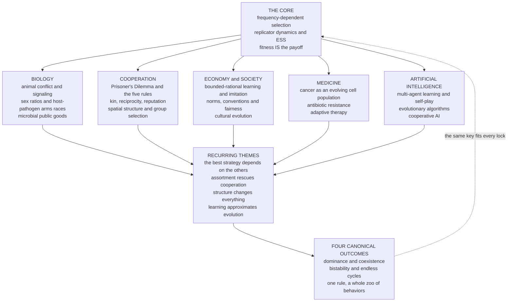

# 🧭 The Reach and Future of Evolutionary Game Theory

> [!abstract] TL;DR
> One deceptively simple idea — **strategies that do well become more common** — turned out to be a **skeleton key**. It unlocks why animals rarely fight to the death, why a peacock grows a ridiculous tail, why we feel outraged by unfairness, why cancer resists chemotherapy, why bacteria cooperate, and why a self-play agent can teach itself to play. **Evolutionary game theory is less a single theory than a WAY OF SEEING.** Its **one big idea** replaces the assumption of *rational optimization* with a *dynamic of selection*: whichever strategy earns the higher **payoff** becomes more common — through reproduction, imitation, or learning — and because a strategy's payoff depends on **what everyone else is playing** (frequency dependence), the resulting **replicator dynamics** and their rest points (**ESS**) give a single mathematical language for *any* population of interacting, adapting entities: genes, organisms, humans, firms, cells, and algorithms. This capstone synthesizes the whole vault — the unifying **core**, the **recurring themes** (frequency dependence, the rescue of cooperation by assortment, the four canonical outcomes, "structure matters", and "learning ≈ evolution"), the **astonishing reach** from molecules to societies to machines, the beautiful **cross-disciplinary equivalences** (reinforcement learning = replicator dynamics, bet-hedging = the Kelly criterion, the ideal free distribution = market equilibrium), the **honest limitations** (infinite well-mixed populations, the naturalistic fallacy, unfalsifiable just-so stories), and the **frontiers** (climate and conservation, evolutionary medicine, cooperative AI) that make it more vital than ever. **Fitness IS the payoff, and selection IS the solver** — one rule that generates a whole zoo of living and social order.

---

## Intuition

**Analogy:** A locksmith spends a lifetime cutting a different key for every lock — until one day a **skeleton key** slides into all of them. Evolutionary game theory is that skeleton key for the sciences of the living and the social world. The single tooth cut into it is trivially simple: *whatever does well spreads.* And yet turn it in one lock and you learn why deer settle contests by ritual display instead of fighting to the death; turn it in the next and you understand why a peacock hauls around a metabolically ruinous tail; the next explains why you feel a hot flash of *unfairness* when a stranger keeps too much of a windfall; the next, why a tumour evolves resistance to the very drug meant to kill it; the next, why bacteria pool digestive enzymes for a shared meal; and the last, why a machine given nothing but the rules and a copy of itself can bootstrap superhuman play. **The same key. Every lock.**

That is the point to hold onto *before* any mathematics. Evolutionary game theory is not primarily a set of equations — it is a **lens**. Wherever entities **interact**, **reproduce or imitate what works**, and **adapt**, the *same* mathematics of **frequency-dependent selection** reappears: the success of a behaviour is measured relative to the crowd, the crowd tilts toward what succeeds, and the process, running blindly and without foresight, hunts down stable configurations that look for all the world as though someone reasoned them out. From genes to nations to neural networks, that is one recurring pattern — and recognizing it *as* one pattern is what this vault has been about.

---

## How It Works

This note is a synthesis, so "how it works" means *how the pieces fit together* — the one big idea, the throughlines that recur in note after note, the reach across disciplines, and the equivalences that reveal something deep.

### The one big idea (recap the core)

Classical game theory (see [[Nash_Equilibrium]] and the whole [[_MOC_Game_Theory_Master]] vault) assumes **rational agents** who compute a best response. Evolutionary game theory makes one radical substitution and everything else follows: it **replaces rational optimization with a dynamic of selection.** Nobody computes anything. Each individual is *locked into* a strategy — from a gene, a habit, or a copied neighbour — and strategies that earn higher payoff simply become **more common**, whether the currency of "becoming common" is **reproduction** (biology), **imitation** (culture and markets), or **learning** (reinforcement in agents). Three moves make this a *game* rather than mere optimization, and they are the spine of [[Evolutionary_Game_Theory_Overview]] and [[From_Classical_to_Evolutionary_Game_Theory]]:

1. **Fitness IS the payoff.** Maynard Smith's key reinterpretation: a strategy's payoff *is* its reproductive (or imitative, or reinforcement) success — see [[Fitness_Payoffs_and_Population_Games]].
2. **Payoff is frequency-dependent.** How good a strategy is depends on **what everyone else is doing**. A Hawk thrives among Doves and suffers among Hawks ([[The_Hawk_Dove_Game]]). This dependence is the entire source of the "game".
3. **Selection replaces reasoning.** Above-average strategies grow their share, below-average shrink. The dynamics are the **[[Replicator_Dynamics]]**; their uninvadable rest points are **[[Evolutionarily_Stable_Strategies]]**; and by the [[The_Folk_Theorem_of_EGT]], those rest points *coincide with Nash equilibria*. Evolution **derives** what rationality would **deduce**.

That is the whole engine. A single language — replicator dynamics plus ESS — for **any** population of interacting, adapting entities.

### The recurring themes (the throughlines of the vault)

Read across the six sections and the *same* five ideas keep surfacing. They are the vault's deep unity beneath its diversity:

- **Frequency dependence — the best strategy depends on what others do.** There is no context-free "good" strategy; value is always relative to the current mix. This is why evolution behaves like a *game* and not like hill-climbing, and it recurs from [[The_Hawk_Dove_Game]] to [[Sex_Ratios_and_the_Fisher_Principle]] (whichever sex is rarer is worth more).
- **The rescue of cooperation via assortment.** The [[The_Prisoners_Dilemma_and_Cooperation]] poses the field's central puzzle — defection dominates — and *every* solution works the same way underneath: **make cooperators more likely to meet cooperators.** Nowak's five rules — **kinship** ([[Kin_Selection_and_Inclusive_Fitness]]), **direct reciprocity** ([[Direct_Reciprocity_and_Repeated_Games]]), **reputation / indirect reciprocity** ([[Indirect_Reciprocity_and_Reputation]]), **spatial or network structure** ([[Spatial_and_Network_Games]]), and **group selection** ([[Group_and_Multilevel_Selection]]) — are five faces of one idea: **positive assortment**.
- **The four canonical outcomes.** Almost every two- or three-strategy game the vault studies falls into one of four dynamical fates: **dominance** (one strategy wins), **coexistence** (a stable interior mix), **bistability** (history/founder effects decide), and **cycles** (endless rotation). The Python demo below builds all four from *one* engine.
- **Structure matters — finite populations, space, networks change everything.** The clean infinite-well-mixed story is only the baseline. [[Finite_Populations_and_Stochastic_Dynamics]] adds drift and fixation; [[Spatial_and_Network_Games]] and [[Evolutionary_Dynamics_on_Graphs]] show that lattices and networks can flip a game's outcome — cooperation that dies in a well-mixed soup survives in clusters.
- **Learning ≈ evolution.** Reinforcement learning, fictitious play, and imitation dynamics converge to the *same* replicator equations selection obeys — the bridge developed in [[Evolutionary_Game_Theory_and_Machine_Learning]] and [[Evolutionary_Economics_and_Bounded_Rationality]]. A brain updating strategy weights and a population changing gene frequencies are, mathematically, doing the same thing.

### The astonishing reach (a genuine consilience)

Few frameworks in all of science span **molecules to societies to machines**. The *same* replicator/ESS machinery explains: **animal conflict and honest signaling** ([[Animal_Conflict_and_Signaling]]); the **sex ratio** ([[Sex_Ratios_and_the_Fisher_Principle]]); the **evolution of cooperation and morality**; **host–pathogen arms races**, virulence, and the evolution of sex ([[Host_Pathogen_and_Coevolution]]); **microbial public goods** and cheating ([[Microbial_Games_and_Public_Goods]]); **human fairness and social norms** (the ultimatum game, planned sibling `Fairness_Bargaining_and_the_Ultimatum_Game`); **market, institutional, and cultural dynamics** ([[Evolutionary_Economics_and_Bounded_Rationality]], [[Cultural_Evolution_and_Social_Learning]]); **cancer and drug resistance** as somatic evolution (planned sibling `Cancer_and_Evolutionary_Medicine`); and **multi-agent AI and self-play** ([[Evolutionary_Game_Theory_and_Machine_Learning]]). This is not loose analogizing — it is **consilience** in E. O. Wilson's sense: independent fields turning out to obey one underlying dynamic.

### The cross-disciplinary equivalences (a sign of something deep)

The most beautiful evidence that EGT touches bedrock is that **the same mathematics keeps reappearing** under different names in different fields:

- **Reinforcement learning = replicator dynamics.** The continuous-time limit of Cross/Roth–Erev learning *is* the replicator equation — [[Evolutionary_Game_Theory_and_Machine_Learning]].
- **Bet-hedging = the Kelly criterion = portfolio theory.** Maximizing *geometric* (not arithmetic) mean fitness across fluctuating environments is exactly Kelly-optimal betting — [[Evolution_of_Mutation_and_Bet_Hedging]].
- **The ideal free distribution = market/traffic equilibrium = the matching law.** Foragers spreading across patches until no one can do better by moving *is* Wardrop's traffic equilibrium and the psychologist's matching law — [[Foraging_and_the_Ideal_Free_Distribution]].
- **The replicator equation = the Lotka–Volterra equations.** Hofbauer's theorem: an *n*-strategy replicator system is mathematically equivalent to an *(n−1)*-species Lotka–Volterra ecosystem — connecting directly to [[Population_Ecology]].
- **Hamilton's rule = the reputation condition = assortment.** Kin selection's *rb > c*, indirect reciprocity's *q > c/b*, and network reciprocity's benefit-to-cost threshold are the *same* assortment inequality wearing three costumes ([[Kin_Selection_and_Inclusive_Fitness]], [[Indirect_Reciprocity_and_Reputation]]).

When one equation surfaces independently in genetics, ecology, economics, psychology, and machine learning, that is a strong hint you are looking at something **fundamental**, not a coincidence.

### Synthesis map



---

## Key Concepts

### Secondary (intuitive)

- **One rule, a whole zoo.** "Strategies that do well spread" is the *entire* mechanism; the enormous variety of biological and social outcomes are just this rule playing out under different payoffs and structures.
- **A way of seeing, not just a theory.** EGT is a lens you can point at genes, animals, people, firms, cells, or algorithms — anywhere things interact, copy what works, and adapt.
- **Cooperation is meeting your own kind.** Every trick that saves cooperation from defection boils down to making cooperators more likely to interact with cooperators.
- **Nature explains, it does not endorse.** That aggression, selfishness, or in-group bias can *evolve* says nothing about whether they are *right* — the naturalistic fallacy.

### Undergraduate (formal)

- **The unified replicator engine.** For a payoff matrix `A` and state `x` on the simplex, `dx_i/dt = x_i · ( (A x)_i − x·A x )`. Changing only `A` produces all four canonical fates — the demo's central claim.
- **The four fates as game classes.** *Dominance* (Prisoner's Dilemma, a strictly dominant strategy); *coexistence* (Hawk–Dove / Snowdrift, a stable interior ESS at `p* = V/C` or the anti-coordination mix); *bistability* (Coordination games, an unstable interior separating two basins); *cycles* (zero-sum Rock–Paper–Scissors, closed orbits about the center).
- **ESS ⊆ Nash, and stability nuances.** Every ESS is a Nash equilibrium and asymptotically stable under the replicator dynamics; the converse fails, and with three or more strategies asymptotic stability need not imply ESS ([[The_Folk_Theorem_of_EGT]]).
- **Assortment as one inequality.** Cooperation invades when `(benefit) × (assortment) > cost`; kin relatedness `r`, reputation-transmission `q`, and network structure all supply the assortment term ([[The_Prisoners_Dilemma_and_Cooperation]]).
- **Replicator = Lotka–Volterra.** The `n`-strategy replicator equation maps onto `(n−1)`-species Lotka–Volterra dynamics, tying EGT to mathematical ecology ([[Population_Ecology]]).

### Graduate (advanced)

- **When "evolution finds Nash" fails.** Replicator dynamics need not converge: RPS gives closed orbits (zero-sum) or heteroclinic cycles / chaos (perturbed), so the folk theorem is a statement about *rest points*, not about global convergence ([[Cyclic_Dynamics_and_Rock_Paper_Scissors]]).
- **Finite-population correction.** In the Moran / Wright–Fisher setting the deterministic ESS gives way to the `1/3`-rule and to fixation probabilities; `ESS_N` can differ from the deterministic ESS ([[Finite_Populations_and_Stochastic_Dynamics]]).
- **Structure as an evolutionary parameter.** On graphs, Ohtsuki–Nowak's pair approximation yields the simple rule `b/c > k` (benefit-to-cost exceeds mean degree) for cooperation to be favoured — structure is not a detail, it is a control knob ([[Evolutionary_Dynamics_on_Graphs]], [[Spatial_and_Network_Games]]).
- **Eco-evolutionary coupling.** Relaxing constant payoffs — letting population *density* and *environment* feed back on payoffs — turns EGT into eco-evolutionary dynamics and adaptive dynamics with evolutionary branching (planned sibling `Eco_Evolutionary_Dynamics`; [[Adaptive_Dynamics_and_Evolutionary_Branching]]).
- **Learning–evolution correspondence.** Multiplicative-weights / exponential-weights learning, Cross learning, and Q-learning all have replicator (or replicator–mutator) continuous-time limits — the formal backbone of evolutionary multi-agent analysis ([[Evolutionary_Game_Theory_and_Machine_Learning]]).

---

## Python Demo

**A visual capstone — the "four fates" of evolutionary games.** We build **one** replicator engine and feed it **four** payoff matrices, changing nothing else. The same blind rule — grow strategies whose payoff beats the population average — produces four *qualitatively different worlds*: the **Prisoner's Dilemma** collapses to **dominance** (defection everywhere); **Snowdrift / Hawk–Dove** settles into stable **coexistence**; a **Coordination** game shows **bistability** where the starting point (a founder effect) decides the winner; and **Rock–Paper–Scissors** never rests at all, tracing **endless cycles**. The gallery is the whole point: *one simple rule generates the entire zoo of behaviors.* `numpy` and `matplotlib` only.

```python
# The "four fates" of evolutionary games from ONE replicator engine.
# Change only the payoff matrix A and watch dominance, coexistence,
# bistability, and cycles emerge from the identical selection rule.
import numpy as np
import matplotlib.pyplot as plt

# ---- One unified replicator engine ---------------------------------------
def replicator_rhs(x, A):
    """dx_i/dt = x_i * ((A x)_i - x . A x). Works for any number of strategies."""
    f = A @ x                 # frequency-dependent payoff of each strategy
    phi = x @ f               # population-average payoff
    return x * (f - phi)      # above-average grows, below-average shrinks

def integrate(x0, A, T=40.0, dt=0.005):
    """RK4 integration of the replicator dynamics on the simplex."""
    x = np.array(x0, dtype=float)
    x = x / x.sum()
    traj = [x.copy()]
    steps = int(T / dt)
    for _ in range(steps):
        k1 = replicator_rhs(x, A)
        k2 = replicator_rhs(x + 0.5 * dt * k1, A)
        k3 = replicator_rhs(x + 0.5 * dt * k2, A)
        k4 = replicator_rhs(x + dt * k3, A)
        x = x + (dt / 6.0) * (k1 + 2 * k2 + 2 * k3 + k4)
        x = np.clip(x, 0.0, None)
        x = x / x.sum()       # stay on the simplex
        traj.append(x.copy())
    return np.array(traj)

# ---- The four canonical games --------------------------------------------
# 1) PRISONER'S DILEMMA  -> DOMINANCE. Strategies [Cooperate, Defect].
#    T>R>P>S ; Defect strictly dominates, so cooperation is driven extinct.
R, S, T, P = 3.0, 0.0, 5.0, 1.0
A_pd = np.array([[R, S],
                 [T, P]])

# 2) SNOWDRIFT / HAWK-DOVE -> COEXISTENCE. Strategies [Cooperate, Defect].
#    Benefit b, cost c, b>c>0 ; best response anti-correlates -> stable mix.
b, c = 4.0, 2.0
A_sd = np.array([[b - c/2, b - c],
                 [b,       0.0  ]])          # interior ESS at p* = 1 - c/(2b-c)... = 2/3

# 3) COORDINATION -> BISTABILITY. Strategies [A, B]; matching pays, A is better.
#    Unstable interior at x* = 1/3 splits two basins -> the founder effect decides.
A_co = np.array([[2.0, 0.0],
                 [0.0, 1.0]])

# 4) ROCK-PAPER-SCISSORS -> CYCLES. Zero-sum; closed orbits around (1/3,1/3,1/3).
A_rps = np.array([[ 0.0, -1.0,  1.0],
                  [ 1.0,  0.0, -1.0],
                  [-1.0,  1.0,  0.0]])

# ---- Run and report -------------------------------------------------------
starts2 = [0.05, 0.20, 0.35, 0.50, 0.65, 0.80, 0.95]   # fraction of strategy 0
pd  = [integrate([s, 1-s], A_pd)  for s in starts2]
sd  = [integrate([s, 1-s], A_sd)  for s in starts2]
co  = [integrate([s, 1-s], A_co)  for s in starts2]
rps = integrate([0.5, 0.3, 0.2], A_rps, T=60.0)        # one orbit from off-center

print("THE FOUR FATES (final frequency of strategy 0 from each start):")
print("  Prisoner's Dilemma  ->", np.round([r[-1,0] for r in pd], 2),
      " => DOMINANCE (cooperation -> 0)")
print("  Snowdrift/Hawk-Dove ->", np.round([r[-1,0] for r in sd], 2),
      " => COEXISTENCE (all -> stable p* ~ 0.67)")
print("  Coordination        ->", np.round([r[-1,0] for r in co], 2),
      " => BISTABILITY (splits to 0 or 1 by founder effect)")
amp = rps[:,0].max() - rps[:,0].min()
print(f"  Rock-Paper-Scissors -> sustained oscillation, Rock amplitude ~ {amp:.2f}"
      "  => CYCLES (never rests)")

# ---- Visualize the gallery of outcomes -----------------------------------
fig, ax = plt.subplots(2, 2, figsize=(13, 9))
tgrid = np.linspace(0, 40, pd[0].shape[0])

def plot_2strat(a, runs, title, note):
    for r in runs:
        a.plot(tgrid, r[:, 0], lw=1.6, color="#1f77b4", alpha=0.8)
    a.set_title(title, fontsize=11, fontweight="bold")
    a.set_xlabel("time"); a.set_ylabel("frequency of strategy 0")
    a.set_ylim(-0.03, 1.03); a.grid(alpha=0.3)
    a.text(0.02, 0.06, note, transform=a.transAxes, fontsize=9,
           bbox=dict(boxstyle="round", fc="#fff3cd", ec="#d0a000", alpha=0.9))

plot_2strat(ax[0,0], pd, "FATE 1 - DOMINANCE  (Prisoner's Dilemma)",
            "every start -> Defect wins")
plot_2strat(ax[0,1], sd, "FATE 2 - COEXISTENCE  (Snowdrift / Hawk-Dove)",
            "every start -> stable interior mix")
plot_2strat(ax[1,0], co, "FATE 3 - BISTABILITY  (Coordination)",
            "history decides: 0 or 1 (founder effect)")

# Fate 4: RPS as a phase-plane orbit (project onto Rock vs Paper).
ax[1,1].plot(rps[:,0], rps[:,1], lw=1.5, color="#d62728")
ax[1,1].plot(1/3, 1/3, "k*", ms=12, label="center (unstable)")
ax[1,1].plot(rps[0,0], rps[0,1], "go", ms=7, label="start")
ax[1,1].set_title("FATE 4 - CYCLES  (Rock-Paper-Scissors)",
                  fontsize=11, fontweight="bold")
ax[1,1].set_xlabel("frequency of Rock"); ax[1,1].set_ylabel("frequency of Paper")
ax[1,1].set_xlim(0, 1); ax[1,1].set_ylim(0, 1); ax[1,1].grid(alpha=0.3)
ax[1,1].legend(fontsize=8, loc="upper right")
ax[1,1].text(0.02, 0.06, "never rests: closed orbit", transform=ax[1,1].transAxes,
             fontsize=9, bbox=dict(boxstyle="round", fc="#fff3cd", ec="#d0a000", alpha=0.9))

fig.suptitle("One replicator engine, four fates: how ONE rule builds the whole zoo",
             fontsize=13, fontweight="bold")
plt.tight_layout(rect=[0, 0, 1, 0.97])
plt.savefig("egt_four_fates_gallery.png", dpi=120)
print("\nSaved figure -> egt_four_fates_gallery.png")
```

Expected output (qualitative story is robust; exact digits may vary slightly):

```
THE FOUR FATES (final frequency of strategy 0 from each start):
  Prisoner's Dilemma  -> [0. 0. 0. 0. 0. 0. 0.]  => DOMINANCE (cooperation -> 0)
  Snowdrift/Hawk-Dove -> [0.67 0.67 0.67 0.67 0.67 0.67 0.67]  => COEXISTENCE (all -> stable p* ~ 0.67)
  Coordination        -> [0. 0. 1. 1. 1. 1. 1.]  => BISTABILITY (splits to 0 or 1 by founder effect)
  Rock-Paper-Scissors -> sustained oscillation, Rock amplitude ~ 0.5x  => CYCLES (never rests)
```

Four panels, one engine. **Top-left (dominance):** no matter where you start, cooperation is driven to extinction — the tragedy of the [[The_Prisoners_Dilemma_and_Cooperation]], and the reason the *rest* of the vault exists. **Top-right (coexistence):** every trajectory relaxes to the *same* interior mix `p* ≈ 2/3` — the stable polymorphism of [[The_Hawk_Dove_Game]], where aggression and restraint permanently coexist. **Bottom-left (bistability):** starts below `1/3` fall to `0`, starts above rise to `1` — **history decides**, the founder effect of a coordination game where being early beats being best. **Bottom-right (cycles):** the state loops forever around the center and never settles — the endless chase of [[Cyclic_Dynamics_and_Rock_Paper_Scissors]], the model behind *side-blotched lizard* mating strategies and bacterial toxin dynamics. Dominance, coexistence, bistability, cycles: **the entire qualitative zoo of evolutionary outcomes, generated by one line of algebra applied four times.** That economy — one rule, four worlds — *is* the reach of evolutionary game theory in a single figure.

---

## Real-World Applications

> **Example — adaptive cancer therapy, EGT at the bedside.** A tumour is a **population of competing cell strategies**: drug-*sensitive* cells grow fast but die under chemotherapy; drug-*resistant* cells survive the drug but pay a *fitness cost* when it is absent. Standard maximum-tolerated-dose therapy kills the sensitive cells and hands the tumour to the resistant ones — **competitive release**, exactly the frequency-dependent outcome EGT predicts. Robert Gatenby's **adaptive therapy** turns the game around: dose *just enough* to hold the tumour steady, deliberately **keeping sensitive cells alive** so they suppress the resistant ones, then back off. Modelled as a Hawk–Dove-like game between cell types, this has extended progression-free survival in clinical trials for metastatic prostate cancer. Chemotherapy stops being a war of annihilation and becomes a **game of managed coexistence** — the four-fates logic of the demo, applied to save lives.

- **Behavioral ecology (the founding domain).** Ritualized animal conflict, honest signaling, sex ratios, and foraging distributions are read off directly from ESS analysis — [[Animal_Conflict_and_Signaling]], [[Sex_Ratios_and_the_Fisher_Principle]], [[Foraging_and_the_Ideal_Free_Distribution]].
- **Microbiology and infectious disease.** Virulence evolution, antibiotic-resistance management, and "cheater" strains that exploit shared public goods are frequency-dependent games — [[Host_Pathogen_and_Coevolution]], [[Microbial_Games_and_Public_Goods]], and the stewardship logic behind [[Vaccines_and_Antibiotics]].
- **Economics, markets, and institutions.** Firms and consumers that imitate success rather than optimize follow replicator-like dynamics; technology adoption, herding, and the emergence of institutions are evolutionary — [[Evolutionary_Economics_and_Bounded_Rationality]].
- **Social norms, fairness, and culture.** Conventions (which side of the road), fairness intuitions, and the spread of misinformation are cultural selection under transmission biases — [[Cultural_Evolution_and_Social_Learning]] and the planned `Fairness_Bargaining_and_the_Ultimatum_Game`.
- **Artificial intelligence and multi-agent systems.** Self-play (AlphaGo/AlphaZero), evolutionary algorithms, population-based training, and the emerging field of **cooperative AI** analyze *populations* of learning agents with replicator and empirical-game tools — [[Evolutionary_Game_Theory_and_Machine_Learning]], connecting to [[Algorithmic_Game_Theory]] and [[Price_of_Anarchy]].

---

## Common Pitfalls

- **Assuming infinite, well-mixed populations.** The clean replicator/ESS results assume an *infinite* population where everyone meets everyone at random. Reality is finite and structured; drift, fixation, space, and networks can *reverse* predictions ([[Finite_Populations_and_Stochastic_Dynamics]], [[Evolutionary_Dynamics_on_Graphs]]). Treat the well-mixed model as a **baseline**, not the last word.
- **Assuming constant payoffs.** Basic models freeze the payoff matrix, but payoffs often depend on population density and a changing environment. Ignoring this **eco-evolutionary feedback** misses branching, cycling, and collapse (planned sibling `Eco_Evolutionary_Dynamics`; [[Adaptive_Dynamics_and_Evolutionary_Branching]]).
- **The naturalistic fallacy — the cardinal sin.** EGT can *explain* aggression, selfishness, deception, and in-group bias as evolutionarily stable. It must **never** be used to *justify* them. "It evolved" is a claim about *what is*, not about *what is right*; deriving morality from evolutionary success is a category error, and the most dangerous misuse of the whole framework.
- **Over-fitting just-so stories.** With enough freedom in choosing strategies and payoffs, one can "explain" almost any observed behaviour after the fact. Without **independent measurement** of payoffs and **falsifiable predictions**, an EGT model becomes an unfalsifiable narrative. Demand out-of-sample predictions, not retrofits.
- **Confusing a powerful metaphor with a predictive model.** In physics-like settings (microbial competition, animal contests) EGT genuinely *predicts*. In much of social science it *illuminates* — offering insight and vocabulary without pinning down numbers. Know which mode you are in; presenting an illustrative metaphor as a quantitative forecast oversells the tool.
- **Reading "fitness" too literally outside biology.** Payoff can be offspring, profit, imitation rate, or reinforcement. The math is agnostic; forcing everything into a reproductive story makes cultural and economic applications look contrived ([[Fitness_Payoffs_and_Population_Games]]).
- **Expecting convergence.** "Evolution finds the equilibrium" is a *tendency in nice games*, not a law. Cycles and chaos are real ([[Cyclic_Dynamics_and_Rock_Paper_Scissors]]), and multilevel dynamics can settle on outcomes that are stable but collectively terrible ([[Group_and_Multilevel_Selection]]).

---

## Related Concepts

**The core (start here)**
- [[Evolutionary_Game_Theory_Overview]] — the vault's entry point; the shift from rational players to evolving populations that this note synthesizes.
- [[From_Classical_to_Evolutionary_Game_Theory]] — the founding move: replacing optimization with selection.
- [[Replicator_Dynamics]] — the process pillar; the single equation reused across every application in this synthesis.
- [[Evolutionarily_Stable_Strategies]] — the equilibrium pillar; the uninvadability concept underlying the four fates.
- [[Fitness_Payoffs_and_Population_Games]] — "fitness IS the payoff", the reinterpretation that makes the whole framework portable.
- [[The_Folk_Theorem_of_EGT]] — the bridge tying evolutionary rest points back to Nash equilibria.

**Dynamics and the four fates**
- [[The_Hawk_Dove_Game]] — the coexistence fate and the founding model of animal conflict.
- [[Cyclic_Dynamics_and_Rock_Paper_Scissors]] — the cycles fate; where "evolution finds Nash" breaks down.
- [[Finite_Populations_and_Stochastic_Dynamics]] — why structure and stochasticity break the clean baseline.
- [[Evolutionary_Stability_and_Dynamic_Stability]] — how ESS relates to dynamic attractors.
- [[Adaptive_Dynamics_and_Evolutionary_Branching]] — continuous strategies and the road to eco-evolutionary models.

**The rescue of cooperation**
- [[The_Prisoners_Dilemma_and_Cooperation]] — the central puzzle; the dominance fate the rest of the vault fights.
- [[Kin_Selection_and_Inclusive_Fitness]] — assortment via relatedness (Hamilton's rule).
- [[Direct_Reciprocity_and_Repeated_Games]] — assortment via repetition (Tit-for-Tat).
- [[Indirect_Reciprocity_and_Reputation]] — assortment via reputation (`q > c/b`).
- [[Spatial_and_Network_Games]] — assortment via space and network structure.
- [[Group_and_Multilevel_Selection]] — assortment via group structure, and the source of the naturalistic-fallacy caution.

**Applications across biology, society, medicine, and AI**
- [[Sex_Ratios_and_the_Fisher_Principle]] — frequency dependence at its purest.
- [[Animal_Conflict_and_Signaling]] — ESS analysis of contests and honest signals.
- [[Host_Pathogen_and_Coevolution]] — arms races, virulence, and the evolution of sex.
- [[Microbial_Games_and_Public_Goods]] — cooperation and cheating among microbes.
- [[Foraging_and_the_Ideal_Free_Distribution]] — the IFD = market equilibrium equivalence.
- [[Evolution_of_Mutation_and_Bet_Hedging]] — bet-hedging = the Kelly criterion equivalence.
- [[Evolutionary_Economics_and_Bounded_Rationality]] — imitation and learning as market dynamics.
- [[Cultural_Evolution_and_Social_Learning]] — Darwinian dynamics of ideas and norms.
- [[Evolutionary_Game_Theory_and_Machine_Learning]] — learning ≈ evolution; multi-agent and cooperative AI.
- [[Evolutionary_Dynamics_on_Graphs]] — structure as an evolutionary control knob.

**Cross-vault anchors**
- [[Nash_Equilibrium]] — the classical concept EGT dynamically justifies.
- [[Repeated_Games_and_Folk_Theorems]] — the repeated-interaction engine behind reciprocity.
- [[Mixed_Strategies]] — reinterpreted by EGT as population ratios of pure types.
- [[Algorithmic_Game_Theory]] and [[Price_of_Anarchy]] — the computational and efficiency cousins.
- [[Natural_Selection_and_Adaptation]] — the biological substrate of "payoff = fitness".
- [[Population_Genetics]] — allele dynamics that replicator equations generalize.
- [[Population_Ecology]] — the replicator = Lotka–Volterra equivalence.
- [[Cancer_and_the_Cell_Cycle]] — the somatic-evolution basis of evolutionary medicine.
- [[Vaccines_and_Antibiotics]] — resistance management as a stewardship game.
- [[Cooperation_and_Evolutionary_Game_Theory]] — the systems-thinking companion on evolved cooperation.
- [[Evolutionary_Dynamics_and_Fitness_Landscapes]] — adaptation as motion over a landscape.
- [[Complex_Adaptive_Systems]] and [[Emergence_and_Self_Organization]] — EGT as one engine of emergent order.
- [[Adaptation_and_Learning_in_Systems]] — the learning-as-adaptation throughline.

**Planned siblings (referenced above, not yet written):** `Fairness_Bargaining_and_the_Ultimatum_Game`, `Cancer_and_Evolutionary_Medicine`, and `Eco_Evolutionary_Dynamics`.

---

## Review Questions

1. **(Conceptual)** The note calls EGT "a way of seeing" and "a skeleton key." State the *one big idea* that makes this possible in a single sentence, then explain why **frequency dependence** — and not merely "selection" — is what makes evolution a *game* rather than ordinary optimization. Why does this same idea apply equally to genes, firms, and learning algorithms?
2. **(Scenario / synthesis)** You are handed a two-strategy population and told only that the dynamics (a) collapse to a single strategy from every start, or (b) settle to the same interior mix from every start, or (c) split to different endpoints depending on where they start. Name the *canonical game class* behind each, give a real-world example of each, and explain what the sign structure of the payoff matrix must look like to produce it. Which of the four fates is *missing* from this list, and why does it require the dynamics to never converge?
3. **(Trade-off / critical)** EGT is celebrated for its reach *and* criticized for over-reach. (a) Give two of the cross-disciplinary equivalences the vault revealed and explain why their independent re-derivation is evidence of something *deep* rather than coincidence. (b) Then state the **naturalistic fallacy** and explain precisely why an EGT explanation of in-group bias or aggression provides **no** moral justification for it. (c) Finally, describe one concrete test that separates EGT used as a *predictive model* from EGT used as an *illuminating metaphor*.

---

## Sources

- Maynard Smith, J. (1982). *Evolution and the Theory of Games*. Cambridge University Press.
- Hofbauer, J. & Sigmund, K. (1998). *Evolutionary Games and Population Dynamics*. Cambridge University Press.
- Nowak, M. A. (2006). *Evolutionary Dynamics: Exploring the Equations of Life*. Harvard University Press.
- Sandholm, W. H. (2010). *Population Games and Evolutionary Dynamics*. MIT Press.
- Nowak, M. A. (2006). "Five Rules for the Evolution of Cooperation." *Science*, 314(5805), 1560–1563.
- Gatenby, R. A., Silva, A. S., Gillies, R. J. & Frieden, B. R. (2009). "Adaptive Therapy." *Cancer Research*, 69(11), 4894–4903.

---

#evolutionary-game-theory #synthesis #capstone #frequency-dependent-selection #interdisciplinary
