# 📈 Equity Markets

> [!abstract] TL;DR
> Equity markets are where companies raise capital by selling ownership stakes and where investors trade those stakes. The **IPO** moves a company from private to public; the **secondary market** (NYSE, NASDAQ) provides continuous liquidity. Stock indices (S&P 500, MSCI World) aggregate market performance. **Market capitalization** ($\text{Price} \times \text{Shares outstanding}$) is the scorecard. Understanding equity markets is the foundation for equity research and valuation.

## Intuition — analogy FIRST

Imagine starting a pizza restaurant with 100 equal slices of ownership.

You and a partner own all 100 slices. As you expand, you need more capital — you sell 30 slices to the public in an **IPO** (Initial Public Offering). Now 30 people own a piece of your pizza empire, and the money from selling those slices funds your expansion.

After the IPO, those 30 people can sell their slices to each other on a **stock exchange** — like eBay for pizza ownership. The price of each slice rises and falls based on how well the restaurant does and what buyers and sellers think it's worth. Your "pizza empire" is now valued at: slice price × 100 total slices = **market capitalization**.

---

## How It Works

```mermaid
graph LR
    subgraph Private["Private Phase"]
        Founders["Founders &\nEarly Investors"] --> VC["Venture Capital\nRounds (Series A/B/C)"]
        VC --> PE["Private Equity /\nGrowth Equity"]
    end

    subgraph IPO["IPO Process"]
        PE --> S1["Select\nUnderwriters"]
        S1 --> S2["SEC Registration\n(S-1 Filing)"]
        S2 --> S3["Roadshow &\nBook-Building"]
        S3 --> S4["Price &\nAllocate Shares"]
        S4 --> S5["First Day\nof Trading"]
    end

    subgraph Secondary["Secondary Market"]
        S5 --> Exchange["Listed Exchange\n(NYSE / NASDAQ)"]
        Exchange --> Liquidity["Continuous Trading\nPrice Discovery"]
    end

    style Private fill:#4a9eff,color:#fff
    style IPO fill:#ff6b6b,color:#fff
    style Secondary fill:#51cf66,color:#fff
```

## Key Concepts / Details

### IPO Process

The IPO transforms a private company into a publicly traded one in six steps:

1. **Select underwriters** — Investment banks (lead left book-runner and co-managers) who will structure, market, and distribute the shares. The lead bank earns ~7% gross spread (fee).
2. **SEC registration** — File Form S-1 (registration statement) disclosing financials, business risks, and use of proceeds. The SEC reviews and comments.
3. **Roadshow** — Management presents to 50–100 institutional investors over 2 weeks, gauging demand (book-building).
4. **Price and allocate** — Final IPO price set the night before based on order book. Shares allocated primarily to institutional investors.
5. **First day** — Shares open for trading on the exchange. A "pop" (price above IPO price) is common but represents money left on the table by the company.
6. **Lock-up expiry** — Insiders cannot sell for 90–180 days; significant supply can hit the market after lock-up expiry.

**IPO Alternatives:**
- **Direct listing** (Spotify 2018, Coinbase 2021): no new shares issued, no underwriter, existing shareholders sell directly. No lock-up, no underwriting fee.
- **SPAC** (Special Purpose Acquisition Company): blank-check shell merges with a private company, giving it public status without a traditional IPO.

### Stock Exchanges and Trading Venues

| Venue | Type | Characteristics | Examples |
|-------|------|-----------------|---------|
| **NYSE** | Auction market | Designated market makers, floor trading, large-caps | Apple, JPMorgan, ExxonMobil |
| **NASDAQ** | Dealer market | Electronic, multiple market makers, tech-heavy | Amazon, Google, Microsoft |
| **LSE** | Exchange | London, many international listings | Shell, HSBC, Unilever |
| **ECNs** | Electronic | Automatic matching, low cost, no human intermediary | ARCA, BATS, IEX |
| **Dark pools** | Private ATS | Large-block trades, minimal market impact | Goldman's Sigma X, Credit Suisse Crossfinder |

### Stock Indices

Indices measure the performance of a basket of stocks:

| Index | Coverage | Weighting | Use |
|-------|----------|-----------|-----|
| **S&P 500** | 500 largest US companies | Market-cap weighted | US large-cap benchmark |
| **Dow Jones Industrial Average** | 30 blue-chip US companies | Price weighted | Historical significance |
| **NASDAQ Composite** | All NASDAQ-listed stocks | Market-cap weighted | Technology benchmark |
| **Russell 2000** | 2000 smallest US public companies | Market-cap weighted | US small-cap benchmark |
| **MSCI World** | ~1,500 companies, 23 developed countries | Market-cap weighted | Global developed market benchmark |
| **MSCI EM** | ~1,400 companies, 24 emerging markets | Market-cap weighted | Emerging market benchmark |

**Market-cap weighting**: each company's weight = its market cap / total index market cap. Apple alone is ~7% of the S&P 500 (2024).

### Market Capitalization

$$\text{Market Cap} = \text{Price per share} \times \text{Shares outstanding}$$

**Size classifications (approximate US 2024 thresholds):**

| Category | Market Cap | Examples |
|----------|-----------|---------|
| **Mega cap** | > $200B | Apple ($3T), Microsoft ($2.8T) |
| **Large cap** | $10B – $200B | Starbucks, Ford |
| **Mid cap** | $2B – $10B | Hasbro, Etsy |
| **Small cap** | $300M – $2B | Many regional companies |
| **Micro cap** | < $300M | Small, often illiquid companies |

### Equity Returns: Components

Total return on equities comes from two sources:

$$\text{Total Return} = \text{Capital Gain} + \text{Dividend Yield}$$

$$= \frac{P_1 - P_0}{P_0} + \frac{D_1}{P_0}$$

- **S&P 500 long-run average**: ~10% nominal, ~7% real (inflation-adjusted)
- **Equity risk premium**: return above risk-free rate (T-bills), historically ~4–6% in the US

---

## Real-World Notes

- **Amazon IPO (1997)**: raised $54M at $18/share (split-adjusted ~$1.50). At $180/share in 2024, that's a 120x return in 27 years — illustrating how secondary market compounding creates wealth.
- **Saudi Aramco IPO (2019)**: the world's largest IPO at $25.6B — raised by the Saudi government selling 1.5% of the national oil company, achieving a $1.7T valuation.
- **WeWork (2019)**: filed S-1 for IPO, withdrew after scrutiny revealed governance problems and a $47B valuation cut to ~$8B — a case study in the discipline the IPO process imposes on management.
- **SPAC bubble (2020–2021)**: over 600 SPACs raised capital; most subsequently traded below NAV, illustrating that SPACs transferred IPO pricing risk from sophisticated banks to retail investors.

---

## Common Pitfalls

- Confusing **shares outstanding** (total issued) with **float** (shares available for public trading). Float excludes locked-up insider shares.
- Thinking IPO pops are good for the company: a 30% first-day pop means the company raised 30% less than it could have — Morgan Stanley earned that surplus for its clients, not the company.
- Using the DJIA as a proxy for the US market: it's only 30 stocks, price-weighted, and dominated by expensive stocks regardless of company size.
- Assuming higher stock price = better company: stock price per share is arbitrary — it reflects splits and buybacks. Market cap is the meaningful size measure.

---

## Related Concepts

- [[_MOC_Financial_Markets|↑ Section MOC]]
- [[Market_Structure_and_Participants]] — Broader market architecture and participant roles
- [[Market_Microstructure]] — Order execution mechanics, bid-ask spreads
- [[Fundamental_Analysis]] — Evaluating whether a stock is worth buying
- [[Equity_Research]] — How analysts build investment theses
- [[DCF_Analysis]] — Intrinsic value estimation for equities

## Review Questions

1. A company files for an IPO with Goldman Sachs as lead underwriter. Walk through the six stages of the IPO process and explain at which stage the company actually receives cash.
2. Apple has 15.4 billion shares outstanding and trades at $195. Calculate Apple's market cap. If the S&P 500's total market cap is $42 trillion, what is Apple's index weight?
3. What is the difference between a direct listing and a traditional IPO? When would a company choose a direct listing over an IPO, and what does it give up?

## Sources

- Ibbotson, Roger, and Ritter, Jay, *The Market's Problem With the Pricing of Initial Public Offerings* (JFE)
- CFA Institute, *CFA Program Curriculum*, Level 1 — Equity Investments
- Damodaran, Aswath, *Investment Valuation*, Ch. 6 — Estimating Cash Flows

#finance #financial-markets #equity-markets #IPO
