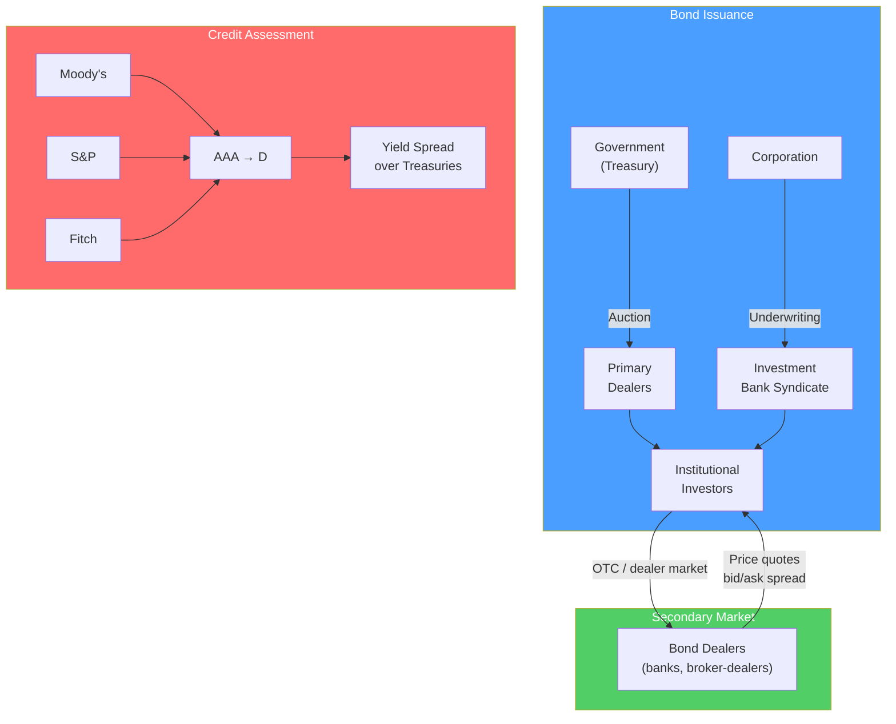

# 🏦 Fixed Income Markets

> [!abstract] TL;DR
> Fixed income markets are where debt instruments are issued and traded. A bond is a loan — the issuer (government or company) borrows money and promises periodic coupon payments plus repayment of principal at maturity. The critical insight: **bond prices and yields move inversely** — when interest rates rise, existing bond prices fall. The global bond market (~$130T) is larger than the equity market ($100T). Key formula: $P = \sum_{t=1}^{n} \frac{C}{(1+y)^t} + \frac{F}{(1+y)^n}$.

## Intuition — analogy FIRST

Imagine lending $1,000 to a friend for 10 years at 5% interest ($50/year). That's a bond.

Now imagine interest rates rise to 8%. A new friend can borrow $1,000 and offer you $80/year. Your original loan (still at $50/year) is now less attractive. If you want to sell your IOU to someone else, you'd have to discount it — sell it for less than $1,000 — so that the buyer's effective yield matches the new 8% market rate. **This is why bond prices fall when interest rates rise**.

Conversely, if rates drop to 3%, your $50/year coupon is now above market, and your bond is worth more than $1,000 — you could sell it at a premium.

---

## How It Works



## Key Concepts / Details

### Bond Mechanics

A bond has five key characteristics:
1. **Face value (par)**: typically $1,000 — amount repaid at maturity
2. **Coupon rate**: annual interest rate × face value = coupon payment
3. **Maturity**: when principal is repaid (1 month to 30+ years)
4. **Price**: what the market currently pays (par, discount, or premium)
5. **Yield**: the return an investor earns if they hold to maturity

### Bond Pricing Formula

$$P = \sum_{t=1}^{n} \frac{C}{(1+y)^t} + \frac{F}{(1+y)^n}$$

Where:
- $P$ = bond price
- $C$ = periodic coupon payment
- $y$ = yield per period
- $n$ = number of periods
- $F$ = face value

**Worked example**: 5-year bond, $1,000 face, 6% annual coupon, current yield 8%:

$$P = \frac{60}{1.08} + \frac{60}{1.08^2} + \frac{60}{1.08^3} + \frac{60}{1.08^4} + \frac{1060}{1.08^5}$$

$$P = 55.56 + 51.44 + 47.63 + 44.10 + 720.87 = \$920.15$$

The bond trades at a **discount** because the 6% coupon is below the 8% market yield.

### Yield Measures

| Measure | Definition | Use |
|---------|-----------|-----|
| **Current yield** | Annual coupon / Price | Quick approximation |
| **Yield to Maturity (YTM)** | IRR of all cash flows at current price | Standard measure |
| **Yield to Call (YTC)** | YTM assuming called at first call date | For callable bonds |
| **Yield to Worst (YTW)** | Minimum of YTM and all YTCs | Conservative measure |
| **Spread over Treasuries** | YTM – comparable Treasury yield | Credit risk premium |

### Duration and Convexity

**Duration** measures a bond's price sensitivity to interest rate changes:

$$\text{Modified Duration} = \frac{\text{Macaulay Duration}}{1 + y}$$

$$\Delta P \approx -\text{Duration} \times \Delta y \times P$$

**Example**: Duration = 7, yield rises 0.5%:
$$\Delta P \approx -7 \times 0.005 \times \$1000 = -\$35$$

**Rules of thumb:**
- Higher duration → more sensitive to rate changes
- Zero-coupon bonds have duration = maturity
- Shorter maturity and higher coupon → lower duration

**Convexity** captures the curvature (duration is linear approximation):
- Positive convexity: price rises more than duration predicts when yields fall; falls less when yields rise — favorable property
- Mortgage bonds have negative convexity (prepayment risk)

### Yield Curve

The yield curve plots YTM against maturity for comparable bonds (usually Treasuries):

```
Yield
 5% |                          ___---
 4% |              ___---
 3% |    ___---
 2% |---
    +----+----+----+----+-----> Maturity
    3m  1y   5y  10y  30y
    (Normal/upward-sloping curve)
```

| Shape | Implication |
|-------|------------|
| **Normal (upward)** | Investors demand premium for longer maturities; economy healthy |
| **Flat** | Rates expected to stay constant; often transition state |
| **Inverted** | Short rates > long rates; historically precedes recession (2022–2023 inversion) |
| **Humped** | Rates expected to rise then fall; rate hike cycle peak |

### Credit Ratings and Spreads

| Rating (S&P) | Rating (Moody's) | Category | Spread over Treasury (typical) |
|-------------|------------------|----------|-------------------------------|
| AAA | Aaa | Investment grade | +20–50 bps |
| AA | Aa | Investment grade | +40–80 bps |
| A | A | Investment grade | +80–120 bps |
| BBB | Baa | Investment grade (lowest) | +120–200 bps |
| BB | Ba | High yield / junk | +200–400 bps |
| B | B | High yield | +400–600 bps |
| CCC and below | Caa and below | Distressed / near default | +600–2000+ bps |

Investment grade (BBB-/Baa3 and above) vs high yield (below) is the most important credit boundary — many institutional investors cannot hold below IG.

### Bond Market Segments

| Segment | Issuers | Characteristics |
|---------|---------|----------------|
| **US Treasuries** | US government | Benchmark, risk-free, $25T market |
| **Agency / GSE** | Fannie Mae, Freddie Mac | Implicit government backing |
| **Municipal bonds** | States, cities | Tax-exempt income (US) |
| **Investment-grade corporate** | Large corporations | Credit risk above Treasuries |
| **High-yield corporate** | Leveraged companies | Higher coupon, default risk |
| **Emerging market debt** | EM governments / corporates | Currency + credit risk |
| **Securitized** | ABS, MBS, CDO | Asset-backed cashflows |

---

## Real-World Notes

- **The 2022 rate shock**: The Fed raised rates from 0.25% to 5.25% in 14 months. The Bloomberg US Aggregate Bond Index fell 13% — the worst year for bonds since the 1920s. A 60/40 portfolio lost money on both components simultaneously.
- **Silicon Valley Bank collapse (2023)**: SVB had $21B in long-duration Treasuries and MBS. When rates rose, unrealized losses grew to $17B. A bank run forced them to crystallize losses, causing the second-largest US bank failure.
- **Argentina's century bond (2017)**: Argentina issued a 100-year bond at 7.9% yield. Within 2 years, it traded at 40 cents on the dollar — an object lesson in emerging market credit risk.
- **Investment grade to "fallen angel"**: When Ford lost its IG rating in 2020, it became a "fallen angel" — forced selling by IG-mandated investors briefly pushed spreads to 1000+ bps.

---

## Common Pitfalls

- Confusing coupon rate and yield: a 6% coupon bond can have a yield of 4% or 8% depending on price.
- Ignoring duration risk: "safe" long-duration government bonds had massive losses in 2022.
- Treating yield as return: YTM assumes coupons are reinvested at the same yield — rarely happens.
- Comparing yields without adjusting for day count conventions, call features, or credit quality.

---

## Related Concepts

- [[_MOC_Financial_Markets|↑ Section MOC]]
- [[Money_Markets]] — Short-term debt instruments (T-bills, repo, commercial paper)
- [[Fixed_Income_Analysis]] — Credit analysis, duration immunization, relative value
- [[Time_Value_of_Money]] — The discounting math underlying bond pricing
- [[Risk_and_Return_Fundamentals]] — Interest rate risk and credit risk framework

## Review Questions

1. A 10-year $1,000 bond pays a 5% annual coupon. If the current market yield is 3%, is the bond priced at par, discount, or premium? Calculate the price using the bond pricing formula.
2. A bond has a duration of 8 years. If yields rise by 100 basis points (1%), what is the approximate percentage change in the bond's price? What does convexity tell us about the precision of this estimate?
3. Explain the economic intuition for why the yield curve inverts before recessions. What does it signal about market expectations for short-term interest rates?

## Sources

- Fabozzi, Frank J., *Fixed Income Mathematics*, 4th edition
- CFA Institute, *CFA Program Curriculum* Level 1 — Fixed Income
- Tuckman, Bruce, and Serrat, Angel, *Fixed Income Securities*, 3rd edition

#finance #financial-markets #fixed-income #bonds #duration
