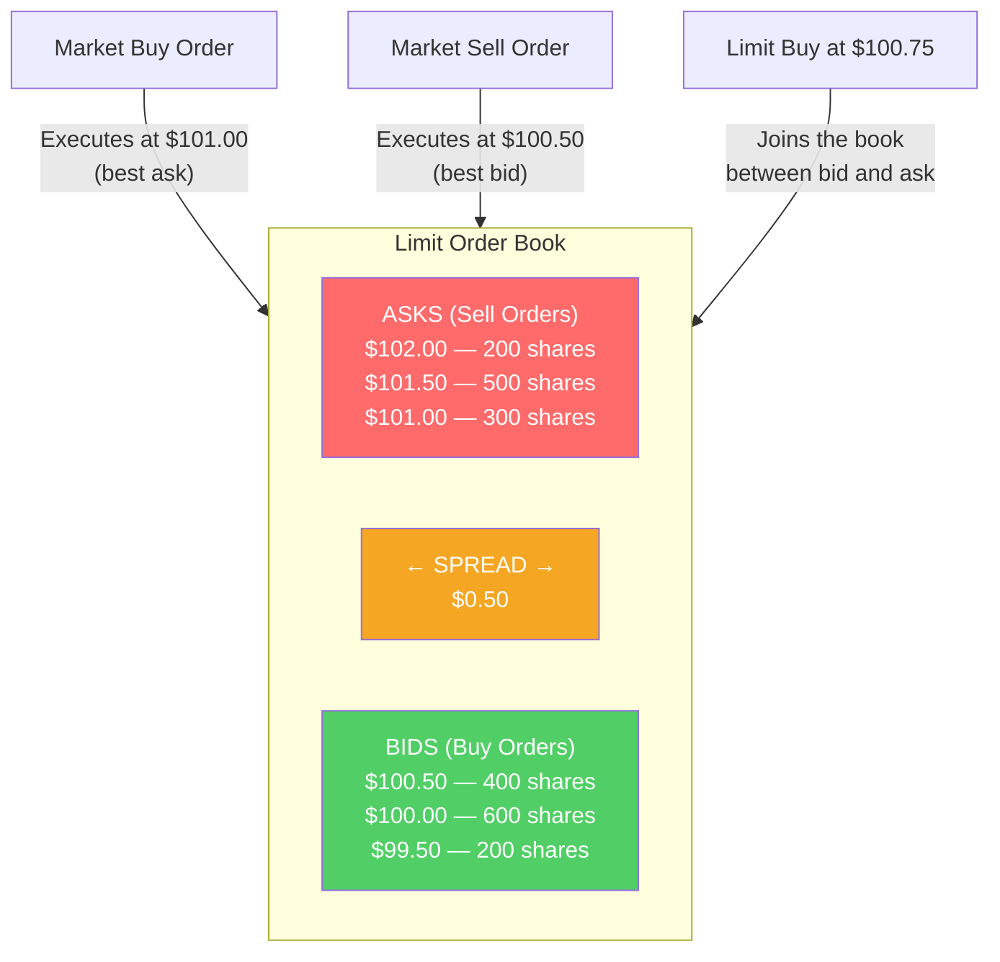

# ⚙️ Market Microstructure

> [!abstract] TL;DR
> Market microstructure studies how trading actually works — order types, the bid-ask spread, price discovery, and liquidity. The **bid-ask spread** is the cost of immediacy: the market maker earns the spread in exchange for always being available to trade. The **limit order book** is the mechanism that matches buyers and sellers. Understanding microstructure is essential for execution quality, trading cost analysis, and understanding how prices form.

## Intuition — analogy FIRST

Imagine a car dealership (market maker) that always buys and sells used cars.

They'll **buy your car** at $18,000 (the "bid") and **sell you a car** at $21,000 (the "ask"). The $3,000 spread is their profit for the service of always being available. You get immediacy (you can always buy or sell); they take on inventory risk and earn the spread.

In a **limit order book**, buyers and sellers post their own prices (like classified ads). If a buyer offers $19,500 and a seller asks $19,500 — trade. The book is ordered by price priority, then time priority. The spread narrows as more participants post competitive prices.

---

## How It Works

## Key Concepts / Details

### Order Types

| Order Type | Description | Execution | Risk |
|-----------|-------------|-----------|------|
| **Market order** | Buy/sell immediately at best available price | Certain | Price uncertainty |
| **Limit order** | Buy/sell at specified price or better | Uncertain | May not execute |
| **Stop order** | Market order triggered when price reaches stop level | Certain when triggered | Can execute far from stop (gap) |
| **Stop-limit order** | Limit order triggered when price reaches stop level | Uncertain | May not execute |
| **Iceberg order** | Large order with only partial quantity shown | Variable | Less market impact |
| **All-or-none (AON)** | Execute entire order or cancel | Certain size | May not execute |
| **Fill-or-kill (FOK)** | Execute immediately in full or cancel | Immediate | Cancels if not fully filled |
| **Good-till-cancelled (GTC)** | Stays in book until filled or cancelled | Whenever price reached | Forgotten orders can trigger |

### The Bid-Ask Spread

The spread is the cost of immediacy:

$$\text{Bid-Ask Spread} = \text{Ask Price} - \text{Bid Price}$$

$$\text{Percentage Spread} = \frac{\text{Ask} - \text{Bid}}{\text{Midpoint}} \times 100$$

**Determinants of the spread:**

1. **Inventory risk**: market makers hold unwanted positions — wider spread compensates
2. **Order processing costs**: exchange fees, technology costs
3. **Adverse selection**: risk of trading against informed traders (insiders, HFT with better information)
4. **Volatility**: higher volatility → more inventory risk → wider spread
5. **Liquidity / volume**: more participants → competitive market making → tighter spreads

**Typical spreads:**
- Apple (AAPL): ~$0.01 = 0.005% — extremely liquid
- Mid-cap stock: ~$0.05 = 0.05%
- Illiquid small-cap: $0.50+ = 1%+ 
- Corporate bonds (OTC): 0.25–1% embedded in dealer quotes

### Price Discovery Mechanisms

**Continuous trading**: most modern equity exchanges match orders continuously throughout the day via limit order books.

**Call auctions**: used at open and close of trading. All orders accumulated, then matched at a single clearing price that maximizes traded volume. The NYSE closing auction (~$10B/day) sets the benchmark prices used by index funds and ETFs.

**Opening auction**: particularly important — overnight news, earnings releases, and order imbalances are resolved via auction rather than creating chaotic opening ticks.

### Market Impact and Execution

For large orders, the act of trading moves the price:

$$\text{Total execution cost} = \text{Spread cost} + \text{Market impact} + \text{Timing risk}$$

**Market impact**: buying $100M of a stock lifts the price as you consume successive layers of the order book. Impact is approximately proportional to $\sqrt{\text{order size}}$.

**Strategies to minimize impact:**
- **VWAP (Volume-Weighted Average Price)**: execute proportional to intraday volume — blend in with natural order flow
- **TWAP (Time-Weighted Average Price)**: spread orders evenly over time
- **Algorithmic execution**: break into small child orders across venues and time
- **Dark pools**: find a natural counterparty without showing order to market

### High-Frequency Trading (HFT)

HFT firms use co-location (servers physically next to exchange matching engines), ultra-low-latency technology (microseconds), and algorithmic strategies:

| HFT Strategy | Description | Market Impact |
|-------------|-------------|---------------|
| **Market making** | Post bids and offers, earn spread | Provides liquidity, tightens spreads |
| **Statistical arbitrage** | Exploit temporary price differences | Keeps prices aligned across venues |
| **Latency arbitrage** | Trade on stale quotes before they're updated | Controversial — extracts value from slow participants |
| **Order flow prediction** | Detect large institutional orders before completion | Most controversial — adverse selection for institutions |

The net effect of HFT is debated: spreads have narrowed dramatically (good for retail), but some HFT strategies impose costs on institutional investors.

### Liquidity Measures

| Measure | Formula | What it captures |
|---------|---------|-----------------|
| **Bid-ask spread** | Ask – Bid | Cost of a round-trip immediate transaction |
| **Market depth** | Volume available at best bid/ask | How much you can trade without price impact |
| **Amihud illiquidity** | |Return| / Volume | Price impact per dollar traded (lower = more liquid) |
| **Turnover ratio** | Volume / Shares outstanding | Frequency of trading |
| **Kyle's lambda** | Price impact per unit of order flow | Market impact parameter |

---

## Real-World Notes

- **Flash Crash (May 6, 2010)**: The Dow fell 998 points (9%) in minutes then recovered almost entirely. Cause: a large automated sell order in S&P futures triggered algorithmic selling, liquidity evaporated, and HFT firms withdrew from the market. Circuit breakers and limit-up/limit-down rules were subsequently implemented.
- **IEX Speed Bump**: IEX interposes a 350-microsecond delay between order entry and execution. This negates latency-arbitrage HFT while still allowing market-making — the subject of Michael Lewis's *Flash Boys* (2014).
- **Gamestop short squeeze (2021)**: The order book dynamics were extreme — retail buying via Robinhood drove the stock from $20 to $483. Short sellers needed to buy to cover, adding fuel. Robinhood's restriction of purchases (due to clearinghouse margin requirements) was highly controversial.
- **Best execution obligation**: SEC Rule 611 (RegNMS) requires broker-dealers to route orders to the venue offering the best displayed price — creating fragmentation across 16+ US equity trading venues.

---

## Common Pitfalls

- Treating bid-ask spread as the only trading cost: market impact can dwarf the spread for large orders.
- Using market orders for illiquid securities: you can execute dramatically worse than the last printed price.
- Misunderstanding HFT as uniformly harmful: most market-making HFT actually reduces costs for retail investors; the controversial strategies are a subset.
- Ignoring the open and close auctions: intraday prices can differ significantly from NAV-setting close prices.

---

## Related Concepts

- [[_MOC_Financial_Markets|↑ Section MOC]]
- [[Market_Structure_and_Participants]] — Who the participants are in these mechanics
- [[Equity_Markets]] — Where equity microstructure operates
- [[Fixed_Income_Markets]] — Fixed income has OTC dealer markets rather than order books

## Review Questions

1. A stock's best bid is $49.90 and best ask is $50.10. What is the bid-ask spread? If you buy 1,000 shares with a market order and immediately sell them with another market order, what is your round-trip cost from the spread alone?
2. Explain the difference between a market order and a limit order. Give a scenario where each type is appropriate, and one scenario where each type could produce a bad outcome.
3. What is adverse selection in the context of market making? How does it affect the bid-ask spread, and why do market makers charge wider spreads in stocks with more informed trading?

## Sources

- O'Hara, Maureen, *Market Microstructure Theory* (Blackwell, 1995)
- Harris, Larry, *Trading and Exchanges: Market Microstructure for Practitioners* (Oxford, 2003)
- Lewis, Michael, *Flash Boys: A Wall Street Revolt* (Norton, 2014)

#finance #financial-markets #microstructure #order-book #bid-ask #HFT
