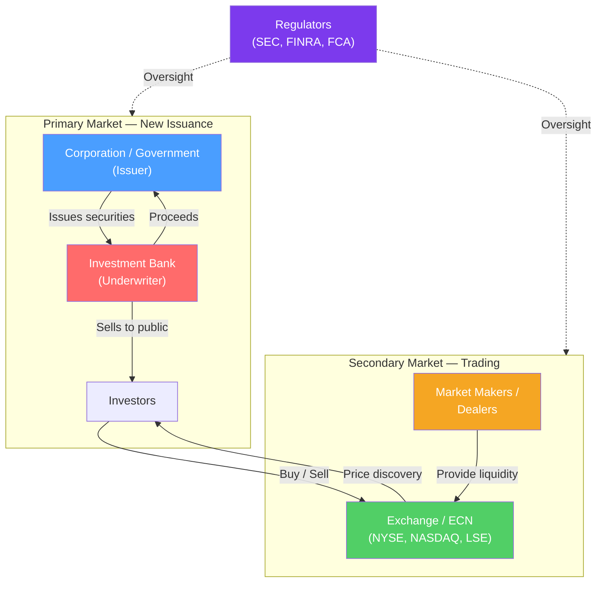

# 🏛️ Market Structure and Participants

> [!abstract] TL;DR
> Financial markets are organized systems where buyers and sellers exchange financial assets. They split into **primary markets** (new securities issued) and **secondary markets** (existing securities traded). Participants range from retail investors to massive institutional players, and from banks that underwrite deals to market makers that provide liquidity. Understanding this structure is the prerequisite for understanding how any security is priced.

## Intuition — analogy FIRST

Think of financial markets like a real-estate ecosystem.

The **primary market** is a new home construction: the developer (company) builds the home (issues stock/bonds) and sells it for the first time — money flows to the developer. An **investment bank** is the real-estate agent who lists it, sets the price, finds buyers, and takes a commission.

The **secondary market** is the resale market on Zillow: buyers and sellers trade existing homes, and none of that money goes back to the original developer — it circulates among investors. The **NYSE or NASDAQ** is the platform (Zillow), **market makers** are dealers who always stand ready to buy or sell, and **institutional investors** are the large property funds that move markets with big purchases.

---

## How It Works

## Key Concepts / Details

### Primary vs Secondary Markets

| Feature | Primary Market | Secondary Market |
|---------|---------------|------------------|
| **Purpose** | Raise new capital for issuers | Trade existing securities between investors |
| **Money flows to** | The issuing company/government | The selling investor |
| **Examples** | IPO, bond issuance, rights offering | NYSE, NASDAQ, bond dealer market |
| **Participants** | Issuer, underwriter, institutional/retail buyers | All investors, brokers, market makers |
| **Price set by** | Underwriter + book-building | Supply and demand continuously |

### Market Types

**Exchange-traded markets** (NYSE, NASDAQ, LSE):
- Centralized, transparent, regulated
- Standardized contracts
- Real-time price discovery via order books

**Over-the-Counter (OTC) markets**:
- Decentralized dealer network
- Negotiated terms — more flexible
- Used for bonds, FX, derivatives, small-cap stocks
- Less transparent — prices quoted bilaterally

**Dark pools**:
- Private trading venues (lit exchanges hide order size)
- Used by large institutions to minimize market impact
- ~15% of US equity volume
- Controversial: reduces price discovery quality

### Market Participants

| Participant | Role | Examples |
|-------------|------|---------|
| **Retail investors** | Individuals buying/selling for personal accounts | Robinhood users, 401(k) holders |
| **Institutional investors** | Large organizations managing pooled capital | BlackRock, Vanguard, CalPERS |
| **Investment banks** | Underwrite securities, advise on M&A, trade | Goldman Sachs, JPMorgan, Morgan Stanley |
| **Commercial banks** | Lending, deposit-taking, some trading | JPMorgan Chase, Bank of America |
| **Hedge funds** | Active strategies, long/short, leverage | Bridgewater, Renaissance, Citadel |
| **Mutual funds** | Pooled investment vehicles, daily NAV | Fidelity, Vanguard funds |
| **Pension funds** | Long-horizon, liability-matching investing | CPPIB, CalPERS, APG |
| **Market makers** | Provide two-sided quotes, earn bid-ask spread | Citadel Securities, Virtu Financial |
| **Broker-dealers** | Execute trades for clients, may principal trade | Schwab, Fidelity, interactive brokers |
| **Regulators** | Enforce rules, protect investors | SEC (US), FCA (UK), ESMA (EU) |

### Buy-Side vs Sell-Side

This distinction is fundamental to careers in finance:

**Sell-side** (sells financial products/services):
- Investment banks, broker-dealers
- Issue research to support sales, underwrite deals, execute trades
- Revenue from fees, commissions, spread

**Buy-side** (buys financial assets):
- Asset managers, hedge funds, pension funds, endowments
- Make investment decisions, deploy capital
- Revenue from management fees (1-2%) and performance fees (20% of profits — hedge funds)

### Market Efficiency — EMH Overview

The **Efficient Market Hypothesis** (Fama, 1970) states that prices reflect all available information:

| Form | Information Reflected | Implication |
|------|-----------------------|-------------|
| **Weak** | All past prices | Technical analysis doesn't generate alpha |
| **Semi-strong** | All public information | Fundamental analysis doesn't generate alpha (controversial) |
| **Strong** | All information including insider | Even insiders can't consistently beat market |

Most practitioners accept weak-form efficiency but believe semi-strong can be exploited with superior analysis (hence active management). Strong-form is violated by insider trading restrictions.

---

## Real-World Notes

- **The 2008 financial crisis** exposed risks in OTC derivatives markets — AIG wrote massive credit default swaps with no exchange clearing. The Dodd-Frank Act (2010) mandated central clearing for standardized OTC derivatives.
- **Gamestop (2021)** showed how retail investors organized via Reddit could disrupt market structure — short sellers (sell-side institutions) lost ~$19B as retail buyers on Robinhood squeezed the stock from $20 to $483.
- **Dark pool controversy**: In 2014, Michael Lewis's *Flash Boys* alleged that HFT firms gained unfair advantages on public exchanges; IEX (Investors Exchange) was founded with a 350-microsecond "speed bump" to level the playing field.
- **RegNMS (2005)** mandated that brokers route orders to the venue offering the best price — this fragmented US equity trading across dozens of venues.

---

## Common Pitfalls

- Confusing primary and secondary markets: when you buy Apple stock on NASDAQ, Apple gets no money — it went to the seller, not the company.
- Treating all institutional investors as "the buy-side": investment banks are sell-side even though they also invest proprietary capital.
- Assuming exchange-traded = more liquid: many OTC bond markets are far deeper and more liquid than small-cap stock exchanges.
- Misunderstanding market makers: they profit from the bid-ask spread, not from directional bets — they are intermediaries, not investors.

---

## Related Concepts

- [[_MOC_Financial_Markets|↑ Section MOC]]
- [[Equity_Markets]] — Deep dive on stock markets and the IPO process
- [[Fixed_Income_Markets]] — The bond market structure
- [[Market_Microstructure]] — Order types, bid-ask spreads, and execution mechanics
- [[Money_Markets]] — Short-term funding market participants

## Review Questions

1. Explain why a company's stock trading on the NYSE at $150/share today provides no direct financial benefit to that company. When did the company last receive cash from its stock?
2. A large pension fund wants to sell a $500M block of stock in a company. Why might it prefer a dark pool over the NYSE, and what are the risks of that choice?
3. Compare the sell-side and buy-side: how does each make money, and what are the potential conflicts of interest when a bank serves clients on both sides?

## Sources

- Fabozzi, Frank J., *The Handbook of Financial Instruments*
- Mishkin, Frederic, *The Economics of Money, Banking, and Financial Markets*
- CFA Institute, *CFA Program Curriculum*, Level 1 — Securities Markets

#finance #financial-markets #beginner #market-structure
