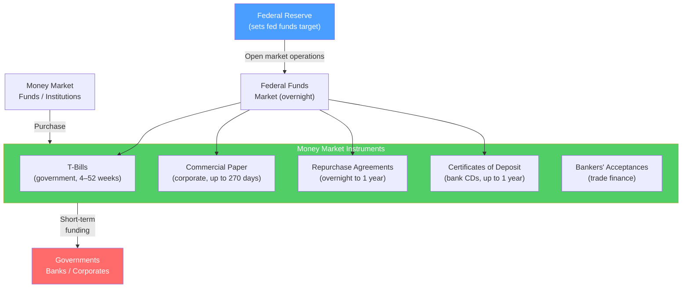

# 💵 Money Markets

> [!abstract] TL;DR
> Money markets are the short-term (maturity ≤ 1 year) funding plumbing of the financial system. They allow governments, banks, and corporations to manage short-term liquidity needs. Key instruments include Treasury bills (government short-term debt), commercial paper (corporate short-term debt), repurchase agreements (repos, collateralized overnight borrowing), and certificates of deposit. The **federal funds rate** and **SOFR** are the benchmark rates that anchor money market pricing.

## Intuition — analogy FIRST

Think of the money market as the overnight lending market between banks — like banks lending each other petty cash to cover daily imbalances.

A bank might collect deposits all day but also need to make loan payments — at day-end it might be $500M short. Rather than calling the Federal Reserve, it borrows from another bank that has a $500M surplus. This overnight lending at the **federal funds rate** is the heartbeat of the money market.

For corporations, the money market is like a short-term line of credit they can tap at any moment. Apple doesn't keep $80B in a checking account — it buys money market instruments that earn interest but remain accessible within days.

---

## How It Works



## Key Concepts / Details

### Key Money Market Instruments

| Instrument | Issuer | Maturity | Features | Typical Yield (relative) |
|-----------|--------|----------|----------|--------------------------|
| **Treasury bills (T-bills)** | US government | 4, 8, 13, 26, 52 weeks | Zero-coupon, issued at discount, risk-free | Lowest |
| **Commercial paper (CP)** | Corporations, banks | 1–270 days | Unsecured promissory note, requires high credit rating | +20–50 bps over T-bill |
| **Repurchase agreements (repo)** | Banks, dealers | Overnight to 1 year | Collateralized by securities, effectively secured lending | Near fed funds |
| **Fed funds** | Banks | Overnight | Uncollateralized interbank lending | Fed funds target rate |
| **CDs (bank certificates)** | Commercial banks | 1 month – 1 year | Fixed rate, FDIC insured up to $250K | Near T-bill |
| **Eurodollar deposits** | Foreign banks | Overnight – 1 year | USD deposits outside US | Slightly above T-bill |
| **Bankers' acceptances** | Banks (trade finance) | 30–180 days | Guaranteed by bank, used in international trade | Near T-bill |

### T-Bill Pricing

T-bills are zero-coupon instruments issued at a discount. They're quoted on a **discount yield** basis:

$$\text{Discount Yield} = \frac{F - P}{F} \times \frac{360}{t}$$

To compare with bond yields, convert to **bond equivalent yield (BEY)**:

$$\text{BEY} = \frac{F - P}{P} \times \frac{365}{t}$$

**Worked example**: 182-day T-bill, face $10,000, purchase price $9,850:
$$\text{Discount yield} = \frac{150}{10000} \times \frac{360}{182} = 2.97\%$$
$$\text{BEY} = \frac{150}{9850} \times \frac{365}{182} = 3.06\%$$

### Repurchase Agreements (Repos)

A repo is a collateralized short-term loan:

1. **Seller (borrower)** sells securities to buyer and agrees to repurchase them at a higher price
2. **Buyer (lender)** provides cash and earns the repo rate
3. **Haircut**: securities are valued at slightly below market (e.g., 2%) to protect the lender

```
Day 0:  Dealer sells $100M Treasuries → receives $98M cash (2% haircut)
Day 1:  Dealer repurchases $100M Treasuries → pays $98M + repo rate interest
```

**Why repos matter**: They are the primary funding mechanism for broker-dealers. Lehman Brothers had $700B in repo outstanding before its collapse in 2008 — when counterparties refused to roll repos overnight, it collapsed within days.

### Benchmark Rates: LIBOR → SOFR Transition

**LIBOR (London Interbank Offered Rate)**: the rate at which banks claimed to lend to each other. Used as the benchmark for ~$300 trillion in financial contracts. Manipulated by banks (Barclays fined $450M in 2012); officially discontinued in June 2023.

**SOFR (Secured Overnight Financing Rate)**: the replacement benchmark. Based on actual repo transactions — transaction-based, not survey-based. Published by the New York Fed. Used as benchmark for new USD floating-rate contracts since 2022.

| Feature | LIBOR | SOFR |
|---------|-------|------|
| Basis | Bank survey (forward-looking) | Actual overnight repo transactions |
| Security | Unsecured interbank | Secured (collateralized by Treasuries) |
| Tenor | Overnight to 12 months | Primarily overnight |
| Credit premium | Includes bank credit risk | Near risk-free |
| Status | Discontinued June 2023 | Current US benchmark |

### Money Market Funds (MMFs)

MMFs are mutual funds that invest exclusively in money market instruments. They offer:
- Near-instant liquidity (T+1 redemption)
- Stable $1 NAV (the "buck" — though this "broke" during 2008 crisis)
- Slightly above bank deposit yields
- Used by corporations to manage short-term cash

**2008 Reserve Primary Fund**: after holding Lehman commercial paper, the fund's NAV fell to $0.97 — "breaking the buck." Created a panic run on all MMFs, requiring Treasury to guarantee the entire industry.

---

## Real-World Notes

- **The repo market freeze (2019)**: In September 2019, overnight repo rates spiked from 2% to 10% as banks simultaneously needed cash for tax payments and Treasury settlement. The Fed had to inject $75B/day via repo operations — highlighting how a short-term funding squeeze can destabilize markets.
- **Commercial paper backstop (COVID-2020)**: When the COVID crisis hit in March 2020, commercial paper markets froze as corporations scrambled for cash. The Fed activated the Commercial Paper Funding Facility (CPFF), buying CP directly for the first time since 2008.
- **Apple's cash machine**: Apple holds ~$60B in "cash and equivalents," most of which is in money market funds and T-bills. This $60B earns ~5% in high-rate environments — $3B/year in virtually risk-free interest income.

---

## Common Pitfalls

- Treating T-bill discount yield and bond equivalent yield as the same: T-bills use 360-day year and face-value denominator — always convert to BEY for comparison.
- Thinking money market funds are bank accounts: they are not FDIC insured (above $250K at banks) and can theoretically break the buck.
- Underestimating repo: the repo market (~$4T daily in US) is bigger than many asset classes and its disruption can destabilize the entire financial system.
- Confusing the fed funds rate (target set by FOMC) with SOFR (market-determined, but closely tracks fed funds).

---

## Related Concepts

- [[_MOC_Financial_Markets|↑ Section MOC]]
- [[Fixed_Income_Markets]] — Longer-duration debt markets
- [[Market_Structure_and_Participants]] — Who participates in money markets
- [[Time_Value_of_Money]] — The compounding math for short-term instruments

## Review Questions

1. A 91-day T-bill has a face value of $1,000 and trades at $992.50. Calculate the discount yield and the bond equivalent yield. Why are these different, and which is more comparable to a corporate bond yield?
2. Explain how a repurchase agreement works. Why did the collapse of Lehman Brothers' repo book contribute to its failure in 2008?
3. What was the key problem with LIBOR that led to its replacement by SOFR? What structural advantage does SOFR have over LIBOR?

## Sources

- Fabozzi, Frank J., and Mann, Steven V., *The Handbook of Fixed Income Securities*
- Federal Reserve Bank of New York, *SOFR: A Primer*
- CFA Institute, *CFA Program Curriculum* Level 1 — Fixed Income — Money Market Instruments

#finance #financial-markets #money-markets #repo #SOFR
