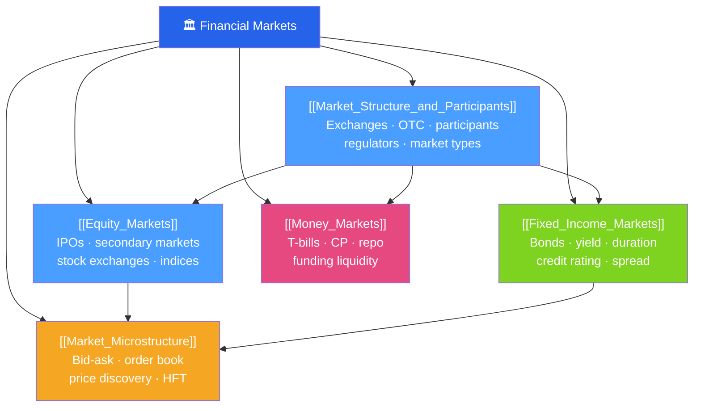

# 🏛️ Financial Markets — Map of Content

> [!abstract] What This Section Covers
> Financial markets are the plumbing of the economy — they channel savings to investment, price risk, and provide liquidity. This section covers how markets are structured (exchanges, OTC, dark pools), who participates (retail, institutional, market makers, regulators), the two giant asset classes (equities and fixed income), the short-term funding plumbing (money markets), and the microstructure details that matter for execution (bid-ask spreads, order types, price discovery). Understanding this foundation is essential before analyzing any security or building any valuation model.

## Concept Map

## Learning Path
1. [[Market_Structure_and_Participants]] — The architecture of markets and who plays each role.
2. [[Equity_Markets]] — How companies access equity capital and how stocks are traded.
3. [[Fixed_Income_Markets]] — The bond market: pricing, yield, duration, credit, and spreads.
4. [[Money_Markets]] — Short-term funding instruments that keep the financial system liquid.
5. [[Market_Microstructure]] — The mechanics of order execution, price discovery, and liquidity.

## All Notes at a Glance

| Note | Difficulty | What You'll Learn |
|------|------------|-------------------|
| [[Market_Structure_and_Participants]] | Beginner | Exchange vs OTC, primary vs secondary, buy-side vs sell-side, regulators |
| [[Equity_Markets]] | Beginner | IPO process, secondary market mechanics, stock indices, market capitalization |
| [[Fixed_Income_Markets]] | Intermediate | Bond pricing, YTM, duration, convexity, credit spreads, yield curve |
| [[Money_Markets]] | Intermediate | T-bills, commercial paper, repo agreements, LIBOR/SOFR transition |
| [[Market_Microstructure]] | Advanced | Order types, bid-ask spread, limit order book, price discovery, HFT |

## Key Questions This Section Answers
- What is the difference between a primary and secondary market?
- How does an IPO work, and what determines IPO pricing?
- What drives bond prices, and why do prices fall when yields rise?
- What are repo agreements and why do they matter for bank funding?
- How does a limit-order book work, and what determines the bid-ask spread?

## Related Sections
- [[_MOC_Finance_Master|↑ Finance Master MOC]]
- [[_MOC_Corporate_Finance|→ Corporate Finance]]
- [[_MOC_Investment_Analysis|→ Investment Analysis]]

#MOC #Finance #financial-markets
