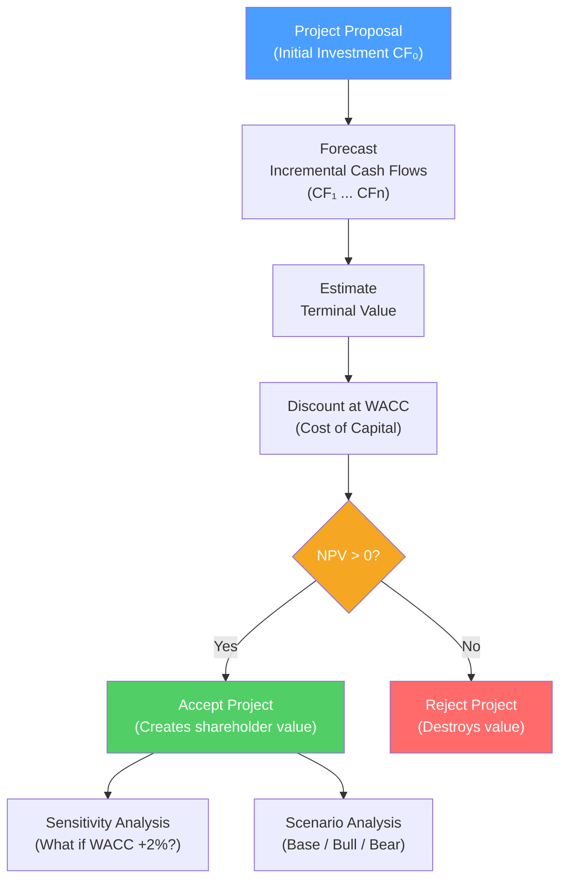

# 📊 Capital Budgeting

> [!abstract] TL;DR
> Capital budgeting decides whether a company should invest in a long-term project. **NPV** (Net Present Value) is the gold standard: if NPV > 0, the project creates value. **IRR** (Internal Rate of Return) is the discount rate that makes NPV zero — accept if IRR > cost of capital. When NPV and IRR conflict (mutually exclusive projects), **always use NPV**. The discount rate is WACC. Key insight: a project creates value only if it earns more than its cost of capital.

## Intuition — analogy FIRST

You're deciding whether to open a coffee shop. It costs $100K to open and you expect to earn $30K profit per year for 5 years.

Simple arithmetic: $30K × 5 = $150K vs $100K invested = $50K profit. But this ignores time value — that $30K in year 5 is worth less than $30K today because you could have invested the $100K elsewhere.

**NPV** asks: discounting all future profits back to today at your required return (say 10%), is the total present value more than the $100K investment? If yes — the coffee shop beats your alternative investment. Build it.

**IRR** asks: what return does this project actually generate? If it returns 15% and your alternative earns 10%, it's better. But if you had two mutually exclusive options and both had IRR > 10%, the one with higher NPV creates more wealth — NPV wins.

---

## How It Works

## Key Concepts / Details

### NPV — Net Present Value

$$NPV = -CF_0 + \sum_{t=1}^{n} \frac{CF_t}{(1+r)^t}$$

Where $r$ = WACC (the company's cost of capital).

**Decision rule**: Accept if NPV > 0. Reject if NPV < 0.

**Why NPV is the correct rule**: It measures wealth creation directly in dollar terms. It accounts for time value, risk (through the discount rate), and opportunity cost. It's additive — NPV of a portfolio of projects = sum of individual NPVs.

### IRR — Internal Rate of Return

IRR is the discount rate $r^*$ that makes NPV = 0:

$$0 = -CF_0 + \sum_{t=1}^{n} \frac{CF_t}{(1+r^*)^t}$$

**Decision rule**: Accept if IRR > WACC (hurdle rate).

**Calculation**: Iterative (Excel: `=IRR(cash_flow_range)`). No closed-form solution.

**Worked example**:
| Year | Cash Flow |
|------|-----------|
| 0 | -$200,000 |
| 1 | $80,000 |
| 2 | $90,000 |
| 3 | $70,000 |
| 4 | $60,000 |

At 10% WACC:
$$NPV = -200K + \frac{80K}{1.10} + \frac{90K}{1.21} + \frac{70K}{1.331} + \frac{60K}{1.464}$$
$$= -200K + 72{,}727 + 74{,}380 + 52{,}592 + 40{,}984 = +\$40{,}683$$

NPV = +$40,683 → **Accept**. IRR ≈ 21% > 10% WACC → **Accept**.

### NPV vs IRR — When They Conflict

For **independent projects** with conventional cash flows: NPV and IRR give the same accept/reject decision.

For **mutually exclusive projects**, they can conflict — always use NPV:

| Scenario | Use |
|----------|-----|
| Different scale (small vs large project) | NPV — IRR ignores the scale of investment |
| Different timing of cash flows | NPV — IRR implicitly reinvests at itself; NPV reinvests at WACC |
| Non-conventional cash flows (sign changes) | NPV — IRR can have multiple solutions |

**IRR pitfall example**: Project A costs $100, returns $150 in year 1 (IRR = 50%). Project B costs $10,000, returns $14,000 in year 1 (IRR = 40%). At 10% WACC:
- NPV(A) = $36.36
- NPV(B) = $2,727.27
NPV prefers B (more wealth created) even though A has higher IRR.

### MIRR — Modified IRR

MIRR fixes IRR's reinvestment rate assumption:

$$MIRR = \left(\frac{FV_{\text{inflows at WACC}}}{PV_{\text{outflows at finance rate}}}\right)^{1/n} - 1$$

MIRR is more realistic but less commonly used in practice.

### Other Capital Budgeting Methods

| Method | Formula | Decision Rule | Weakness |
|--------|---------|---------------|---------|
| **Payback period** | Years to recover initial investment | Accept if < cutoff | Ignores TVM, ignores post-payback cash flows |
| **Discounted payback** | Payback using PV of cash flows | Accept if < cutoff | Still ignores post-payback flows |
| **Profitability index (PI)** | $\frac{PV \text{ of inflows}}{CF_0}$ | Accept if > 1 | Useful for capital rationing |
| **Accounting rate of return** | Avg net income / Avg book value | Accept if > hurdle | Uses accounting not cash flows |

**Payback** is widely used in practice despite its flaws — it measures liquidity risk and is intuitive. Companies typically require both a positive NPV and an acceptable payback period.

### Incremental Cash Flow Principles

What goes into the cash flows:

1. **Incremental**: only cash flows that change *because* of the project
2. **After-tax**: use after-tax operating cash flows
3. **No sunk costs**: costs already spent are irrelevant
4. **Include opportunity costs**: if you use a factory you already own, charge it at market rental value
5. **Include side effects**: cannibalization of existing products, synergies

**Working capital**: projects typically require incremental working capital (inventory, receivables). This is a cash *outflow* at start, recovered at project end.

$$\text{After-tax OCF} = (\text{Revenue} - \text{Cost} - \text{D&A}) \times (1-T) + \text{D&A}$$
$$= (\text{Revenue} - \text{Cost}) \times (1-T) + T \times \text{D&A}$$

The last term ($T \times D\&A$) is the **depreciation tax shield** — depreciation reduces taxes even though it's not a cash outflow.

### Real Options

Traditional NPV ignores managerial flexibility. Real options add value to NPV:

| Option Type | Description | Example |
|-------------|-------------|---------|
| **Option to expand** | Invest more if project succeeds | Amazon expanding AWS |
| **Option to abandon** | Exit if project fails | Oil well abandonment |
| **Option to delay** | Wait for better information | Mining license |
| **Option to switch** | Change inputs/outputs | Flexible manufacturing |

$$\text{True NPV} = \text{Static NPV} + \text{Option value}$$

In practice, real options are valued using binomial trees or Black-Scholes. They often explain why companies invest in projects with negative static NPV.

---

## Real-World Notes

- **Amazon AWS capital budgeting**: Amazon invested ~$500M in AWS infrastructure in 2006–2010 with very uncertain returns. Traditional payback analysis would likely have rejected this; the embedded option to scale globally drove the true value. AWS generated $90B in revenue in 2023.
- **Oil industry hurdle rates**: Exxon and Chevron use internal hurdle rates of 15–20% for capital projects — far above WACC — to buffer commodity price uncertainty. This creates underinvestment relative to NPV maximization.
- **Tesla Gigafactory**: Invested $5B+ in Gigafactory Nevada before full-scale EV demand materialized. Traditional NPV would struggle to justify this; option-based thinking (option to be the cost leader when EVs go mainstream) captures the real value.
- **Payback in retail**: Starbucks evaluates new locations partly on payback period (typically 3 years) because it measures how quickly a location becomes self-financing — important for rapid expansion capital recycling.

---

## Common Pitfalls

- Using accounting income instead of cash flows: depreciation is not a cash cost; interest is accounted for in the discount rate (WACC), not the cash flows.
- Including sunk costs: the $2M already spent on feasibility studies is gone regardless — it's irrelevant to the accept/reject decision.
- Forgetting working capital: projects require inventory and receivables funding; not modeling this overstates returns.
- Choosing the project with higher IRR when projects are mutually exclusive: always choose the project with higher NPV.

---

## Related Concepts

- [[_MOC_Corporate_Finance|↑ Section MOC]]
- [[Time_Value_of_Money]] — The PV/FV math underlying NPV
- [[Cost_of_Capital_and_WACC]] — The discount rate used in NPV calculation
- [[DCF_Analysis]] — Capital budgeting applied to entire companies
- [[Scenario_and_Sensitivity_Analysis]] — Testing NPV robustness to assumptions

## Review Questions

1. A project costs $500,000 and generates $150,000/year for 5 years. At a WACC of 10%, calculate NPV and decide whether to accept. What is the approximate IRR?
2. Project Alpha costs $100K with IRR of 35%. Project Beta costs $1M with IRR of 25%. WACC is 12%. The projects are mutually exclusive. Which should you choose and why? Calculate the NPV of each using year 1 cash flows of $135K (Alpha) and $1.25M (Beta).
3. Your company built a $5M factory 2 years ago. You're now considering using it for a new product that requires no additional facility investment. Should you include the factory cost in your NPV analysis? What should you include instead?

## Sources

- Brealey, Myers, Allen, *Principles of Corporate Finance*, 13th edition, Ch. 5–6
- Damodaran, Aswath, *Applied Corporate Finance*, 4th edition
- CFA Institute, *CFA Program Curriculum* Level 1 — Corporate Finance

#finance #corporate-finance #NPV #IRR #capital-budgeting
