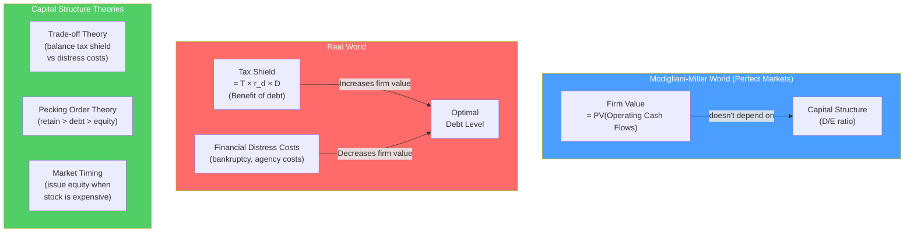

# 🏗️ Capital Structure

> [!abstract] TL;DR
> Capital structure is the mix of debt and equity a company uses to finance its assets. **Modigliani-Miller (1958)**: in a world without taxes or bankruptcy costs, capital structure is irrelevant — firm value depends only on assets, not how they're financed. With taxes (1963), debt creates value via the **interest tax shield**. In practice, the **trade-off theory** says optimal structure balances tax shield against financial distress costs. The **pecking order theory** says firms prefer retained earnings, then debt, then equity.

## Intuition — analogy FIRST

Imagine you own a house worth $500K. Does it matter whether you paid entirely in cash or used a 70% mortgage?

In an ideal world (no taxes, no bankruptcy risk), **the house is worth $500K regardless** — its value comes from the rent it generates, not the financing structure. This is Modigliani-Miller Proposition I: the pie (firm value) is the same size regardless of how you slice it into debt and equity.

But add the real world: mortgage interest is tax-deductible (like corporate interest) — the tax man subsidizes your leverage. This makes debt valuable. But if you take too much leverage and can't pay the mortgage, you face foreclosure costs (financial distress) — this limits how much you borrow.

The optimal point: borrow enough to capture tax benefits, but not so much that distress costs exceed them. That's the **trade-off theory**.

---

## How It Works



## Key Concepts / Details

### Modigliani-Miller Propositions

**MM Proposition I (1958 — No taxes)**:
$$V_L = V_U$$

The value of a levered firm equals the value of an unlevered firm. Capital structure is **irrelevant**.

**Intuition**: Investors can create "homemade leverage" on their own — if a company won't lever up, shareholders can borrow personally to achieve the same exposure. No value is created by the firm.

**MM Proposition II (1958 — No taxes)**:
$$r_e = r_0 + (r_0 - r_d) \times \frac{D}{E}$$

The cost of equity rises linearly with leverage. As D/E increases, equity holders bear more risk and demand higher returns. The cost savings from cheap debt exactly offset the higher cost of now-riskier equity → WACC unchanged.

**MM Proposition I with Taxes (1963)**:
$$V_L = V_U + T \times D$$

The **tax shield** ($T \times D$) creates value. Each dollar of debt saves $T$ in taxes annually (in perpetuity), adding $T \times D$ to firm value.

**Example**: Firm U has no debt, value = $1,000. Firm L is identical but has $400 debt, T = 30%:
$$V_L = 1{,}000 + 0.30 \times 400 = \$1{,}120$$

The $120 premium comes entirely from the tax shield.

**MM Proposition II with Taxes (1963)**:
$$r_e = r_0 + (r_0 - r_d) \times \frac{D}{E} \times (1-T)$$

Cost of equity still rises with leverage, but less than in the no-tax case (tax shield partially absorbed by debt holders / government).

**WACC with taxes**:
$$WACC = r_0 \times \left(1 - T \times \frac{D}{V}\right)$$

WACC *decreases* with leverage → firm value increases with leverage. In the pure MM-with-taxes world, 100% debt would be optimal.

### Trade-Off Theory

In practice, extreme leverage is not optimal because of **financial distress costs**:

| Direct costs | Indirect costs |
|-------------|----------------|
| Legal/accounting fees in bankruptcy (1–5% of firm value) | Management distraction |
| Fire-sale asset liquidation | Customer/supplier defection |
| Time in court | Loss of growth opportunities |
| | Employee turnover |

The optimal capital structure maximizes:

$$V_L = V_U + PV(\text{Tax Shield}) - PV(\text{Financial Distress Costs})$$

```
Firm Value
    |         ← Trade-off theory optimum
    |        /\
    |       /  \    Financial distress
    |      /    \   costs dominate
    |_____/ Tax   \_______
    |     shield
    |
    +--------------------------------> Leverage (D/V)
         Low          High
```

**Mature, stable industries** (utilities, telecom) can support higher leverage (40–60% D/V) because cash flows are predictable and distress risk is low.

**High-growth tech companies** use low leverage because:
- Earnings volatile → distress risk high
- Assets are intangible (IP, human capital) → low liquidation value
- High-value growth options would be destroyed in distress

### Pecking Order Theory (Myers & Majluf, 1984)

Based on **information asymmetry**: managers know more about firm value than investors. When a firm issues equity, the market interprets it as a signal that shares are overvalued → stock price drops.

The hierarchy of financing:
1. **Internal cash (retained earnings)**: no information signal, no transactions costs
2. **Debt**: mild negative signal (some think you couldn't find equity buyers), but smaller than equity
3. **Equity**: strong negative signal — last resort

**Evidence**: stock price drops ~3% on average at equity issuance announcement. Firms issue equity mainly after stock prices have run up (market timing).

### Agency Costs of Debt

Debt creates conflict between equity holders and debt holders:

| Problem | Description | Example |
|---------|-------------|---------|
| **Asset substitution** | Equity holders switch to risky projects (wins go to equity, losses shared with debt) | Bankrupt airline gambles on risky routes |
| **Underinvestment** | Equity holders reject positive-NPV projects if gains go mainly to debt repayment | Distressed firm skips profitable capex |
| **Debt overhang** | Existing debt makes new financing harder | Can't raise equity; existing debt holders capture all new value |

**Protective covenants** in loan agreements (minimum interest coverage, debt/EBITDA caps, capex limits) are the debt holders' response to agency costs — they limit management's ability to expropriate value.

### Capital Structure in Practice

| Industry | Typical D/V | Why |
|----------|-------------|-----|
| Utilities | 50–60% | Regulated, stable cash flows |
| Telecom | 40–50% | Predictable recurring revenue |
| Real estate (REITs) | 40–55% | Tangible assets, steady rent |
| Banks | 80–90% | Deposits = debt, business model |
| Consumer staples | 20–40% | Stable but some brand value |
| Technology (mature) | 10–25% | Intangible assets, growth options |
| Pharmaceutical | 10–20% | R&D pipeline = optionality |
| Early-stage tech | ~0% | Too risky for meaningful debt |

---

## Real-World Notes

- **Apple's debt-funded buybacks**: Apple had $200B+ in offshore cash and $0 domestic debt in 2012. Rather than repatriating cash (35% tax), Apple issued $17B in bonds at 1–3% interest to fund dividends and buybacks domestically. Pure tax arbitrage — a real-world application of MM-with-taxes.
- **LBOs (Leveraged Buyouts)**: Private equity firms buy companies using 60–70% debt, specifically to capture the tax shield on the entire acquisition value. KKR's buyout of RJR Nabisco (1988, $25B) was the archetypal LBO — the tax shield on $15B in debt created enormous value.
- **Hertz bankruptcy (2020)**: COVID crushed car rental revenue; Hertz had $19B in debt. High leverage, appropriate for stable cash flows in 2019, became fatal when revenues fell 70%. Classic trade-off theory in reverse.
- **Tesla's capital structure evolution**: From 2012–2020, Tesla raised multiple equity rounds (dilutive but avoiding bankruptcy during money-losing years). As it became profitable, it began adding modest debt. Textbook pecking-order: equity first when earnings negative, shift to debt when stable.

---

## Common Pitfalls

- Thinking maximum debt = maximum value: MM ignores distress costs; trade-off theory shows the optimum is well short of 100% debt.
- Applying utility-like leverage to volatile businesses: a 50% D/V ratio appropriate for a power company would be dangerous for a semiconductor company.
- Ignoring agency costs: high leverage changes management incentives in ways that can destroy value even before formal distress.
- Confusing the book debt ratio with the market debt ratio: market values should be used; book values can dramatically overstate leverage for companies whose equity has appreciated.

---

## Related Concepts

- [[_MOC_Corporate_Finance|↑ Section MOC]]
- [[Cost_of_Capital_and_WACC]] — WACC is the practical output of capital structure decisions
- [[Dividend_Policy]] — Payout decisions are linked to the financing hierarchy
- [[LBO_Analysis]] — LBOs are the extreme application of capital structure theory
- [[CAPM_and_Factor_Models]] — Beta rises with leverage; understanding risk is prerequisite

## Review Questions

1. Explain Modigliani-Miller Proposition I without taxes. If you accept that investors can create homemade leverage, why does it follow that a levered firm and unlevered firm with the same assets must have the same value?
2. A firm has $500M in assets and $100M in debt (T=30%). What is the present value of the tax shield, and what is the levered firm value using MM-with-taxes? Show the formula and calculation.
3. According to pecking order theory, what signal does an equity issuance send to the market? How does this explain why stock prices typically fall ~3% when a company announces an equity offering?

## Sources

- Modigliani, Franco, and Miller, Merton, "The Cost of Capital, Corporation Finance, and the Theory of Investment" (AER, 1958)
- Modigliani, Franco, and Miller, Merton, "Corporate Income Taxes and the Cost of Capital" (AER, 1963)
- Myers, Stewart, and Majluf, Nicholas, "Corporate Financing and Investment Decisions When Firms Have Information That Investors Do Not Have" (JFE, 1984)
- Brealey, Myers, Allen, *Principles of Corporate Finance*, 13th edition, Ch. 17–19

#finance #corporate-finance #capital-structure #Modigliani-Miller #WACC #leverage
