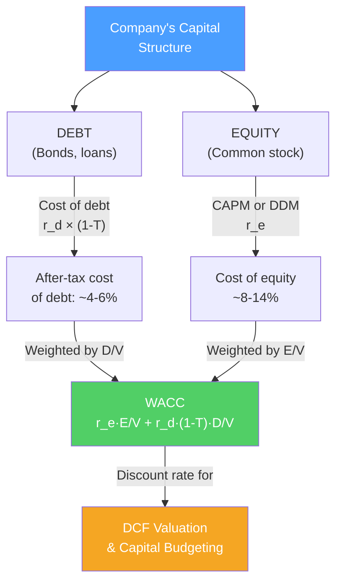

# ⚖️ Cost of Capital and WACC

> [!abstract] TL;DR
> **WACC** (Weighted Average Cost of Capital) is the blended return a company must earn on its assets to satisfy all its capital providers. It combines the after-tax cost of debt and cost of equity, weighted by their proportions in the capital structure: $WACC = r_e \cdot \frac{E}{V} + r_d \cdot (1-T) \cdot \frac{D}{V}$. WACC is the discount rate for DCF valuations and the hurdle rate for capital budgeting. The cost of equity is unobservable — we estimate it using CAPM.

## Intuition — analogy FIRST

Your company is like a rental property funded by a mix of your own money (equity) and a bank loan (debt).

The bank charges 6% interest (cost of debt). You could have invested your own money elsewhere and earned 12% in the stock market (cost of equity — an opportunity cost). If your property earns less than a blended average of these two costs, you're destroying wealth.

The blend considers how much of each you used. If 40% bank loan (at 6%) and 60% your money (at 12%), your blended cost is: $0.4 \times 6\% + 0.6 \times 12\% = 9.6\%$. The property must yield at least 9.6% to justify the investment.

One wrinkle: interest is tax-deductible (the government effectively subsidizes your debt). So the after-tax cost of debt is 6% × (1 − 30% tax) = 4.2%. This is the tax shield in action.

---

## How It Works

## Key Concepts / Details

### WACC Formula

$$\boxed{WACC = r_e \cdot \frac{E}{V} + r_d \cdot (1-T) \cdot \frac{D}{V}}$$

Where:
- $r_e$ = cost of equity
- $r_d$ = pre-tax cost of debt
- $T$ = marginal corporate tax rate
- $E$ = market value of equity
- $D$ = market value of debt
- $V = E + D$ = total value of the firm

**Important**: Use **market values** (not book values) for weights. Use **marginal tax rate** (not effective rate).

### Worked WACC Calculation

**Example: Tech company**

| Component | Value |
|-----------|-------|
| Equity market cap | $8 billion |
| Debt (book ≈ market) | $2 billion |
| Total capital (V) | $10 billion |
| E/V weight | 80% |
| D/V weight | 20% |
| Cost of equity (CAPM) | 11.5% |
| Cost of debt (yield on bonds) | 5.0% |
| Marginal tax rate | 25% |

$$WACC = 11.5\% \times 0.80 + 5.0\% \times (1 - 0.25) \times 0.20$$
$$= 9.2\% + 0.75\% = \mathbf{9.95\%}$$

This company must earn >9.95% on investments to create value.

### Cost of Debt ($r_d$)

The cost of debt is the yield investors require to lend to the company:

1. **Yield to maturity** on existing bonds (most reliable)
2. **Synthetic rating approach**: estimate a spread over Treasuries based on interest coverage ratio
3. **Recent debt issuance**: coupon rate on recently-issued bonds

**After-tax cost of debt** = $r_d \times (1 - T)$

Interest is tax-deductible → the government pays part of your interest cost. At 25% tax rate, a 6% coupon costs the company only 4.5%.

### Cost of Equity ($r_e$) — CAPM

The cost of equity is unobservable — we use CAPM:

$$r_e = r_f + \beta \times (E[R_m] - r_f)$$

Where:
- $r_f$ = risk-free rate (10-year Treasury yield)
- $\beta$ = systematic risk of the stock vs market
- $E[R_m] - r_f$ = equity risk premium (ERP), typically 4–6%

**Worked CAPM example**:
- Risk-free rate: 4.5% (10-year Treasury)
- Beta: 1.2 (20% more volatile than market)
- ERP: 5.5%

$$r_e = 4.5\% + 1.2 \times 5.5\% = 4.5\% + 6.6\% = 11.1\%$$

### Beta Estimation

| Source | Method | Pros / Cons |
|--------|--------|------------|
| **Historical regression** | Regress stock returns on market returns | Direct but backward-looking; 5 years/monthly typical |
| **Comparable companies** | Unlever comps' betas, re-lever at target structure | Useful for private companies and restructurings |
| **Bloomberg / Refinitiv** | Published beta estimates | Convenient; varies by provider |

**Unlevering and re-levering beta** (Hamada equation):

$$\beta_U = \frac{\beta_L}{1 + (1-T) \times \frac{D}{E}}$$

$$\beta_L = \beta_U \times \left(1 + (1-T) \times \frac{D}{E}\right)$$

Use unlevered beta from comps, then relever at target D/E:

**Example**: Peer company $\beta_L = 1.3$, D/E = 50%, T = 25%:
$$\beta_U = \frac{1.3}{1 + 0.75 \times 0.5} = \frac{1.3}{1.375} = 0.945$$

Now relever at our target D/E = 30%, T = 25%:
$$\beta_L = 0.945 \times (1 + 0.75 \times 0.3) = 0.945 \times 1.225 = 1.158$$

### Alternatives to CAPM for Cost of Equity

| Model | Formula | Notes |
|-------|---------|-------|
| **CAPM** | $r_f + \beta \times ERP$ | Standard; single systematic risk factor |
| **Fama-French 3-factor** | $r_f + \beta_m \times ERP + \beta_{SMB} \times SMB + \beta_{HML} \times HML$ | Adds size and value premiums |
| **Dividend Discount Model** | $r_e = D_1/P_0 + g$ | Useful for stable dividend payers |
| **Build-up model** | $r_f + ERP + \text{size premium} + \text{company-specific risk}$ | Used for private companies |

### WACC in Practice: Common Adjustments

**Project-specific WACC**: if a project has different risk than the company, use a risk-adjusted WACC:
- Project riskier than firm → use higher discount rate
- Project safer (e.g., real estate lease) → use lower rate
- Estimate by finding comparable pure-play companies in that sector

**Country risk premium**: for international projects, add a country risk premium (CRP) to the cost of equity based on sovereign credit rating.

| Country | CRP (approximate) |
|---------|-------------------|
| US / Germany | 0% (base) |
| China | 1.5% |
| India | 2.5% |
| Brazil | 4.0% |
| Nigeria | 8.0% |

---

## Real-World Notes

- **Apple WACC (~2024)**: ~8.5% — modest leverage (D/V ≈ 15%), low beta (~1.2 when excluding cash), reflects its cash-generative stability. Used to discount very large terminal values in DCF.
- **WeWork WACC**: pre-bankruptcy was estimated at 20%+ by some analysts — reflecting massive operational leverage, cash burn, and weak credit. High WACC crushes DCF valuations of money-losing companies.
- **ERP debate**: Damodaran estimates ERP at ~4–5% for 2024. Survey of CFOs (Graham/Harvey) shows 5–6%. The ERP is the single most important and most contested input in corporate finance.
- **Debt vs equity mixing**: Sprint borrowed 70%+ of its capital before T-Mobile merger — very high leverage pushed WACC down temporarily (cheap debt) but increased financial distress risk and ultimately required the merger.

---

## Common Pitfalls

- Using book value weights instead of market value weights: book values reflect historical costs; market values reflect current opportunity costs.
- Using the effective tax rate instead of the marginal rate: it's the marginal dollar of interest that's tax-deductible; use the statutory/marginal rate.
- Ignoring preferred stock: if the company has preferred stock, it gets its own weight in WACC (cost of preferred = preferred dividend / preferred price).
- Assuming WACC is constant across a company's lifecycle: early-stage companies should use higher discount rates (more risk); WACC generally falls as companies mature.

---

## Related Concepts

- [[_MOC_Corporate_Finance|↑ Section MOC]]
- [[Capital_Budgeting]] — WACC is the discount rate for NPV
- [[Capital_Structure]] — The D/E mix determines WACC inputs
- [[CAPM_and_Factor_Models]] — The theory behind cost-of-equity estimation
- [[DCF_Analysis]] — WACC drives all DCF terminal value calculations

## Review Questions

1. Calculate WACC for a company with: equity market cap $6B, total debt $2B, cost of equity 13%, pre-tax cost of debt 6%, and marginal tax rate 30%.
2. Why is the after-tax cost of debt lower than the pre-tax cost? Explain the mechanism using numbers. If a company has $1B of 7% bonds and a 25% tax rate, what is the annual tax benefit?
3. A private company has no stock price. Describe two approaches to estimating its cost of equity, and explain how you would unlever and re-lever a comparable company's beta to use it for the private firm.

## Sources

- Brealey, Myers, Allen, *Principles of Corporate Finance*, 13th edition, Ch. 9, 17
- Damodaran, Aswath, *Investment Valuation*, Ch. 4 — Estimating the Cost of Equity
- CFA Institute, *CFA Program Curriculum* Level 2 — Corporate Finance

#finance #corporate-finance #WACC #cost-of-capital #CAPM #beta
