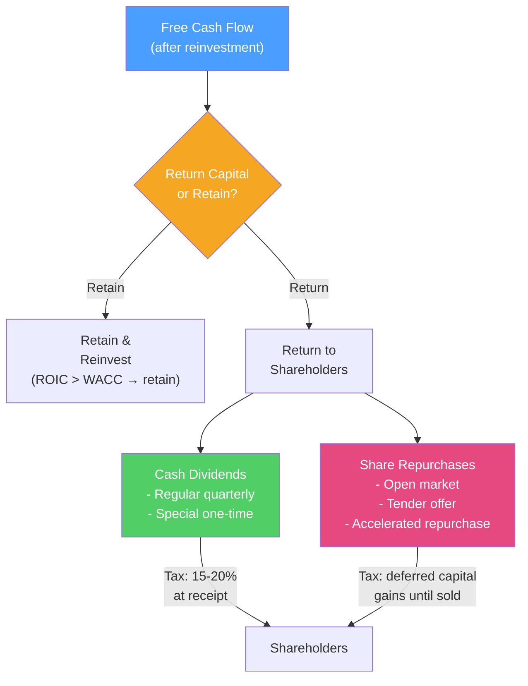

# 💸 Dividend Policy

> [!abstract] TL;DR
> Dividend policy determines how a company returns cash to shareholders — through dividends, share buybacks, or both. **Miller-Modigliani (1961)**: in perfect markets, dividend policy is irrelevant — shareholders can create homemade dividends. In practice, dividends and buybacks differ in taxes, flexibility, and signaling. **Dividend signaling**: cuts are punished severely (-15% to -25% stock drop); initiations and increases signal management confidence. Apple's $100B+ annual return program illustrates modern payout policy at scale.

## Intuition — analogy FIRST

You own a profitable rental property that throws off $50K/year after expenses. You have two choices:

1. **Take a dividend**: collect the $50K in cash every year
2. **Let it compound**: leave the cash in the business to buy a second property

In a perfect world, it shouldn't matter — both paths create the same wealth. If you need cash and the business isn't paying dividends, you just sell a small slice of the property. This is **homemade dividend** — the core of MM's irrelevance argument.

But in the real world, taxes complicate things (qualified dividends taxed at 15–20%, capital gains deferred), and a dividend cut signals the "property" is less profitable than management previously claimed — causing a sharp price drop.

---

## How It Works

## Key Concepts / Details

### Miller-Modigliani Dividend Irrelevance (1961)

In a perfect capital market (no taxes, no transaction costs, no information asymmetry):

**Firm value depends only on investment decisions, not payout decisions.**

If a company pays a $10 dividend:
- You receive $10 cash
- But the stock price drops $10 (by the dividend amount — ex-dividend date)
- Net wealth change: $0

If you wanted a $10 dividend but the company didn't pay one:
- Sell $10 of stock (homemade dividend)
- Same outcome

**Corollary**: if a company runs out of internal cash to pay dividends, issuing new equity to fund dividends destroys no value — you're just recycling capital.

### Dividends vs Buybacks: Key Differences

| Feature | Cash Dividends | Share Repurchases |
|---------|---------------|-------------------|
| **Tax timing** | Taxed at receipt | Capital gains deferred until sale |
| **Tax rate** | Qualified: 15–20%; ordinary: up to 37% | Long-term capital gains: 15–20% |
| **Flexibility** | Strong expectation to maintain/grow | Discretionary — no obligation |
| **Signal** | Strong commitment signal; cut is very costly | Weaker signal; can be halted quietly |
| **EPS effect** | No EPS impact | Reduces share count → raises EPS |
| **Capital structure** | Reduces equity; may increase leverage | Same |
| **Undervaluation signal** | Weak | Buybacks often done when management thinks stock is cheap |

**For US investors in higher tax brackets, buybacks are typically more tax-efficient than dividends.**

### Dividend Signaling Theory

Dividends contain **information content** — they signal management's expectations:

| Event | Typical stock price reaction |
|-------|------------------------------|
| Dividend initiation | +3% to +5% |
| Dividend increase | +1% to +3% |
| Dividend cut | -15% to -25% |
| Dividend elimination | -25% to -40% |

This asymmetry makes dividends a strong commitment device: management will only initiate or raise dividends if they're confident in future earnings. A cut is a confession that earnings will not support it.

### Dividend Policy Frameworks

**Lintner Model (1956)**: Firms smooth dividends toward a target payout ratio, adjusting slowly:

$$\Delta D_t = \alpha + c \times (D^* - D_{t-1})$$

Where:
- $D^*$ = target dividend = target payout ratio × earnings
- $c$ = speed of adjustment (typically 0.3–0.5 — firms adjust 30–50% of the gap per year)

Companies avoid cutting dividends even if earnings fall temporarily — they'll pay from cash or debt before cutting.

**Residual dividend policy**: pay dividends only from earnings left over after all positive-NPV projects are funded:

$$\text{Dividend} = \text{Net income} - (\text{Target D/E ratio} \times \text{New capital needed})$$

This minimizes new equity issuances but makes dividends highly volatile — most large companies abandon it in favor of smoother payout.

### Share Repurchases

Methods:
1. **Open market repurchase**: most common — company buys shares on the open market over time at market prices. No obligation to complete.
2. **Tender offer**: company offers to buy shares at a fixed premium (typically 10–20% above market) within a time window. Fast but expensive.
3. **Accelerated share repurchase (ASR)**: company pays bank upfront; bank delivers shares immediately using borrowed shares; covers its position in open market over time.
4. **Dutch auction**: company sets price range; shareholders tender; company accepts lowest price at which it can buy target quantity.

**EPS arithmetic of buybacks**:
- Company has 100M shares, $1B net income → EPS = $10.00
- Buy back 10M shares → 90M shares, same income → EPS = $11.11
- 11.1% EPS increase with no operational improvement

This can make buybacks look value-creating even when they're not — if buybacks are done above intrinsic value, shareholders net lose.

**The buyback tax** (2023 US): The Inflation Reduction Act imposed a 1% excise tax on repurchases by US public companies. At $1T/year in buybacks, this raises ~$10B/year and marginally increases the relative attractiveness of dividends.

### Dividend Aristocrats and Policy

**Dividend aristocrats**: S&P 500 companies that have increased dividends for 25+ consecutive years (66 companies in 2024). Examples: Johnson & Johnson, Coca-Cola, Procter & Gamble.

**Typical dividend yield ranges (2024)**:
| Sector | Typical Yield |
|--------|--------------|
| Utilities | 3–5% |
| REITs | 4–7% |
| Telecom | 4–6% |
| Energy majors | 3–5% |
| Consumer staples | 2–3% |
| Financials | 2–4% |
| Technology | 0–1% (growth > income) |
| High-growth tech | 0% |

---

## Real-World Notes

- **Apple's return program**: Apple announced its first dividend in 2012, after a 17-year absence, when Tim Cook inherited $100B+ in cash. Since 2012, Apple has returned $700B+ in buybacks and $100B+ in dividends — dwarfing any company in history. The buyback program reduced shares from 26B to 15.4B (41% reduction), massively boosting EPS without improving operations.
- **GE's fatal dividend cut (2017)**: GE cut its dividend by 50% (first cut since the Great Depression). The stock fell 45% that year and 80% over three years as the cut confirmed deep structural problems in its power and insurance businesses. Classic signaling theory confirmed.
- **Exxon's dividend commitment**: During COVID-2020, when oil prices went negative, Exxon maintained its dividend despite negative free cash flow — borrowing $20B+ to do so. Management's signaling commitment proved right when oil recovered in 2021–2022.
- **Meta's first dividend (2024)**: Meta paid its first-ever dividend ($0.50/share) in 2024 after years of buybacks. The market interpreted it as a sign of mature, stable FCF generation — stock rose 3% on announcement.

---

## Common Pitfalls

- Thinking buybacks are always value-accretive: they create value only if done below intrinsic value. Buybacks at inflated prices destroy shareholder wealth.
- Modeling EPS growth from buybacks as "earnings growth": reducing share count is financial engineering, not operational improvement.
- Ignoring dividend clientele effects: pension funds and income-seeking retirees prefer dividends; growth investors prefer buybacks. Changing policy can disrupt your shareholder base.
- Treating dividends and buybacks as mutually exclusive: most large caps do both — dividends for stability signaling, buybacks for opportunistic excess cash return.

---

## Related Concepts

- [[_MOC_Corporate_Finance|↑ Section MOC]]
- [[Capital_Structure]] — Payout policy links to leverage (dividends reduce equity)
- [[DCF_Analysis]] — Dividend discount models use Gordon Growth Model
- [[Financial_Statement_Analysis]] — Free cash flow is what funds payout
- [[Equity_Research]] — Analysts forecast dividends and buybacks as part of return

## Review Questions

1. Explain the Miller-Modigliani dividend irrelevance proposition. If dividends don't matter, why do stock prices typically fall significantly when a company cuts its dividend?
2. Company XYZ has 200M shares at $50, $2B net income (EPS = $10). It repurchases 20M shares. What is the new EPS? Does this represent value creation? Under what condition would the repurchase create value, and when would it destroy value?
3. Compare dividends vs share buybacks for a US investor in the 37% ordinary income tax bracket and 20% long-term capital gains bracket. Which form of return is more tax-efficient and why?

## Sources

- Miller, Merton, and Modigliani, Franco, "Dividend Policy, Growth, and the Valuation of Shares" (Journal of Business, 1961)
- Lintner, John, "Distribution of Incomes of Corporations Among Dividends, Retained Earnings, and Taxes" (AER, 1956)
- Brealey, Myers, Allen, *Principles of Corporate Finance*, 13th edition, Ch. 16

#finance #corporate-finance #dividends #buybacks #payout-policy
