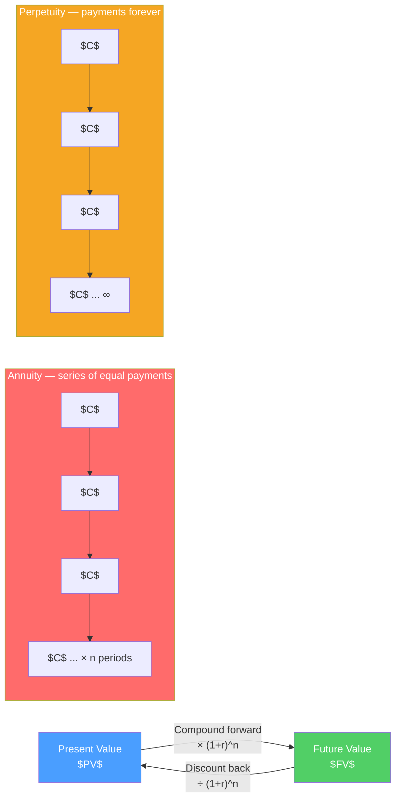

# ⏰ Time Value of Money

> [!abstract] TL;DR
> A dollar today is worth more than a dollar in the future — you can invest it and earn a return. **Present Value (PV)** is what a future cash flow is worth today: $PV = \frac{FV}{(1+r)^n}$. **Future Value (FV)** compounds a present amount forward: $FV = PV \times (1+r)^n$. TVM is the mathematical bedrock of all of finance — every valuation, bond pricing, and capital budgeting analysis rests on it.

## Intuition — analogy FIRST

Would you rather receive $1,000 today or $1,000 a year from now?

Today, obviously — you can invest it and turn it into $1,050 by year-end (at 5%). This isn't preference; it's arithmetic. Money has time value because it can be invested.

Now flip it: you're promised $1,050 in one year. How much is that worth **today**? If you can earn 5%, the answer is exactly $1,000 — because investing $1,000 now gives you $1,050 then. We call $1,000 the **present value** of $1,050 at 5%.

This single insight — that future cash flows need to be discounted back to today — underlies every bond price, every DCF model, and every mortgage payment calculation.

---

## How It Works

## Key Concepts / Details

### Core Formulas

**Future Value:**
$$FV = PV \times (1 + r)^n$$

**Present Value:**
$$PV = \frac{FV}{(1 + r)^n}$$

**Worked example**: $10,000 invested at 7% for 10 years:
$$FV = 10{,}000 \times (1.07)^{10} = 10{,}000 \times 1.9672 = \$19{,}672$$

**Rule of 72**: Years to double ≈ 72 / interest rate. At 7%: 72/7 ≈ 10.3 years. Checks out.

### Annuities

An **annuity** is a series of equal cash flows at equal intervals:

$$PV_{\text{annuity}} = C \times \frac{1 - (1+r)^{-n}}{r}$$

$$FV_{\text{annuity}} = C \times \frac{(1+r)^n - 1}{r}$$

**Worked example — mortgage**: $300,000 mortgage, 6% annual (0.5%/month), 30-year (360 months):
$$C = 300{,}000 \times \frac{0.005}{1 - (1.005)^{-360}} = 300{,}000 \times 0.005996 = \$1{,}799/\text{month}$$

**Annuity due** (payments at beginning of period): multiply PV by $(1+r)$:
$$PV_{\text{annuity due}} = C \times \frac{1 - (1+r)^{-n}}{r} \times (1+r)$$

### Perpetuities

A **perpetuity** pays the same cash flow forever:

$$PV_{\text{perpetuity}} = \frac{C}{r}$$

**Growing perpetuity (Gordon Growth Model)**:
$$PV = \frac{C_1}{r - g}$$

Where $g$ = constant growth rate (must be $< r$).

**Example**: A stock pays $5 in dividends next year, expected to grow 3% annually, discount rate 8%:
$$PV = \frac{5}{0.08 - 0.03} = \frac{5}{0.05} = \$100$$

This is the Gordon Growth Model — the foundation of dividend discount stock valuation.

### Compounding Frequencies

The more frequently interest compounds, the higher the effective return:

$$FV = PV \times \left(1 + \frac{r}{m}\right)^{m \times n}$$

Where $m$ = compounding periods per year.

**Effective Annual Rate (EAR):**
$$EAR = \left(1 + \frac{r}{m}\right)^m - 1$$

| Compounding | Formula | EAR at 6% stated rate |
|-------------|---------|----------------------|
| Annual | $(1.06)^1 - 1$ | 6.000% |
| Semi-annual | $(1.03)^2 - 1$ | 6.090% |
| Monthly | $(1.005)^{12} - 1$ | 6.168% |
| Daily | $(1+0.06/365)^{365} - 1$ | 6.183% |
| Continuous | $e^{0.06} - 1$ | 6.184% |

**Always use EAR when comparing rates with different compounding frequencies.**

### Net Present Value

NPV is the present value of all future cash flows minus the initial investment:

$$NPV = -CF_0 + \sum_{t=1}^{n} \frac{CF_t}{(1+r)^t}$$

**Worked example**:
- Initial investment: $100,000
- Cash flows: Year 1: $30K, Year 2: $40K, Year 3: $50K
- Discount rate: 10%

$$NPV = -100{,}000 + \frac{30{,}000}{1.10} + \frac{40{,}000}{1.21} + \frac{50{,}000}{1.331}$$
$$= -100{,}000 + 27{,}273 + 33{,}058 + 37{,}566 = -\$2{,}103$$

NPV is negative → reject the project at 10% required return.

### Key TVM Relationships

| Relationship | Intuition |
|-------------|-----------|
| Higher discount rate → lower PV | Future cash flows are worth less when alternatives are more attractive |
| Longer time → lower PV | More time for compounding to erode value |
| PV and rate move inversely | The foundation of bond price-yield relationship |
| Growing annuity | Streams growing faster → worth more today |

---

## Real-World Notes

- **Lottery example**: Mega Millions jackpot is advertised as $500M but the lump sum is $240M and after 37% tax it's ~$151M. The rest is the time value — if you received $20M/year for 25 years at 5% discount rate, PV is exactly $500M × 0.5 adjustment ≈ $284M pre-tax.
- **Warren Buffett's compounding**: $10,000 invested in Berkshire Hathaway in 1965 is worth $350M+ in 2024 — 59 years at ~20%/year. The Rule of 72 predicts doubling every 3.6 years — 16 doublings in 59 years = $10,000 × 2^16 = $655M theoretical, showing power of sustained compounding.
- **Pension valuation**: A defined benefit pension promising $50,000/year for 20 years starting in 30 years requires estimating the PV of a deferred annuity — a multi-step TVM problem that drives pension liability calculations and funding requirements.

---

## Common Pitfalls

- Mixing up nominal and real interest rates: use real rates to discount real cash flows, nominal rates for nominal cash flows. Never mix them.
- Discounting at annual rate but having monthly cash flows: always match the compounding period to the cash flow period.
- Forgetting that the perpetuity formula requires $r > g$ strictly: if growth equals discount rate, PV is infinite (model breaks down).
- Using stated (APR) instead of effective annual rate (EAR) when comparing products with different compounding frequencies.

---

## Related Concepts

- [[_MOC_Corporate_Finance|↑ Section MOC]]
- [[Capital_Budgeting]] — NPV and IRR directly use TVM
- [[DCF_Analysis]] — TVM applied to company valuation
- [[Fixed_Income_Markets]] — Bond pricing is an annuity PV calculation
- [[Cost_of_Capital_and_WACC]] — The discount rate used in NPV
- [[Dividend_Policy]] — Gordon Growth Model connects TVM to stock value

## Review Questions

1. You will receive $50,000 in 8 years. The appropriate discount rate is 9%. Calculate the present value. What would the PV be if the discount rate were 12% instead? Explain why the PV is lower.
2. A bond pays a $60 coupon annually for 10 years and returns $1,000 principal at maturity. Using a discount rate of 8%, calculate the bond's present value using the annuity formula for coupons plus a single PV for principal.
3. A company expects to pay a $3 dividend next year, growing at 4% forever. If investors require a 9% return, what is the stock's fair value? What happens to the price if the growth rate increases to 6%?

## Sources

- Brealey, Myers, Allen, *Principles of Corporate Finance*, 13th edition, Ch. 2–3
- CFA Institute, *CFA Program Curriculum* Level 1 — Quantitative Methods
- Ross, Westerfield, Jordan, *Fundamentals of Corporate Finance*, 12th edition

#finance #corporate-finance #TVM #present-value #discounting
