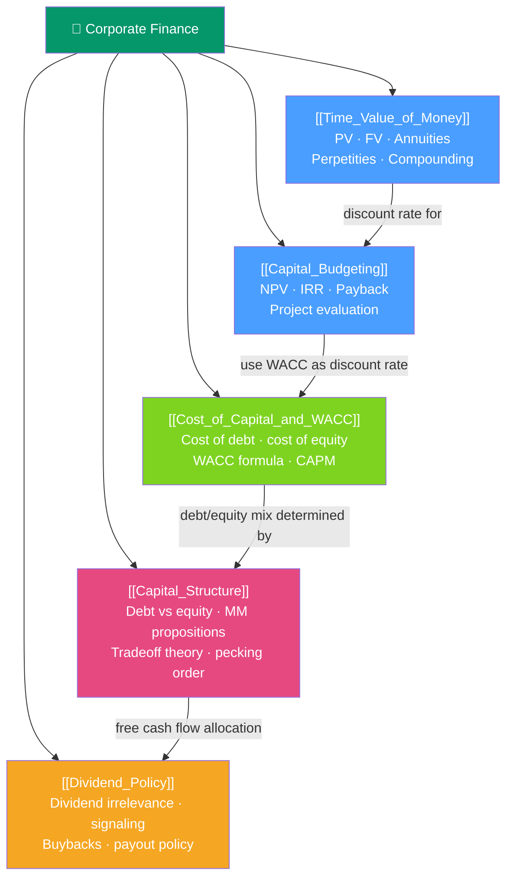

# 🏢 Corporate Finance — Map of Content

> [!abstract] What This Section Covers
> Corporate finance answers the three fundamental decisions every firm faces: **investment decisions** (what assets to invest in — capital budgeting), **financing decisions** (how to fund those assets — capital structure), and **dividend decisions** (how to return value to shareholders). The foundation is **time value of money** — the idea that a dollar today is worth more than a dollar tomorrow. From TVM comes NPV and IRR (the investment decision rules), WACC (the financing cost used as discount rate), Modigliani-Miller (the theory of capital structure), and dividend policy theory. This section is the core of any MBA finance curriculum and the CFA Level 1–2 corporate finance curriculum.

## Concept Map

## Learning Path
1. [[Time_Value_of_Money]] — The mathematical foundation: present value, future value, annuities, perpetuities.
2. [[Capital_Budgeting]] — Using TVM to evaluate investments: NPV, IRR, MIRR, Payback, and real options.
3. [[Cost_of_Capital_and_WACC]] — Calculating the hurdle rate: cost of debt, cost of equity (CAPM), and blending into WACC.
4. [[Capital_Structure]] — The optimal debt/equity mix: Modigliani-Miller, tradeoff theory, pecking order, and market timing.
5. [[Dividend_Policy]] — Returning capital to shareholders: dividends, buybacks, dividend signaling, and payout policy.

## All Notes at a Glance

| Note | Difficulty | What You'll Learn |
|------|------------|-------------------|
| [[Time_Value_of_Money]] | Beginner | PV/FV, annuities, perpetuities, compounding, effective annual rate |
| [[Capital_Budgeting]] | Intermediate | NPV, IRR, MIRR, payback period, profitability index, capital rationing |
| [[Cost_of_Capital_and_WACC]] | Intermediate | Cost of debt, CAPM for cost of equity, WACC formula, unlevered beta |
| [[Capital_Structure]] | Advanced | MM Propositions I and II, tradeoff theory, pecking order, agency costs |
| [[Dividend_Policy]] | Intermediate | Miller-Modigliani dividend irrelevance, signaling, buybacks vs dividends |

## Key Questions This Section Answers
- What is the present value of a future cash flow, and why does the discount rate matter so much?
- How do you calculate NPV and IRR, and which should you use when they conflict?
- What is WACC, and how do you calculate the cost of equity using CAPM?
- Why did Modigliani and Miller say capital structure is irrelevant? What makes it relevant in practice?
- Why do companies pay dividends if it theoretically shouldn't matter?

## Related Sections
- [[_MOC_Finance_Master|↑ Finance Master MOC]]
- [[_MOC_Valuation|→ Valuation]] — WACC and TVM used in DCF analysis
- [[_MOC_Risk_Return|→ Risk & Return]] — CAPM (used in WACC) is covered in depth

#MOC #Finance #corporate-finance
