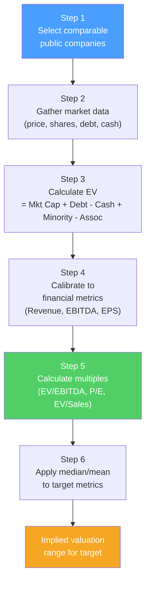

# 📊 Comparable Company Analysis

> [!abstract] TL;DR
> Comparable company analysis ("comps") values a company relative to how similar public companies trade in the market. The core insight: if Company A trades at 12x EV/EBITDA and your target has similar margins and growth, it should also trade near 12x. Key multiples: **EV/EBITDA** (most common in M&A), **P/E** (equity analyst standard), **EV/Revenue** (for money-losing growth companies). Comps give you a "what the market pays" answer vs DCF's "what it's intrinsically worth."

## Intuition — analogy FIRST

Imagine valuing a house. You could estimate its worth from scratch (DCF equivalent: rent it out, discount future rents at cap rate). Or you could look at what comparable houses in the same neighborhood just sold for (comparable company analysis).

The "comps" approach is faster and anchored in real market transactions. If similar 3-bedroom houses in your area sell for $400 per square foot and your 2,000 sq ft house is comparable in quality, it's worth ~$800,000.

The challenge: no two companies are exactly alike (just like no two houses are identical). You need to find the closest comparables and adjust for differences in growth, margins, risk, and capital structure. The analyst's judgment is in selecting the right "neighborhood" of comparables.

---

## How It Works

## Key Concepts / Details

### Enterprise Value (EV)

EV is the total value of the business — what you'd pay to acquire all of it (debt + equity, net of cash):

$$EV = \text{Market Cap} + \text{Total Debt} + \text{Minority Interest} - \text{Cash} - \text{Investments in associates}$$

**Why subtract cash?** If you buy the company, you get the cash — it's a built-in offset to the price.
**Why add debt?** You must repay it — it's an additional cost of acquisition.

**Example**:
- Market cap: $10B
- Total debt: $3B
- Cash: $1.5B
- Minority interest: $0.5B
$$EV = 10 + 3 + 0.5 - 1.5 = \$12B$$

### Key Trading Multiples

| Multiple | Formula | Best For | Pros | Cons |
|---------|---------|---------|------|------|
| **EV/EBITDA** | EV / EBITDA | Most M&A; cyclicals | Capital structure neutral; minimizes D&A differences | EBITDA ≠ cash flow; capex ignored |
| **EV/EBIT** | EV / EBIT | Capital-intensive | Better than EBITDA for high-capex | Affected by D&A differences |
| **EV/Revenue** | EV / Sales | Money-losing growth cos | No profitability required | Ignores margins entirely |
| **P/E** | Price / EPS | Equity analysis | Intuitive; widely used | Affected by leverage; accounting choices |
| **P/B** | Price / Book | Banks, financial firms | Anchored to balance sheet | Less meaningful for intangibles |
| **EV/FCF** | EV / Free Cash Flow | Cash-generating cos | Most cash-flow based | FCF volatile; affected by capex cycles |
| **PEG** | P/E / EPS Growth | Growth stocks | Adjusts for growth | Growth estimation subjective |

### Worked Comps Example: Software Sector

**Target company**: Private SaaS company, LTM EBITDA $100M, Revenue $500M

**Public comparables:**

| Company | EV ($M) | Revenue ($M) | EBITDA ($M) | EV/Revenue | EV/EBITDA |
|---------|---------|-------------|------------|-----------|----------|
| Salesforce | 220,000 | 34,000 | 5,500 | 6.5x | 40.0x |
| ServiceNow | 155,000 | 10,000 | 2,800 | 15.5x | 55.4x |
| Workday | 65,000 | 7,200 | 1,200 | 9.0x | 54.2x |
| HubSpot | 19,000 | 2,200 | 330 | 8.6x | 57.6x |
| Median | | | | **9.0x** | **54.8x** |

**Applying medians to target:**
- EV/Revenue: $500M × 9.0x = **$4,500M**
- EV/EBITDA: $100M × 54.8x = **$5,480M**
- Implied EV range: $4,500M – $5,480M

**Key judgment call**: Is our private target really comparable to these large-cap SaaS companies? Likely some discount for size, liquidity, and market position.

### Selecting Comparables

The most important and subjective step:

**Criteria (in order of priority):**
1. **Industry**: same business model and revenue drivers
2. **Size**: similar revenue/EBITDA (scale affects multiples)
3. **Growth profile**: similar revenue growth rate
4. **Geography**: US vs European vs emerging market companies trade differently
5. **Margins**: similar margin structure
6. **Capital intensity**: similar capex as % of revenue

**4–10 comparables** is the typical range. Too few → statistically weak. Too many → you've diluted the comparability.

**Clean up the data**: calendarize all financials to the same fiscal year-end; use the same definition of EBITDA (strip out stock-based comp in SaaS sector, for example); use diluted shares (including options, warrants, convertibles via treasury stock method).

### LTM vs NTM Multiples

| Basis | Definition | Use |
|-------|-----------|-----|
| **LTM (Last Twelve Months)** | Most recent 4 quarters | Backward-looking; uses actual numbers |
| **NTM (Next Twelve Months)** | Forward 4 quarters of consensus estimates | Forward-looking; reflects expected performance |

M&A transactions typically compare on both. NTM is preferred for growth companies since LTM may not reflect the business's trajectory. **Always disclose the basis used.**

### Multiples Adjustments

**EBITDA normalization**: strip out one-time items (restructuring, M&A costs, litigation), management add-backs, and non-recurring revenue.

**Net debt vs gross debt**: always calculate EV using net debt (debt minus cash), not gross debt, unless cash is restricted.

**Minority interest**: add it to EV at market value (use book if no separate listing), because you're buying 100% of the operating assets but the minority owns part of earnings.

---

## Real-World Notes

- **Tesla vs peers (2021)**: Tesla traded at 100x+ NTM EBITDA vs 8–12x for Toyota, GM, Ford. This was justified by analysts as "Tesla is a tech company" — using software/EV multiples rather than auto multiples. Which comps you select can dramatically change the output.
- **SaaS Rule of 40**: a common adjustment for SaaS companies is to use "Rule of 40" (revenue growth % + FCF margin %) as a normalizing factor. Companies above 40% typically trade at premium multiples.
- **Conglomerate discount**: diversified companies often trade at a 15–25% discount to the sum of their parts valued using pure-play comps — because investors prefer to make their own diversification decisions.
- **Bank multiples**: banks trade on P/Book (tangible book value) not EV/EBITDA — because interest income and deposit liabilities are the core business and EV/EBITDA doesn't apply to financial firms with debt as a product.

---

## Common Pitfalls

- Cherry-picking comparables to reach a desired valuation: use consistent, defensible selection criteria.
- Using unadjusted EBITDA with unusual non-cash items or one-time charges: always normalize.
- Applying the same multiple range to companies at very different growth stages: a 5% grower and a 30% grower deserve different multiples even in the same industry.
- Ignoring share count differences: always use diluted share count (treasury stock method for options); basic share count significantly understates diluted for option-heavy companies.

---

## Related Concepts

- [[_MOC_Valuation|↑ Section MOC]]
- [[DCF_Analysis]] — Intrinsic value cross-check to comps
- [[Precedent_Transactions]] — Acquisition multiples (includes control premium over comps)
- [[Financial_Statement_Analysis]] — Understanding the metrics multiples are applied to
- [[Equity_Research]] — How analysts use comps in investment recommendations

## Review Questions

1. A company has a $5B market cap, $2B total debt, and $800M cash. Calculate its enterprise value. Why do we subtract cash from EV?
2. You're valuing a private logistics company using EV/EBITDA comps. You find three comparable public companies with EV/EBITDA multiples of 10x, 12x, and 15x. The target has $200M EBITDA. What valuation range do you get? What discount, if any, should you apply for being private?
3. Why might two companies in the same industry trade at very different EV/EBITDA multiples? Give three company-specific factors that would justify a premium multiple.

## Sources

- Rosenbaum, Joshua, and Pearl, Joshua, *Investment Banking: Valuation, LBOs, M&A, and IPOs*, 3rd edition (Ch. 3)
- Damodaran, Aswath, *The Little Book of Valuation*
- CFA Institute, *CFA Program Curriculum* Level 2 — Equity Valuation

#finance #valuation #comps #EV-EBITDA #trading-multiples
