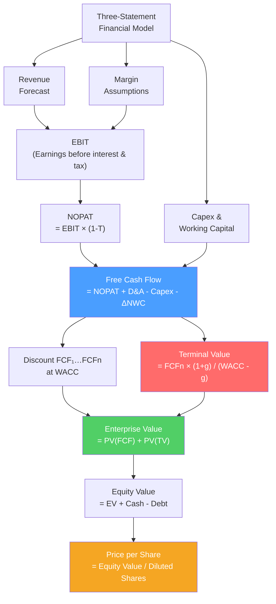

# 📉 DCF Analysis

> [!abstract] TL;DR
> DCF (Discounted Cash Flow) is the gold standard of intrinsic valuation — it asks "what is this business worth based on its future cash flows?" You forecast **free cash flow** (operating cash flow minus capex), discount it at **WACC**, and add a **terminal value** for cash flows beyond the forecast period. $Value = \sum \frac{FCF_t}{(1+WACC)^t} + \frac{TV}{(1+WACC)^n}$. Terminal value typically represents 60–80% of total DCF value — making growth and WACC assumptions critically important.

## Intuition — analogy FIRST

Buying a business is like buying a goose that lays golden eggs.

The goose's value isn't its feathers — it's the eggs it will lay in the future. To figure out what to pay today, you forecast how many eggs each year, translate them into cash, and discount back to today (because a golden egg next year is worth less than one today).

The tricky part: the goose lays eggs forever, but you can only forecast realistically for 5–10 years. So you calculate a **terminal value** — what the goose is worth at year 10, assuming it then lays eggs at a steady, slow growth rate forever (Gordon Growth Model). This is almost always the biggest part of the answer.

**DCF is not about predicting the future precisely — it's about being explicit about your assumptions so you can stress-test them.**

---

## How It Works

## Key Concepts / Details

### Free Cash Flow (FCF)

DCF uses **unlevered free cash flow** (UFCF) — cash generated by operations independent of financing:

$$UFCF = EBIT \times (1-T) + D\&A - \Delta NWC - Capex$$

Or equivalently:
$$UFCF = NOPAT + D\&A - \Delta NWC - Capex$$

Where:
- $EBIT \times (1-T)$ = **NOPAT** (Net Operating Profit After Tax) — operating profit as if the firm were unlevered
- $D\&A$ = Depreciation & Amortization (non-cash add-back)
- $\Delta NWC$ = Change in net working capital (cash used to fund growth)
- $Capex$ = Capital expenditure (investment in fixed assets)

**Why unlevered FCF?** You discount at WACC (which includes the cost of debt), so using pre-interest cash flows (unlevered) avoids double-counting the debt benefit.

### Worked DCF Example

**Tech company, Year 1–5 projection:**

| Year | Revenue | EBITDA (25%) | D&A | EBIT | NOPAT (25%T) | D&A | Capex | ΔNWC | UFCF |
|------|---------|-------------|-----|------|-------------|-----|-------|------|------|
| 1 | $500M | $125M | $30M | $95M | $71M | $30M | -$40M | -$10M | $51M |
| 2 | $575M | $144M | $32M | $112M | $84M | $32M | -$46M | -$11M | $59M |
| 3 | $660M | $165M | $35M | $130M | $98M | $35M | -$52M | -$13M | $68M |
| 4 | $760M | $190M | $38M | $152M | $114M | $38M | -$60M | -$15M | $77M |
| 5 | $875M | $219M | $42M | $177M | $133M | $42M | -$70M | -$17M | $88M |

**WACC = 10%, terminal growth rate = 3%**

**Discounted FCF:**

| Year | FCF | PV Factor (10%) | PV of FCF |
|------|-----|----------------|-----------|
| 1 | $51M | 0.909 | $46M |
| 2 | $59M | 0.826 | $49M |
| 3 | $68M | 0.751 | $51M |
| 4 | $77M | 0.683 | $53M |
| 5 | $88M | 0.621 | $55M |
| **Sum** | | | **$254M** |

**Terminal Value (Gordon Growth Model):**
$$TV = \frac{FCF_5 \times (1+g)}{WACC - g} = \frac{88 \times 1.03}{0.10 - 0.03} = \frac{90.6}{0.07} = \$1{,}294M$$

$$PV(TV) = \frac{1{,}294}{1.10^5} = \frac{1{,}294}{1.611} = \$803M$$

**Enterprise Value = $254M + $803M = $1,057M**

Note: TV ($803M) = 76% of total EV. **Terminal value dominates DCF — always stress-test it.**

**From EV to equity value:**
- Enterprise Value: $1,057M
- Less: Net Debt (debt − cash): -$150M
- Equity Value: $907M
- Divided by diluted shares: 100M
- **Implied share price: $9.07**

### Terminal Value Approaches

| Method | Formula | Use |
|--------|---------|-----|
| **Gordon Growth Model (perpetuity)** | $\frac{FCF_{n+1}}{WACC - g}$ | Most common; simple; sensitive to g and WACC |
| **Exit multiple** | $EBITDA_n \times \text{EV/EBITDA multiple}$ | Cross-checks DCF with comps; anchors on observed market multiples |

**Exit multiple approach** for the example above:
- Year 5 EBITDA = $219M
- Industry EV/EBITDA = 12x
- TV = $219M × 12x = $2,628M
- PV(TV) = $1,630M
- EV = $254M + $1,630M = $1,884M

The range from the two methods ($1,057M – $1,884M) illustrates DCF's inherent uncertainty.

### Key DCF Sensitivities

A one-way sensitivity table on WACC and growth rate is standard:

|  | g = 2% | g = 3% | g = 4% |
|--|--------|--------|--------|
| **WACC = 9%** | $1,131M | $1,374M | $1,759M |
| **WACC = 10%** | $909M | $1,057M | $1,261M |
| **WACC = 11%** | $760M | $862M | $1,000M |

The range can be 2–3x — hence the importance of combining with comps (sanity check).

### Common DCF Adjustments

**Non-operating assets**: add back:
- Excess cash (cash above operating needs)
- Investments in associates
- Value of unused real estate

**Non-equity claims**: subtract:
- Total debt (including finance leases, pension liabilities)
- Minority interests
- Employee stock options value

**Convergence in WACC**: if the company currently has no/high debt but target is different, the WACC should gradually converge (use APV approach or iterative WACC).

---

## Real-World Notes

- **Amazon's DCF challenge (2001)**: At the dot-com peak, Amazon had no earnings. A DCF in 2001 with the right FCF ramp-up would have implied a huge terminal value — but required faith in decade-long loss-making growth. Amazon's AWS (launched 2006) wasn't even in the picture — illustrating how terminal value captures options not yet visible.
- **Goldman's Apple DCF (2012)**: When Apple traded at $400 (pre-split), Goldman's DCF used 10-year projections with iPhone growth slowing to 3% terminal. The model implied $700 fair value. Apple subsequently traded as high as $3T market cap — showing that even expert DCFs are highly sensitive to the growth assumptions.
- **WeWork DCF (2019)**: With -$1.9B in EBITDA and 5-year losses projected, a DCF required extreme growth assumptions to justify the $47B valuation SoftBank assigned. After S-1 disclosure, the DCF-implied value was $8–20B — the IPO was cancelled.
- **Aswath Damodaran's practice**: Damodaran (NYU Stern) publishes DCFs for major companies annually at damodaran.com — excellent for learning the craft.

---

## Common Pitfalls

- Over-relying on terminal value without stress-testing it: if TV is 90%+ of EV, your model is driven almost entirely by a perpetuity growth assumption.
- Using nominal cash flows with real discount rate (or vice versa): must be consistent throughout.
- Double-counting the debt tax shield: if using UFCF, discount at WACC (which includes tax shield). If using FCFE, discount at cost of equity.
- Not normalizing for the terminal year: year 5 FCF should reflect normalized capex (= D&A for steady-state) and working capital, not the growth-phase assumptions.
- Circular references in WACC (WACC depends on D/V which depends on value): use iterative calculation or APV.

---

## Related Concepts

- [[_MOC_Valuation|↑ Section MOC]]
- [[Time_Value_of_Money]] — The discounting math underlying DCF
- [[Cost_of_Capital_and_WACC]] — The discount rate
- [[Three_Statement_Model]] — Produces the FCF inputs
- [[Comparable_Company_Analysis]] — The market-based cross-check
- [[Scenario_and_Sensitivity_Analysis]] — How to stress-test DCF assumptions

## Review Questions

1. Calculate the terminal value of a company that generates $100M FCF in year 5, using: (a) Gordon Growth Model at 3% growth and 9% WACC, and (b) exit multiple of 10x EV/EBITDA if year-5 EBITDA is $150M. Why do the two methods give different answers?
2. A DCF produces an enterprise value of $2.5B. The company has $500M cash, $800M debt, and 200M diluted shares. Calculate equity value and implied share price.
3. Why does terminal value often represent 70–80% of total DCF enterprise value? What does this tell us about the precision of DCF analysis?

## Sources

- Damodaran, Aswath, *Investment Valuation*, 3rd edition, Ch. 12–15
- Koller, Goedhart, Wessels (McKinsey), *Valuation: Measuring and Managing the Value of Companies*, 7th edition
- CFA Institute, *CFA Program Curriculum* Level 2 — Equity Valuation

#finance #valuation #DCF #discounted-cash-flow #WACC #terminal-value
