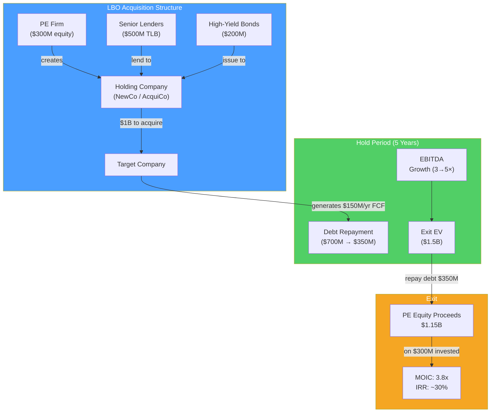

# 🔒 LBO Analysis

> [!abstract] TL;DR
> A leveraged buyout (LBO) is the acquisition of a company using a large proportion of borrowed money (debt), with the assets of the acquired company serving as collateral. Private equity firms use LBOs to amplify equity returns: use $300M equity + $700M debt to buy a $1B company; if it grows to $1.5B, your $300M equity becomes $800M — a 2.7x return. Key metrics: **IRR** (target 20–25%+) and **MOIC** (target 2–3x). The maximum price a PE firm can pay is the "LBO floor" in a valuation football field.

## Intuition — analogy FIRST

Imagine buying a $500,000 house with $100,000 down (20% equity) and $400,000 mortgage. The house appreciates to $700,000 in 5 years. Your return:

- Sold for $700K, repaid $400K mortgage → $300K cash back
- On your $100K investment → 3x return (200% gain)

The house only appreciated 40%, but your equity earned 200% because leverage amplified your returns. If you'd paid all cash, you'd have $200K gain on $500K = 40% total return.

LBOs work the same way — but instead of a house, it's a company. And instead of rental income, the company's cash flow services the debt. The PE firm uses the company's own cash flows to repay the debt over 3–7 years, then sells the (now mostly debt-free) company at a profit.

---

## How It Works

## Key Concepts / Details

### LBO Sources and Uses

The acquisition is funded by a mix of debt and equity:

**Typical LBO capital structure:**

| Source | % of Total | Type |
|--------|-----------|------|
| Senior secured term loan (TLB) | 40–50% | Floating rate, 7-year maturity |
| Second lien / mezzanine | 5–15% | Higher rate, subordinated |
| High-yield bonds | 10–20% | Fixed rate, 8–10 year |
| PE equity contribution | 25–40% | Residual / last dollar |

**Example: $1B acquisition, 60% debt:**

| Sources | Amount | Uses | Amount |
|---------|--------|------|--------|
| Senior TLB | $450M | Purchase equity | $1,000M |
| HY Bonds | $150M | Repay existing debt | $50M |
| PE equity | $400M | Transaction fees | $20M |
| Management rollover | $50M | Working capital | $30M |
| **Total** | **$1,050M** | | **$1,100M** |

Wait — Sources ≠ Uses? Add revolver draw or adjust. In real models these always balance.

### LBO Return Metrics

**MOIC (Multiple of Invested Capital)**:
$$MOIC = \frac{\text{Equity proceeds at exit}}{\text{Equity invested}}$$

**IRR (Internal Rate of Return)**: the annualized compound return on equity invested. Calculated as the IRR of the equity cash flows (initial investment as negative, exit proceeds as positive).

**Rule of thumb** (approximate relationship):

| Hold period | MOIC for 20% IRR | MOIC for 25% IRR |
|-------------|-----------------|-----------------|
| 3 years | 1.73x | 1.95x |
| 4 years | 2.07x | 2.44x |
| 5 years | 2.49x | 3.05x |
| 6 years | 2.99x | 3.81x |

Target return: top-quartile PE funds target **IRR > 20–25%** and **MOIC > 2.5–3x**.

### LBO Value Creation Levers

Three and only three ways to create value in an LBO:

1. **EBITDA growth**: increase revenue or margins → higher exit EBITDA → higher enterprise value
   - Organic growth, add-on acquisitions, pricing power
   - Most important lever; drives 60–70% of returns in well-performing LBOs

2. **Multiple expansion**: exit at a higher EV/EBITDA multiple than you paid
   - Market timing (buy in recession, sell in bull market)
   - Improved business quality (diversification, recurring revenue, margin improvement)
   - Sometimes luck (rate environment changes)

3. **Debt paydown**: FCF reduces debt → equity value increases for the same EV
   - Most predictable lever
   - Companies with strong FCF make great LBO targets for this reason

$$\text{Exit Equity Value} = \text{Exit EV} - \text{Net Debt at Exit}$$
$$= (EBITDA_{exit} \times \text{Exit Multiple}) - (Entry Debt - \text{Debt Paydown})$$

### Worked LBO Example

**Entry (Year 0)**:
- Entry EV: $1,000M
- Entry EV/EBITDA: 10x → LTM EBITDA: $100M
- Debt: $600M (60% leverage)
- PE equity: $400M (40%)
- Revolver (undrawn): $50M

**Operations (Years 1–5)**:
- EBITDA grows 8%/year: $100M → $147M by Year 5
- FCF after interest = ~$50M/year (after debt service)
- Debt paydown from FCF: $250M total over 5 years
- Year 5 net debt: $600M - $250M = **$350M**

**Exit (Year 5)**:
- Exit EV/EBITDA: 12x (multiple expansion from 10x entry)
- Exit EBITDA: $147M
- Exit EV: $147M × 12x = **$1,764M**
- Exit equity: $1,764M – $350M = **$1,414M**

**Returns:**
$$MOIC = \frac{\$1,414M}{\$400M} = \mathbf{3.5x}$$

$$IRR \approx \left(\frac{1,414}{400}\right)^{1/5} - 1 = 3.5^{0.2} - 1 = 28.6\%$$

Excellent LBO returns — both EBITDA growth *and* multiple expansion contributed.

### LBO Target Characteristics

Ideal LBO candidate:

| Characteristic | Why it matters |
|---------------|----------------|
| **Strong, predictable cash flows** | Must service debt; volatile FCF → distress risk |
| **Low existing leverage** | More room to add debt |
| **Tangible assets** | Collateral for loans |
| **Non-cyclical industry** | Protects against recession during hold period |
| **Management improvement opportunity** | Operational value creation |
| **Clear exit options** | Strategic buyers, IPO, or another PE sale |
| **Defensive competitive position** | Moat prevents EBITDA erosion |

**Classic LBO sectors**: industrial manufacturing, healthcare services, business services, consumer brands (with stable demand).

**Poor LBO candidates**: early-stage tech, highly cyclical companies (airlines, commodity), capital-intensive businesses (semiconductors), businesses with regulatory risk.

### Leveraged Credit Metrics

Lenders assess LBO risk using:

| Metric | Typical threshold |
|--------|------------------|
| **Leverage ratio (Net Debt/EBITDA)** | < 6.0x for TLB; < 7.5x total |
| **Interest coverage (EBITDA/Interest)** | > 2.0x minimum |
| **Debt/EBITDA at exit (assumed)** | < 4.0x (clean exit) |
| **FCF conversion (FCF/EBITDA)** | > 30–40% (after interest, taxes, capex) |

---

## Real-World Notes

- **KKR / RJR Nabisco (1988, $25B)**: The defining LBO — immortalized in *Barbarians at the Gate*. Used 80%+ debt, leveraging RJR's stable cigarette cash flows. KKR paid 25x earnings, sparking debate about whether LBOs create or destroy value.
- **Blackstone / Hilton Hotels (2007, $26B)**: Bought at LBO peak with heavy leverage. Hilton nearly defaulted during the 2008-2009 recession. But hotel business recovered; Hilton IPO'd in 2013. Blackstone made $14B profit — one of the most profitable LBOs ever.
- **PE in healthcare**: Hospital Corporation of America (HCA) went private in 2006 for $33B (then the largest LBO). Relisted in 2011; PE sponsors made ~5x. HCA's reliable insurance reimbursement cash flows made it an ideal LBO target.
- **The 2022 LBO freeze**: When rates rose from 0.25% to 5.25%, debt for LBOs became much more expensive. Elon Musk's Twitter LBO ($13B debt at 10%+ rates) left banks unable to sell the loans at par — "hung debt." LBO deal volume fell 75% in 2022–2023 from 2021 peak.

---

## Common Pitfalls

- Confusing MOIC and IRR: a 3x MOIC in 3 years (44% IRR) vs 3x in 7 years (17% IRR) are very different results. Always calculate both.
- Assuming all EBITDA is available for debt service: capex, taxes, and working capital changes consume cash before debt repayment. Model free cash flow carefully.
- Ignoring the PIK toggle (payment-in-kind): some bonds allow interest to accrue rather than be paid cash; this hides cash flow problems but increases total debt.
- Using entry leverage as the permanent structure: banks require amortizing term loans (1% per year minimum); debt should decline through the hold period.

---

## Related Concepts

- [[_MOC_Valuation|↑ Section MOC]]
- [[Capital_Structure]] — LBOs are the extreme application of capital structure theory
- [[DCF_Analysis]] — LBO equity IRR is similar to DCF from PE's perspective
- [[Mergers_and_Acquisitions]] — LBO is a specific form of acquisition
- [[Three_Statement_Model]] — LBO models require full three-statement modeling

## Review Questions

1. A PE firm buys a company for $500M (7x entry EV/EBITDA, $71.4M EBITDA) using $325M debt and $175M equity. After 5 years, EBITDA has grown to $100M, and they exit at 8x EV/EBITDA. Remaining debt is $200M. Calculate exit equity value, MOIC, and approximate IRR.
2. What are the three ways a PE firm can generate returns in an LBO? Which is the most reliable, which is most affected by market conditions, and which is most dependent on management skill?
3. Why is strong free cash flow the most critical characteristic of an LBO target? Explain using the debt service math: if a company has $300M debt at 8% interest rate and generates $100M EBITDA, is it a viable LBO candidate? (Assume 20% tax, 10% capex, no D&A add-back needed.)

## Sources

- Rosenbaum, Joshua, and Pearl, Joshua, *Investment Banking: Valuation, LBOs, M&A, and IPOs*, 3rd edition (Ch. 5)
- Burrough, Bryan, and Helyar, John, *Barbarians at the Gate* (1990)
- Kaplan, Steven, and Strömberg, Per, "Leveraged Buyouts and Private Equity" (Journal of Economic Perspectives, 2009)

#finance #valuation #LBO #private-equity #leveraged-buyout #IRR #MOIC
