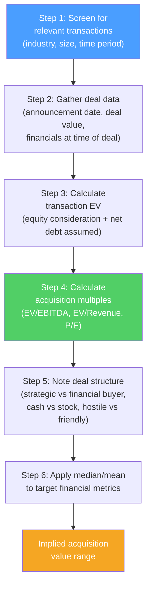

# 🤝 Precedent Transactions

> [!abstract] TL;DR
> Precedent transactions analysis values a company by examining what acquirers paid for similar companies in past M&A deals. Because acquirers must pay a **control premium** (typically 20–40% above the unaffected stock price) to win deals, transaction multiples are almost always higher than comparable trading multiples. This analysis answers: "what would an acquirer pay?" vs comps' "what does the market pay day-to-day?" Used heavily in M&A fairness opinions, sell-side advisory, and setting acquisition expectations.

## Intuition — analogy FIRST

To value a house for sale, you can look at what similar houses are currently listed at (comparable trading companies) vs what similar houses *actually sold for* in recent transactions (precedent transactions).

The "sold for" price is almost always higher than the "listed" price because buyers compete and negotiate, and sellers demand a premium to give up control. If the neighborhood's listed houses are at $400/sq ft but recent sales average $480/sq ft — that 20% premium reflects the competition dynamic.

In M&A, the equivalent is the **control premium**: acquirers must pay above the current stock price (which reflects minority-stake, no-control value) to convince shareholders to sell their controlling interest. The "acquisition price" (transaction multiple) thus always exceeds the "trading price" (trading multiple) by the control premium.

---

## How It Works

## Key Concepts / Details

### Control Premium

The control premium is the percentage above the target's pre-announcement stock price that the acquirer pays:

$$\text{Control Premium} = \frac{\text{Acquisition price per share} - \text{Unaffected price per share}}{\text{Unaffected price per share}} \times 100\%$$

**Unaffected price**: the stock price before any rumor or announcement of the deal (typically 1-month or 52-week avg pre-announcement).

**Historical averages (US M&A)**:
| Target type | Typical control premium |
|-------------|------------------------|
| US public company acquisitions | 25–40% |
| Hostile takeovers | 35–50% |
| Financial buyer (LBO) | 20–35% |
| Strategic buyer (synergies) | 30–50% |

**Why is there a control premium?**
1. **Synergies**: strategic buyers can cut costs or grow revenue post-merger
2. **Control**: owning 100% lets you make all decisions — this autonomy has value
3. **Competition**: multiple bidders compete in auctions → price discovery pushes price up
4. **Undiscovered value**: acquirer may have better information about target potential

### Transaction EV Calculation

$$\text{Transaction EV} = \text{Equity consideration} + \text{Net debt assumed}$$

For a cash deal: equity consideration = offer price × shares outstanding (fully diluted)

**Example — Microsoft / Activision Blizzard (2022)**:
- Offer price: $95.00/share (68.7% premium to pre-announcement price)
- Diluted shares: ~800M
- Equity consideration: $95 × 800M = **$76B**
- Net debt assumed: -$0 (Activision had net cash)
- Transaction EV: **$76B**
- LTM EBITDA: ~$3.2B
- Transaction EV/EBITDA: **23.8x**

vs. Activision's pre-deal trading multiple of ~14x → **premium of ~70%** over unaffected trading multiple.

### Transaction vs Trading Multiples

| Feature | Trading Comps | Precedent Transactions |
|---------|--------------|----------------------|
| **Premium included?** | No — minority, no-control value | Yes — control premium included |
| **Synergies?** | No | Yes (for strategic deals) |
| **Market conditions** | Current | Historical (may be dated) |
| **Multiples level** | Lower | Higher (control + synergies) |
| **Use** | "What's it worth in the market?" | "What would a buyer pay?" |

**Rule of thumb**: transaction multiples typically run 20–40% above comparable trading multiples. Use both in a "football field" range.

### Deal Sources and Data

| Source | Content | Access |
|--------|---------|--------|
| **Bloomberg** | Comprehensive M&A database | Subscription |
| **Capital IQ (S&P)** | Deal terms, multiples, financials | Subscription |
| **Refinitiv (LSEG)** | Global M&A data | Subscription |
| **Thomson One** | Historical deal database | Subscription |
| **SEC EDGAR** | Public company proxies (DEF 14A), merger agreements | Free |
| **Mergerstat** | Premium statistics | Publication |
| **Press releases** | Deal announcements | Free (PRN, GN wire) |

**The "fairness opinion"**: investment banks advise boards whether a deal price is "fair" from a financial point of view — the analysis always includes precedent transactions.

### Worked Precedent Transactions: Industrial Manufacturing

**Target**: Private industrial equipment company, $80M EBITDA, $600M Revenue

**Relevant precedents (last 5 years):**

| Deal | Date | Acquirer | Target | EV ($M) | EBITDA ($M) | EV/EBITDA | Strategic? |
|------|------|---------|--------|---------|------------|----------|-----------|
| A | 2023 | Corp A | Corp B | $1,200M | $110M | 10.9x | Yes |
| B | 2022 | PE Fund | Corp C | $640M | $60M | 10.7x | No (LBO) |
| C | 2021 | Corp D | Corp E | $950M | $85M | 11.2x | Yes |
| D | 2021 | Corp F | Corp G | $420M | $45M | 9.3x | No (LBO) |
| E | 2020 | Corp H | Corp I | $800M | $70M | 11.4x | Yes |
| **Median** | | | | | | **10.9x** | |
| **Strat. Median** | | | | | | **11.2x** | |
| **Financial Median** | | | | | | **10.0x** | |

**Implied valuation (80M EBITDA):**
- Strategic buyer: $80M × 11.2x = **$896M**
- Financial buyer: $80M × 10.0x = **$800M**
- Overall: $80M × 10.9x = **$872M**

vs. trading comps for comparable public companies at 8–9x EBITDA:
- Implied control premium: 11x / 8.5x − 1 = **29%** — consistent with historical average.

### Adjustments and Nuances

**Time weighting**: older transactions (3–5 years) may not reflect current market conditions (interest rate environment, sector multiples). Weight recent deals more heavily.

**Strategic vs financial buyer**: strategic deals include synergies → higher multiples. For a standalone valuation or LBO, use financial buyer comps.

**Deal structure**: all-cash deals typically command slightly higher premiums than stock-for-stock (target shareholders take acquisition risk in stock deals). Hostile takeovers command higher premiums.

**Market conditions at deal time**: transactions done in 2021 (low rates, easy credit) carry higher multiples than 2023 (high rates, tighter credit). Adjust for the rate environment.

---

## Real-World Notes

- **Elon Musk's Twitter acquisition (2022)**: $54.20/share, 38% premium to unaffected price (~$39), transaction EV ~$44B. Twitter LTM EBITDA: ~$1.3B → EV/EBITDA ~34x. Extremely high multiple even for strategic/private (social media comps traded at 10–15x). Musk paid a premium for control/optionality — classic strategic buyer logic.
- **Microsoft / LinkedIn (2016)**: $26.2B acquisition at 86 premium and ~34x EV/EBITDA vs LinkedIn's trading multiple of ~22x. Microsoft justified this with data and cross-sell synergies. Premium of ~55% over trading.
- **Pfizer / Allergan failed (2016)**: Pfizer attempted a $160B inversion merger with Allergan to lower its tax rate. The US Treasury changed the rules mid-deal, killing it. Illustrates that precedent transaction analysis must account for deal risk (regulatory, financing).

---

## Common Pitfalls

- Including too few transactions: with 3–4 deals, the median is highly sensitive to outliers. Try to find 8–12 relevant precedents.
- Comparing strategic and financial buyer multiples without distinguishing them: PE buyers use less leverage in high-rate environments, driving down multiples.
- Using dated transactions without adjustment: 2020–2021 M&A multiples (peak easy-money era) were 20–40% above 2023 levels in many sectors.
- Ignoring deal-specific circumstances: failed auctions, distressed sellers, or hostile bids all affect premiums in non-comparable ways.

---

## Related Concepts

- [[_MOC_Valuation|↑ Section MOC]]
- [[Comparable_Company_Analysis]] — Trading comps (lower multiples; no control premium)
- [[DCF_Analysis]] — Intrinsic value cross-check
- [[Mergers_and_Acquisitions]] — Full M&A deal mechanics
- [[LBO_Analysis]] — Financial buyer perspective on transaction pricing

## Review Questions

1. A company's stock trades at $40/share. An acquirer offers $54/share. Calculate the control premium. Why does an acquirer typically pay this premium over the trading price?
2. You're advising a target company's board on whether to accept a $2.5B acquisition offer. The company has $200M EBITDA. Comparable public companies trade at 9x EBITDA. Comparable acquisition deals in the past 3 years show a range of 11x–14x EBITDA. Is the offer fair? What additional information would you want?
3. What is the "unaffected stock price" and why must you use it rather than the current (post-announcement) price when calculating a control premium?

## Sources

- Rosenbaum, Joshua, and Pearl, Joshua, *Investment Banking: Valuation, LBOs, M&A, and IPOs*, 3rd edition (Ch. 4)
- Mergerstat / BVR, *Control Premium Study*
- Bruner, Robert F., *Applied Mergers and Acquisitions*

#finance #valuation #precedent-transactions #M&A #control-premium
