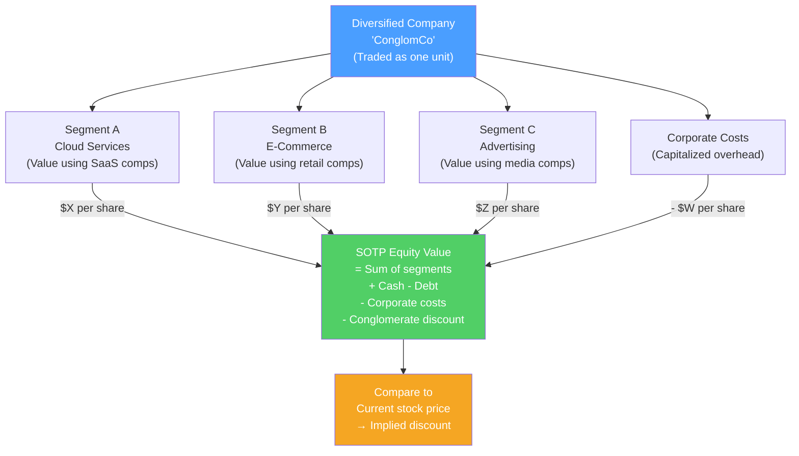

# 🧩 Sum of Parts Valuation

> [!abstract] TL;DR
> Sum-of-parts (SOTP) valuation values a diversified company by summing the separate values of its constituent businesses, each valued using appropriate metrics (DCF, trading multiples, or NAV). It is used for conglomerates, holding companies, and companies with clearly distinct business segments. The key insight: a diversified company often trades at a **conglomerate discount** of 10–25% below the sum of its parts — creating activist investor opportunities to "break up" the company and unlock value. The canonical example: Amazon's cloud (AWS) vs e-commerce separation arguments.

## Intuition — analogy FIRST

Imagine you own a pizza restaurant, a car wash, and a bookstore under one holding company. If each business would be worth $1M separately (because buyers would pay full pizza-restaurant, car-wash, or bookstore multiples), but together the holding company sells at $2.5M — there's a $500K "conglomerate discount."

Why the discount? Investors prefer to buy pure-play businesses (they can diversify on their own). A holding company adds management complexity, potential cross-subsidization of poor businesses by good ones, and lack of transparency. If you could spin off each business separately, you'd unlock the full $3M.

SOTP is the analyst's tool for finding where this $500K discount hides — and arguing that a spinoff or sale would create shareholder value.

---

## How It Works

## Key Concepts / Details

### When to Use SOTP

Use SOTP when:
- Company operates in **2+ clearly distinct business segments** with different risk/growth profiles
- Segments would trade at **very different multiples** as standalone companies
- There is meaningful **cross-segment corporate overhead** to strip out
- The company is a holding company or conglomerate
- An activist investor is arguing for a spinoff or breakup

Do NOT use SOTP when segments are integrated and can't be meaningfully separated (e.g., a vertically integrated manufacturer where R&D, manufacturing, and sales are inseparable).

### SOTP Mechanics

**Step 1: Identify and define segments**
Use the company's segment reporting (SEC filings require disclosure of operating segments with revenue, profit, and assets). Ensure segments are meaningful and separable.

**Step 2: Select valuation methodology per segment**

| Segment type | Preferred methodology |
|-------------|----------------------|
| High-growth tech / SaaS | EV/Revenue or DCF (high growth) |
| Mature / cyclical industrial | EV/EBITDA using comps |
| Real estate | NAV (Net Asset Value = assets at market less debt) |
| Financial services | P/Book or P/Earnings |
| Resources / commodities | DCF with commodity price deck |
| Regulated utilities | Regulated asset base (RAB) × multiple |

**Step 3: Find pure-play comparables for each segment**
This is the key advantage of SOTP — you use segment-specific comps rather than a blended multiple that fits no segment precisely.

**Step 4: Sum segment values and adjust**

$$SOTP\;EV = \sum_{i=1}^{n} \text{Segment}_{i}\;EV - PV(\text{Unallocated Corporate Costs})$$

$$SOTP\;Equity\;Value = SOTP\;EV + \text{Cash} - \text{Debt} \pm \text{Other adjustments}$$

$$SOTP\;Price\;per\;Share = \frac{SOTP\;Equity\;Value}{\text{Diluted Shares}}$$

**Corporate cost adjustment**: corporate overhead not allocated to segments (CEO, group finance, legal) must be capitalized and subtracted. Typical approach: divide unallocated EBITDA impact by blended EBITDA multiple.

### Worked Example: Amazon SOTP (Approximate 2023)

Amazon reports three major segments. Let's build a simplified SOTP:

| Segment | AWS (Cloud) | North America E-comm | International E-comm | Advertising |
|---------|------------|---------------------|---------------------|------------|
| Revenue | $91B | $248B | $131B | $47B |
| Operating Income | $25B | $15B | -$2.7B | ~$22B |
| Comp sector | SaaS/cloud | Retail | Retail | Digital media |
| Comp multiple | 25x EV/EBIT | 12x EV/EBIT | Loss — EV/Rev 0.5x | 20x EV/EBIT |
| **Segment EV** | **$625B** | **$180B** | **$66B** | **$440B** |

**Sum of segment EVs: ~$1,311B**

Add:
- Cash & investments: +$70B
- Less: Total debt: -$150B
- Less: Corporate costs (capitalized): -$50B

**SOTP Equity Value: ~$1,181B**

**Amazon market cap (2023 average): ~$1,300B**

Amazon traded at a modest *premium* to SOTP, indicating the market was pricing in growth optionality beyond current segments.

**The "AWS unlock" thesis**: Some analysts argue AWS alone would be worth $600B+ as a standalone SaaS company vs its value embedded in Amazon. Separating it could unlock ~$200–300B of "hidden" value.

### Conglomerate Discount

The **conglomerate discount** is the persistent observation that diversified companies trade below their SOTP values:

| Study | Average discount |
|-------|----------------|
| Berger & Ofek (1995) | 13–15% |
| Lamont & Polk (2002) | 10–15% |
| Ushijima (2020, Japan) | 20–30% |

**Causes of the discount:**
1. **Investor preference for pure plays**: investors can diversify themselves; they don't pay for conglomerate diversification
2. **Capital allocation inefficiency**: weak divisions subsidized by strong ones ("socialism" of internal capital markets)
3. **Management complexity**: running multiple unrelated businesses is harder; generalist management inferior to focused specialists
4. **Transparency discount**: harder for investors to analyze; less accurate pricing
5. **Agency costs**: entrenched management builds empires instead of returning capital

**Eliminating the discount**: spinoffs, split-offs, carve-outs, or outright sale of divisions. Research shows spinoffs typically trade up 10–20% on announcement.

### NAV Approach (Asset-Based SOTP)

For holding companies, real estate, or resource companies, **Net Asset Value (NAV)** is preferred:

$$NAV = \text{Market value of assets} - \text{Market value of liabilities}$$

**Berkshire Hathaway NAV approach:**
1. Value each major business (insurance, railroads, utilities, manufacturing) using comps
2. Mark equity portfolio to market (Berkshire publishes full holdings)
3. Add cash and equivalents
4. Subtract debt
5. Divide by shares

Berkshire typically trades at a 20–30% premium to NAV because of Buffett's reputation and the float from insurance operations.

---

## Real-World Notes

- **GE's 2018 breakdown**: GE conglomerate (aviation, healthcare, power, finance) had traded at a conglomerate discount for years. Under CEO Larry Culp, it announced a three-way breakup (GE Aerospace, GE HealthCare, GE Vernova). All three have outperformed the original combined stock post-separation.
- **AT&T / WarnerMedia spin-off (2022)**: AT&T spun off WarnerMedia (merged with Discovery to form WBD). Thesis: telecom and media deserve different multiples; the conglomerate structure was destroying value. WBD traded poorly initially but AT&T stock recovered — consistent with unlocking the telecom pure-play multiple.
- **Alphabet's reported segments**: Google parent reports segments (Google Services, Google Cloud, Other Bets) partly to enable SOTP valuation by analysts — Cloud trades at SaaS multiples, Other Bets as a venture portfolio.
- **Elliott Management vs Salesforce (2023)**: Elliott took a >$1B position and argued Salesforce should separate its Tableau and Mulesoft acquisitions or cut costs. Pure SOTP and operational efficiency activism.

---

## Common Pitfalls

- Adding up segment revenues instead of segment EV (revenues are not values — you must apply multiples to the right metric).
- Forgetting corporate costs: unallocated group overhead can reduce SOTP by 10–15% if large — ignoring it overstates the sum.
- Using wrong comparables per segment: applying the same retail multiple to both an e-commerce division and a cloud division produces a meaningless blend.
- Double-counting intercompany revenues: if Segment A sells to Segment B at marked-up prices, the eliminations must be handled carefully.
- Applying a "conglomerate discount" subjectively: the discount should be the residual between observed trading value and SOTP, not a number pulled from thin air.

---

## Related Concepts

- [[_MOC_Valuation|↑ Section MOC]]
- [[DCF_Analysis]] — Used for individual segments in SOTP
- [[Comparable_Company_Analysis]] — Pure-play comps are the heart of SOTP
- [[Mergers_and_Acquisitions]] — Breakups are reverse M&A transactions
- [[Equity_Research]] — Analysts build SOTP models to identify undervalued conglomerates

## Review Questions

1. A conglomerate has two divisions: a software business ($50M EBITDA, comps trade at 20x EV/EBITDA) and an industrial business ($100M EBITDA, comps trade at 8x EV/EBITDA). Corporate costs are $20M EBITDA; use a 12x blended multiple for these. Net debt is $200M, 100M shares outstanding. Calculate SOTP enterprise value and implied share price.
2. What is the conglomerate discount and what are three structural reasons why diversified companies trade below their sum-of-parts value?
3. Amazon's AWS generates ~$25B operating profit. If AWS were spun off as a standalone SaaS company and traded at 25x EBIT, what would it be worth? How does this compare to AWS's implied contribution to Amazon's current market cap?

## Sources

- Damodaran, Aswath, *Investment Valuation*, 3rd edition, Ch. 17 — Valuing Complex Companies
- Berger, Philip, and Ofek, Eli, "Diversification's Effect on Firm Value" (JFE, 1995)
- CFA Institute, *CFA Program Curriculum* Level 2 — Equity Valuation — Private Company Valuation

#finance #valuation #SOTP #conglomerate #breakup-value #sum-of-parts
