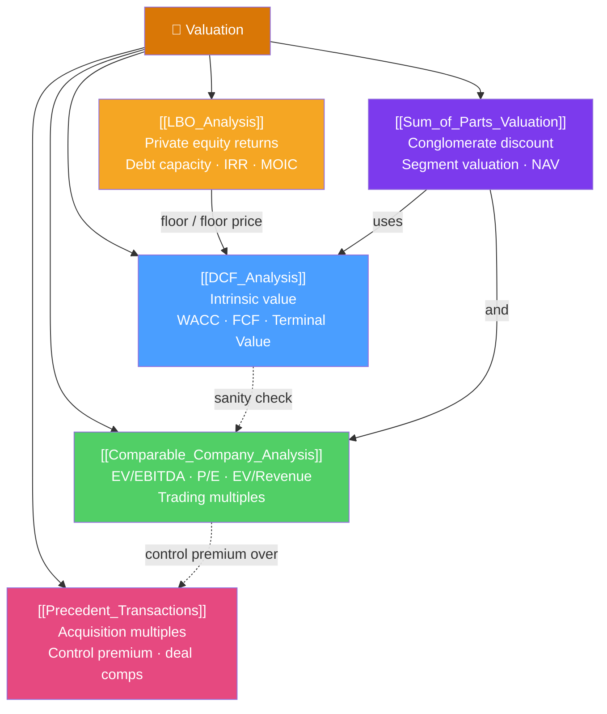

# 💎 Valuation — Map of Content

> [!abstract] What This Section Covers
> Valuation is the art and science of estimating what an asset is worth. This section covers the five core approaches used by investment bankers, equity analysts, and private equity investors. **DCF** is intrinsic value — what the business is worth based on its future cash flows. **Comparable company analysis (comps)** and **precedent transactions** are relative value — what similar businesses trade/transact at. **LBO analysis** determines the maximum price a financial buyer can pay to achieve target returns. **Sum-of-parts** breaks conglomerates into pieces valued separately. A credible valuation uses multiple methods and reconciles them in a "football field" chart.

## Concept Map

## Learning Path
1. [[DCF_Analysis]] — The foundation of intrinsic valuation.
2. [[Comparable_Company_Analysis]] — Trading multiples from public peers.
3. [[Precedent_Transactions]] — Acquisition multiples and control premiums.
4. [[LBO_Analysis]] — Private equity buyer valuation and returns.
5. [[Sum_of_Parts_Valuation]] — Valuing conglomerates and complex businesses.

## All Notes at a Glance

| Note | Difficulty | What You'll Learn |
|------|------------|-------------------|
| [[DCF_Analysis]] | Intermediate | Free cash flow, terminal value, WACC, DCF build, sensitivity |
| [[Comparable_Company_Analysis]] | Intermediate | EV, EBITDA, EV/EBITDA, P/E, how to select and apply trading comps |
| [[Precedent_Transactions]] | Intermediate | Transaction multiples, control premium, sources, applying deal comps |
| [[LBO_Analysis]] | Advanced | LBO structure, debt waterfall, IRR/MOIC calculation, PE returns |
| [[Sum_of_Parts_Valuation]] | Advanced | Segment valuation, conglomerate discount, NAV approach, real examples |

## Key Questions This Section Answers
- How do you build a DCF model and what drives terminal value?
- How do you select comparable companies and which multiples matter most?
- Why do acquirers pay a premium over market price, and how much is typical?
- How does a private equity firm structure an LBO and calculate its return?
- When should you value a company using sum-of-parts instead of a single multiple?

## Related Sections
- [[_MOC_Finance_Master|↑ Finance Master MOC]]
- [[_MOC_Corporate_Finance|← Corporate Finance]] — WACC and FCF are built here
- [[_MOC_Financial_Modeling|→ Financial Modeling]] — Models that produce the inputs

#MOC #Finance #valuation
