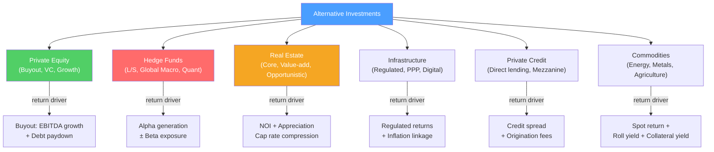

# 🌐 Alternative Investments

> [!abstract] TL;DR
> Alternative investments are asset classes beyond traditional stocks and bonds — private equity, hedge funds, real estate, infrastructure, commodities, and private credit. They offer diversification benefits (low correlation with public markets) and often illiquidity premiums. The tradeoffs: less transparency, limited liquidity, and higher fees (2-and-20 for hedge funds; 1.5% management + 20% carry for PE). CFA Level I–III covers the main alternative categories; CAIA is the specialist qualification.

## Intuition — analogy FIRST

Think of a traditional 60/40 portfolio (60% stocks, 40% bonds) as owning two asset classes that often move together — when the economy weakens, both can fall simultaneously (as in 2022).

**Alternatives** are like adding a third, fourth, and fifth asset class that behave differently — a warehouse you rent out (real estate), a toll road you own (infrastructure), a fund that profits whether markets go up or down (hedge fund), and ownership of the unpolished diamond before it goes public (private equity).

Adding alternatives doesn't guarantee better returns — but it can reduce the portfolio's volatility for a given expected return (better risk-adjusted performance). The catch: your money is often locked up for 5–10 years (illiquidity), and the complexity costs make most retail investors better off in index funds.

---

## How It Works

## Key Concepts / Details

### Private Equity

PE encompasses three main strategies:

| Strategy | Description | Target company | Return drivers | Target IRR |
|---------|-------------|---------------|---------------|-----------|
| **Venture Capital** | Early-stage companies, pre-revenue to pre-IPO | Startups, Series A–D | Multiple expansion, IPO / acquisition exit | 25–40%+ |
| **Growth Equity** | Minority stakes, profitable but growing | $10M–$500M revenue, 20%+ growth | Revenue scaling, multiple expansion | 20–30% |
| **Buyout / LBO** | Control acquisition with leverage | Established, cash-generative | EBITDA growth, debt paydown, multiple | 20–25% |
| **Distressed PE** | Turnaround investing | Underperforming or near-bankrupt | Operational improvement, debt-for-equity | 15–25% |

**Fund structure**: PE firms raise a fund every 3–5 years, deploy over 3–5 years, hold companies for 3–7 years, then exit. Fund life is typically 10–12 years. GPs (general partners, the PE firm) invest 1–2% of capital alongside LPs (limited partners — pension funds, endowments, sovereign wealth).

**Fees**: typical PE structure is "2 and 20" — 2% annual management fee on committed capital + 20% carried interest (profit share above an 8% preferred return "hurdle").

**Performance measurement**: MOIC (multiple of invested capital) and IRR (see [[LBO_Analysis]]).

### Hedge Funds

Hedge funds use diverse strategies to generate returns regardless of market direction:

| Strategy | Mechanism | Market correlation |
|---------|-----------|------------------|
| **Long/Short Equity** | Buy undervalued stocks, short overvalued | Low-medium |
| **Global Macro** | Trade currencies, rates, commodities on macro views | Low |
| **Market Neutral** | Equal long/short positions; near-zero beta | Near zero |
| **Event-Driven** | Trade M&A, distressed, spinoffs | Medium |
| **Quantitative / Systematic** | Algorithm-driven factor strategies | Varies |
| **Fixed Income Relative Value** | Exploit bond mispricing | Low |
| **Multi-Strategy** | Multiple strategies in one fund | Low |

**Fees**: 2% management fee + 20% performance fee above high-water mark.

**Performance reality**: hedge fund indices (HFRI, Cambridge) show average hedge fund returns have **underperformed** a simple 60/40 portfolio over most 10-year periods since 2010. The top quartile significantly outperforms; the bottom half underperforms after fees. Skill concentration is high; manager selection is critical.

### Real Estate

**Direct real estate** (owning property):
- Return drivers: **Net Operating Income (NOI)** + capital appreciation
- Key metric: **cap rate** (capitalization rate) = NOI / Property Value
- Like dividend yield for real estate — an 8% cap rate implies 12.5x price/NOI

**Risk spectrum:**

| Style | Description | Target return |
|-------|-------------|--------------|
| **Core** | Stabilized, high-quality assets (trophy office, prime retail) | 7–10% unlevered |
| **Core-plus** | Some leasing/renovation needed | 9–12% |
| **Value-add** | Significant renovation/re-leasing required | 12–15% |
| **Opportunistic** | Development, distressed, complex special situations | 15–20%+ |

**REITs** (Real Estate Investment Trusts): publicly traded real estate portfolios. Must distribute 90%+ of taxable income as dividends. Highly liquid alternative to direct RE. Trade at premiums/discounts to NAV (net asset value = appraised property values − debt).

**Key real estate metrics:**

| Metric | Formula | Interpretation |
|--------|---------|---------------|
| **Cap rate** | NOI / Property Value | Lower = more expensive market (NYC cap rate 4%; Midwest 8%) |
| **FFO** | Net income + D&A − property gains | REIT earnings proxy |
| **AFFO** | FFO − recurring capex | More accurate cash flow measure |
| **LTV** | Debt / Property Value | Leverage ratio for RE |
| **DSCR** | NOI / Debt Service | Debt coverage (>1.25x required by lenders) |

### Infrastructure

Infrastructure assets are long-lived physical assets with stable, often inflation-linked cash flows:

**Sub-categories:**
- **Regulated** (utilities, pipelines): return set by regulator; very stable; low risk
- **Public-Private Partnership (PPP)**: government pays availability or usage fees (roads, hospitals)
- **Digital** (data centers, cell towers, fiber): volume-driven; higher growth
- **Transport** (ports, airports, toll roads): GDP-linked; volume risk

**Why investors like it**: long-term inflation-linked cash flows, low correlation with public markets, 30+ year asset lives. Pension funds love infrastructure for long-duration liability matching.

**Returns**: 8–12% for core infrastructure; 12–18% for opportunistic / greenfield development.

### Private Credit

Private credit (direct lending) has grown from $100B (2010) to $1.5T+ (2024) as banks reduced corporate lending post-GFC.

**Instruments:**
- **Senior secured direct loans**: first lien on assets; 7–10% yield
- **Unitranche**: all-in single loan combining senior and sub debt; 9–12%
- **Mezzanine**: subordinated, often PIK; 12–18%
- **Distressed debt**: buying bonds at distress prices; 15–25%+ if recovery

**Comparison to leveraged loans (bank market)**:
- Direct lenders hold loans to maturity; no marking-to-market
- Higher yields than syndicated loans for same credit (illiquidity premium)
- More covenant protections
- Less liquidity

### Commodities

**Three return components:**
1. **Spot return**: change in commodity price
2. **Roll yield**: difference between current futures price and spot price at rollover
3. **Collateral yield**: return on margin (Treasury bills backing futures positions)

**Portfolio role**: inflation hedge — commodity prices typically rise with inflation. Strong negative correlation to USD (dollar down = commodity up, since most priced in USD).

**Commodity sub-categories**: energy (oil, gas), metals (gold, copper, aluminum), agriculture (corn, soy, wheat), livestock.

**Gold specifically**: zero coupon, zero dividend, zero earnings. Value = inflation hedge + monetary uncertainty hedge + store of value in tail scenarios. Damodaran calls it "the pet rock of the investment world" — no intrinsic cash flow, only conviction value.

### Portfolio Construction with Alternatives

**Illustrative allocation (endowment model — Yale style):**

| Asset Class | Yale 2023 | Traditional 60/40 |
|-------------|-----------|-------------------|
| Domestic equity | 2.3% | 60% |
| Foreign equity | 11.0% | 0% |
| Fixed income | 7.0% | 40% |
| Private equity | 39.0% | 0% |
| Real assets | 13.0% | 0% |
| Hedge funds | 23.0% | 0% |
| Venture capital | included in PE | 0% |

Yale has generated 40-year average returns of ~13%/year — significantly above the 60/40's ~8–9%. But requires: 10-year illiquidity, huge team (80+ investment professionals), and access to top-quartile managers.

---

## Real-World Notes

- **Blackstone BREIT controversy (2022)**: Blackstone's non-traded real estate REIT suspended redemptions after requests hit 2% monthly limit. Illustrated that "liquid alternatives" (semi-liquid wrappers around illiquid assets) create structural mismatch when markets stress.
- **SoftBank Vision Fund**: $100B VC fund that invested $300M–$3B in late-stage startups (WeWork, Uber, OYO, Lemonade). Losses on WeWork write-down ($6B) plus tech downturn made SVFII a case study in concentration risk and governance failure in alternatives.
- **Buffett's bet against hedge funds (2008–2017)**: Buffett bet $1M that an S&P 500 index fund would beat a basket of hedge fund-of-funds over 10 years. Hedge funds returned 36%; S&P returned 126%. Most hedge fund returns eaten by 2-and-20 fees — only exceptional managers justify the cost.
- **Brookfield Infrastructure Partners**: The gold standard of infrastructure investing — BIPC/BIP owns toll roads, data centers, pipelines, and utilities globally. Has delivered 15%+ annualized returns since 2009 via organic growth and accretive acquisitions.

---

## Common Pitfalls

- Treating PE IRR as comparable to public market returns: PE IRR uses the timing of cash flows which inflates apparent performance vs a simple TWRR comparison. Use PME (public market equivalent) to compare properly.
- Assuming all hedge funds provide diversification: equity long/short funds are highly correlated with equities during market crises (2008: average hedge fund -18%, compared to market -38%). Correlation rises in downturns.
- Ignoring the illiquidity premium math: private credit yields 300–400 bps above equivalent public bonds. Over 10 years this compounds to meaningful outperformance — but only if you can afford to lock up capital.
- Applying cap rates without market context: an 8% cap rate in a growth city (Austin) implies different risk than 8% in a shrinking city (Detroit).

---

## Related Concepts

- [[_MOC_Investment_Analysis|↑ Section MOC]]
- [[LBO_Analysis]] — Deep dive on PE buyout structure and returns
- [[Portfolio_Theory_Basics]] — How alternatives fit in a diversified portfolio
- [[Risk_and_Return_Fundamentals]] — The risk premium framework for alternatives
- [[Market_Structure_and_Participants]] — Who the institutional investors are

## Review Questions

1. A PE fund invests $200M in a company (along with $300M in debt) for a $500M entry EV. After 5 years, the company is sold for $900M EV with $200M net debt remaining. Calculate the PE fund's MOIC and approximate IRR.
2. Why do hedge funds charge 2-and-20 fees? Using Buffett's 10-year bet as evidence, argue whether the average hedge fund justifies its fee structure. What type of investor might still be justified in allocating to hedge funds?
3. A commercial property generates $1.2M in NOI and is valued at $15M. Calculate the cap rate. If the market cap rate rises from 8% to 10% (interest rates increase), and NOI stays constant, what happens to the property value?

## Sources

- CFA Institute, *CFA Program Curriculum* Level 1 — Alternative Investments
- Swensen, David F., *Pioneering Portfolio Management* (Yale endowment model)
- Kaplan, Steven, and Schoar, Antoinette, "Private Equity Performance: Returns, Persistence, and Capital Flows" (JF, 2005)

#finance #investment-analysis #alternatives #private-equity #hedge-funds #real-estate #infrastructure
