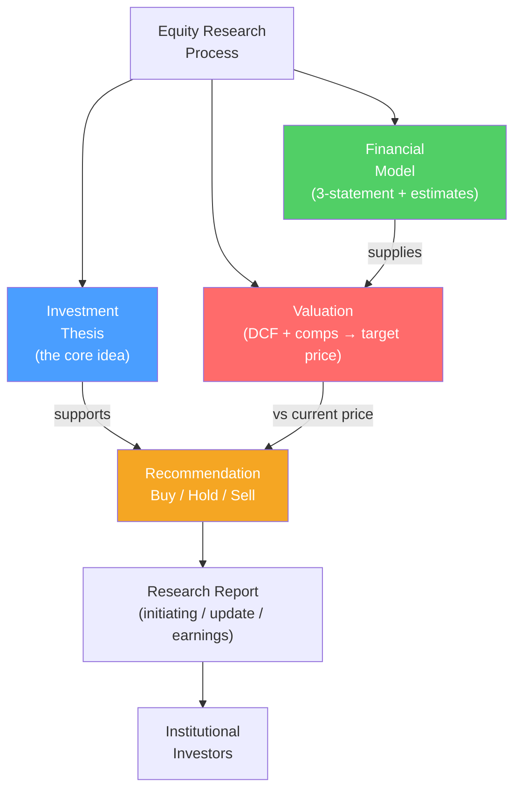

# 📝 Equity Research

> [!abstract] TL;DR
> Equity research analysts produce reports recommending whether to buy, hold, or sell a stock. Sell-side analysts (at investment banks) publish for institutional clients; buy-side analysts (at asset managers) make internal recommendations. A research report has three components: (1) **investment thesis** — the core argument for why the stock will outperform; (2) **financial model** — a three-statement model with estimates; (3) **valuation** — DCF + comps → target price. The **buy/sell decision** is: is the stock trading significantly away from intrinsic value?

## Intuition — analogy FIRST

An equity research analyst is like a business journalist who also happens to be a financial modeler and valuation expert.

Their job: follow 15–25 companies obsessively, build detailed financial models for each, meet with management quarterly, attend industry conferences, and produce written reports advising institutional investors on what to buy and sell.

The sell-side analyst at Goldman Sachs writes for Goldman's institutional clients (hedge funds, mutual funds, pension funds) who execute trades through Goldman — this is how the bank makes money. The analyst's "Buy" rating implicitly tells the client to use Goldman's trading desk to buy.

The buy-side analyst at Fidelity reads those Goldman reports, often skeptically, forms their own view, and makes internal recommendations to portfolio managers who make the actual investment decisions.

---

## How It Works



## Key Concepts / Details

### Investment Thesis

The investment thesis is the core argument — 2–4 sentences that explain why the stock will outperform:

**Good thesis structure:**
1. **Differentiated insight**: what does the market misunderstand or not appreciate?
2. **Catalyst**: what specific events will close the gap between price and value?
3. **Valuation**: how much upside/downside exists?
4. **Time horizon**: when will the thesis play out?

**Example thesis**: *"We initiate on Datadog (DDOG) at Buy with a $140 price target (35% upside). The market is underpricing Datadog's multi-product expansion opportunity — customers using 6+ products generate 4x the ARR of single-product customers, yet the market values DDOG at 15x EV/Revenue vs SaaS comps at 20x. Catalysts: Q3 earnings showing improved net dollar retention (NDR) and potential for FCF margin expansion as the sales force reaches maturity in 2024–2025."*

### Research Report Types

| Type | Occasion | Length | Purpose |
|------|---------|--------|---------|
| **Initiation of Coverage (IOC)** | First report on company | 40–80 pages | Full thesis, model, valuation |
| **Earnings update** | After quarterly results | 4–8 pages | Update estimates, reiterate view |
| **Industry note** | Sector event or data | 8–20 pages | Sector-wide implications |
| **Quick note / flash** | Breaking news | 1–3 pages | Immediate reaction |
| **Thematic piece** | Macro or structural trend | 10–30 pages | Industry disruption analysis |

### Analyst Estimates: The Financial Model

The model produces **earnings per share (EPS)** and **free cash flow** estimates for the next 2–3 years:

| Line item | Method |
|-----------|--------|
| **Revenue** | Bottom-up: volumes × prices × growth drivers |
| **Gross margin** | Mix shift, pricing trends, COGS component analysis |
| **Operating expenses** | Historical as % revenue, management guidance |
| **D&A** | Linked to PP&E model |
| **Interest expense** | Linked to debt balance |
| **Tax rate** | Blended statutory + deferred |
| **EPS** | Net income / diluted shares |
| **Capex** | Maintenance + growth, linked to revenue |

**Consensus vs proprietary estimates**: the analyst's differentiated value is when their estimates differ from consensus (Bloomberg or FactSet aggregate). If your model is identical to consensus, you add no value.

### Valuation: From Model to Target Price

**Step 1: DCF**
- Project FCF for 5–10 years using the model
- Discount at WACC
- Add terminal value
- Bridge to equity value per share

**Step 2: Trading Comps**
- Identify 5–8 comparable public companies
- Calculate EV/EBITDA, P/E for current year and next year
- Apply median/mean to own estimates

**Step 3: Football Field Chart**

The "football field" reconciles all valuation methods:

```
Method                Value Range
──────────────────────────────────────────────
52-Week Range         ▓▓▓▓▓▓▓     $85 – $110
Trading Comps         ▓▓▓▓▓▓▓▓▓   $90 – $130
DCF (Base)            ▓▓▓▓▓▓▓▓▓▓  $95 – $145
Precedent Trans.      ▓▓▓▓▓▓▓▓▓▓▓▓ $110 – $160
Price Target                    ↑  $140
Current Price              ←    $104
──────────────────────────────────────────────
                $80  $100  $120  $140  $160
```

Target price is set at the analyst's "fair value" given their weighting of methods — typically anchored to DCF with a sanity-check from comps.

### Analyst Recommendation Scale

| Rating | Interpretation | % of total (typical) |
|--------|---------------|---------------------|
| **Buy / Outperform** | Expected to outperform sector or market | ~55% |
| **Hold / Neutral** | Expected to perform in line | ~35% |
| **Sell / Underperform** | Expected to underperform | ~10% |

**Rating inflation**: sell-side firms rarely issue Sells on companies they have banking relationships with — generating the paradox that ~90% of stocks are rated Buy or Hold. Buy-side investors discount "Hold" as the real "Sell" signal.

**The value of a "Sell"**: Morgan Stanley's Adam Jonas (auto analyst) issued a sell on Rivian when most analysts were bullish — differentiated and correct; Rivian fell 70%.

### Key Metrics Analysts Track

| Sector | Key Metric |
|--------|-----------|
| **SaaS / Software** | ARR, NRR (net dollar retention), Rule of 40, CAC/LTV |
| **Retail** | Same-store sales growth, gross margin, inventory turns |
| **Semiconductor** | Book-to-bill ratio, capacity utilization, ASP trends |
| **Financial services** | NIM, NPA ratio, CET1 ratio, efficiency ratio |
| **Healthcare** | Pipeline milestones, patent cliff, reimbursement rates |
| **Energy** | Reserve replacement ratio, NAV per share, break-even oil price |
| **Real estate** | FFO, NOI, cap rate, occupancy |
| **Media / Streaming** | MAU/DAU, ARPU, subscriber growth, content spend |

---

## Real-World Notes

- **Short sellers as equity researchers**: short sellers like Hindenburg Research and Citron Research produce the most contrarian, highest-quality research because they have the most skin in the game. Their reports on Nikola, Wirecard, and Block have driven massive short squeezes and exposures of fraud.
- **Bernstein Research** is considered the gold standard of sell-side research for institutional clients — their analysts typically have deep sector expertise (10+ years in one industry). The research fee model (paying separately for research via "soft dollars") is evolving due to MiFID II.
- **Analyst "whisper numbers"**: the published EPS estimate often differs from the "whisper" — an informal number that accounts for typical management guidance conservatism. Stocks often react to beating/missing the whisper, not the published consensus.
- **Superforecasting vs consensus**: The most valuable analyst is one who beats consensus systematically. A meta-analysis by Gu, Kelly, and Xiu (2020) found that analyst forecasts contain economically significant information beyond consensus — especially from high-reputation analysts.

---

## Common Pitfalls

- Anchoring target price to current price: the entire analysis should be bottom-up to fair value; starting from "30% above current price" is analytically backwards.
- Confusing price target and intrinsic value: a 12-month price target must account for what catalyst will close the gap within 12 months — a stock can be undervalued for years.
- Consensus herding: the most common analyst error is being slightly wrong in the same direction as everyone else. Differentiated value comes from independent analysis.
- Ignoring bear case: always build a bear scenario in the model. If the bear case shows meaningful downside, the expected value may still be negative even with a high probability bull case.

---

## Related Concepts

- [[_MOC_Investment_Analysis|↑ Section MOC]]
- [[Fundamental_Analysis]] — The analytical framework behind the thesis
- [[Financial_Statement_Analysis]] — The data driving the model
- [[DCF_Analysis]] — The primary valuation tool
- [[Comparable_Company_Analysis]] — The market-based valuation cross-check

## Review Questions

1. Draft a 3-sentence investment thesis for a company you know well. Include: (1) the differentiated insight, (2) the specific catalyst, and (3) the valuation gap.
2. A sell-side analyst rates 90% of stocks "Buy or Hold." What structural incentive explains this, and how should a buy-side investor adjust for this bias when reading research?
3. What is the difference between a 12-month price target and intrinsic value? Can a stock be both undervalued (intrinsic value > price) and a "Hold" rating? Give a scenario where this makes sense.

## Sources

- Fabozzi, Frank J., and Drake, Pamela, *Analysis of Financial Statements*, 3rd edition
- CFA Institute, *CFA Program Curriculum* Level 2 — Equity Valuation
- Greenwald, Bruce et al., *Value Investing: From Graham to Buffett and Beyond*

#finance #investment-analysis #equity-research #sell-side #buy-side #investment-thesis
