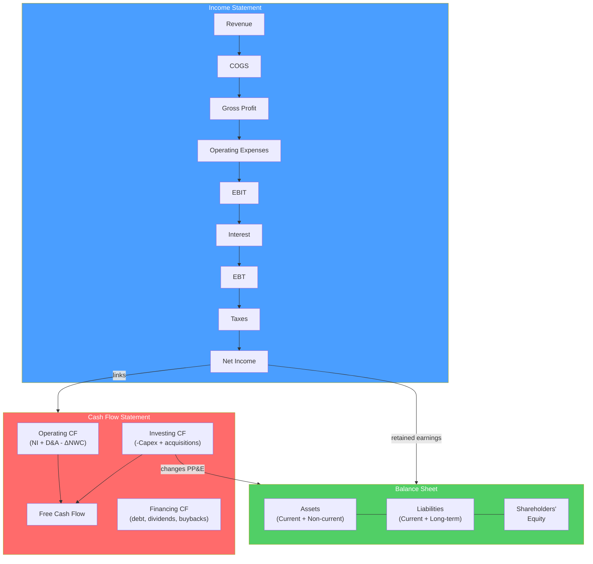

# 📋 Financial Statement Analysis

> [!abstract] TL;DR
> Financial statement analysis decodes a company's financial performance and health from its income statement, balance sheet, and cash flow statement. The **DuPont decomposition** breaks ROE into profitability, efficiency, and leverage: $ROE = \frac{Net Income}{Sales} \times \frac{Sales}{Assets} \times \frac{Assets}{Equity}$. Cash flow quality matters more than reported earnings — look for earnings backed by cash generation. Red flags: rising receivables, aggressive revenue recognition, and shrinking cash conversion cycles.

## Intuition — analogy FIRST

Reading financial statements is like reading a person's health record, bank statements, and daily planner simultaneously.

The **income statement** (health record) shows what happened this period — revenue earned, costs incurred, profit generated. But it can be massaged by accounting choices.

The **balance sheet** (net worth statement) shows what you own and owe at a point in time — the cumulative result of all past decisions. Is it getting stronger or weaker?

The **cash flow statement** (bank statement) shows actual cash in and out. This is the hardest to manipulate. A company showing profit but bleeding cash is in trouble. Cash is king.

The analyst's job: read all three together, identify the real economics beneath the accounting, and assess whether the business is getting better or worse.

---

## How It Works

## Key Concepts / Details

### The Three Financial Statements

**Income Statement** (P&L):
- Reports revenue and expenses over a period (quarter or year)
- Follows accrual accounting — revenue when earned, expenses when incurred (not when cash changes hands)
- Key lines: Revenue → Gross Profit → EBITDA → EBIT → EBT → Net Income

**Balance Sheet** (Statement of Financial Position):
- Reports assets, liabilities, and equity at a **point in time**
- Fundamental equation: Assets = Liabilities + Equity
- Tells you: what the company owns, what it owes, and what's left for shareholders

**Cash Flow Statement**:
- Reports actual cash movements during the period
- Three sections: Operating (CFO), Investing (CFI), Financing (CFF)
- Most honest statement — cash flows are harder to manipulate than earnings
- Free Cash Flow (FCF) = CFO − Capex

### Key Financial Ratios

**Profitability Ratios:**

| Ratio | Formula | What it tells you |
|-------|---------|-------------------|
| **Gross margin** | Gross Profit / Revenue | Pricing power and COGS efficiency |
| **EBITDA margin** | EBITDA / Revenue | Operating profitability before D&A |
| **Operating margin** | EBIT / Revenue | Core operating efficiency |
| **Net profit margin** | Net Income / Revenue | Bottom-line profitability |
| **ROA** | Net Income / Total Assets | Asset efficiency |
| **ROE** | Net Income / Equity | Return generated on shareholders' capital |
| **ROIC** | NOPAT / Invested Capital | Return generated on all capital deployed |

**Liquidity Ratios:**

| Ratio | Formula | Healthy level |
|-------|---------|--------------|
| **Current ratio** | Current Assets / Current Liabilities | > 1.5x |
| **Quick ratio** | (Cash + Receivables) / Current Liabilities | > 1.0x |
| **Cash ratio** | Cash / Current Liabilities | > 0.5x |

**Leverage Ratios:**

| Ratio | Formula | Interpretation |
|-------|---------|----------------|
| **Debt/Equity** | Total Debt / Shareholders' Equity | Capital structure leverage |
| **Net Debt/EBITDA** | (Debt − Cash) / EBITDA | Repayment capacity; < 3x considered safe |
| **Interest coverage** | EBIT / Interest Expense | > 3x considered healthy |
| **Debt/Assets** | Total Debt / Total Assets | Balance sheet leverage |

**Efficiency Ratios:**

| Ratio | Formula | Lower = better |
|-------|---------|---------------|
| **DSO (Days Sales Outstanding)** | (Receivables / Revenue) × 365 | Faster collection |
| **DIO (Days Inventory Outstanding)** | (Inventory / COGS) × 365 | Faster inventory turn |
| **DPO (Days Payable Outstanding)** | (Payables / COGS) × 365 | Higher = better (delay payments) |
| **Cash Conversion Cycle** | DSO + DIO − DPO | Lower = capital efficiency |

### DuPont Analysis

DuPont decomposes ROE into three drivers:

$$ROE = \underbrace{\frac{Net Income}{Sales}}_{\text{Profit Margin}} \times \underbrace{\frac{Sales}{Assets}}_{\text{Asset Turnover}} \times \underbrace{\frac{Assets}{Equity}}_{\text{Leverage}}$$

**Five-factor DuPont** (more detailed):

$$ROE = \underbrace{\frac{NI}{EBT}}_{\text{Tax burden}} \times \underbrace{\frac{EBT}{EBIT}}_{\text{Interest burden}} \times \underbrace{\frac{EBIT}{Sales}}_{\text{EBIT margin}} \times \underbrace{\frac{Sales}{Assets}}_{\text{Asset turnover}} \times \underbrace{\frac{Assets}{Equity}}_{\text{Leverage}}$$

**Worked example — Apple vs Walmart:**

| Company | Net Margin | Asset Turnover | Leverage | ROE |
|---------|-----------|----------------|---------|-----|
| Apple (2023) | 25% | 1.1x | 5.9x | ~163% |
| Walmart (2023) | 2.5% | 2.5x | 5.2x | ~32% |

Apple achieves high ROE through massive profit margins. Walmart achieves ROE through volume (high asset turnover) and efficiency.

### Cash Flow Quality Analysis

**High-quality earnings**: backed by cash generation, not accounting choices.

| Indicator | Signal |
|---------|--------|
| CFO > Net Income | Good — cash earnings exceed accrual earnings |
| CFO < Net Income | Warning — earnings not converting to cash |
| Rising DSO | Warning — customers slow to pay; potential revenue quality issues |
| Large non-cash "add-backs" | Investigate — what's being excluded? |
| Negative FCF with positive net income | Common for growth companies — verify capex justification |

**Cash conversion**: the quality metric:

$$\text{Cash Conversion} = \frac{CFO}{Net Income}$$

Healthy companies typically show 1.0–1.5x cash conversion over time.

**Accrual ratio** (Sloan, 1996): earnings with high accrual components mean-revert more — cash earnings are more sustainable:

$$\text{Accrual Ratio} = \frac{Net Income - CFO - CFI}{\text{Average Net Assets}}$$

Lower is better — low accruals relative to assets indicates high earnings quality.

### Red Flags and Earnings Quality

| Red Flag | What it suggests |
|----------|-----------------|
| **Receivables growing faster than revenue** | Channel stuffing, aggressive revenue recognition |
| **Inventory growing faster than COGS** | Slow-moving inventory, demand problems |
| **Gross margin expanding while competitors flat** | Accounting change? Channel mix shift? |
| **Operating cash flow persistently below net income** | Working capital drain; low earnings quality |
| **Frequent non-recurring charges** | Management using "one-time" items to obscure real performance |
| **Auditor change** | Investigate reason; sometimes accounting disagreement |
| **CFO/CEO turnover** | Often precedes difficult disclosures |
| **Related-party transactions** | Potential conflict of interest |

---

## Real-World Notes

- **Enron (2001)**: Used special purpose entities (SPEs) to hide debt off-balance-sheet. Cash flow from operations was far below reported income. The divergence between CFO and reported earnings was the tell — a systematic analyst would have flagged it before the collapse.
- **Luckin Coffee (2020)**: Chinese coffee chain IPO'd on NASDAQ; fabricated $310M in sales by inflating per-item selling prices and transaction volumes. DSO and gross margin trends were inconsistent with physical store economics.
- **Amazon FCF focus**: Jeff Bezos told analysts to focus on free cash flow per share, not earnings. Amazon reported near-zero GAAP earnings for years while generating positive FCF — an example of management correctly directing investors to the cash-based metric.
- **WeWork's "community-adjusted EBITDA"**: WeWork's S-1 introduced a non-GAAP metric that excluded rent expenses from EBITDA — the core cost of its business model. The SEC forced them to remove it. Classic earnings manipulation via selective non-GAAP metrics.

---

## Common Pitfalls

- Using EBITDA as if it equals cash flow: EBITDA ignores capex, tax, and working capital changes. For capital-intensive businesses, EBITDA can massively overstate cash generation.
- Comparing ROE without adjusting for leverage: high leverage inflates ROE mechanically; DuPont decomposition reveals whether profit margin or asset efficiency is actually improving.
- Accepting goodwill amortization as "noise": large, recurring goodwill charges may signal overpaid acquisitions destroying value.
- Ignoring the cash flow statement: it's the most honest statement. Start FSA with the CF statement, not the income statement.

---

## Related Concepts

- [[_MOC_Investment_Analysis|↑ Section MOC]]
- [[Fundamental_Analysis]] — The qualitative framework FSA quantifies
- [[Three_Statement_Model]] — Building the statements from scratch in models
- [[Equity_Research]] — FSA feeds directly into research reports
- [[DCF_Analysis]] — Normalized earnings and FCF from FSA drive DCF

## Review Questions

1. A company shows $200M net income but only $50M in operating cash flow. Explain three possible reasons for this divergence and what each would signal about earnings quality.
2. Perform a partial DuPont analysis: Company A has 8% net margin, 2.5x asset turnover, and 3.0x leverage. Company B has 15% margin, 1.0x turnover, and 4.0x leverage. Calculate ROE for each and explain which company's ROE quality is higher.
3. A retailer has: DSO = 45 days, DIO = 60 days, DPO = 30 days. Calculate the cash conversion cycle. What does this mean for working capital needs, and how could management improve the CCC?

## Sources

- Penman, Stephen, *Financial Statement Analysis and Security Valuation*, 5th edition
- CFA Institute, *CFA Program Curriculum* Level 1 — Financial Reporting and Analysis
- Sloan, Richard, "Do Stock Prices Fully Reflect Information in Accruals and Cash Flows About Future Earnings?" (The Accounting Review, 1996)

#finance #investment-analysis #financial-statements #DuPont #ratio-analysis #ROE
