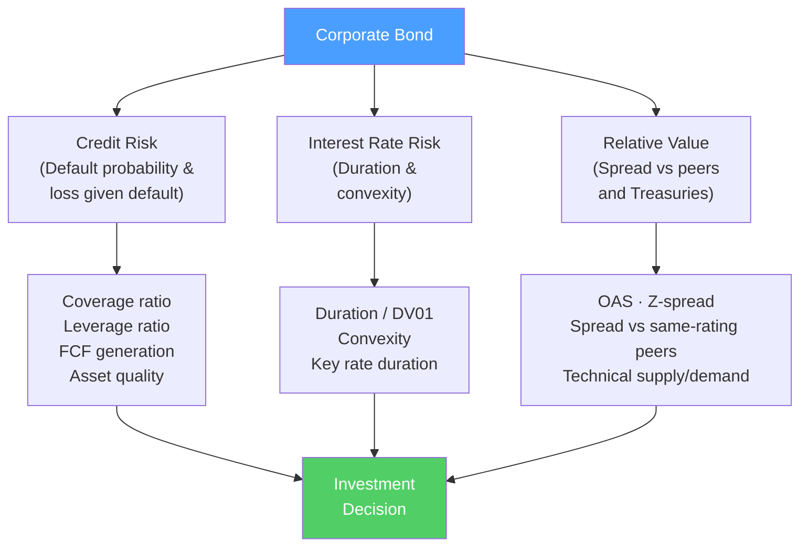

# 🏦 Fixed Income Analysis

> [!abstract] TL;DR
> Fixed income analysis evaluates bonds as investments — assessing credit risk, interest rate sensitivity, and relative value. **Credit analysis** asks "can the issuer repay?" using leverage, coverage, and cash flow metrics. **Duration analysis** asks "how sensitive is the price to rate changes?" **Spread analysis** asks "am I being adequately compensated for credit risk vs Treasuries?" CFA Level II covers this in depth; it is the core skill for corporate bond investors, credit analysts, and fixed income portfolio managers.

## Intuition — analogy FIRST

Buying a corporate bond is like lending money to a business — except your IOU is traded daily at market-determined prices.

Before you lend, you ask three questions:

1. **Will they repay me?** (Credit analysis) — Look at their cash flows, debt load, collateral. Is the interest expense manageable relative to their earnings?

2. **How long is my money locked up and what's my rate risk?** (Duration analysis) — A 30-year bond fluctuates far more in price when interest rates move than a 2-year bond. How much rate risk am I taking?

3. **Am I being paid enough?** (Spread analysis) — The extra yield above a risk-free government bond is the "spread." Is this spread wide enough relative to the true credit risk?

If the answer to all three is satisfactory — the bond is an attractive investment.

---

## How It Works

## Key Concepts / Details

### Credit Analysis Framework

The **4 C's of Credit**:

| Factor | Question | Key metrics |
|--------|---------|------------|
| **Capacity** | Can they generate enough cash to repay? | EBITDA/Interest, FCF/Debt service, EBITDA margins |
| **Collateral** | What assets secure the debt? | PP&E coverage, liquidation value |
| **Covenants** | What protects lenders? | Maintenance vs incurrence covenants, restricted payments baskets |
| **Character** | Will management honor obligations? | Track record, insider ownership, history |

**Key credit ratios for corporate bonds:**

| Metric | Calculation | Investment Grade | High Yield |
|--------|-----------|-----------------|-----------|
| **Net Debt/EBITDA** | (Debt−Cash) / EBITDA | < 2.5x | 3.0–6.0x |
| **EBITDA/Interest** | EBITDA / Interest expense | > 5.0x | 2.0–4.0x |
| **FCF/Debt** | Free Cash Flow / Total Debt | > 15% | > 5% |
| **Debt/Assets** | Total Debt / Total Assets | < 35% | 40–60% |
| **Current ratio** | Current Assets / Current Liabilities | > 1.5x | > 1.0x |

**Working example — credit analysis:**
Company: Industrial manufacturer
- EBITDA: $200M
- Interest expense: $40M
- Total debt: $800M, cash $100M, net debt $700M

| Metric | Calculation | Level | Assessment |
|--------|-----------|-------|-----------|
| Net Debt/EBITDA | 700/200 | 3.5x | Borderline IG/HY |
| EBITDA/Interest | 200/40 | 5.0x | Adequate IG |
| FCF/Debt | 80/800 | 10% | Tight |
| Rating implication | | BBB | Investment grade, lower end |

### Duration and Interest Rate Risk

**Modified Duration** (recap from [[Fixed_Income_Markets]]):
$$\Delta P \approx -D_{mod} \times \Delta y \times P$$

**DV01 (Dollar Value of 1 basis point)**: the dollar change in bond price for a 1 bp (0.01%) move in yield:
$$DV01 = -D_{mod} \times 0.0001 \times P$$

**Example**: $1M position, 7-year duration, current price $970K:
$$DV01 = 7 \times 0.0001 \times 970{,}000 = \$679$$

A 100 bp rate move would change position value by ~$67,900.

**Key rate duration**: measures sensitivity to a specific maturity point on the yield curve (useful for immunization strategies).

**Duration immunization**: matching asset duration to liability duration so the portfolio's value is insulated from rate movements. Used by:
- Pension funds (assets ≈ duration of pension obligations)
- Insurance companies (assets ≈ duration of policy liabilities)

$$\text{Target duration} = \frac{PV(\text{liabilities})}{PV(\text{assets})} \times D(\text{liabilities})$$

### Spread Analysis

**Yield spreads** measure credit risk premium over risk-free Treasuries:

| Spread Measure | Definition | Use |
|---------------|-----------|-----|
| **G-spread** | YTM − interpolated Treasury yield | Simple credit risk measure |
| **I-spread** | YTM − interpolated swap rate | Compared to funding cost |
| **Z-spread (zero-volatility)** | Constant spread added to Treasury spot rates that equates PV to price | More precise; accounts for curve shape |
| **OAS (option-adjusted spread)** | Z-spread adjusted for embedded options (callable bonds) | True credit spread, option removed |

**OAS is the correct measure for callable bonds**: callable bonds have a price ceiling (issuer calls at par), which compresses the G-spread. OAS removes the call option value to isolate the credit spread.

### Yield Curve Strategies

Fixed income portfolio managers trade the yield curve:

| Strategy | Description | Bet |
|---------|-------------|-----|
| **Bullet** | Concentrate maturities at one point | Outperformance at that maturity |
| **Barbell** | Short- and long-term bonds only | Curve flattening |
| **Ladder** | Equal distribution across maturities | Diversified rate risk |
| **Duration extension** | Extend portfolio duration | Rates will fall |
| **Duration reduction** | Shorten portfolio duration | Rates will rise |
| **Curve flattener** | Long short-duration, short long-duration | Yield curve will flatten |

### Relative Value Analysis

Is this bond cheap or expensive vs. peers?

**Within-sector spread comparison:**
- Apple bonds (AA+ rated): OAS +80 bps
- Microsoft bonds (AAA rated): OAS +55 bps
- Peer average (AA): OAS +85 bps
- **Apple bonds appear slightly rich (narrow spread for AA quality)** — wait for wider entry

**Historical spread analysis:**
- Compare current spread to historical range
- Current spread at 10th percentile (historically tight) → bonds expensive
- Current spread at 90th percentile (historically wide) → bonds cheap

**Cross-asset relative value:**
- Compare bond yield to equity earnings yield (E/P): if bond yield > earnings yield, bonds may be relatively more attractive
- High-yield bonds vs leveraged loans (same credit, different structure)

---

## Real-World Notes

- **Pacific Gas & Electric (PG&E, 2019)**: Utility bonds with excellent coverage ratios (5x+) dropped from 100 cents to 50 cents when California wildfire liability ($30B+) emerged — balance sheet risk that income statement analysis missed entirely. Credit analysis must include off-balance-sheet contingent liabilities.
- **COVID credit rally (2020)**: High-yield bond spreads blew out to 1,100 bps in March 2020 (pricing in 20% default rates). The Fed's Corporate Credit Facilities (buying IG and HY ETFs) triggered a massive rally. Spreads tightened to 300 bps by year-end. Classic "buy fear, sell greed" in credit.
- **Evergrande (2021)**: Chinese property developer with $300B in liabilities. Credit analysts following China property saw leverage at 15x+ and coverage < 1x for years — obvious red flags that were dismissed by yield-hungry investors. The distress was visible in financial ratios 2–3 years before default.
- **Duration mismatch — SVB (2023)**: Silicon Valley Bank held $80B of long-duration MBS (10+ year duration) funded by short-term deposits. A textbook duration mismatch: when rates rose 500 bps, bond prices fell; deposits left for higher yields. Duration risk destroyed the bank.

---

## Common Pitfalls

- Treating investment-grade ratings as a ceiling on credit risk: ratings lag market pricing; OAS spread is a real-time credit risk signal.
- Ignoring covenant documentation: a bond with weak covenants (covenant-lite) has less protection despite the same rating.
- Using duration as the only risk measure: convexity matters for large moves; also consider liquidity, event risk (M&A), and refinancing risk.
- Comparing yields across different seniority: senior secured and unsecured bonds of the same issuer have very different recovery rates in default and deserve different spreads.

---

## Related Concepts

- [[_MOC_Investment_Analysis|↑ Section MOC]]
- [[Fixed_Income_Markets]] — Market structure and pricing fundamentals
- [[Financial_Statement_Analysis]] — The credit ratios come from FSA
- [[Risk_and_Return_Fundamentals]] — Credit risk is a component of total risk
- [[Portfolio_Theory_Basics]] — Fixed income in a multi-asset portfolio context

## Review Questions

1. A corporate bond has an EBITDA/Interest coverage of 2.5x and Net Debt/EBITDA of 5.5x. Does this qualify as investment grade? What credit rating range does this suggest, and what risks would you highlight to a prospective investor?
2. You hold a 10-year bond with duration 8.5 and a $5M face position (current price 95 cents). How much does your position change in value if yields rise by 50 basis points? Calculate the DV01.
3. A callable bond has a G-spread of 200 bps but an OAS of 130 bps. What does the 70 bps difference represent? Which spread is the correct measure of credit risk and why?

## Sources

- Fabozzi, Frank J., *Fixed Income Analysis*, 3rd edition (CFA Institute Investment Series)
- CFA Institute, *CFA Program Curriculum* Level 2 — Fixed Income
- Altman, Edward, "Financial Ratios, Discriminant Analysis and the Prediction of Corporate Bankruptcy" (JF, 1968)

#finance #investment-analysis #fixed-income #credit-analysis #duration #spread
