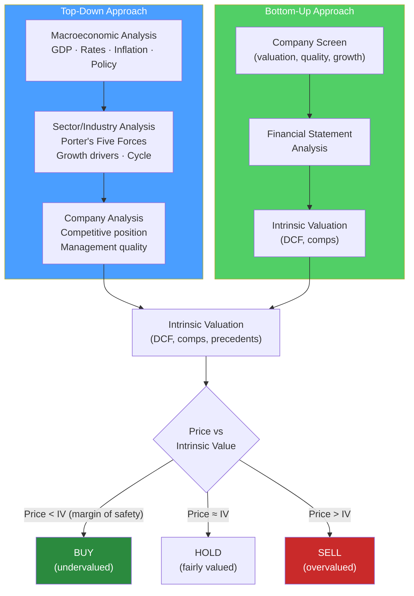

# 🔎 Fundamental Analysis

> [!abstract] TL;DR
> Fundamental analysis estimates a security's intrinsic value by studying economic, financial, and qualitative factors. **Top-down** investing starts with macro (GDP, rates, cycle), narrows to sector, then selects stocks. **Bottom-up** starts with individual companies regardless of macro. Both culminate in a valuation model. The **competitive moat** — durable advantage that protects returns on capital — is the central qualitative judgment. A stock is worth buying when price < intrinsic value (margin of safety).

## Intuition — analogy FIRST

Imagine you're evaluating whether to buy into a local bakery as a part-owner.

You'd start by asking: Is the economy good for food businesses right now? (macro). Is the bakery industry growing or shrinking? (sector). Is this particular bakery better than competitors — better location, better quality, loyal customers? (company). What are their financials — revenue, margins, how much cash they generate? (statements). What would a fair price be? (valuation).

**Bottom-up**: skip the macro questions; just analyze this specific bakery and buy if the price is right — no matter what the economy is doing.

**Top-down**: start by deciding "I want to own food companies in the current economic environment" — then find the best bakery in that space.

Both approaches reach the same destination — a specific investment — via different routes.

---

## How It Works



## Key Concepts / Details

### Macroeconomic Analysis (Top-Down Step 1)

Key macro variables that affect asset prices:

| Variable | Impact on equities | Impact on bonds |
|---------|-------------------|----------------|
| **GDP growth** | Positive | Modest positive |
| **Inflation rising** | Mixed (hurts growth stocks) | Very negative (real return eroded) |
| **Interest rates rising** | Negative (higher discount rate) | Very negative (price falls) |
| **Unemployment falling** | Positive (consumer spending) | Slightly negative (inflation pressure) |
| **USD strengthening** | Mixed (hurts exporters) | Depends on country |
| **Credit spreads widening** | Very negative | Negative (risk-off) |

**Economic cycle positioning:**
- **Recovery**: buy cyclicals (autos, housing, financials)
- **Expansion**: hold growth stocks; upgrade to quality
- **Peak**: defensive rotation (utilities, healthcare, consumer staples)
- **Recession**: maximize defensives; consider bonds

### Industry/Sector Analysis — Porter's Five Forces

Porter's Five Forces determines industry attractiveness (pricing power → margins → returns on capital):

```
                    New Entrants
                         ↓
                   (Barriers to entry)
                         
Suppliers ←→ [INDUSTRY RIVALRY] ←→ Buyers
(Bargaining        ↕               (Bargaining
  power)     Substitutes            power)
```

| Force | Strong (bad for industry) | Weak (good for industry) |
|-------|--------------------------|--------------------------|
| **Rivalry** | Many competitors, commodity product | Few competitors, differentiated |
| **Threat of new entrants** | Low capital requirements, no IP | High capex, regulation, brand moat |
| **Bargaining power of buyers** | Concentrated buyers, low switching cost | Fragmented buyers, high switching cost |
| **Bargaining power of suppliers** | Few suppliers, unique inputs | Many suppliers, interchangeable |
| **Threat of substitutes** | Easy substitution, low switching cost | Hard to substitute, high switching cost |

**Application**: Google Search has high barriers (network effects + brand), weak substitutes, fragmented buyers → very attractive industry → high sustained margins (40%+).

### Competitive Moat Analysis

A **competitive moat** (Buffett's term) is a durable advantage that allows a company to earn returns above the cost of capital for extended periods:

| Moat Type | Description | Examples |
|-----------|-------------|---------|
| **Network effects** | Value increases with users | Visa, Facebook, LinkedIn |
| **Switching costs** | Painful/expensive to change supplier | Salesforce CRM, Bloomberg Terminal |
| **Cost advantage** | Structural cost lower than competitors | Walmart distribution, TSMC scale |
| **Intangible assets** | Brands, patents, regulatory licenses | Coca-Cola, Pfizer drugs, NYSE license |
| **Efficient scale** | Natural monopoly in niche market | Local utility, regional airport |

**Moat width assessment:**
- **Wide moat**: durable 10+ years, high ROIC (>15%) expected throughout
- **Narrow moat**: 5-10 year advantage, moderate ROIC
- **No moat**: competitive returns only; ROIC ≈ WACC

### Qualitative Factors

**Management quality** (the most important and hardest to quantify):
- Capital allocation track record (has management created value?)
- Insider ownership (skin in the game aligns interests)
- Compensation structure (does it incentivize long-term value creation?)
- Candor and transparency in communication
- History with acquisitions (serial acquirers vs organic growers)

**ESG factors** (increasingly embedded in investment process):
- Environmental: carbon footprint, stranded asset risk, water usage
- Social: employee relations, supply chain ethics, product safety
- Governance: board independence, executive pay, shareholder rights

**Business model assessment:**
- Revenue quality: recurring vs one-time; contracted vs discretionary
- Customer concentration: top 10 customers as % of revenue
- Pricing power: ability to raise prices without losing volume
- Scalability: unit economics — does margin improve with scale?

### Growth Analysis

Decomposing a company's growth:

$$\text{Revenue growth} = \text{Volume growth} + \text{Pricing growth}$$

$$\text{EPS growth} = \text{Revenue growth} + \text{Margin expansion} + \text{Share reduction (buybacks)}$$

**Sustainable growth rate (Plowback model):**
$$g = ROE \times b$$

Where $b$ = retention ratio (1 − dividend payout ratio). A company that earns 15% ROE and retains 70% of earnings can grow at $15\% \times 0.7 = 10.5\%$ per year without external financing.

### Margin of Safety

Benjamin Graham's concept: **buy at a significant discount to intrinsic value** to protect against errors in analysis and unforeseen events.

$$\text{Margin of Safety} = \frac{\text{Intrinsic Value} - \text{Market Price}}{\text{Intrinsic Value}} \times 100\%$$

Value investors typically require 20–40% margin of safety before purchasing.

**Why it matters**: DCF models have huge uncertainty bands (±30% easily). Buying at a 30% discount to a potentially 30% wrong DCF still gives you protection.

---

## Real-World Notes

- **Warren Buffett's Coca-Cola (1988)**: Classic bottom-up moat analysis. KO had: strong brand (intangible moat), global distribution, pricing power. Bought at ~15x earnings. Brand + distribution moat has sustained returns for 35+ years.
- **Amazon AWS thesis (2014)**: A top-down analyst seeing cloud computing market growth + bottom-up analyst seeing Amazon's structural cost advantage over IBM/Oracle would have identified AWS as a compelling investment thesis before it was widely recognized.
- **WeWork analysis failure**: Analysts using top-down "co-working is a megatrend" approach missed the bottom-up analysis showing negative contribution margins, no moat (easy to compete), and misaligned management incentives.
- **Cathie Wood ARK Invest (growth focus)**: Pure top-down thematic investing in disruptive technology. Strong in 2020–2021 (low rates favor long-duration assets). Failed 2022–2023 as rates rose — showing that macro matters even for bottom-up thematic investors.

---

## Common Pitfalls

- Confusing industry growth with company quality: a fast-growing industry can contain terrible businesses (WeWork, many dot-coms). Porter's forces matter more than headline TAM.
- Anchoring to historical multiples: a company that traded at 25x historically isn't necessarily "cheap" at 20x — the moat may be eroding.
- Overconfidence in competitive advantages: "moats" can be filled. Kodak, Blockbuster, Nokia all looked like wide-moat businesses from certain angles.
- Ignoring the base rate: most stocks underperform the market index over 10 years. The analyst's job is to find the exceptions — require strong evidence, not a compelling story.

---

## Related Concepts

- [[_MOC_Investment_Analysis|↑ Section MOC]]
- [[Financial_Statement_Analysis]] — The quantitative skills to execute fundamental analysis
- [[Equity_Research]] — The output format of fundamental analysis
- [[DCF_Analysis]] — Translating qualitative analysis into intrinsic value
- [[CAPM_and_Factor_Models]] — Market's framework for pricing fundamental risk

## Review Questions

1. You're analyzing a pharmaceutical company with a blockbuster drug going off-patent in 3 years. Using Porter's Five Forces, which force(s) will change most dramatically, and what impact will this have on the company's profitability?
2. A company has a 20% ROE and a 60% dividend payout ratio. Calculate its sustainable growth rate. If it retained 80% instead (same ROE), what would its sustainable growth rate be?
3. An analyst calculates a DCF value of $100/share for a stock currently trading at $75. Is there enough margin of safety to buy? What additional analysis would you do before making the investment?

## Sources

- Graham, Benjamin, and Dodd, David, *Security Analysis*, 6th edition
- Porter, Michael, *Competitive Strategy* (Free Press, 1980)
- CFA Institute, *CFA Program Curriculum* Level 1 — Equity Investments

#finance #investment-analysis #fundamental-analysis #top-down #bottom-up #moat
