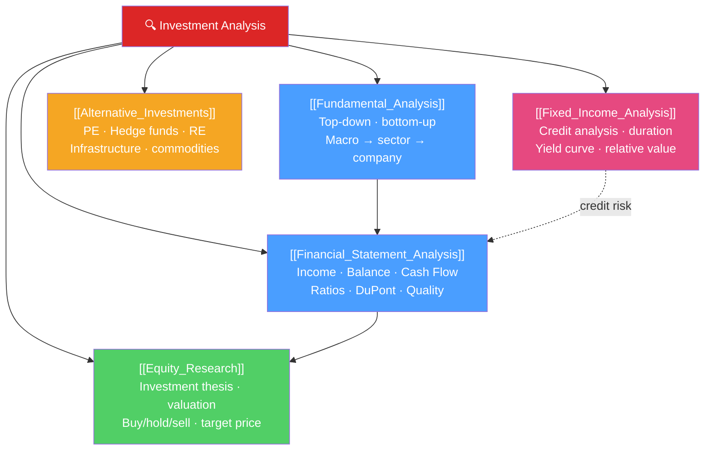

# 🔍 Investment Analysis — Map of Content

> [!abstract] What This Section Covers
> Investment analysis is the process of evaluating securities to determine whether they are worth buying. This section covers the full toolkit: **fundamental analysis** (the top-down / bottom-up approach to finding investment opportunities), **financial statement analysis** (reading balance sheets, income statements, and cash flows; ratio analysis; DuPont decomposition), **equity research** (how analysts build investment theses and write research reports), **fixed income analysis** (credit analysis, duration immunization, relative value in bonds), and **alternative investments** (private equity, hedge funds, real estate, infrastructure, commodities). CFA Level I and II cover all of these in depth.

## Concept Map

## Learning Path
1. [[Fundamental_Analysis]] — The framework for approaching any investment analysis.
2. [[Financial_Statement_Analysis]] — The skills to decode financial statements and assess quality.
3. [[Equity_Research]] — Putting it all together in an equity investment recommendation.
4. [[Fixed_Income_Analysis]] — Applying analysis to bonds, credit, and the yield curve.
5. [[Alternative_Investments]] — Beyond stocks and bonds: the alternative asset universe.

## All Notes at a Glance

| Note | Difficulty | What You'll Learn |
|------|------------|-------------------|
| [[Fundamental_Analysis]] | Intermediate | Top-down/bottom-up, Porter's Five Forces, moat analysis, growth drivers |
| [[Financial_Statement_Analysis]] | Intermediate | DuPont, key ratios, cash flow quality, red flags, GAAP adjustments |
| [[Equity_Research]] | Intermediate | Investment thesis, target price, buy/sell/hold, report structure |
| [[Fixed_Income_Analysis]] | Intermediate | Credit metrics, spread analysis, duration immunization, bond relative value |
| [[Alternative_Investments]] | Advanced | PE structure, hedge fund strategies, RE cap rates, commodity roll yield |

## Key Questions This Section Answers
- What is the difference between top-down and bottom-up investing?
- How do you read a cash flow statement to distinguish quality earnings from low-quality earnings?
- What makes a company's competitive advantage durable, and how does that affect valuation?
- How do you evaluate a corporate bond's credit risk beyond its rating?
- What role do alternatives play in a portfolio, and what are the key return drivers?

## Related Sections
- [[_MOC_Finance_Master|↑ Finance Master MOC]]
- [[_MOC_Valuation|← Valuation]] — Valuation models that quantify investment analysis
- [[_MOC_Risk_Return|→ Risk & Return]] — Portfolio context for investment decisions

#MOC #Finance #investment-analysis
