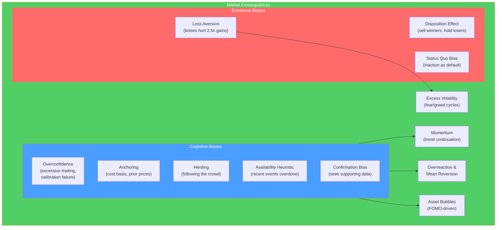

# 🧠 Behavioral Finance

> [!abstract] TL;DR
> Behavioral finance challenges the rational-investor assumption of CAPM and EMH by documenting systematic psychological biases that lead investors to make suboptimal decisions. **Prospect theory** (Kahneman & Tversky): people feel losses ~2.5x more painfully than equivalent gains (loss aversion). **Overconfidence** leads to excessive trading. **Anchoring** causes anchoring to irrelevant prices. These biases explain market anomalies (momentum, value, overreaction) and create persistent pricing errors that disciplined investors can exploit.

## Intuition — analogy FIRST

You buy a stock at $50. It rises to $70. You sell, pocketing a $20 gain. Good.

Then you buy another stock at $50. It falls to $30. Do you sell? Most investors don't — because the $20 loss "hurts" far more than the $20 gain felt good. This is **loss aversion**: you're holding a losing position hoping to break even, even though a rational investor would ask "if I were buying this today, would I buy it at $30?"

You're also likely to hold **more** of the stock that went to $70 than you should, afraid to sell because you'd "confirm the loss" — the endowment effect. Meanwhile you may avoid diversifying because your mental account keeps track of the $50 cost basis, not the current $30 value.

These aren't character flaws — they're systematic, predictable patterns that evolved for survival in physical environments but misfire in financial markets.

---

## How It Works

## Key Concepts / Details

### Prospect Theory (Kahneman & Tversky, 1979)

Prospect theory replaces rational utility theory with empirically observed decision-making under uncertainty:

**Value function**: S-shaped, steeper for losses than gains
- Concave for gains (diminishing sensitivity to gains)
- Convex for losses (diminishing sensitivity to losses)
- Asymmetric: a loss of $1,000 hurts ~2.5x more than a $1,000 gain feels good

$$\text{Loss aversion ratio} \approx 2.5$$

**Probability weighting**: people overweight small probabilities (why people buy lottery tickets) and underweight moderate-to-high probabilities. This explains why insurance and lottery tickets coexist with rational agents.

**Framing effects**: "90% survival rate" vs "10% mortality rate" evoke different responses to identical information — demonstrating that decisions depend on how choices are presented.

### Key Cognitive Biases

**Anchoring:**
- People make estimates by starting from an initial value (the "anchor") and adjusting insufficiently
- Example: if you paid $100 for a stock now worth $60, your loss of $40 feels "anchoring" you to $100 as fair value
- Market impact: stock prices anchor to prior highs/lows; analysts anchor to prior year earnings

**Overconfidence:**
- Most people rate themselves above-average drivers, investors, and forecasters
- Leads to: excessive trading (Barber & Odean showed that men trade 45% more than women and earn 1% less/year due to transaction costs)
- **Calibration failure**: investors believe their forecasts are more accurate than they are; too-narrow confidence intervals
- **Knowledge illusion**: feeling knowledgeable about a company after reading positive news — but news is already priced

**Confirmation bias:**
- Seeking information that confirms existing beliefs while discounting contradictory evidence
- Example: a bull on Tesla reads every positive news story; dismisses negative Tesla analysis as "biased"
- Particularly dangerous in investment thesis management — you need to actively seek disconfirming evidence

**Availability heuristic:**
- Overweighting easily recalled, recent events
- Example: after a plane crash, people temporarily overestimate plane crash probability
- Market: after the 2008 crisis, investors overweighted recession probability for years; after 2020–2021 bull run, overweighted bubble risk

**Herding:**
- Following crowd behavior regardless of personal analysis
- Amplifies price trends; creates bubbles and crashes
- Rational herding: sometimes it's rational to follow the crowd if you know others have better information

### Loss Aversion in Markets

**Disposition effect** (Shefrin & Statman, 1985):
Investors sell winners too quickly (locking in "sure" gains) and hold losers too long (avoiding confirmed loss):

| Position | What happens | Why |
|---------|-------------|-----|
| Gain | Sell too early | Concave value function — capture the "certain" gain |
| Loss | Hold too long | Convex value function — gamble for recovery |

**Evidence**: US retail investors realize gains 50% more often than losses (Odean, 1998). Trading records show "losers" held twice as long as "winners." This is suboptimal: winners (momentum) continue to win, while losers (mean reversion in earnings) continue to lag.

### Market Anomalies Explained by Behavioral Finance

| Anomaly | Behavioral Explanation |
|---------|----------------------|
| **Momentum** | Underreaction to news — investors slowly update beliefs → trend continues |
| **Mean reversion / value effect** | Overreaction to recent growth/decline → prices overshoot → revert |
| **January effect** | Tax-loss selling in December (loss aversion) creates selling pressure; reverses in January |
| **Post-earnings drift** | Investors underreact to earnings surprises; drift continues for months |
| **IPO underperformance** | Overoptimism about IPOs → overpricing → underperformance long-run |
| **Bubble formation** | Herding + overconfidence + availability heuristic → prices detach from fundamentals |

### Adaptive Markets Hypothesis (Lo, 2004)

Andrew Lo's AMH reconciles EMH and behavioral finance:
- Markets are not always efficient — they evolve
- Efficiency depends on the competitive environment and regime
- Periods of stress/transition: less efficient, more exploitable
- Long-run: competition drives toward efficiency

"Not efficient all the time, but not always inefficient" — markets adapt. Strategies that work in one regime fail in another. Investor survival = adapting strategies to current conditions.

### Practical Implications for Investors

**Personal bias mitigation:**

| Bias | Mitigation |
|------|-----------|
| Overconfidence | Pre-commit to position sizing rules; track actual vs predicted performance |
| Disposition effect | Set stop-losses; use predetermined sell rules unrelated to cost basis |
| Anchoring | Ignore cost basis for sell decisions; ask "would I buy this today at this price?" |
| Confirmation bias | Actively seek bear theses for held positions; consider before-action reviews |
| Herding | Have a written investment thesis; compare your analysis to consensus |

**Institutional disciplines**: investment committees, devil's advocates, pre-mortem analysis, systematic rules (quant strategies) can reduce bias.

---

## Real-World Notes

- **Bitcoin 2017 bubble**: Exemplifies availability (FOMO from neighbor's gains) + herding + overconfidence (everyone a crypto expert after 2 months). BTC fell 80% in 2018. In 2021, the cycle repeated at $60,000 → fell to $15,000. Classic bubble mechanics driven by behavioral, not fundamental, forces.
- **Robinhood GameStop (2021)**: The WSB Reddit community's coordinated buying of GME had strong herding elements — social reinforcement, FOMO, narrative-driven (vs fundamental). The short squeeze was rational; the continued buying at $400+ (10x fundamental value) was purely behavioral.
- **Nassim Taleb's Taleb distribution**: Traders who write out-of-the-money options appear to earn steady small gains. This looks like skill but is actually accumulating massive tail risk — availability heuristic causes them to underestimate the probability of a crash.
- **Kahneman's experiment on CEO overconfidence**: CEO surveys consistently show that acquirers believe they can integrate targets better than others have. Post-acquisition studies show the opposite — overconfidence drives overpayment and integration failures.

---

## Common Pitfalls

- Treating behavioral finance as a collection of cute anecdotes rather than rigorous models: Kahneman and Tversky's work is based on controlled experiments with replication.
- Assuming you're immune to biases because you know about them: awareness reduces but does not eliminate biases. Structural rules work better than willpower.
- Using behavioral explanations to justify any anomaly: not every market quirk is behavioral. Many "anomalies" disappear after publication (due to arbitrage), others were spurious in the data.
- Overconfidence about exploiting behavioral biases: the smart money is already trying to exploit the same anomalies. Edges from behavioral inefficiencies are shrinking as they become widely known.

---

## Related Concepts

- [[_MOC_Risk_Return|↑ Section MOC]]
- [[CAPM_and_Factor_Models]] — Behavioral finance challenges EMH and provides alternative explanations for anomalies
- [[Fundamental_Analysis]] — Behavioral biases affect how analysts form and maintain views
- [[Market_Microstructure]] — Behavioral dynamics affect bid-ask spreads, momentum in order flow
- [[Performance_Measurement]] — Distinguishing skill from behavioral pattern exploitation

## Review Questions

1. Explain the disposition effect using prospect theory. Why do investors hold losers too long and sell winners too soon? Give a specific example using a stock purchased at $50 that first rises to $70 (trigger to sell) then another that falls to $30 (resistance to sell).
2. How does herding behavior contribute to the formation of asset price bubbles? Walk through the 2021 meme stock episode as an example, identifying which specific biases were operating.
3. You believe a stock is significantly undervalued and have built a strong bull thesis. What are three specific steps you can take to check your analysis for confirmation bias?

## Sources

- Kahneman, Daniel, and Tversky, Amos, "Prospect Theory: An Analysis of Decision Under Risk" (Econometrica, 1979)
- Kahneman, Daniel, *Thinking, Fast and Slow* (Farrar, Straus and Giroux, 2011)
- Odean, Terrence, "Do Investors Trade Too Much?" (AER, 1999)
- CFA Institute, *CFA Program Curriculum* Level 2 — Behavioral Finance

#finance #risk-return #behavioral-finance #loss-aversion #cognitive-biases #prospect-theory
