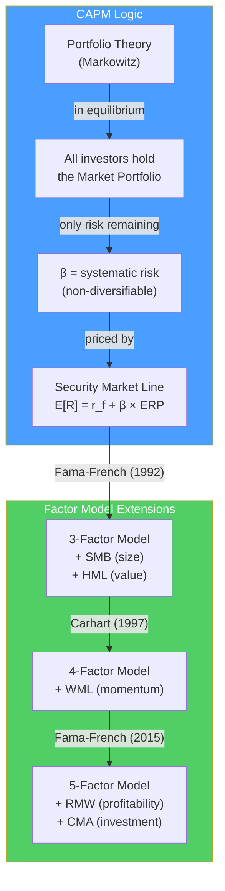

# 📐 CAPM and Factor Models

> [!abstract] TL;DR
> CAPM (Sharpe, 1964) prices systematic risk: $E[R_i] = R_f + \beta_i(E[R_m] - R_f)$. Only beta (systematic risk) is rewarded — idiosyncratic risk is diversifiable and earns zero return. The Security Market Line (SML) shows the expected return for any level of beta. In practice, CAPM misses important return drivers; Fama-French (1992) added size (SMB) and value (HML) factors; Carhart (1997) added momentum (WML). These multi-factor models better explain observed returns but raise EMH questions.

## Intuition — analogy FIRST

CAPM says the only risk worth paying for is the risk you **can't** diversify away.

If you own 30 stocks, company-specific bad news (a product recall, a CEO scandal) won't destroy your portfolio — it's diversified away. But a recession hitting all stocks simultaneously? That's undiversifiable market risk — beta.

Since only beta is undiversifiable, only beta earns a return premium. A company with β = 2 (moves twice as much as the market) requires a higher expected return than a company with β = 0.5. That's the CAPM prediction: expected return scales linearly with beta.

The SML is this relationship drawn as a line: the x-axis is beta, the y-axis is expected return. Every stock should plot on this line in equilibrium. A stock plotting **above** the SML (higher return than its beta predicts) is undervalued (positive alpha). Below the SML = overvalued.

---

## How It Works



## Key Concepts / Details

### CAPM Formula

$$\boxed{E[R_i] = R_f + \beta_i \times (E[R_m] - R_f)}$$

Where:
- $R_f$ = risk-free rate (10-year Treasury)
- $\beta_i$ = systematic risk of stock $i$ relative to market
- $E[R_m] - R_f$ = equity risk premium (ERP)
- $E[R_i]$ = required return for stock $i$

**Example:**
- Risk-free rate: 4.5%
- Beta: 1.3
- ERP: 5.5%

$$E[R_i] = 4.5\% + 1.3 \times 5.5\% = 4.5\% + 7.15\% = 11.65\%$$

This stock must return 11.65% to compensate investors for its systematic risk.

### Security Market Line (SML)

The SML is CAPM plotted graphically:

```
Expected Return
     |
 14% |                         • (positive alpha — buy)
     |                    /  ↗
 11% |               SML /
     |              /   
  8% |         /       
     |    /             × (negative alpha — sell)
  5% |/
     |
     +----+----+----+-----> Beta (β)
      0    0.5   1.0   1.5
      r_f        Market
```

**Key SML properties**:
- Y-intercept: risk-free rate ($R_f$)
- Market portfolio at β=1, E[R] = $R_m$
- Slope = ERP
- Alpha (α) = vertical distance above/below SML

**SML vs CML**:
| Feature | Security Market Line (SML) | Capital Market Line (CML) |
|---------|--------------------------|--------------------------|
| X-axis | Beta (systematic risk) | Total risk (σ) |
| Applies to | Individual assets + portfolios | Efficiently diversified portfolios only |
| Interpretation | Pricing of systematic risk | Optimal return per unit total risk |

### CAPM Assumptions and Limitations

**Assumptions (often violated):**
1. All investors are rational and mean-variance optimizers
2. All investors have the same expectations
3. No taxes or transaction costs
4. All assets are infinitely divisible and tradable
5. Investors can lend/borrow at the risk-free rate

**Empirical failures of CAPM:**
1. **Low-beta anomaly**: low-beta stocks historically earn higher risk-adjusted returns than CAPM predicts (Black, 1972)
2. **Size effect**: small-cap stocks earn more than their beta predicts (Banz, 1981)
3. **Value effect**: high book-to-market stocks earn more than beta predicts (Fama-French, 1992)
4. **Momentum**: stocks with strong recent performance continue to outperform (Jegadeesh & Titman, 1993)
5. **Profitability/investment effects**: profitable, low-investment firms outperform

### Fama-French Three-Factor Model (1992)

FF3 adds two factors to CAPM:

$$E[R_i] = R_f + \beta_i \times (R_m - R_f) + s_i \times SMB + h_i \times HML$$

| Factor | Name | Construction | Premium (historical) |
|--------|------|-------------|---------------------|
| **Market** | MKT | $R_m - R_f$ | ~5.5%/year |
| **SMB** | Small-Minus-Big | Return of small-cap minus large-cap | ~2–3%/year |
| **HML** | High-Minus-Low | Return of high B/M minus low B/M (value minus growth) | ~3–5%/year |

**Why does value outperform?** Debate continues:
- **Risk explanation**: value stocks are riskier (more financial distress risk) → higher return compensates
- **Behavioral explanation**: investors systematically overpay for glamour/growth stocks → value stocks are mispriced

### Carhart Four-Factor Model (1997)

Adds momentum:

$$E[R_i] = \alpha + \beta_{MKT}MKT + \beta_{SMB}SMB + \beta_{HML}HML + \beta_{WML}WML$$

| Factor | Name | Construction | Premium (historical) |
|--------|------|-------------|---------------------|
| **WML** | Winners-Minus-Losers | Return of 12-month winners minus 12-month losers | ~8–10%/year |

Momentum is the strongest short-term anomaly empirically — past 12-month winners continue to outperform for the next 3–12 months. The "crash" of momentum strategies is also a risk (sudden reversals can be severe).

### Fama-French Five-Factor Model (2015)

Further adds profitability and investment:

| Factor | Name | Premium |
|--------|------|---------|
| RMW | Robust-Minus-Weak (profitability) | ~3%/year |
| CMA | Conservative-Minus-Aggressive (investment) | ~2%/year |

**RMW**: high-profit firms outperform low-profit. Consistent with "moat" investing.
**CMA**: conservative-investing firms (low capex growth) outperform aggressive-investing firms.

### Alpha and Beta Separation

Modern factor models allow **performance attribution**:

$$R_i = \alpha + \sum_k \beta_k F_k + \epsilon_i$$

- $\alpha$ = skill (return unexplained by factors)
- $\beta_k F_k$ = factor exposures (passive, can be replicated cheaply with ETFs)
- $\epsilon_i$ = idiosyncratic return

**Smart beta ETFs** deliberately tilt toward factor exposures:
- Value ETFs: high HML loading
- Small-cap ETFs: high SMB loading
- Momentum ETFs: high WML loading
- Quality ETFs: high RMW loading
- Low volatility ETFs: negative MKT loading

The question for active managers: are they generating true alpha, or just unexpensive factor exposure?

---

## Real-World Notes

- **LTCM (1998)**: Long-Term Capital Management used Nobel laureates (Scholes, Merton) running factor models. Was essentially selling volatility (negative options beta). Lost $4.6B when Russia defaulted — correlations broke down and the model failed. Even the most sophisticated factor models have regime blind spots.
- **Factor crowding risk**: by 2019–2020, value factor had massive drawdown as tech growth stocks dominated. Many "smart beta" value ETFs dramatically underperformed. Factors that become widely known and invested get arbitraged away.
- **Momentum crash of 2009**: momentum strategy lost 40% in April 2009 as the market reversed — prior winners became sellers and prior losers rallied. Momentum strategies need robust risk management given crash risk.
- **AQR Capital Management**: the world's largest quantitative hedge fund ($100B+, Cliff Asness, 2024) is built on systematic factor investing (value, momentum, carry, defensive). AQR's research has both documented and exploited factor premiums — but also faced challenges when factors disappointed 2018–2022.

---

## Common Pitfalls

- Treating beta as a constant: beta changes with the company's fundamentals and market regime. A company that acquires heavily will change its beta.
- Confusing factor exposure with alpha: a value investor claiming "alpha" may just have HML factor exposure — which is now available in cheap ETFs.
- Using past high returns as evidence of superior skill without controlling for factor loadings: a "great" manager from 2014–2021 may have been a leveraged technology momentum bet.
- Applying CAPM cost of equity without checking beta measurement quality: the measurement period and market proxy matter significantly.

---

## Related Concepts

- [[_MOC_Risk_Return|↑ Section MOC]]
- [[Portfolio_Theory_Basics]] — CAPM is built on top of Markowitz portfolio theory
- [[Cost_of_Capital_and_WACC]] — CAPM's primary corporate finance application
- [[Risk_and_Return_Fundamentals]] — Beta defined; Sharpe ratio related to SML
- [[Behavioral_Finance]] — Explains why CAPM anomalies exist and persist

## Review Questions

1. Stock X has a beta of 1.4, the risk-free rate is 4%, and the equity risk premium is 5.5%. Calculate the required return using CAPM. If the stock actually returns 12.5%, calculate Jensen's alpha and explain what this means.
2. What are the three Fama-French factors? Give the economic intuition for why small-cap stocks (SMB) and value stocks (HML) historically earned higher returns — provide both the risk-based and behavioral explanations.
3. How does a "smart beta" ETF differ from both an active mutual fund and a passive index fund? Give an example of a smart beta strategy and explain the factor it captures.

## Sources

- Sharpe, William, "Capital Asset Prices: A Theory of Market Equilibrium under Conditions of Risk" (JF, 1964)
- Fama, Eugene, and French, Kenneth, "The Cross-Section of Expected Stock Returns" (JF, 1992)
- Carhart, Mark, "On Persistence in Mutual Fund Performance" (JF, 1997)
- Asness, Clifford, Moskowitz, Tobias, and Pedersen, Lasse, "Value and Momentum Everywhere" (JF, 2013)

#finance #risk-return #CAPM #SML #Fama-French #factor-models #beta #alpha
