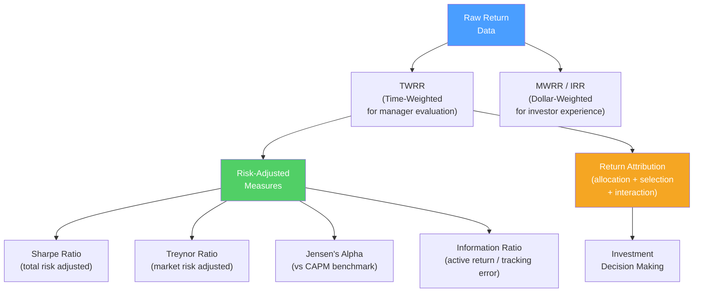

# 🏆 Performance Measurement

> [!abstract] TL;DR
> Performance measurement evaluates investment results — distinguishing skill from luck, and rewarded risk from alpha. **TWRR** (Time-Weighted Rate of Return) measures portfolio performance independent of client cash flows; **MWRR** measures actual client wealth creation. **Sharpe ratio** adjusts for total risk; **Treynor** adjusts for market risk; **Jensen's alpha** measures excess return vs CAPM. **Attribution analysis** decomposes returns into asset allocation, security selection, and interaction effects. The GIPS standards ensure comparable reporting across managers.

## Intuition — analogy FIRST

Measuring investment performance sounds easy: compare returns. But two complications make it tricky.

**Problem 1 — Timing of cash flows**: a fund that doubles your $1M to $2M looks great. But if you only invested $100K when it doubled and $900K when it halved, you personally lost money — even though the "fund return" was positive. TWRR strips out cash flow timing to measure the manager's skill; MWRR measures your actual experience.

**Problem 2 — Risk adjustment**: a fund returning 20%/year while taking 3x the market risk isn't a great fund. You could have bought leveraged ETFs. Risk-adjusted measures (Sharpe, Treynor, Jensen) ask: did the manager earn more than the risk they took justified?

The final question: is the alpha statistically significant, or just noise? Even a monkey randomly selecting stocks will occasionally outperform for 3–5 years by chance.

---

## How It Works

## Key Concepts / Details

### Return Calculation Methods

**Holding Period Return (HPR):**
$$HPR = \frac{(P_t - P_{t-1}) + D_t}{P_{t-1}}$$

**Time-Weighted Rate of Return (TWRR):**
$$TWRR = \left[\prod_{t=1}^{n} (1 + R_t)\right]^{1/n} - 1$$

- Breaks the period into sub-periods at each cash flow
- Calculates HPR for each sub-period
- Links them geometrically
- **Eliminates the effect of cash flows** — measures manager skill independent of investor timing
- **Used for manager comparison and benchmarking**

**Money-Weighted Rate of Return (MWRR / IRR):**
$$0 = -CF_0 + \sum_{t=1}^{n} \frac{CF_t}{(1+MWRR)^t}$$

- The IRR of all cash flows (contributions and withdrawals)
- **Reflects investor experience** — affected by timing of contributions
- If an investor adds money before a downturn, MWRR < TWRR
- **Used for measuring actual investor wealth creation**

**Worked example:**

| Period | Start Value | Cash Flow | End Value | Period Return |
|--------|------------|-----------|-----------|--------------|
| Q1 | $1,000 | +$500 (added) | $1,600 | 10% (on $1,000) |
| Q2 | $1,600 | 0 | $1,440 | -10% |

TWRR = $[(1.10) \times (0.90)]^{1/2} - 1 = [0.99]^{0.5} - 1 = -0.50\%$

The manager slightly lost value. But because the investor added $500 before the down quarter:
MWRR < TWRR — the investor's actual wealth experience is worse than the TWRR suggests.

### Risk-Adjusted Performance Measures

**Sharpe Ratio:**
$$SR = \frac{R_p - R_f}{\sigma_p}$$
Measures excess return per unit of **total risk**. Best for evaluating a portfolio in isolation (not relative to a benchmark). Higher is better.

**Treynor Ratio:**
$$TR = \frac{R_p - R_f}{\beta_p}$$
Measures excess return per unit of **systematic risk (beta)**. Best when the portfolio is one of many in a diversified account — only market risk matters, not total risk. Higher is better.

**Jensen's Alpha:**
$$\alpha = R_p - [R_f + \beta_p(R_m - R_f)]$$
Measures excess return vs CAPM prediction. Positive alpha = outperformance after accounting for market risk. Can be negative (underperformance).

**Information Ratio:**
$$IR = \frac{R_p - R_b}{\sigma_{p-b}} = \frac{\text{Active return}}{\text{Tracking error}}$$
Where $R_b$ = benchmark return, $\sigma_{p-b}$ = standard deviation of active return. Measures skill in generating active returns per unit of active risk. An IR > 0.5 is considered good for active managers; > 1.0 is excellent.

**M-squared (Modigliani-Modigliani):**
$$M^2 = R_f + SR_p \times \sigma_m$$
Adjusts a portfolio's return to market risk level — allows comparison at a standardized risk level. Useful for clients who want a single return number that's comparable.

**Comparison example:**

| Fund | R_p | σ_p | β | R_f=4% | R_m=10% | Sharpe | Treynor | Jensen's α |
|------|-----|-----|---|--------|---------|--------|---------|-----------|
| A | 12% | 14% | 0.8 | 4% | 10% | 0.57 | 10.0% | 3.2% |
| B | 15% | 22% | 1.4 | 4% | 10% | 0.50 | 7.9% | 2.6% |
| Market | 10% | 15% | 1.0 | 4% | | 0.40 | 6.0% | 0% |

Fund A: better Sharpe AND Treynor → outperforms on both total and systematic risk basis.
Fund B: higher raw return but worse risk-adjusted performance.

### Performance Attribution (Brinson-Hood-Beebower, 1986)

Attribution decomposes active return vs benchmark into three effects:

$$R_p - R_b = \text{Allocation effect} + \text{Selection effect} + \text{Interaction effect}$$

| Effect | Formula | Interpretation |
|--------|---------|----------------|
| **Allocation** | $(w_{p,i} - w_{b,i}) \times (R_{b,i} - R_b)$ | Value of overweighting/underweighting sectors vs benchmark |
| **Selection** | $w_{b,i} \times (R_{p,i} - R_{b,i})$ | Value of picking better stocks within each sector |
| **Interaction** | $(w_{p,i} - w_{b,i}) \times (R_{p,i} - R_{b,i})$ | Combined effect of weight and return decisions |

**Example**: Portfolio overweighted technology (+5% vs benchmark) and tech outperformed (+8% vs benchmark average). Allocation effect = positive (right sector bet) + Selection effect (right stocks within tech).

### Statistical Significance of Alpha

A common problem: distinguishing luck from skill.

**Signal-to-noise ratio**: at a typical annual alpha of 2% and tracking error of 5%, the t-statistic after $n$ years:

$$t = \frac{\alpha}{\sigma_\alpha / \sqrt{n}} = \frac{2\%}{5\% / \sqrt{n}}$$

For statistical significance at 95% (t > 2), need $n > 25$ years. 

**Implication**: it takes ~25 years of 2% annual alpha to be statistically confident the manager is genuinely skilled vs lucky. Most manager track records are 3–10 years — far too short to distinguish skill from luck.

**Multiple testing problem**: if 100 managers randomly invest, ~5 will produce statistically significant 5% performance by chance (one-tailed, 95% CI). Published track records suffer from survivorship bias.

### GIPS Standards

The **Global Investment Performance Standards (GIPS)**, administered by CFA Institute, ensure consistent performance reporting:

Key requirements:
- Report gross AND net-of-fees returns
- Show 5-year minimum (or since inception) track record
- Define composites (all portfolios with similar mandate)
- Use TWRR for returns
- Report 3-year annualized ex-post standard deviation

GIPS compliance is voluntary but required by many institutional investors and sovereign wealth funds before allocating capital.

---

## Real-World Notes

- **Tiger Global's 2021/2022 swing**: Tiger Global returned +65% in 2021 (heavily tech long). In 2022, lost ~50% of total assets under management. In 2021, they looked like geniuses; in 2022, the beta to speculative tech became apparent. The actual risk-adjusted performance measured by Sharpe was not exceptional once accounting for the concentrated tech risk.
- **Buffett's alpha**: Frazzini, Kabiller, and Pedersen (2013) decomposed Berkshire Hathaway's returns using factor models. They found Buffett's alpha is partly explained by the BAB (Betting Against Beta — investing in low-beta stocks with leverage), quality, and value factors. Still significant unexplained alpha remains.
- **Survivorship bias in mutual funds**: Carhart (1997) found that including defunct funds reduces average mutual fund performance by ~1%/year vs reported averages — because bad funds are liquidated and removed from databases.
- **The "best fund manager" illusion**: After 2020, ARK Invest's Cathie Wood was labeled "best fund manager in decades" after +150% in 2020. By 2022, ARKK had lost 80% from peak. Regression to mean, high tracking error, and concentrated risk showed the 2020 performance was largely luck (max beta to COVID winners).

---

## Common Pitfalls

- Comparing TWRR across managers without checking benchmark definitions: a 12% return vs a benchmark of 10% may be 2% alpha, or it may just be higher beta.
- Using Sharpe ratio to compare funds with different strategies: Sharpe is only meaningful for strategies with similar distribution of returns (not for options strategies or leveraged products).
- Evaluating managers over < 5 years: too short to distinguish skill from luck; require minimum 7–10 years with consistent strategy.
- Ignoring the fee impact: a 1% management fee and 20% performance fee consumes roughly half of a manager's alpha in typical scenarios.

---

## Related Concepts

- [[_MOC_Risk_Return|↑ Section MOC]]
- [[CAPM_and_Factor_Models]] — Jensen's alpha is defined relative to CAPM
- [[Risk_and_Return_Fundamentals]] — Sharpe, beta, and standard deviation inputs
- [[Portfolio_Theory_Basics]] — Efficient frontier as the performance benchmark
- [[Behavioral_Finance]] — Behavioral biases that cause managers to appear skilled or unskilled

## Review Questions

1. A fund has the following quarterly returns and client cash flows: Q1 start $1M, +20% return; Q2 client adds $500K, then −15% return. Calculate TWRR and MWRR. Why are they different, and which measure should a fund use to compare itself to benchmark?
2. Fund X: 15% return, σ=20%, β=1.2. Fund Y: 12% return, σ=12%, β=0.8. Risk-free rate = 4%, market return = 10%. Calculate Sharpe, Treynor, and Jensen's alpha for each. Which fund is the better investment, and does the answer depend on whether the investor holds it as their entire portfolio vs part of a larger portfolio?
3. How many years of 2% annual alpha with 5% tracking error are needed to achieve statistical significance at the 95% confidence level? What does this imply about the practice of evaluating active managers on 3-year track records?

## Sources

- Brinson, Gary, Hood, Randolph, and Beebower, Gilbert, "Determinants of Portfolio Performance" (FAJ, 1986)
- Jensen, Michael, "The Performance of Mutual Funds in the Period 1945–1964" (JF, 1968)
- CFA Institute, *CFA Program Curriculum* Level 3 — Portfolio Management — Evaluating Portfolio Performance
- GIPS Standards, CFA Institute (2020 edition)

#finance #risk-return #performance-measurement #Sharpe #Treynor #Jensen #TWRR #attribution
