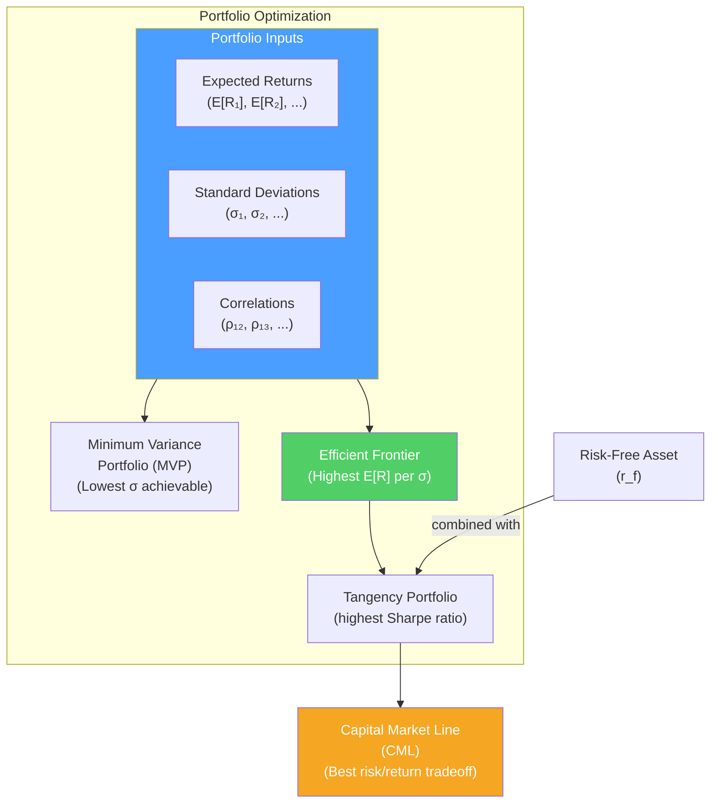

# 🧮 Portfolio Theory Basics

> [!abstract] TL;DR
> Markowitz (1952) showed that the risk of a portfolio depends on the **correlation** between its assets, not just their individual risks. By combining imperfectly correlated assets, you can reduce portfolio risk without reducing expected return — this is the **diversification benefit**. The **efficient frontier** shows all optimal portfolios. The **Minimum Variance Portfolio (MVP)** has the lowest possible risk. Adding a risk-free asset creates the **Capital Market Line (CML)** — a straight line from risk-free to the tangency portfolio (market portfolio). Key formula: $\sigma_p^2 = w_1^2\sigma_1^2 + w_2^2\sigma_2^2 + 2w_1w_2\sigma_1\sigma_2\rho_{12}$.

## Intuition — analogy FIRST

Imagine you own two ice cream shops: one in Miami (great in summer, dead in winter) and one in Aspen (great in winter, dead in summer). 

Neither alone is great — highly seasonal, high revenue variance. But **together**, they smooth out returns because when one is slow, the other is busy. You've diversified: total cash flow variability is much lower than either individual shop, while average annual revenue is the same.

This is the core insight of portfolio theory: combining assets with **low or negative correlation** reduces portfolio volatility without reducing expected return. You get risk reduction "for free."

The key variable: **correlation** (ρ). If your two shops had perfectly correlated revenues (both high in summer, both low in winter — ρ=+1), there's no diversification benefit. If they're negatively correlated (ρ=−1), you can eliminate variance entirely.

---

## How It Works



## Key Concepts / Details

### Portfolio Return

Portfolio expected return is simply the weighted average of individual returns:

$$E[R_p] = \sum_{i=1}^{n} w_i \times E[R_i]$$

**Example**: 60% in stocks (expected return 10%), 40% in bonds (expected return 5%):
$$E[R_p] = 0.60 \times 10\% + 0.40 \times 5\% = 8\%$$

### Portfolio Variance (Two Assets)

Portfolio variance is NOT simply the weighted average of individual variances:

$$\sigma_p^2 = w_1^2\sigma_1^2 + w_2^2\sigma_2^2 + 2w_1w_2\sigma_1\sigma_2\rho_{12}$$

$$\sigma_p^2 = w_1^2\sigma_1^2 + w_2^2\sigma_2^2 + 2w_1w_2\text{Cov}_{12}$$

The third term ($2w_1w_2\sigma_1\sigma_2\rho_{12}$) is the **covariance term** — the source of diversification benefit.

**Worked example**: 
- Asset 1: E[R] = 10%, σ = 20%
- Asset 2: E[R] = 8%, σ = 15%
- Correlation ρ = 0.3
- Weights: w₁ = 60%, w₂ = 40%

$$\sigma_p^2 = (0.6)^2(0.20)^2 + (0.4)^2(0.15)^2 + 2(0.6)(0.4)(0.20)(0.15)(0.3)$$
$$= 0.0144 + 0.0036 + 0.00432 = 0.02232$$
$$\sigma_p = \sqrt{0.02232} = 14.9\%$$

Weighted average σ would be $0.6 \times 20\% + 0.4 \times 15\% = 18\%$. The portfolio σ of 14.9% is significantly lower because of low correlation.

### Effect of Correlation on Diversification

| Correlation (ρ) | Diversification benefit |
|----------------|------------------------|
| ρ = +1 | No benefit — σ_p = weighted average σ |
| 0 < ρ < 1 | Partial benefit — σ_p < weighted average |
| ρ = 0 | Significant benefit |
| −1 < ρ < 0 | Large benefit |
| ρ = −1 | Perfect hedge — can reduce σ to 0 with optimal weights |

**Correlation in practice (approximate, equities)**:
- Two stocks, same sector: ρ ≈ 0.6–0.8
- Two stocks, different sectors: ρ ≈ 0.2–0.5
- Stocks vs bonds (normal regime): ρ ≈ −0.1 to +0.2
- Stocks vs gold: ρ ≈ −0.1 to +0.1

### Efficient Frontier

The efficient frontier shows all **mean-variance optimal** portfolios — portfolios that maximize expected return for a given level of risk (or minimize risk for a given expected return).

```
Expected Return
     |
 10% |                    •---•---•  Efficient Frontier
     |               •---
  8% |          •---    ← (optimal portfolios above here)
     |     •--- 
  6% |•---         MVP = Minimum Variance Portfolio
     |
     +----+----+----+-----> Portfolio σ (Risk)
       5%  10%  15%  20%
```

**Key point**: portfolios on the **lower** part of the frontier (below MVP) are inefficient — you could get higher return for the same risk by moving up.

**Minimum Variance Portfolio (MVP)**: the portfolio with the lowest possible standard deviation. For two assets, the MVP weights are:

$$w_1^* = \frac{\sigma_2^2 - \text{Cov}_{12}}{\sigma_1^2 + \sigma_2^2 - 2\text{Cov}_{12}}$$

### Capital Market Line (CML)

When a risk-free asset exists, investors can combine the risk-free asset with any portfolio on the efficient frontier. The optimal combination is the **tangency portfolio** (the portfolio on the efficient frontier with the highest Sharpe ratio).

The CML is the straight line from the risk-free rate through the tangency portfolio:

$$E[R_p] = R_f + \left(\frac{E[R_T] - R_f}{\sigma_T}\right) \times \sigma_p$$

The slope $\frac{E[R_T] - R_f}{\sigma_T}$ is the **Sharpe ratio of the tangency portfolio** — the "price of risk" per unit of standard deviation.

In CAPM theory, the tangency portfolio **is the market portfolio** (value-weighted portfolio of all risky assets). Therefore, CAPM predicts all rational investors hold a combination of the risk-free asset and the market portfolio.

### Number of Assets and Diversification

As you add more stocks, total portfolio variance approaches systematic (market) variance:

$$\sigma_p^2 \approx \overline{\text{Cov}} \text{ as } n \to \infty$$

The remaining risk (systematic) = average covariance of all pairs of assets. Individual stock variance becomes irrelevant.

**Practical implications**:
- 5 stocks: ~50% of idiosyncratic risk eliminated
- 20 stocks: ~90% of idiosyncratic risk eliminated
- 50 stocks: ~97% of idiosyncratic risk eliminated
- No amount of diversification eliminates systematic risk

**Rule of thumb**: a 20–30 stock portfolio, properly diversified across sectors, eliminates most unsystematic risk. Beyond that, marginal benefit diminishes rapidly.

---

## Real-World Notes

- **2022 stock-bond correlation shift**: For 40 years (1982–2022), stocks and bonds had negative correlation during recessions (bonds rallied while stocks fell). This was the diversification benefit of 60/40 portfolios. In 2022, inflation drove both down simultaneously — demonstrating that diversification benefits depend on the economic regime.
- **Risk parity** (Bridgewater's "All Weather" portfolio): allocates risk equally across asset classes (stocks, bonds, commodities, gold) rather than equal dollar weights. Because bonds have much lower volatility, they need larger weight to contribute equal risk. Theoretically more robust to regime changes — but uses leverage on bonds.
- **Global diversification** in practice: US institutional investors have progressively added international exposure. The correlation between US and international equities has risen over time (globalization) — reducing the diversification benefit. In 2008 global crisis, most equity markets fell together.
- **Crisis correlations**: a key finding in financial crises is that correlations between risky assets spike toward 1 precisely when diversification is most needed. This is called **correlation breakdown** or "all correlations go to 1 in a crisis."

---

## Common Pitfalls

- Assuming historical correlations are stable: crisis periods see correlations spike; this means standard diversification measures underestimate tail-risk.
- Believing that 30 stocks is fully diversified: even with 30 stocks, you bear market beta risk. Diversification removes stock-specific risk, not market risk.
- Optimizing the efficient frontier using historical returns: expected returns are far noisier than correlations; optimization using historical returns is highly sensitive to outliers and often leads to extreme weights in backtests.
- Ignoring international and asset class diversification: portfolio theory applies to any risky asset, not just stocks — adding real assets, bonds, and foreign equity extends the diversification benefit.

---

## Related Concepts

- [[_MOC_Risk_Return|↑ Section MOC]]
- [[Risk_and_Return_Fundamentals]] — The inputs to portfolio variance calculation
- [[CAPM_and_Factor_Models]] — Extends portfolio theory to asset pricing
- [[Performance_Measurement]] — Evaluating portfolios relative to the efficient frontier
- [[Alternative_Investments]] — How alternatives extend the efficient frontier

## Review Questions

1. A portfolio holds 70% in an asset with E[R]=12%, σ=20%, and 30% in an asset with E[R]=6%, σ=10%. The correlation is 0.4. Calculate the portfolio expected return and standard deviation.
2. Why does the efficient frontier have the shape it does (concave/curved)? What happens to the frontier shape as the correlation between two assets decreases from +1 to 0 to −1?
3. What is the Capital Market Line? Explain in one paragraph why rational investors should always hold a combination of the risk-free asset and the tangency portfolio, rather than any other point on the efficient frontier.

## Sources

- Markowitz, Harry, "Portfolio Selection" (Journal of Finance, 1952)
- Brealey, Myers, Allen, *Principles of Corporate Finance*, 13th edition, Ch. 8
- CFA Institute, *CFA Program Curriculum* Level 1 — Portfolio Management

#finance #risk-return #portfolio-theory #Markowitz #efficient-frontier #diversification
