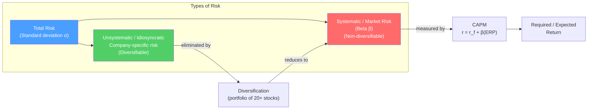

# 📈 Risk and Return Fundamentals

> [!abstract] TL;DR
> The risk-return tradeoff is the first principle of finance: higher expected returns require bearing higher risk. **Return** is measured as percentage change in value plus income. **Risk** is measured as standard deviation (total risk) or beta (market risk). The **Sharpe ratio** ($\frac{R_p - R_f}{\sigma_p}$) measures return per unit of total risk. Rational investors demand a risk premium — the **equity risk premium (ERP)** of ~5% is what investors require above the risk-free rate to hold stocks.

## Intuition — analogy FIRST

You can put your money in a US Treasury bill (essentially risk-free) at 4.5%, or in the S&P 500 with expected returns of ~9.5%. Why would you take the stock market risk?

Because you're paid 5% extra (the equity risk premium) to bear the uncertainty of stock returns. Some years stocks return +30%; other years -30%. That volatility is the risk you're paid to bear.

Now compare two mutual funds: Fund A returns 12%/year; Fund B returns 15%/year. Is Fund B better? Not necessarily — if Fund B took twice as much risk (was twice as volatile), you only received 1.5x the return for 2x the risk. The **Sharpe ratio** adjusts returns for risk, allowing apples-to-apples comparison.

---

## How It Works

## Key Concepts / Details

### Measuring Returns

**Single-period return:**
$$R_t = \frac{P_t - P_{t-1} + D_t}{P_{t-1}}$$

Where $D_t$ = dividend or cash distribution.

**Arithmetic mean return** (for estimating average return):
$$\bar{R} = \frac{1}{n} \sum_{t=1}^{n} R_t$$

**Geometric mean return** (for measuring compound growth rate — the true "what did I earn?"):
$$R_g = \left[\prod_{t=1}^{n} (1 + R_t)\right]^{1/n} - 1$$

**Example**: Returns of +50%, −40%, +50% over 3 years:
- Arithmetic mean = (50 − 40 + 50)/3 = **20%** per year (misleading)
- Geometric mean = $(1.5 \times 0.6 \times 1.5)^{1/3} − 1 = (1.35)^{0.333} − 1 = $ **10.5%** per year (true compounded return)
- The difference is significant — the geometric mean is always ≤ arithmetic mean.

### Measuring Risk

**Variance and Standard Deviation:**
$$\sigma^2 = \frac{1}{n-1} \sum_{t=1}^{n} (R_t - \bar{R})^2$$

$$\sigma = \sqrt{\sigma^2}$$

**Example**: Annual returns: 15%, −5%, 20%, 10%, −10%
- Mean = 6%
- Deviations: 9%, −11%, 14%, 4%, −16%
- Squared: 81, 121, 196, 16, 256 → Sum = 670
- Variance = 670/4 = 167.5
- Standard deviation = $\sqrt{167.5}$ = **12.9% per year**

**Normal distribution approximation:**
- 68% of annual returns within ±1σ of mean
- 95% of annual returns within ±2σ of mean

**S&P 500 historical**: mean return ~10%/year, std dev ~15%/year → 95% of years should be between −20% and +40%.

### Risk Types

| Risk Type | Description | Can diversify away? | Measure |
|-----------|-------------|---------------------|---------|
| **Market risk (systematic)** | Broad market moves | No | Beta (β) |
| **Interest rate risk** | Change in interest rates | Partially | Duration |
| **Inflation risk** | Real return erosion | Partially | TIPS spread |
| **Credit risk** | Issuer default | Partially | Credit spreads |
| **Liquidity risk** | Cannot exit position at fair value | No (for illiquid assets) | Bid-ask spread |
| **Currency risk** | Exchange rate movements | Partially (hedge) | FX volatility |
| **Company-specific risk** | Single company events | Yes | Idiosyncratic vol |
| **Reinvestment risk** | Cannot reinvest at original rate | Partially | Coupon reinvestment |

### Beta

Beta measures a stock's sensitivity to market returns:

$$\beta = \frac{\text{Cov}(R_i, R_m)}{\text{Var}(R_m)} = \rho_{i,m} \times \frac{\sigma_i}{\sigma_m}$$

| Beta | Interpretation |
|------|---------------|
| β = 0 | No market correlation (cash, some hedged funds) |
| β = 0.5 | Half as volatile as market (utilities, consumer staples) |
| β = 1.0 | Moves with market (S&P 500 index) |
| β = 1.5 | 50% more volatile than market (cyclicals, financials in stress) |
| β = 2.0 | Doubles market moves (leveraged tech, speculative biotech) |
| β < 0 | Inversely correlated with market (gold, some hedge funds) |

### Risk-Adjusted Return Measures

**Sharpe Ratio** (return per unit of total risk):
$$SR = \frac{R_p - R_f}{\sigma_p}$$

**Treynor Ratio** (return per unit of systematic risk — beta):
$$TR = \frac{R_p - R_f}{\beta_p}$$

**Jensen's Alpha** (excess return above what CAPM predicts):
$$\alpha = R_p - [R_f + \beta_p(R_m - R_f)]$$

**Information Ratio** (active return per unit of active risk):
$$IR = \frac{R_p - R_b}{\sigma_{p-b}} = \frac{\text{Active return}}{\text{Tracking error}}$$

**Example comparison:**

| Fund | Return | σ | Beta | R_f = 4% | Sharpe | Treynor | Jensen's α |
|------|--------|---|------|---------|--------|---------|-----------|
| Fund A | 12% | 15% | 0.9 | 4% | 0.53 | 8.9% | 1.1% |
| Fund B | 14% | 20% | 1.3 | 4% | 0.50 | 7.7% | 0.4% |
| Market | 10% | 15% | 1.0 | 4% | 0.40 | 6.0% | 0% |

Fund A has better risk-adjusted performance on all measures despite lower raw return.

### Equity Risk Premium (ERP)

The ERP is the expected return of equities above the risk-free rate:

$$ERP = E[R_m] - R_f$$

**Historical (ex-post) estimates:**
- Ibbotson (1926–2023): US ERP ~6.5% (arithmetic), ~4.8% (geometric)
- Global ERP somewhat lower (~4–5%)

**Forward-looking (implied) ERP** (Damodaran approach):
$$ERP = \frac{E[Dividends + Buybacks]}{S\&P500} + g - R_f$$

Using a dividend discount model: S&P earnings yield + growth − risk-free rate.

As of 2024, Damodaran's implied ERP estimate: ~4.0–4.5%.

---

## Real-World Notes

- **COVID crash (March 2020)**: S&P 500 fell 34% in 33 days — approximately 2.3σ move. The speed was unprecedented; many risk models (VaR, which assumed fat tails but not at this speed) failed. Beta of tech stocks temporarily rose above historical estimates.
- **2022 — stocks and bonds both fell**: Standard portfolio diversification wisdom (bonds hedge equity drawdowns) failed in 2022. Both stocks (−18%) and bonds (−13%) fell as inflation drove rates up. The 60/40 suffered its worst year since 1937. Shows that the "diversification" between stocks and bonds depends on the inflation regime.
- **Long-term ERP**: Dimson, Marsh, Staunton (2023 Credit Suisse Global Returns Yearbook) estimate the global equity risk premium at ~5.4% (arithmetic) over 1900–2022 — the most comprehensive long-term data.

---

## Common Pitfalls

- Using arithmetic mean to calculate compound wealth: always use geometric mean for measuring how much wealth actually compounded.
- Treating standard deviation as the only risk measure: it's symmetric and normally distributed. Actual returns are negatively skewed with fat tails. VaR, CVaR, and maximum drawdown supplement standard deviation.
- Confusing absolute return and risk-adjusted return: a 15% returning fund with double the risk isn't "better" than a 10% fund.
- Using short historical periods to estimate beta: at least 36 months, preferably 60 months, of monthly returns for a reliable beta estimate.

---

## Related Concepts

- [[_MOC_Risk_Return|↑ Section MOC]]
- [[Portfolio_Theory_Basics]] — Extends single-asset risk measurement to portfolios
- [[CAPM_and_Factor_Models]] — The formal model pricing systematic risk
- [[Performance_Measurement]] — Sharpe, Treynor, Jensen applied to evaluation
- [[Behavioral_Finance]] — Why real investors don't behave as predicted by these models

## Review Questions

1. An investment has annual returns of +20%, −30%, +25%, +15%, −10% over 5 years. Calculate the arithmetic mean return, the geometric mean return, and explain which is more appropriate for measuring wealth growth.
2. Fund X returns 14% with a standard deviation of 18%. Fund Y returns 11% with a standard deviation of 9%. The risk-free rate is 4%. Calculate the Sharpe ratio for each fund. Which fund provides better risk-adjusted performance?
3. A stock has a beta of 1.4 and returns 16%. The market returned 11% and the risk-free rate is 4%. Calculate Jensen's alpha. What does a positive alpha indicate about the stock's performance?

## Sources

- Dimson, Elroy, Marsh, Paul, and Staunton, Mike, *Triumph of the Optimists* (Princeton University Press)
- CFA Institute, *CFA Program Curriculum* Level 1 — Portfolio Management
- Damodaran, Aswath, *Equity Risk Premiums (ERP): Determinants, Estimation, and Implications* (annual paper)

#finance #risk-return #Sharpe-ratio #beta #ERP #standard-deviation
