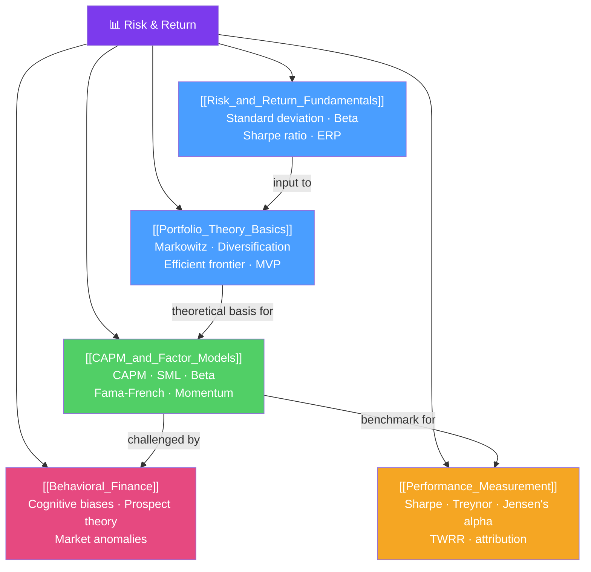

# 📊 Risk and Return — Map of Content

> [!abstract] What This Section Covers
> Risk and return is the theoretical foundation of modern portfolio management. This section covers the basic risk-return tradeoff and how to measure both (standard deviation, Sharpe ratio, beta), the mathematical framework for diversification and optimal portfolios (Markowitz portfolio theory), the central asset pricing model (CAPM and its extensions to factor models), the psychological limits of the rational investor assumption (behavioral finance), and how to measure whether investment performance is genuinely skilled or just lucky (performance measurement). Together these topics form the core of CFA Level 1–2 portfolio management and the theoretical grounding for every investment decision.

## Concept Map

## Learning Path
1. [[Risk_and_Return_Fundamentals]] — Measuring risk and return for individual assets.
2. [[Portfolio_Theory_Basics]] — Combining assets to minimize risk for a given return.
3. [[CAPM_and_Factor_Models]] — Pricing risk across markets; extensions to multi-factor.
4. [[Behavioral_Finance]] — Why investors deviate from rationality and what it means.
5. [[Performance_Measurement]] — Distinguishing skill from luck in investment management.

## All Notes at a Glance

| Note | Difficulty | What You'll Learn |
|------|------------|-------------------|
| [[Risk_and_Return_Fundamentals]] | Intermediate | Return calculation, standard deviation, Sharpe ratio, beta, risk types |
| [[Portfolio_Theory_Basics]] | Intermediate | Correlation, diversification, efficient frontier, minimum variance portfolio |
| [[CAPM_and_Factor_Models]] | Advanced | Security Market Line, beta estimation, Fama-French 3-factor, momentum |
| [[Behavioral_Finance]] | Intermediate | Loss aversion, overconfidence, anchoring, herding, market anomalies |
| [[Performance_Measurement]] | Intermediate | TWRR, MWRR, Sharpe, Treynor, Jensen's alpha, performance attribution |

## Key Questions This Section Answers
- How do you measure risk and return for an individual stock vs a portfolio?
- Why does diversification reduce risk but only up to a point?
- What is the Security Market Line and how does CAPM price risk?
- How do behavioral biases affect prices and create exploitable anomalies?
- How do you evaluate whether an active manager actually has skill vs luck?

## Related Sections
- [[_MOC_Finance_Master|↑ Finance Master MOC]]
- [[_MOC_Investment_Analysis|← Investment Analysis]] — CAPM used in cost of equity
- [[_MOC_Corporate_Finance|← Corporate Finance]] — CAPM in WACC calculation

#MOC #Finance #risk-return #portfolio-management
