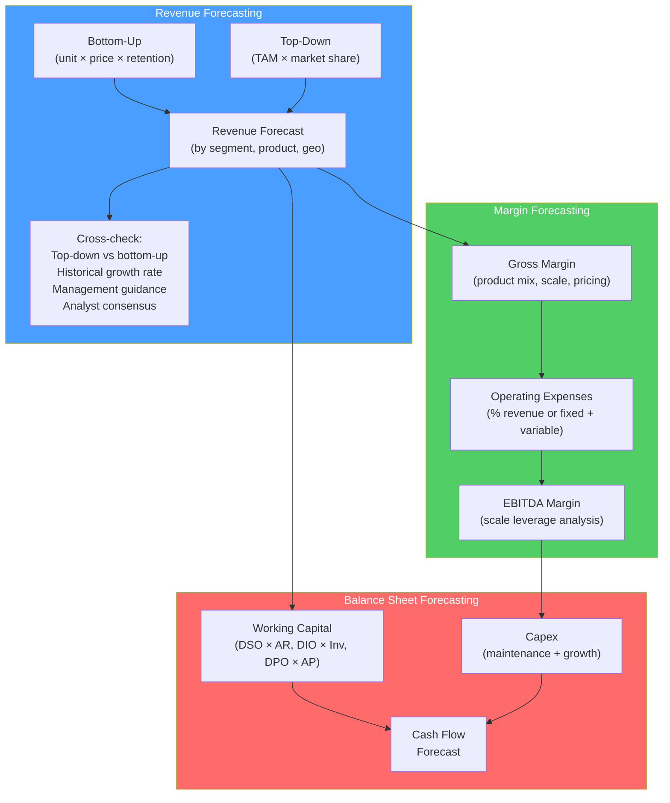

# 📅 Financial Forecasting

> [!abstract] TL;DR
> Financial forecasting builds the projected income statement, balance sheet, and cash flows that drive valuations and strategic decisions. **Bottom-up** forecasting projects revenue from unit economics (units × price); **top-down** starts with TAM and applies market share. Margin forecasting links COGS and OpEx to operating leverage. Working capital and capex forecasting closes the cash flow loop. The quality of a DCF or LBO model is entirely determined by the quality of its forecasts — garbage in, garbage out.

## Intuition — analogy FIRST

Forecasting is like planning a road trip: you can estimate arrival time from the top down ("it's 500 miles, so ~8 hours at 60mph average") or bottom up ("1 hour to get out of the city, 4 hours highway, 30 min at rest stops, 2.5 hours through mountains = 8 hours").

Both approaches might converge on 8 hours, but the bottom-up approach gives you more confidence and lets you identify where uncertainty is highest (the mountain section). If actual traffic changes those estimates, you know exactly what to update.

In finance: a top-down analyst says "the cloud market will grow 25% and our company will capture 5% market share." A bottom-up analyst says "we have 500 enterprise accounts, average $500K ACV, with 110% net dollar retention; new logo additions of 50 accounts/year = X revenue." The bottom-up answer is more defensible and easier to stress-test.

---

## How It Works

## Key Concepts / Details

### Revenue Forecasting Methods

**Bottom-Up (Preferred)**:

Start from granular business drivers:
$$\text{Revenue} = \sum_i (\text{Volume}_i \times \text{Price}_i)$$

| Business Model | Bottom-Up Driver |
|---------------|-----------------|
| **SaaS** | ARR = (Beginning ARR × NRR%) + New logo ARR |
| **Retail** | Store count × Same-Store Sales + New store ramp |
| **Industrial** | Units shipped × ASP + Services revenue |
| **Subscription** | Subscribers × ARPU |
| **Marketplace** | GMV × Take rate |
| **Bank** | Assets × Net Interest Margin + Fee revenue |

**Top-Down (Cross-Check)**:
$$\text{Revenue} = \text{TAM} \times \text{Market Share}$$

Use to sanity-check: if bottom-up forecasts imply 20% market share in 5 years but the company currently has 5%, that's aggressive. Provide context, not justification.

**Key forecasting data sources:**
- Company 10-K, 10-Q, earnings calls and investor presentations
- Industry research reports (IDC, Gartner, Forrester)
- Management guidance (typically conservative — company guidance "beats" 70% of quarters)
- Sell-side analyst consensus (Bloomberg or FactSet)
- Customer/channel checks (primary research — call customers, partners, competitors)

### SaaS Revenue Model (Detailed Example)

SaaS metrics drive a precise bottom-up model:

| Metric | Definition | Typical Range (healthy SaaS) |
|--------|-----------|---------------------------|
| **ARR** | Annual Recurring Revenue | — |
| **NRR** (Net Dollar Retention) | Revenue retained + expanded from existing customers | 110–130%+ = excellent |
| **Logo retention** | % customers retained | 85–95% |
| **New logo ARR** | ARR from new customers | Growth driver |
| **ACV** | Annual Contract Value per customer | Business segment specific |

**ARR bridge:**

| | Year 0 | Year 1 | Year 2 |
|--|--------|--------|--------|
| Beginning ARR | $100M | $120M | $150M |
| Expansion (NRR -100% on existing) | +$15M | +$18M | +$23M |
| Churn | −$5M | −$6M | −$7M |
| New logos (50 × $200K ACV) | +$10M | +$18M | +$20M |
| **Ending ARR** | **$120M** | **$150M** | **$186M** |
| **ARR Growth** | 20% | 25% | 24% |

**Revenue ≈ beginning ARR + ending ARR / 2** (for subscription recognized ratably)

### Gross Margin Forecasting

**COGS components** (SaaS/tech):
- Cloud hosting (AWS, Azure, GCP) — scales roughly with revenue
- Support/customer success team costs — scales with headcount
- Third-party content/data licenses — often fixed
- Amortization of capitalized software

**Margin drivers:**
- **Scale leverage**: many costs fixed → margin expands as revenue grows
- **Product mix shift**: higher-margin products growing faster → margin tailwind
- **Pricing power**: ability to raise prices without volume loss → margin protection
- **Competition**: if competition intensifies, pricing must fall → margin pressure

**Example — gross margin expansion forecast:**

| Year | Revenue | COGS | Gross Profit | Gross Margin | Why |
|------|---------|------|-------------|-------------|-----|
| 2023A | $500M | $225M | $275M | 55% | Infrastructure buildout |
| 2024E | $620M | $264M | $356M | 57% | Scale leverage on hosting |
| 2025E | $750M | $300M | $450M | 60% | Engineering efficiency gains |
| 2026E | $900M | $342M | $558M | 62% | Mix shift to higher-margin products |

### Operating Leverage

Operating leverage describes how EBITDA margin scales with revenue:

$$\text{Operating Leverage} = \frac{\Delta\% EBITDA}{\Delta\% Revenue}$$

If operating leverage = 2x: a 10% revenue increase drives 20% EBITDA increase.

**Why it exists**: fixed costs (R&D teams, executive salaries, corporate overhead) don't scale with revenue. As revenue grows, they become a smaller % of revenue, expanding EBITDA margin.

**Example calculation:**

| Year | Revenue | Fixed Costs | Variable COGS | EBITDA | EBITDA Margin |
|------|---------|------------|--------------|--------|--------------|
| Base | $1,000M | $200M | $600M | $200M | 20% |
| +10% Rev | $1,100M | $200M | $660M | $240M | 21.8% |

EBITDA grew 20% on 10% revenue growth → 2x operating leverage.

### Capex Forecasting

**Capex types:**
1. **Maintenance capex**: replacing worn assets; typically 2–5% of revenue or ~100% of D&A
2. **Growth capex**: new capacity, new markets, new products; driven by growth initiatives

**Common capex drivers by sector:**

| Sector | Capex as % Revenue | Driver |
|--------|-------------------|--------|
| Software / SaaS | 2–5% | Data centers, capitalized software |
| Consumer tech (Apple) | 3–7% | Manufacturing tooling, retail |
| Industrial | 5–10% | Machinery, plants |
| Telecom | 15–25% | Network infrastructure |
| Oil & gas | 20–40% | Exploration, drilling |
| Utilities | 20–50% | Power grid, plants |

**Declining capex intensity** over time indicates maturing business: early Amazon capex was 15%+ of revenue; mature Amazon is 8–10%.

### Working Capital Projections

Link each working capital item to its natural driver:

$$AR = \frac{DSO}{365} \times \text{Revenue}$$

$$\text{Inventory} = \frac{DIO}{365} \times \text{COGS}$$

$$AP = \frac{DPO}{365} \times \text{COGS}$$

**Forecasting DSO/DIO/DPO**: hold constant at historical average, or model trend (management initiatives to improve working capital). Note direction of change:
- Improving DSO (falling) → cash benefit
- Improving DIO (falling) → cash benefit
- Improving DPO (rising, paying later) → cash benefit

### Building the Forecast Period

**How many years to forecast explicitly?** Standard practice:
- **DCF valuation**: 5–10 years explicit, then terminal value
- **LBO model**: hold period + 1 year (typically 5–7 years)
- **Strategic plan**: 3–5 years (beyond this is fiction)
- **Covenant compliance**: model through debt maturity

**Fade rate**: in terminal value, growth should "fade" to a long-run sustainable rate. Explicitly modeling a fade (e.g., 25% growth → 20% → 15% → 10% → 5% → 3% terminal) is more realistic than a hard drop in year 6.

---

## Real-World Notes

- **Consensus vs. company guidance**: Salesforce consistently guides $0.10–0.15 below consensus, then "beats" each quarter. Analysts adjust for this habitually — they add back the "guidance haircut." Model consensus estimates (from FactSet/Bloomberg), not management guidance directly.
- **Netflix subscriber forecasting fiasco (2022)**: Netflix guided Q1 2022 net subscriber additions of +2.5M. Actual: −200K. The miss was 2.7M subscribers — the model's biggest failure in years. Revenue recognition is proportional to subscriber count; the miss cascaded through the P&L. Q2 2022: Netflix stock fell 50%.
- **Tesla gross margin surge (2020–2022)**: as Tesla scaled from 500K to 1.4M deliveries, fixed manufacturing costs spread over more vehicles. Gross margin expanded from ~15% to ~30% — textbook operating leverage. Any model that held margins flat would have dramatically underestimated FCF.
- **Semiconductor cycle forecasting**: TSMC revenue growth runs in 2–3 year cycles tied to chip investment cycles. Bottom-up forecasting at the chip type level (AI, mobile, auto, PC) is far more precise than top-down market share approach.

---

## Common Pitfalls

- Extrapolating historical growth rates linearly: all high-growth businesses eventually face law of large numbers. A $100M ARR company growing 80% hits $10B in 6 years — which may be implausible. Build an explicit S-curve or growth fade.
- Modeling margin expansion without justification: "margins expand from 20% to 30% over 5 years" must be supported by specific cost efficiencies (headcount leverage, vendor renegotiations, automation).
- Ignoring seasonality: many businesses have strong Q4 / weak Q1 patterns. Annual models miss this; quarterly models must have seasonal adjustments.
- Building consensus rather than your own analysis: copying consensus estimates directly adds no analytical value. Understand *why* consensus expects what it does, then form your own view.

---

## Related Concepts

- [[_MOC_Financial_Modeling|↑ Section MOC]]
- [[Three_Statement_Model]] — The forecasts feed directly into the three-statement model
- [[DCF_Analysis]] — Forecasted FCF drives DCF enterprise value
- [[Financial_Statement_Analysis]] — Historical statements are the starting point for forecasts
- [[Fundamental_Analysis]] — The qualitative basis for quantitative forecasts

## Review Questions

1. A SaaS company starts 2024 with $100M ARR, 115% NRR, 8% gross logo churn, and adds 40 new customers at $300K ACV each. Calculate ending ARR and ARR growth rate for 2024.
2. A retailer has $500M revenue and 20% EBITDA margin. Revenue grows 15% next year. Fixed costs are $150M; variable costs are 70% of revenue (COGS + variable SG&A). Calculate next year's EBITDA and EBITDA margin. What is the operating leverage?
3. A company targets 45-day DSO. Revenue is $1.2B annually. What is the accounts receivable balance at year-end? If management reduces DSO to 38 days, how much cash is freed up?

## Sources

- Koller, Goedhart, Wessels (McKinsey), *Valuation: Measuring and Managing the Value of Companies*, 7th edition, Ch. 10–11
- Damodaran, Aswath, *Applied Corporate Finance*, Ch. 3 — Analyzing Financial Performance
- CFA Institute, *CFA Program Curriculum* Level 2 — Equity Valuation — Forecasting

#finance #financial-modeling #forecasting #revenue-model #SaaS #operating-leverage
