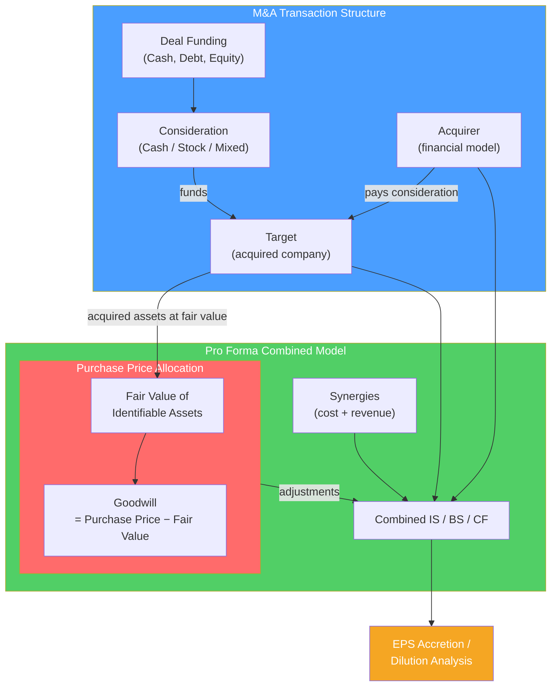

# 🤝 Mergers and Acquisitions

> [!abstract] TL;DR
> M&A modeling assesses whether an acquisition creates or destroys value for the acquirer's shareholders. The primary test is **EPS accretion/dilution**: does the deal increase or decrease the acquirer's earnings per share? Accretive deals (EPS increases post-deal) are shareholder-friendly; dilutive deals raise questions. Beyond EPS, a full merger model adjusts the combined entity's balance sheet for purchase price allocation (goodwill creation), pro forma financing, and synergies. Key: synergies must exceed the acquisition premium for a deal to create net value.

## Intuition — analogy FIRST

Company A earns $10/share with 100M shares. It acquires Company B at a price that dilutes earnings — perhaps because it issues new shares and B's earnings don't fully offset the dilution, or because it pays interest on acquisition debt.

If post-deal EPS becomes $9.50, the deal is **dilutive** (EPS fell by 5%). Shareholders of A just got 5% poorer on an earnings-per-share basis. This requires justification — typically through synergies (cost cuts, revenue gains) that will raise EPS in later years.

If EPS becomes $10.50, the deal is **accretive** (EPS rose 5%). On paper, shareholders are better off immediately. But accretion/dilution alone doesn't determine whether a deal is a "good" — overpaying for a target can be accretive (if funded by cheap debt) while still destroying economic value.

---

## How It Works

## Key Concepts / Details

### EPS Accretion/Dilution

The core test of a strategic acquisition's financial impact:

$$\text{Pro Forma EPS} = \frac{\text{Combined Net Income (after synergies and adjustments)}}{\text{Pro Forma Diluted Shares}}$$

$$\text{Accretion/Dilution} = \frac{\text{Pro Forma EPS} - \text{Acquirer Standalone EPS}}{\text{Acquirer Standalone EPS}} \times 100\%$$

**Worked example: All-cash deal**

| | Acquirer | Target |
|--|---------|--------|
| Net Income | $500M | $100M |
| Shares | 200M | — |
| EPS | $2.50 | — |

Acquisition: $2B purchase price in cash (funded by $2B debt at 5% interest). Tax rate 25%.

After-tax interest cost = $2B × 5% × (1−0.25) = **$75M/year**

Pro forma net income = $500M + $100M − $75M = **$525M**
Pro forma shares = 200M (no new shares — all cash deal)
Pro forma EPS = $525M / 200M = **$2.625**
Accretion = ($2.625 − $2.50) / $2.50 = **+5% accretive**

**All-stock deal** (issuing new shares to fund acquisition):

Issue price = Acquirer stock price $25. Shares issued = $2B / $25 = **80M new shares**
After-tax interest = $0 (no debt)
Pro forma net income = $500M + $100M = **$600M**
Pro forma shares = 200M + 80M = **280M**
Pro forma EPS = $600M / 280M = **$2.14**
Accretion = ($2.14 − $2.50) / $2.50 = **−14.4% dilutive**

The stock deal is heavily dilutive because the acquirer issued expensive equity (25× P/E) to buy a cheaper target.

### Purchase Price Allocation (PPA)

When an acquisition closes, acquired assets are restated to **fair value** for accounting purposes:

$$\text{Purchase Price} = \text{Fair Value of Identifiable Assets} + \text{Goodwill}$$

$$\text{Goodwill} = \text{Purchase Price} - \text{Fair Value of Net Assets}$$

**Key PPA adjustments:**
1. **Tangible assets** marked up to fair market value (inventory, PP&E)
2. **Intangible assets** identified and given value (customer lists, technology, brand, contracts) → these are amortized over 5–20 years → creates amortization expense
3. **Deferred revenue** written down (acquired deferred revenue recognized more slowly → lower near-term revenue)
4. **Goodwill** = residual — not amortized under GAAP/IFRS but tested for impairment annually

**Impact on P&L post-acquisition:**
- PP&E step-up → higher D&A (earnings drag)
- Intangible amortization → significant non-cash earnings drag
- Inventory step-up → one-time COGS hit in year 1 (LIFO layer liquidation effect)

**Why goodwill matters**: goodwill represents synergies and strategic value paid above book. If synergies don't materialize, goodwill must be impaired — a non-cash write-down that hurts reported earnings. AOL-Time Warner wrote off $99B in goodwill in 2002.

### Synergies Analysis

Synergies are the incremental value from combining two companies:

| Type | Examples | Timing | Realization risk |
|------|---------|--------|----------------|
| **Cost synergies** | Headcount reduction, facility consolidation, procurement savings, IT rationalization | Year 1–3 | High — quantifiable |
| **Revenue synergies** | Cross-selling, geographic expansion, product bundling | Year 2–5 | Low — uncertain |
| **Financial synergies** | Lower cost of debt, tax benefits, balance sheet optimization | Year 1 | Medium |

**The "synergy required" calculation** is the most important test of deal logic:

$$\text{Required synergies} = \text{Premium paid} \div [(1-\text{Tax rate}) \times \text{EV/EBITDA exit multiple}]$$

Or more practically: the NPV of synergies must exceed the control premium paid.

**Example**: Acquirer pays $2B, target's standalone value is $1.5B. Premium = $500M.
Required synergies (PV): $500M
At 25% tax, materializing in Years 1–5:
$$\text{Annual synergies required} \approx \frac{500M}{PV\;annuity\;factor\;(5yr, 10\%)} = \frac{500M}{3.79} = \$132M/year$$

If the target has $500M revenue, this requires 26% of revenue in synergies — very aggressive.

### Deal Consideration Structures

| Structure | EPS Impact | Balance Sheet | When used |
|-----------|-----------|---------------|-----------|
| **All cash** | Depends on target P/E vs interest rate | Increases debt | Acquirer has cash/low leverage |
| **All stock** | Dilutive if acquirer P/E < target P/E | Equity issuance | Stock-rich acquirer |
| **Cash + stock** | Mixed | Mixed | Balance dilution vs debt |
| **Stock + rollover equity** | PE seller retains stake | Less cash out | PE exit when target mgmt stays |

**Accretion/dilution rule of thumb**: a deal is accretive when:
$$\frac{\text{Target earnings yield} (E/P)}{\text{After-tax cost of debt}} > 1 \quad \text{(cash deal)}$$

$$\text{Target } P/E < \text{Acquirer } P/E \quad \text{(stock deal)}$$

### Hostile vs Friendly Acquisitions

| Feature | Friendly | Hostile |
|---------|---------|--------|
| Board approval | Yes — negotiated | No — bypassed |
| Approach | Management-to-management | Direct to shareholders |
| Mechanism | Merger agreement | Tender offer / proxy fight |
| Premium | Typically lower | Higher (need to win shareholders) |
| Timeline | 3–6 months | 6–18 months |
| Success rate | High | ~50% |

**Defensive measures** (pre-deal):
- **Poison pill** (shareholder rights plan): triggers dilutive share issuance if hostile bidder crosses 15–20% ownership threshold
- **Staggered board**: directors elected in 3-year tranches — takes 2+ years to replace majority
- **Golden parachute**: large severance for executives triggered by change of control — makes acquisition expensive

---

## Real-World Notes

- **Microsoft / Activision Blizzard (2022, $69B)**: The largest gaming acquisition ever. Microsoft used balance sheet cash + debt. FTC challenged on antitrust (Call of Duty exclusivity); deal finally closed October 2023 after 21 months. Required synergies: $69B deal price vs Activision's $3.2B EBITDA = 21.6x entry multiple. Microsoft needs significant revenue synergies via Game Pass subscription growth.
- **Elon Musk / Twitter (2022, $44B)**: A rare case where the acquirer tried to back out (claimed material adverse change after bot revelation). Delaware court would have forced completion. Deal closed; now called X. Model implication: $44B acquisition funded by $13B debt at 10%+ interest + massive equity injection. Interest coverage < 1x at acquisition — a classic case of strategic overpayment.
- **Amazon / MGM (2022, $8.5B)**: Content synergy thesis — Prime Video needs content; MGM has 4,000+ films including James Bond. Classic revenue synergy deal (cross-sell MGM content to 200M Prime subscribers). Traditional accretion/dilution analysis less relevant for platform companies.
- **Kraft / Heinz (2015, $46B)**: 3G Capital's merger created massive cost synergy assumptions ($1.5B). After initial EPS accretion, the stripped-down business lost brand equity; Kraft Heinz took $15.4B write-down in 2019 on goodwill and brands. Cost synergies without revenue reinvestment can destroy long-term value.

---

## Common Pitfalls

- Using GAAP EPS accretion as the primary value metric: accretion can be manufactured with cheap debt, regardless of whether NPV > 0. Always check NPV of synergies vs premium paid.
- Assuming management's synergy estimates without stress-testing: studies show synergies are realized only 50% of the time at expected levels. Apply a 30–50% discount to management synergy claims.
- Forgetting the cost to achieve synergies: restructuring charges, severance, systems integration costs (often 1–2x annual synergies) reduce PV significantly.
- Ignoring purchase price allocation impact: amortization of acquired intangibles can reduce GAAP earnings 10–20% — making a deal look accretive to "cash EPS" but dilutive to GAAP EPS.

---

## Related Concepts

- [[_MOC_Financial_Modeling|↑ Section MOC]]
- [[Three_Statement_Model]] — Merged entity requires combined three-statement model
- [[LBO_Analysis]] — Financial buyers' perspective on deals; similar model structure
- [[Precedent_Transactions]] — Historical deal multiples provide valuation context
- [[Capital_Structure]] — Post-deal leverage determines financing strategy

## Review Questions

1. Company A (P/E = 25x, EPS = $2.00, 100M shares) acquires Company B ($50M net income) for $1.5B in cash funded entirely by debt at 6% pre-tax (25% tax rate). Calculate pro forma EPS and determine if the deal is accretive or dilutive.
2. Explain why goodwill is created in an acquisition, what it represents economically, and what happens when synergies don't materialize (with a real example).
3. An acquirer pays a $400M premium over standalone value for a target. Required synergies must cover this premium. If synergies are valued as a 5-year annuity at 10% discount rate, what annual synergy is required? Is this feasible for a target with $200M in operating costs?

## Sources

- Rosenbaum, Joshua, and Pearl, Joshua, *Investment Banking: Valuation, LBOs, M&A, and IPOs*, 3rd edition (Ch. 7)
- Bruner, Robert F., *Applied Mergers and Acquisitions*
- CFA Institute, *CFA Program Curriculum* Level 2 — Corporate Finance

#finance #financial-modeling #M&A #accretion-dilution #merger-model #synergies #goodwill
