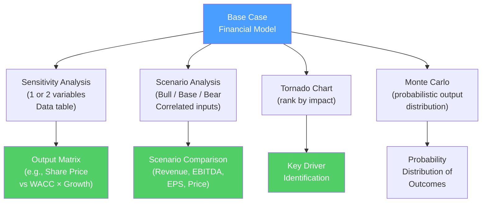

# 🎯 Scenario and Sensitivity Analysis

> [!abstract] TL;DR
> Sensitivity and scenario analysis test how model outputs change when assumptions change. **Sensitivity analysis** (one-variable) asks "what if WACC changes by 1%?" **Two-variable sensitivity** (data tables) shows a matrix of outcomes across two variables simultaneously. **Scenario analysis** creates discrete Base/Bull/Bear cases with correlated assumption changes. **Tornado charts** rank which inputs matter most. These analyses are essential for communicating uncertainty and identifying which assumptions drive value — critical for every DCF and LBO model.

## Intuition — analogy FIRST

You build a DCF model that says a company is worth $10/share at a 10% WACC and 3% terminal growth. But your boss asks: "What if rates rise and WACC is 12%? Or what if growth is only 2%? How wrong does our $10 have to be for this deal to not make sense?"

**Sensitivity analysis** answers: "If WACC = 12% and terminal growth = 2%, the stock is worth $7." You can show a grid of all WACC/growth combinations.

**Scenario analysis** answers: "In a Bear case (recession hits, margins contract, growth = 1%), the stock is worth $5. In a Bull case (EBITDA beats, multiple expands), it's worth $15. The base case is $10."

The difference: sensitivity rotates one or two inputs around a base case. Scenario analysis swaps entire coherent sets of assumptions simultaneously — a recession scenario isn't just lower growth, it's also lower margins, higher WACC, and lower exit multiples all at once.

---

## How It Works



## Key Concepts / Details

### One-Variable Sensitivity Analysis

Simple sensitivity: change one input, observe output change.

**Method**: use a formula that links directly to a single input cell. Change the cell and note the output.

**Example**: DCF share price vs WACC:

| WACC | Implied Share Price |
|------|-------------------|
| 8.0% | $15.20 |
| 9.0% | $12.80 |
| 10.0% (base) | **$10.00** |
| 11.0% | $8.10 |
| 12.0% | $6.80 |

The range is $6.80–$15.20 — a 2.2x range from a 4% WACC swing. This illustrates DCF sensitivity to the discount rate.

### Two-Variable Sensitivity Table (Excel Data Table)

A data table shows a matrix of outputs across two simultaneous input changes:

**Example**: DCF share price vs WACC (rows) and terminal growth rate (columns):

|  | g=2% | g=2.5% | g=3% | g=3.5% | g=4% |
|--|------|-------|------|--------|------|
| **WACC=8%** | $13.20 | $14.00 | $15.20 | $16.80 | $19.10 |
| **WACC=9%** | $10.80 | $11.50 | $12.80 | $14.30 | $16.50 |
| **WACC=10%** | $8.90 | $9.40 | **$10.00** | $11.10 | $12.80 |
| **WACC=11%** | $7.50 | $7.90 | $8.10 | $8.90 | $10.20 |
| **WACC=12%** | $6.40 | $6.60 | $6.80 | $7.40 | $8.50 |

**Excel implementation**:
1. Set up input rows/columns with the range of values
2. Place the output formula in the top-left cell of the table
3. Select the entire table range
4. Data → What-If Analysis → Data Table
5. Row input cell = WACC cell; Column input cell = growth rate cell

**Color convention**: shade base case cell green; shade the "interesting" range (±20% from current price) to highlight the realistic outcome band.

### Scenario Analysis

Scenarios create coherent alternative sets of assumptions:

**Standard scenario structure:**

| Assumption | Bear | Base | Bull |
|-----------|------|------|------|
| Revenue growth (3yr avg) | 3% | 8% | 15% |
| EBITDA margin | 18% | 22% | 28% |
| WACC | 12% | 10% | 9% |
| Exit EV/EBITDA | 8x | 10x | 13x |
| Net Debt/EBITDA | 4.0x | 3.0x | 2.0x |
| **Implied Share Price** | **$5.20** | **$10.00** | **$18.40** |
| **Implied IRR (LBO)** | **12%** | **22%** | **35%** |

**Key principle**: scenarios should be internally consistent. A bear case isn't just lower growth — it's lower growth AND lower margins AND higher discount rate AND lower exit multiple. They move together because they all stem from the same macro/business scenario.

**Probability-weighted expected value:**
$$EV = P_{bear} \times \text{Bear} + P_{base} \times \text{Base} + P_{bull} \times \text{Bull}$$

Example: Bear (30%): $5.20, Base (50%): $10.00, Bull (20%): $18.40
$$EV = 0.30 \times 5.20 + 0.50 \times 10.00 + 0.20 \times 18.40 = 1.56 + 5.00 + 3.68 = \$10.24$$

### Tornado Chart

A tornado chart ranks inputs by their impact on a key output, with the highest-impact variable at the top:

```
Variable         [Downside]...[Base]...[Upside]
──────────────────────────────────────────────
Revenue growth    ░░░░░░░░░░████████████████████   ±$4.2
Exit multiple     ░░░░░░░░██████████████████       ±$3.8
EBITDA margin     ░░░░░░████████████████           ±$2.9
WACC              ░░░░████████████████             ±$2.7
Terminal growth   ░░██████████████                 ±$1.8
Tax rate          ████████████                     ±$1.2
──────────────────────────────────────────────
                  $5   $7   $10   $13   $15
```

**What it tells you**: revenue growth and exit multiple are the most important assumptions. Spend the most time getting these right. Tax rate precision matters less.

**Building it in Excel**: calculate the model at high and low values for each input independently. Sort by the range (high − low). Plot as a horizontal bar chart.

### Monte Carlo Simulation

Monte Carlo assigns probability distributions to key inputs and runs thousands of simulations:

**Inputs**: instead of single values, assign distributions:
- Revenue growth: Normal(8%, 4%) — mean 8%, std dev 4%
- EBITDA margin: Uniform(18%, 28%) — equally likely anywhere in range
- WACC: Normal(10%, 1.5%)
- Exit multiple: Triangular(7x, 10x, 14x) — most likely 10x

**Run 10,000 simulations**, sample inputs randomly, calculate share price for each.

**Output**: distribution of share prices — mean, percentiles, probability of exceeding/falling below thresholds:
- P10 (10th percentile): $6.50
- P50 (median): $10.20
- P90 (90th percentile): $15.80
- Probability of value > $8: 75%

**Tools**: @Risk, Crystal Ball (Excel add-ins), or Python's numpy/scipy libraries.

### Break-Even Analysis

For investment decisions, the "break-even" question is critical:

**LBO break-even**: at what entry price does the IRR fall to 15% (minimum threshold)?
$$\text{Max entry EV} = f(\text{Target IRR}, \text{Exit multiple, EBITDA trajectory, debt paydown})$$

**Acquisition break-even**: how much synergy is needed to justify a 30% acquisition premium?
$$\text{Required synergies} = \text{Premium paid} / \text{Post-tax value multiplier}$$

---

## Real-World Notes

- **Valuation range in M&A**: Goldman Sachs's fairness opinion for the Twitter/Musk deal (2022) showed a football field chart with DCF range of $30–47, comps range of $35–55, precedent transactions range of $45–75. The deal price ($54.20) sat at the midpoint. Sensitivity tables showed wide ranges driven by user growth uncertainty.
- **COVID scenario analysis (March 2020)**: Every company's finance team ran three scenarios (Mild/Severe/Catastrophic COVID impact). Most bear cases were violated within 2 weeks, forcing CFOs to re-run analysis weekly. Scenario analysis had to be dynamic, not a one-time exercise.
- **DCF sensitivity killing deals**: during 2022 rising rate environment, DCF sensitivity tables showed that deals priced in 2021 at 8% WACC were now NPV-negative at 12% WACC. Many LBO deals collapsed as sponsors ran sensitivity tables and found required returns impossible to achieve at agreed prices.

---

## Common Pitfalls

- Varying inputs independently without recognizing correlations: if growth falls, margins probably also fall. Independent sensitivity analysis misses the correlated risk.
- Using too narrow a range in sensitivity tables: ±1% WACC is not enough — historical variation in WACC over a cycle is 3–5%. Use ±3% at minimum.
- Building scenarios that differ only by the headline metric: a "bear case" that's just -20% revenue with everything else unchanged is unrealistic and unhelpful.
- Forgetting that all scenarios should use internally consistent assumptions across all drivers.

---

## Related Concepts

- [[_MOC_Financial_Modeling|↑ Section MOC]]
- [[DCF_Analysis]] — The primary model where sensitivity analysis is applied
- [[Three_Statement_Model]] — The foundation model being stress-tested
- [[LBO_Analysis]] — IRR sensitivity to entry price and exit multiple is critical
- [[Excel_Best_Practices]] — Clean input structure required for data tables

## Review Questions

1. Build a conceptual 3×3 sensitivity table for a DCF. With WACC on one axis (9%, 10%, 11%) and terminal growth on the other (2%, 3%, 4%), what is the pattern of values, and why does the bottom-right corner always show the highest value?
2. You're presenting an LBO analysis with Base Case IRR of 22%. Your MD asks: "What are the top three risks to this return?" Build a tornado chart framework — which three variables would you test, and why?
3. A company has a base case share price of $12.00. In the bear scenario (20% probability): $6.00. Bull scenario (30% probability): $20.00. Calculate the probability-weighted expected value. Is this stock a buy if it currently trades at $10.00?

## Sources

- Rosenbaum, Joshua, and Pearl, Joshua, *Investment Banking*, 3rd edition
- CFA Institute, *CFA Program Curriculum* Level 2 — Quantitative Methods
- Berk, Jonathan, and DeMarzo, Peter, *Corporate Finance*, 5th edition, Ch. 8

#finance #financial-modeling #sensitivity-analysis #scenario-analysis #tornado-chart #Monte-Carlo
