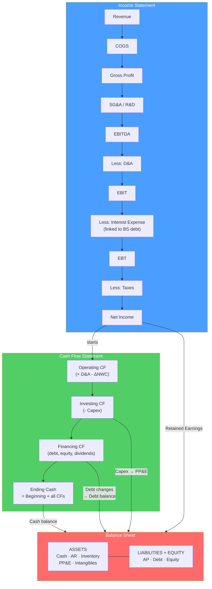

# 🔗 Three Statement Model

> [!abstract] TL;DR
> A three-statement model integrates the income statement (IS), balance sheet (BS), and cash flow statement (CFS) so that every change flows through consistently. The critical linkage: **Net Income flows from IS to CFS** (starting point for operating cash flow) **and to retained earnings on the BS**. **Capex flows from CFS to PP&E on the BS**. **Debt changes flow from CFS to BS debt balances**. The model "balances" when assets = liabilities + equity. Circular references arise from the interest-debt relationship; resolved via a revolver or iterative calculation.

## Intuition — analogy FIRST

Three statements = three views of the same business reality.

Imagine your business earns $100K profit this year (income statement). But you also bought $30K of equipment (cash out) and received $50K from a new loan. Your bank account changed by: +$100K income − $30K equipment + $50K loan = +$120K.

The three statements capture: **what you earned** (IS), **what you now own and owe** (BS), and **how cash actually moved** (CFS). Change one assumption — say gross margin improves 1% — and it ripples through all three: higher net income on IS → higher retained earnings on BS → higher cash balance on CFS.

That auto-linking behavior is why "three-statement model" is the foundation of all financial modeling.

---

## How It Works



## Key Concepts / Details

### The Three Statements: Structure

**Income Statement (P&L):**

| Line | Notes |
|------|-------|
| Revenue | Total sales |
| COGS | Cost of goods/services sold |
| **Gross Profit** | Revenue − COGS |
| Gross Margin | GP / Revenue |
| SG&A / R&D | Operating expenses |
| **EBITDA** | GP − OpEx (earnings before interest, tax, D&A) |
| D&A | Depreciation & Amortization (from PP&E roll) |
| **EBIT** | EBITDA − D&A |
| Interest Expense | **Circular** — depends on debt balance |
| EBT | EBIT − Interest |
| Tax | EBT × Tax rate |
| **Net Income** | EBT − Tax |

**Balance Sheet (at a point in time):**

| Assets | Liabilities + Equity |
|--------|---------------------|
| Cash (from CFS) | Accounts Payable |
| Accounts Receivable | Accrued Liabilities |
| Inventory | Short-term debt |
| **Total Current Assets** | **Total Current Liabilities** |
| PP&E (net) | Long-term debt |
| Intangibles / Goodwill | Other LT liabilities |
| **Total Assets** | Shareholders' Equity |
| | **Total L + E** |
| **MUST EQUAL →** | **← MUST EQUAL** |

**Cash Flow Statement:**

| Section | Key items |
|---------|-----------|
| **Operating CF (CFO)** | NI + D&A ± ΔNWC |
| **Investing CF (CFI)** | − Capex ± Acquisitions |
| **Financing CF (CFF)** | + Debt raised − Debt repaid ± Equity ± Dividends |
| **Net change in cash** | CFO + CFI + CFF |

### Critical Linkages

1. **Net Income → Retained Earnings (IS → BS)**:
$$\text{Ending Retained Earnings} = \text{Beginning RE} + \text{Net Income} - \text{Dividends}$$

2. **Net Income → CFS starting point (IS → CFS)**:
CFS starts with Net Income, adds back non-cash items (D&A, stock-based comp), adjusts for working capital changes.

3. **Ending Cash → BS Cash balance (CFS → BS)**:
$$\text{BS Cash} = \text{CFS Ending Cash Balance}$$

4. **Capex → PP&E Roll (CFS → BS)**:
$$\text{Ending PP\&E} = \text{Beginning PP\&E} + \text{Capex} - \text{Depreciation}$$

5. **Debt changes → Debt on BS (CFS → BS)**:
$$\text{Ending Debt} = \text{Beginning Debt} + \text{New Borrowings} - \text{Repayments}$$

6. **Debt on BS → Interest Expense (BS → IS)**:
$$\text{Interest Expense} = \text{Average Debt Balance} \times \text{Interest Rate}$$

This creates the **circular reference**: debt → interest → net income → retained earnings → equity → (through leverage constraints) → debt.

### The Circular Reference Problem

Interest expense depends on debt. Debt depends on the cash balance. Cash depends on net income (which depends on interest). This is a genuine model circularity.

**Solutions:**

1. **Iterative calculation (Excel "Enable Iterative Calculation")**: let Excel run until convergence. Fast and clean.

2. **Revolver as the plug**: instead of circularity, use a revolving credit facility ("revolver") as the balance sheet "plug":
   - If the model needs more cash → draw down revolver (debt increases)
   - If model has excess cash → pay down revolver (debt decreases)
   - Cash floor maintained at a minimum operating balance
   
3. **Prior-period interest**: use beginning-of-period debt balance instead of average → breaks the circularity. Slightly less precise but simpler.

### Working Capital Schedule

Working capital items link to the income statement and drive operating cash flow:

| Item | Driver | Direction |
|------|--------|-----------|
| Accounts Receivable | DSO × Revenue / 365 | Increase = cash use |
| Inventory | DIO × COGS / 365 | Increase = cash use |
| Accounts Payable | DPO × COGS / 365 | Increase = cash source |
| Accrued Expenses | Accruals × Revenue | Increase = cash source |

**Change in NWC = ΔNWC (cash flow impact)**:

$$\text{ΔNWC} = \Delta(\text{Current Assets ex. Cash}) - \Delta(\text{Current Liabilities ex. Debt})$$

Positive ΔNWC (growing NWC) = cash outflow from operations. Growing revenue typically requires more working capital — a cash drag in growth models.

### Debt Schedule

The debt schedule tracks all debt facilities:

```
Beginning Balance + Draws − Repayments = Ending Balance
Ending Balance × Rate = Interest Expense
```

**Priority waterfall** (typically):
1. Revolving credit facility (most flexible, lowest rate)
2. Term Loan A (amortizing, medium rate)
3. Term Loan B (minimal amortization, higher rate)
4. Senior Notes / High-Yield Bonds (fixed coupon)
5. Subordinated Debt

**Cash sweep**: if the model generates excess free cash flow, it pays down the revolver first, then optionally accelerates senior debt repayment.

### Depreciation and PP&E Roll

$$\text{Ending PP\&E} = \text{Beginning PP\&E} + \text{Capex} - \text{D\&A}$$

$$\text{D\&A} = \text{Beginning PP\&E} \times \text{Depreciation Rate}$$

(Or calculate from detailed asset-life assumptions for each capex vintage)

**Maintenance vs growth capex**: for modeling, split capex into maintenance (replacement of worn assets, proportional to existing asset base) and growth (expansion). Maintenance capex ≈ D&A in steady state.

---

## Real-World Notes

- **Investment bank model templates**: Goldman Sachs, Morgan Stanley, and Lazard each have proprietary three-statement model templates with elaborate debt schedules, PPE rolls, and working capital schedules. New analysts spend 2–3 months mastering these before touching live deal models.
- **Model error consequences**: An Excel error in JP Morgan's CDS risk model (the "London Whale" trade, 2012) led to a $6.2B loss — a spreadsheet formula that divided by the sum instead of the average. Model audit protocols exist precisely because of such errors.
- **Amazon's three-statement interconnect**: Amazon's capex (heavily in AWS infrastructure) hits PP&E, reduces cash, impacts future depreciation (which adds back to CFO). This is exactly the PP&E → depreciation → CFO linkage in a three-statement model at scale.

---

## Common Pitfalls

- Hardcoding balance sheet items instead of linking from the income statement: the entire point of the model is that IS, BS, and CFS auto-link.
- Forgetting D&A in the cash flow statement: D&A is a non-cash charge on the IS (reduces income) but must be added back in the CFO section.
- Using the same period's debt to calculate interest (creating unresolved circular reference): use either iterative calculation or beginning balance.
- Not verifying the balance check: the model must always satisfy Assets = Liabilities + Equity at every period. If it doesn't balance, there's a link error somewhere.

---

## Related Concepts

- [[_MOC_Financial_Modeling|↑ Section MOC]]
- [[Financial_Forecasting]] — The revenue and cost assumptions that feed the IS
- [[DCF_Analysis]] — The three-statement model produces FCF used in DCF
- [[Financial_Statement_Analysis]] — Understanding the statements you're modeling
- [[Mergers_and_Acquisitions]] — M&A model is a three-statement model with acquisition adjustments

## Review Questions

1. Walk through how a $100M increase in revenue flows through a three-statement model. Assume 60% gross margin, 20% tax rate, 30-day DSO, and $10M capex associated with the revenue growth. Trace the impact on IS, BS, and CFS.
2. Why does the three-statement model create a circular reference, and what are the three standard ways to resolve it? Which method do investment banks typically use and why?
3. A company's PP&E was $500M at year-start. It spent $80M in capex and recorded $60M in depreciation. What is ending PP&E? What would you see in each of the three statements related to these activities?

## Sources

- Rosenbaum, Joshua, and Pearl, Joshua, *Investment Banking: Valuation, LBOs, M&A, and IPOs*, 3rd edition (Ch. 6)
- Pignataro, Paul, *Financial Modeling and Valuation: A Practical Guide to Investment Banking* (Wiley)
- Wall Street Prep and Breaking Into Wall Street — standard IBD training curricula

#finance #financial-modeling #three-statement-model #income-statement #balance-sheet #cash-flow
