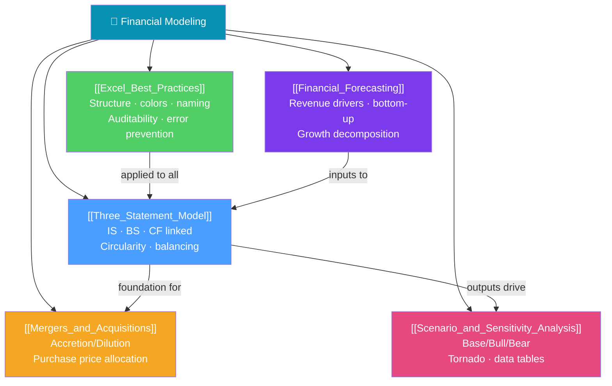

# 🧮 Financial Modeling — Map of Content

> [!abstract] What This Section Covers
> Financial modeling translates analytical frameworks into working spreadsheet models. This section covers the full practitioner toolkit: the **three-statement model** (income statement, balance sheet, cash flow linked together), **Excel best practices** (the craft of building auditable, professional models), **scenario and sensitivity analysis** (stress-testing assumptions), **M&A modeling** (accretion/dilution, merger consequences), and **financial forecasting** (revenue and cost projection techniques). These skills are the core technical requirement for investment banking, private equity, corporate finance, and equity research roles.

## Concept Map

## Learning Path
1. [[Excel_Best_Practices]] — Master the craft before building models.
2. [[Financial_Forecasting]] — Projecting the revenue and cost inputs.
3. [[Three_Statement_Model]] — Building the integrated model.
4. [[Scenario_and_Sensitivity_Analysis]] — Stress-testing the model.
5. [[Mergers_and_Acquisitions]] — Applying the model to M&A transactions.

## All Notes at a Glance

| Note | Difficulty | What You'll Learn |
|------|------------|-------------------|
| [[Three_Statement_Model]] | Intermediate | IS-BS-CF linkages, circular references, cash sweep, debt schedule |
| [[Excel_Best_Practices]] | Intermediate | Model structure, formatting standards, error prevention, auditing |
| [[Scenario_and_Sensitivity_Analysis]] | Intermediate | Scenario manager, data tables, tornado charts, Monte Carlo |
| [[Mergers_and_Acquisitions]] | Advanced | Accretion/dilution, synergies, PPA, merger consequences model |
| [[Financial_Forecasting]] | Intermediate | Revenue drivers, bottom-up projection, margin forecasting, working capital |

## Key Questions This Section Answers
- How do the three financial statements link together, and where does circularity arise?
- What are the professional standards for building institutional-quality financial models?
- How do you build a sensitivity table for a DCF to show the range of outcomes?
- What is EPS accretion/dilution and how does it affect M&A deal pricing?
- How do you project revenue using a bottom-up vs top-down approach?

## Related Sections
- [[_MOC_Finance_Master|↑ Finance Master MOC]]
- [[_MOC_Valuation|← Valuation]] — Models produce DCF and LBO inputs
- [[_MOC_Corporate_Finance|← Corporate Finance]] — WACC and FCF definitions

#MOC #Finance #financial-modeling
