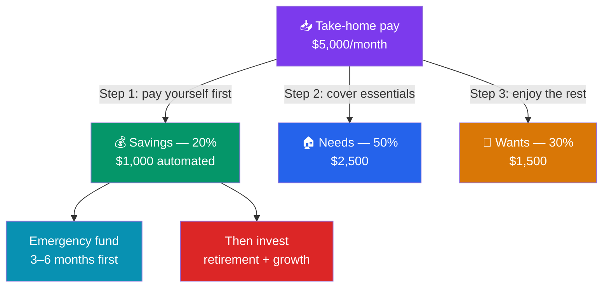

# 💵 Budgeting and Saving

> [!abstract] TL;DR
> A budget is a plan that tells every dollar where to go before the month begins. Start by measuring **net worth** = assets − liabilities. Control cash flow with a simple framework like the **50/30/20 rule** (50% needs, 30% wants, 20% savings), build an **emergency fund** of **3–6 months** of essential expenses, and **pay yourself first** by automating a transfer to savings on payday so saving happens before spending, not after. This is educational content, not personalized financial advice.

## Intuition — analogy FIRST

Imagine your money is water and your month is a set of buckets. Without a plan, the water flows to whatever bucket is closest — takeout, subscriptions, impulse buys — and the "savings" bucket at the far end never fills. Budgeting simply reorders the buckets so the savings bucket fills **first**, before the water can drain away.

Most people try to save what is *left over* at the end of the month. The problem: there is rarely anything left. **Pay yourself first** flips the order — you skim savings off the top the moment income arrives, then live on the rest. The same paycheck, a completely different outcome, because of *sequence*, not size.

A budget is not about restriction. It is about intention: deciding on purpose where your money goes instead of wondering where it went.

---

## The Flow of a Paycheck

## Key Concepts / Details

### Net Worth — Your Financial Scoreboard

Before you can improve, you must measure. **Net worth** is the single number that captures your whole financial position:

$$\text{Net Worth} = \text{Total Assets} - \text{Total Liabilities}$$

**Assets** are what you own (cash, investments, home, car). **Liabilities** are what you owe (mortgage, loans, credit-card balances). Track it once a quarter — the *trend* matters far more than the *level*.

**Worked example — a household net worth statement:**

| Assets | Value | Liabilities | Value |
|--------|-------|-------------|-------|
| Checking account | $3,000 | Mortgage | $260,000 |
| Savings account | $12,000 | Car loan | $8,000 |
| 401(k) retirement | $45,000 | Credit-card balance | $4,000 |
| Car (market value) | $15,000 | Student loan | $18,000 |
| Home (market value) | $320,000 | | |
| **Total assets** | **$395,000** | **Total liabilities** | **$290,000** |

$$\text{Net Worth} = \$395{,}000 - \$290{,}000 = \boxed{\$105{,}000}$$

A positive and *rising* net worth means you are building wealth. A negative net worth (common early in life with student loans) is not failure — it is a starting line.

### The 50/30/20 Rule

Popularized by Senator Elizabeth Warren, the **50/30/20 rule** splits *after-tax* income into three buckets:

- **50% Needs** — rent/mortgage, groceries, utilities, insurance, minimum debt payments, transport. Things you cannot skip.
- **30% Wants** — dining out, streaming, travel, hobbies. Lifestyle you *choose*.
- **20% Savings & debt payoff** — emergency fund, retirement, investments, and extra payments on high-interest debt.

**Worked example — $5,000 monthly take-home pay:**

| Bucket | % | Amount | Example allocation |
|--------|---|--------|--------------------|
| Needs | 50% | $2,500 | Rent $1,500, groceries $500, utilities $250, insurance $250 |
| Wants | 30% | $1,500 | Dining $500, subscriptions $100, travel fund $400, hobbies $500 |
| Savings | 20% | $1,000 | Emergency fund $400, 401(k) $400, brokerage $200 |
| **Total** | **100%** | **$5,000** | |

The percentages are a *starting template*, not a law. In high-cost cities, needs may run to 60%; aggressive savers push the last bucket to 30–40%. The discipline that matters is giving **every dollar a job**.

### The Emergency Fund

An **emergency fund** is cash set aside for genuine surprises — job loss, a medical bill, a car repair — held in a liquid, safe account (a high-yield savings account, *not* stocks). The standard guideline:

$$\text{Emergency fund target} = \text{Essential monthly expenses} \times (3 \text{ to } 6)$$

Use **essential** (needs-only) expenses, not total spending — in a crisis you cut the wants.

**Worked example:** If essential monthly expenses are **$3,500**:
- Minimum (3 months): $3,500 × 3 = **$10,500**
- Comfortable (6 months): $3,500 × 6 = **$21,000**

Choose the multiple based on income stability: 3 months for a dual-income household with secure jobs, 6+ months for a single earner, commission worker, or freelancer with volatile income.

### Pay Yourself First + Automation

**Pay yourself first** means treating savings like a non-negotiable bill that is due on payday. **Automation** removes willpower from the equation:

1. Set up an automatic transfer from checking to savings/investment the day after payday.
2. Enroll in your employer 401(k) so retirement savings leave *before* the paycheck ever hits your account.
3. Use separate accounts (or "buckets") so money earmarked for goals is out of sight of daily spending.

Because the money moves *first*, you simply never learn to miss it — a behavioral trick that beats budgeting willpower every time.

---

## Real-World Notes

Consider two colleagues, both earning $5,000/month take-home. **Alex** waits to save whatever is left at month's end; some months it's $300, most months it's $0, and over the year he banks about $1,200. **Bailey** automates a $1,000 transfer every payday (the 50/30/20 target) and lives on the remaining $4,000; over the year she saves $12,000 — a **10× difference from the same income**, driven entirely by sequence and automation.

After one year Bailey has a fully funded 3-month emergency reserve; Alex is still one surprise car repair away from a credit-card balance. When both faced an unexpected $2,000 dental bill, Bailey paid from her fund and moved on, while Alex financed it at 24% APR — turning a $2,000 problem into a $2,500 problem (see [[Debt_and_Credit_Management]]).

---

## Common Pitfalls

- **Budgeting off gross income instead of take-home pay.** Always plan around the money that actually lands in your account, after taxes and payroll deductions.
- **Treating savings as the remainder.** "Save what's left" almost always rounds to zero. Reverse it — pay yourself first.
- **Investing the emergency fund.** An emergency fund must be *liquid and stable*. If it's in stocks, it can drop 30% exactly when you get laid off in a recession.
- **Forgetting irregular expenses.** Insurance premiums, holidays, and annual subscriptions wreck monthly budgets. Divide them by 12 and set aside a "sinking fund" each month.
- **Abandoning the whole budget after one bad month.** Overspending once is a data point, not a failure. Adjust and continue.

---

## Related Concepts

- [[_MOC_Personal_Finance|↑ Section MOC]]
- [[The_Power_of_Compounding]] — Where the 20% savings bucket goes to grow
- [[Debt_and_Credit_Management]] — High-interest debt is the emergency fund's chief rival
- [[Retirement_Planning_and_FIRE]] — Automated saving scaled up to a lifelong goal
- [[Insurance_and_Personal_Risk]] — Insurance protects the plan from catastrophic surprises
- [[Time_Value_of_Money]] — Why a dollar saved today outperforms a dollar saved later

## Review Questions

1. A household owns a home worth $280,000, a car worth $12,000, and has $25,000 across bank and retirement accounts. They owe $210,000 on the mortgage and $6,000 on a car loan. Calculate their net worth. Is it positive, and what does the number tell you?
2. Someone brings home $4,200/month and follows the 50/30/20 rule. How much goes to each bucket? If their essential (needs) expenses are $2,000/month, how large should their 3-month and 6-month emergency fund be?
3. Explain in your own words why "pay yourself first" with automation tends to outperform "save whatever is left over," even when the person's income and intentions are identical.

## Sources

- Elizabeth Warren & Amelia Warren Tyagi, *All Your Worth: The Ultimate Lifetime Money Plan* (origin of the 50/30/20 framework)
- Consumer Financial Protection Bureau (CFPB), "An essential guide to building an emergency fund"
- Ramit Sethi, *I Will Teach You to Be Rich*, 2nd edition (automation and conscious spending)
- U.S. Financial Literacy and Education Commission, *MyMoney.gov* — budgeting fundamentals

#finance #personal-finance #budgeting #emergency-fund #net-worth #saving
