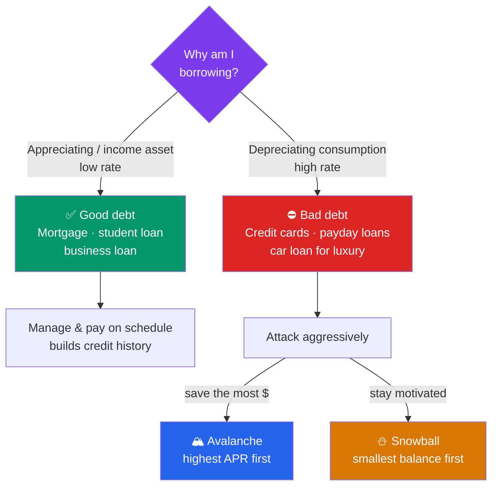

# 💳 Debt and Credit Management

> [!abstract] TL;DR
> Not all debt is equal: **good debt** finances appreciating or income-producing assets at low rates (mortgages, student loans), while **bad debt** funds depreciating consumption at high rates (credit cards). **APR** is the yearly price of borrowing, and on credit cards it compounds *daily* — turning a 24% sticker rate into a ~27% effective cost. Your **credit score** (FICO, 300–850) is driven mostly by payment history and utilization. To get out of debt, the **avalanche** method (highest rate first) saves the most money, while the **snowball** method (smallest balance first) builds motivation. This is educational content, not personalized financial advice.

## Intuition — analogy FIRST

Debt is a tool, like a chainsaw. In skilled hands and for the right job, it lets you do things impossible with muscle alone — buy a home, earn a degree, start a business. Used carelessly, it takes a limb.

The dividing question is simple: **is the borrowing making you richer or poorer?** A mortgage at 6% that lets you own an appreciating home, or a student loan that raises lifetime earnings, is debt *working for you*. A credit-card balance at 24% for a vacation is debt working *against* you — it is [[The_Power_of_Compounding|compounding]] in reverse, the exact same exponential math that builds wealth now quietly dismantling it.

The uncomfortable truth about high-interest debt: paying off a 22% credit card is a **guaranteed, tax-free 22% return** — better than almost any investment you could make with the same dollar.

---

## The Debt Decision

## Key Concepts / Details

### Good Debt vs Bad Debt

| | Good debt | Bad debt |
|---|-----------|----------|
| Funds | Appreciating / income-producing asset | Depreciating consumption |
| Typical rate | Low (3–8%) | High (18–30%+) |
| Examples | Mortgage, student loan, business loan | Credit cards, payday loans, "buy now pay later" |
| Tax treatment | Interest often deductible (mortgage, student) | Rarely deductible |
| Rule of thumb | May build wealth over time | Destroys wealth; pay off first |

The line blurs — a mortgage on an overpriced house or a student loan for a low-value degree can be bad debt. Always compare the borrowing **rate** to the **return** (or utility) the money produces.

### APR and How Credit-Card Interest Compounds

The **APR (Annual Percentage Rate)** is the yearly cost of borrowing including certain fees. But credit cards apply interest using a **daily periodic rate**:

$$\text{Daily rate} = \frac{\text{APR}}{365} \qquad \text{Effective Annual Rate} = \left(1 + \frac{\text{APR}}{365}\right)^{365} - 1$$

**Worked example — a 24% APR card:**
$$EAR = \left(1 + \frac{0.24}{365}\right)^{365} - 1 = (1.000658)^{365} - 1 \approx 27.1\%$$

The 24% you were quoted actually costs about **27.1%** because interest compounds on interest daily. Note the escape hatch: most cards charge **no interest on purchases if you pay the statement balance in full by the due date** (the grace period). Interest only starts when you carry a balance.

**The minimum-payment trap.** On a **$5,000** balance at 24% APR, the first month's interest alone is $5{,}000 \times (0.24/12) = \$100$. If the minimum payment is ~2% ($100), your entire payment is eaten by interest and the balance barely moves — stretching payoff over *decades* and costing more than the original purchase.

### Credit Scores — The FICO Factors

A **credit score** (the FICO model runs **300–850**) predicts how likely you are to repay. It is built from five weighted factors:

| Factor | Weight | What it means |
|--------|--------|---------------|
| Payment history | **35%** | Do you pay on time? One 30-day late mark can cost 60–100 points |
| Amounts owed (utilization) | **30%** | Balance ÷ credit limit. Keep **under 30%**, ideally under 10% |
| Length of credit history | **15%** | Age of accounts; older is better (don't close old cards) |
| Credit mix | **10%** | Variety: cards, auto, mortgage |
| New credit / inquiries | **10%** | Many recent applications look risky |

**Utilization worked example:** With a total limit of $10,000, carrying a $4,000 balance is **40% utilization** — a drag on your score. Paying it down to under $3,000 (30%) or under $1,000 (10%) can lift the score meaningfully within a month or two. Because payment history and utilization together are **65%** of the score, the two highest-leverage habits are: pay on time, every time, and keep balances low.

Score bands (approximate): **Poor** 300–579 · **Fair** 580–669 · **Good** 670–739 · **Very good** 740–799 · **Exceptional** 800–850. Higher bands unlock lower mortgage and loan rates worth tens of thousands of dollars over a lifetime.

### Avalanche vs Snowball — A Worked Comparison

Both methods say: pay **minimums on everything**, then throw every spare dollar at **one** target debt. They differ only in which target.

- **Avalanche** — attack the **highest interest rate** first. Mathematically optimal: minimizes total interest and total time.
- **Snowball** — attack the **smallest balance** first. Behaviorally powerful: fast, visible wins keep you going.

**Illustrative scenario** — two debts, with **$300/month extra** above minimums (minimums: $25 and $100):

| Debt | Balance | APR |
|------|---------|-----|
| Card A | $1,000 | 12% |
| Card B | $5,000 | 24% |

These methods diverge because the smaller balance (A) has the *lower* rate:

| Method | First target | Debt-free in | Total interest paid |
|--------|-------------|--------------|---------------------|
| **Avalanche** | Card B (24%) | ≈ 16 months | ≈ $780 |
| **Snowball** | Card A ($1,000) | ≈ 16 months | ≈ $880 |

*(Figures from a standard amortization model with the assumptions above.)* Avalanche saves roughly **$100** in interest here; on larger, higher-rate debts the gap widens to hundreds or thousands. Snowball, however, clears **Card A in about 3 months**, delivering an early motivational win. Choose **avalanche if you are disciplined by numbers**; choose **snowball if you need momentum to stay on track** — the best method is the one you will actually finish.

---

## Real-World Notes

A borrower with a **760** credit score versus **620** might pay 1.5–2 percentage points less on a 30-year mortgage. On a $300,000 loan that is roughly **$300+ more per month** — over $100,000 in extra interest across the life of the loan. The "invisible" cost of a mediocre credit score is enormous, which is why the cheap habits (autopay, low utilization) pay off so richly.

On the payoff side, studies of real debtors (notably research by Kellogg's Blakeley McShane and colleagues) found that people using the **snowball** method were often *more* likely to eliminate all their debt — not because the math is better (it isn't), but because early wins kept them engaged. This is the recurring theme of personal finance: the behaviorally sustainable plan beats the theoretically optimal one you abandon.

---

## Common Pitfalls

- **Paying only the minimum.** It maximizes the lender's profit and can keep you in debt for decades. Always pay more than the minimum on high-rate balances.
- **Maxing out cards before a loan application.** High utilization tanks your score right when you need it for a mortgage or auto loan.
- **Closing your oldest credit card.** It shortens your average account age *and* cuts your total limit (raising utilization) — a double hit to your score.
- **Chasing rewards while carrying a balance.** 2% cashback is worthless against 24% interest. Rewards only make sense if you pay in full monthly.
- **Investing while carrying high-interest debt.** Paying off a 22% card is a guaranteed 22% return — usually far better than expected market returns.
- **Ignoring which debt is which.** Aggressively overpaying a 3% mortgage while a 24% card compounds is optimizing the wrong problem.

---

## Related Concepts

- [[_MOC_Personal_Finance|↑ Section MOC]]
- [[Budgeting_and_Saving]] — The surplus that funds extra debt payments
- [[The_Power_of_Compounding]] — The same math, now working against you
- [[Retirement_Planning_and_FIRE]] — Clearing bad debt usually comes before investing
- [[Time_Value_of_Money]] — APR, discounting, and the cost of carrying balances

## Review Questions

1. A credit card advertises a 21.9% APR and compounds interest daily. What is the effective annual rate? Why is it higher than the stated APR, and how does the grace period let you avoid interest entirely?
2. Your total credit limit is $8,000 and you carry a $3,600 balance. What is your utilization ratio, and roughly what should you pay it down to for a healthier score? Which two FICO factors give you the most leverage, and why?
3. You owe $2,000 at 15% and $6,000 at 26%, with $400/month above minimums. Which debt does the avalanche method target first, and which does snowball target? Give one reason someone might rationally choose the method that costs slightly more in interest.

## Sources

- myFICO / Fair Isaac Corporation — official documentation of the five FICO score factors and weights
- Consumer Financial Protection Bureau (CFPB) — credit reports, scores, and credit-card interest guidance
- Gal & McShane (2012), "Beyond Personal Budgeting," *Journal of Marketing Research* (debt-snowball effectiveness)
- Dave Ramsey, *The Total Money Makeover* (popularization of the debt-snowball method)

#finance #personal-finance #debt #credit-score #apr #avalanche #snowball
